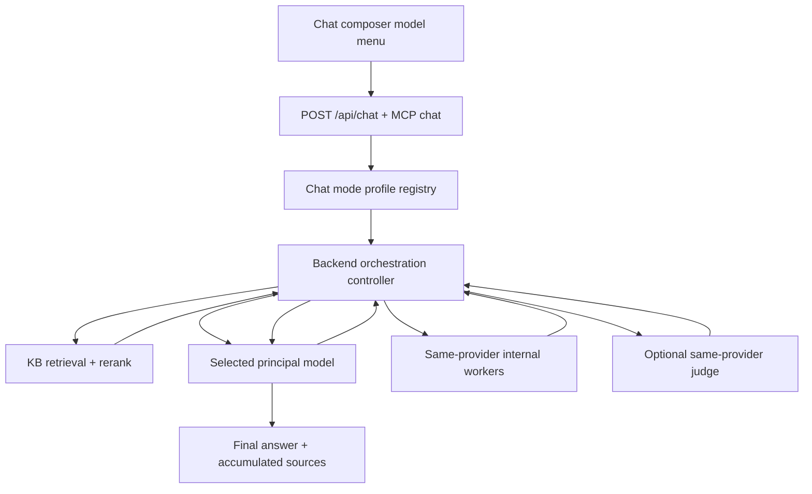
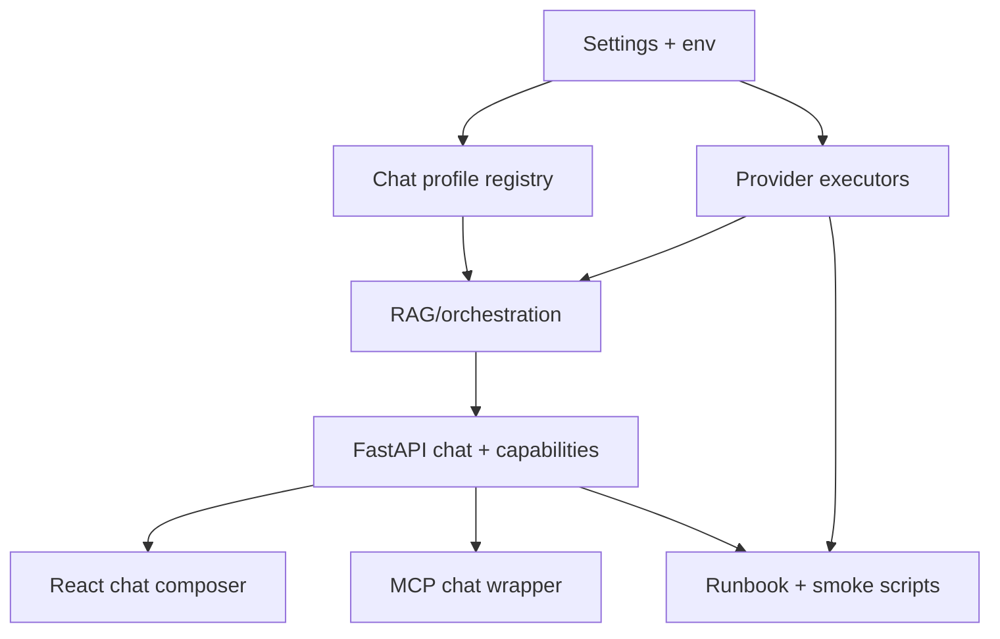

# feat: Add multi-provider OAuth orchestration modes

## Summary

Add four visible chat modes to Dante Dashboard while keeping internal worker models hidden: DeepSeek API, Codex/OpenAI OAuth, Claude Sonnet OAuth, and Claude Opus OAuth Premium. The backend owns retrieval, provider isolation, budgets, retries, judging, and final source reporting; selected providers never silently mix with other providers.

---

## Problem Frame

The chat now has a simple model selector and a direct grounded-RAG flow, but the desired product shape is richer: the user chooses a premium provider mode, and the app runs the right orchestration behind it without exposing worker model details. Because the new modes touch OAuth-local CLIs, API-key billing, subprocess execution, cost limits, and MCP/chat parity, this needs a full implementation plan before code changes.

---

## Requirements

- R1. The chat model menu exposes exactly these visible modes: `deepseek - deepseek-v4-pro`, `openai/codex - gpt-5.5 OAuth`, `claude - sonnet-4.6 OAuth`, and `claude - opus-4.8 OAuth Premium`.
- R2. Internal workers are hidden from the user; the selected visible mode determines the principal orchestrator, final responder, and worker pool.
- R3. Provider isolation is strict: selecting DeepSeek only uses DeepSeek; selecting OpenAI/Codex only uses Codex/OpenAI OAuth; selecting Claude only uses Claude OAuth.
- R4. OAuth modes use the local authenticated CLI/session path and must not fall back to API-key billing without an explicit operator change.
- R5. DeepSeek remains API/provider based and may use DeepSeek workers through the current DeepSeek API route.
- R6. The backend remains the only component that executes retrieval, reads provider configuration, enforces budgets, and returns cited sources.
- R7. Orchestration is bounded by per-mode worker limits, retry limits, timeouts, and fallback behavior so premium modes cannot loop indefinitely.
- R8. The MCP chat wrapper, frontend chat request, backend schema, and model selector remain compatible with the same model IDs.
- R9. Operation is verifiable through preflight, unit tests, integration-style tests with fakes, and read-only live smoke checks.
- R10. No provider secret, OAuth token, account identifier, or raw auth file content is logged, returned, committed, or shown in the UI.

---

## Scope Boundaries

- No Grok/xAI mode or Grok workers.
- No reindex, migration, delete, clear, or mutation of the existing KB corpus.
- No changes to Dante Dashboard ports, LaunchAgent label, MCP server name, global aliases, or Electron app identity.
- No modification of global Codex or Claude credential stores; the app only detects whether the local CLI session is usable.
- No exposed worker-model menu. Worker profiles remain internal implementation detail.
- No cross-provider automatic fallback. If Claude fails, it does not silently use OpenAI or DeepSeek; the user sees a provider-specific error or degraded same-provider behavior.
- No free-form agent access to the filesystem or shell from model prompts. Backend-owned actions are the only allowed actions.

### Deferred to Follow-Up Work

- Dedicated provider-settings UI for editing per-mode budgets and worker counts.
- Persistent per-conversation model switching history and analytics dashboards.
- Direct multimodal image payloads to final chat models. This plan keeps the current card/source-context grounding path unless implementation confirms a safe bounded extension.

---

## Context & Research

### Relevant Code and Patterns

- `backend/app/chat_models.py` currently defines the accepted model IDs as a small literal union.
- `backend/app/providers.py` contains the DeepSeek streaming client and the current local `CodexOAuthChatClient`.
- `backend/app/kb.py` constructs provider clients and dispatches `chat_client_for_model`.
- `backend/app/rag.py` owns retrieval, grounded context construction, and selected model invocation.
- `backend/app/routes/chat.py` streams token frames plus final source frames over SSE.
- `backend/app/mcp_server.py` forwards `chat_model` through the read-only MCP wrapper.
- `frontend/src/hooks/useChat.ts` owns the frontend model list and sends `chat_model`.
- `frontend/src/components/ChatPanel.tsx` persists the selected chat model and renders the composer model menu.
- `backend/.env.example`, `README.md`, and `docs/runbooks/dante-dashboard-operations.md` document the current provider contract.
- `backend/tests/test_chat_models.py`, `backend/tests/test_schemas.py`, and `backend/tests/test_mcp_server.py` are the closest current test anchors.

### Institutional Learnings

- No `docs/solutions/` entries exist in this workspace at planning time.
- Workspace instructions require read-only validation for routine health, no secret printing, and a pre-change snapshot before auth/provider/default changes. Implementation should create a fresh snapshot before changing provider defaults or auth surfaces.

### External References

- OpenAI models: GPT-5.5 is the flagship complex-reasoning/coding model, and GPT-5.4 mini is positioned for lower-latency, lower-cost workloads and subagents: <https://developers.openai.com/api/docs/models>
- OpenAI Codex CLI: Codex can be authenticated through ChatGPT and scripted through `codex exec`: <https://developers.openai.com/codex/cli>
- Claude Code authentication: Claude Code supports Claude.ai account login for Pro/Max subscription usage and can report auth status: <https://code.claude.com/docs/en/authentication>
- Claude Code CLI reference: `claude -p`, `--model`, `--effort`, `--max-turns`, `--tools`, `--safe-mode`, and `--no-session-persistence` are relevant for bounded local CLI calls: <https://code.claude.com/docs/en/cli-reference>
- Claude model configuration: Claude Code supports aliases and full model IDs, fallback chains, and effort levels: <https://code.claude.com/docs/en/model-config>
- Claude model overview: Opus 4.8, Sonnet 4.6, and Haiku 4.5 are current model tiers with published model IDs and pricing differences: <https://platform.claude.com/docs/en/about-claude/models/overview>
- DeepSeek models and pricing: DeepSeek documents `deepseek-v4-pro` and `deepseek-v4-flash`, OpenAI-compatible base URL, pricing, context, and cache behavior: <https://api-docs.deepseek.com/quick_start/pricing>
- DeepSeek chat completions: DeepSeek chat accepts `deepseek-v4-pro` / `deepseek-v4-flash`, streaming, thinking controls, JSON output, and tool-related parameters: <https://api-docs.deepseek.com/api/create-chat-completion>

---

## Key Technical Decisions

- Use a chat-mode profile registry instead of expanding only the literal model list. A profile should describe visible label, principal model, worker models, auth route, orchestration strategy, budgets, and availability checks in one place.
- Keep retrieval backend-owned. Principal models may propose retrieval intent or critique retrieved candidates, but the backend executes search, source selection, candidate packaging, and final source reporting.
- Treat workers as same-provider helpers. This preserves user expectations around cost, privacy, auth, and debugging.
- Use pinned model IDs, not mutable aliases, for provider calls. Display labels may be human-friendly, but executor configuration should pin the actual model identifiers.
- Keep public chat-mode IDs stable and separate from provider model IDs. Proposed public IDs are `deepseek-v4-pro`, `codex-gpt-5.5-oauth`, `claude-sonnet-4.6-oauth`, and `claude-opus-4.8-oauth-premium`.
- Treat OAuth subprocesses as untrusted external boundaries. Each local CLI call should run with a temporary working directory, no stdin, bounded timeout, no session persistence where supported, and sanitized API-key environment variables.
- Do not use Claude `--bare` as the default OAuth path. It is fast, but it still exposes built-in tools and changes Claude Code behavior; the implementation should prefer a characterized safe print-mode invocation with tools disabled.
- Make worker failure degradable and principal failure visible. If a worker fails, the principal can respond with raw retrieved context; if the selected principal cannot run, the mode fails explicitly.
- Use bounded premium loops. Opus Premium gets judge/repair behavior, but retry count must be small and observable.
- Preserve the existing source panel contract. Final SSE sources should represent all evidence used by the final answer, not only the last internal worker pass.

---

## Open Questions

### Resolved During Planning

- Should Grok be included? No. Grok/xAI is excluded from this plan.
- Should worker models appear in the menu? No. Workers are internal and hidden.
- Should DeepSeek run when the user selects Sonnet, Opus, or GPT-5.5? No. Provider selection is isolated.
- Should Opus Premium use an evaluator loop? Yes, with bounded retries and same-provider workers.

### Deferred to Implementation

- Exact Claude CLI invocation flags: verify against the installed Claude Code version during implementation, especially tool disabling, safe mode, session persistence, and OAuth behavior.
- Exact Codex OAuth worker invocation shape: reuse the existing `codex exec` pattern, then characterize whether the installed CLI honors OAuth when API-key environment variables are stripped.
- Opus 4.8 OAuth availability on the local Claude account: preflight must detect and report unavailable model access without changing auth state.
- DeepSeek worker model: prefer `deepseek-v4-flash` when configured and available; otherwise decide whether to disable DeepSeek workers or use smaller same-model worker calls.
- Final budget numbers: set conservative defaults first, then adjust after live latency/cost observations.

---

## High-Level Technical Design

> *This illustrates the intended approach and is directional guidance for review, not implementation specification. The implementing agent should treat it as context, not code to reproduce.*



| Visible mode | Principal / final responder | Internal workers | Judge loop |
|---|---|---|---|
| `deepseek - deepseek-v4-pro` | `deepseek-v4-pro` through DeepSeek API | DeepSeek worker model, preferably `deepseek-v4-flash` if configured | Optional same-principal quality pass only if enabled |
| `openai/codex - gpt-5.5 OAuth` | `gpt-5.5` through Codex OAuth | `gpt-5.4-mini` through Codex OAuth | Optional GPT-5.5 self-check for complex turns |
| `claude - sonnet-4.6 OAuth` | `claude-sonnet-4-6` through Claude OAuth | `claude-haiku-4-5` through Claude OAuth | Optional Sonnet self-check |
| `claude - opus-4.8 OAuth Premium` | `claude-opus-4-8` with `xhigh` effort through Claude OAuth | Sonnet chief workers plus Haiku workers | Opus judge with bounded repair loop |

---

## Implementation Units

### U1. Define Chat Mode Profiles

**Goal:** Replace the two-string chat model contract with a profile registry that can describe visible modes, provider ownership, principal model, workers, auth route, budgets, and availability.

**Requirements:** R1, R2, R3, R7, R8

**Dependencies:** None

**Files:**
- Modify: `backend/app/chat_models.py`
- Create: `backend/app/chat_profiles.py`
- Modify: `backend/app/schemas.py`
- Modify: `backend/app/mcp_server.py`
- Test: `backend/tests/test_chat_models.py`
- Test: `backend/tests/test_schemas.py`
- Test: `backend/tests/test_mcp_server.py`

**Approach:**
- Keep stable public model IDs for the four visible modes.
- Preserve existing IDs where possible: `deepseek-v4-pro` and `codex-gpt-5.5-oauth` remain stable, while Claude modes add `claude-sonnet-4.6-oauth` and `claude-opus-4.8-oauth-premium`.
- Add profile metadata for display label, provider family, principal executor, worker executor list, premium flag, and default budgets.
- Preserve DeepSeek as the default unless the operator explicitly changes the default later.
- Make MCP validation use the same accepted model/profile set as the FastAPI schema.

**Execution note:** Start with schema and MCP contract tests before changing dispatch behavior.

**Patterns to follow:**
- Existing constants and `ChatModelId` pattern in `backend/app/chat_models.py`.
- Existing `ChatRequest` validation in `backend/app/schemas.py`.
- Existing MCP chat forwarding in `backend/app/mcp_server.py`.

**Test scenarios:**
- Happy path: each of the four visible IDs validates through `ChatRequest`.
- Edge case: unknown model ID is rejected before provider dispatch.
- Integration: MCP `chat` forwards an accepted `chat_model` unchanged to `/api/chat`.
- Error path: MCP `chat` rejects or surfaces invalid model errors consistently with the API.

**Verification:**
- The app has one authoritative source for visible model IDs and profile metadata.
- Existing DeepSeek requests remain accepted with the same default behavior.

---

### U2. Add Provider Executor Interfaces and Preflight

**Goal:** Introduce a common provider-executor boundary that can run direct chat, worker tasks, principal planning, judge checks, and availability preflight across API and OAuth providers.

**Requirements:** R3, R4, R5, R6, R9, R10

**Dependencies:** U1

**Files:**
- Modify: `backend/app/providers.py`
- Modify: `backend/app/deps.py`
- Create: `backend/app/provider_preflight.py`
- Modify: `backend/.env.example`
- Test: `backend/tests/test_chat_models.py`
- Create: `backend/tests/test_provider_preflight.py`
- Create: `backend/tests/test_provider_executors.py`

**Approach:**
- Keep DeepSeek as the streaming HTTP provider.
- Generalize the current Codex OAuth client pattern so local CLI providers can be configured for principal and worker calls without duplicating subprocess safety logic.
- Add a Claude OAuth CLI executor that uses the local Claude Code session without reading or printing credential files.
- Sanitize provider-specific API-key environment variables for OAuth subprocesses so OAuth modes do not accidentally become API-key billed modes.
- Add preflight checks for binary presence, local auth status, model reachability, timeout behavior, and provider-specific availability.
- Ensure preflight returns capability status and safe error messages without account details or secrets.

**Patterns to follow:**
- `CodexOAuthChatClient` in `backend/app/providers.py` for temp directory, output capture, no stdin, timeout, and ProviderError wrapping.
- `Settings` in `backend/app/deps.py` for environment-driven provider configuration.
- Existing `.env.example` structure for optional overrides.

**Test scenarios:**
- Happy path: fake Codex and Claude executors return output and do not receive stdin.
- Happy path: DeepSeek executor can be configured separately for principal and worker model names.
- Error path: nonzero CLI exit becomes a redacted `ProviderError`.
- Error path: missing CLI binary or failed auth preflight marks the OAuth mode unavailable without crashing settings load.
- Security: OAuth subprocess environment excludes API-key variables for the same provider.
- Security: provider errors truncate stderr/stdout and never include raw token-like values.
- Timeout: executor timeouts become bounded provider errors.

**Verification:**
- Provider executors can be tested without live provider calls.
- Preflight can distinguish unavailable mode, missing binary, missing auth, and model access failure.

---

### U3. Build the Orchestration Controller

**Goal:** Add a backend orchestration controller that can run direct answers, worker-assisted answers, and judge/repair premium flows while preserving the current source reporting contract.

**Requirements:** R2, R3, R6, R7, R9

**Dependencies:** U1, U2

**Files:**
- Modify: `backend/app/rag.py`
- Create: `backend/app/chat_orchestration.py`
- Modify: `backend/app/kb.py`
- Test: `backend/tests/test_chat_orchestration.py`

**Approach:**
- Split the current single model call into stages: retrieval strategy, retrieval execution, candidate packaging, worker curation, optional judging, and final answer generation.
- Keep the backend in charge of every action. Model outputs can request bounded actions, but only structured backend-approved actions run.
- Preserve the current `GroundedAnswer` shape so frontend context accumulation and MCP source payloads continue working.
- Track all source candidates used by workers or final model and emit a final de-duplicated source list.
- Add per-mode budgets: max candidate count, max worker tasks, max retry loops, per-call timeout, and total turn timeout.
- Make orchestration degrade within the same provider: worker failure falls back to principal-only answer; judge failure falls back to principal answer with available curated material.

**Execution note:** Use fake provider executors to characterize orchestration state transitions before wiring live providers.

**Technical design:** Directional orchestration states:

```text
profile selected
  -> preflight status checked
  -> principal proposes retrieval/curation intent
  -> backend executes bounded retrieval
  -> workers summarize/rerank/extract when enabled
  -> judge evaluates only premium or configured modes
  -> bounded repair loop if judge rejects
  -> principal writes final answer using approved material
  -> backend emits tokens and accumulated sources
```

**Patterns to follow:**
- Current `answer_with_vision` retrieval and context building in `backend/app/rag.py`.
- Current `PipelineEvent` usage for user-visible stages.
- Current `SearchResult` and source DTO conversion.

**Test scenarios:**
- Happy path: direct DeepSeek mode still retrieves, calls a single principal, streams answer chunks, and emits sources.
- Happy path: worker-assisted mode calls workers before final principal and emits the final principal answer.
- Happy path: premium mode performs judge rejection once, sends feedback to workers, and returns the repaired final answer.
- Edge case: no retrieval results returns the existing no-results answer without calling providers.
- Error path: worker timeout produces a same-provider principal-only fallback.
- Error path: principal failure emits an SSE error and no cross-provider fallback.
- Integration: all sources used by worker and final stages appear once in the final source payload.
- Budget: retry loop stops at the configured maximum even when the judge keeps rejecting.

**Verification:**
- The orchestration controller is deterministic under fake provider outputs.
- Existing frontend and MCP source payload consumers do not need a breaking response-shape change.

---

### U4. Implement DeepSeek API Mode With Optional DeepSeek Workers

**Goal:** Keep `deepseek - deepseek-v4-pro` as the visible DeepSeek mode and add same-provider worker support through the DeepSeek API route.

**Requirements:** R1, R3, R5, R7, R9

**Dependencies:** U1, U2, U3

**Files:**
- Modify: `backend/app/providers.py`
- Modify: `backend/app/deps.py`
- Modify: `backend/app/chat_profiles.py`
- Modify: `backend/.env.example`
- Test: `backend/tests/test_provider_executors.py`
- Test: `backend/tests/test_chat_orchestration.py`

**Approach:**
- Keep `deepseek-v4-pro` as principal and final responder.
- Add an optional DeepSeek worker model setting, preferring `deepseek-v4-flash` where available.
- Use DeepSeek thinking/non-thinking controls per task type: reasoning-heavy curation can use thinking, simple extraction/summarization can avoid unnecessary effort when safe.
- Use the same API key and base URL already configured for DeepSeek; do not introduce a DeepSeek OAuth concept.
- Keep worker use optional so current DeepSeek direct behavior survives if worker configuration is absent.

**Patterns to follow:**
- Existing `DeepSeekChatClient` streaming implementation.
- Current DeepSeek settings in `backend/app/deps.py`.

**Test scenarios:**
- Happy path: DeepSeek profile maps to `deepseek-v4-pro` principal.
- Happy path: configured DeepSeek worker is invoked for a worker task and principal returns final answer.
- Edge case: no worker model configured results in principal-only DeepSeek behavior.
- Error path: worker HTTP error degrades to principal-only response.
- Budget: worker count and top-k are capped by profile settings.

**Verification:**
- DeepSeek behavior remains compatible with existing API-key deployments.
- DeepSeek never calls OpenAI/Codex or Claude when selected.

---

### U5. Implement OpenAI/Codex OAuth Mode With GPT-5.4-Mini Workers

**Goal:** Make `openai/codex - gpt-5.5 OAuth` run as a selected OAuth mode where GPT-5.5 orchestrates and writes the final answer, with GPT-5.4-mini hidden workers for curation.

**Requirements:** R1, R2, R3, R4, R6, R7, R9, R10

**Dependencies:** U1, U2, U3

**Files:**
- Modify: `backend/app/providers.py`
- Modify: `backend/app/deps.py`
- Modify: `backend/app/chat_profiles.py`
- Modify: `backend/.env.example`
- Test: `backend/tests/test_provider_executors.py`
- Test: `backend/tests/test_chat_orchestration.py`

**Approach:**
- Preserve the existing Codex OAuth client safety posture: temporary working directory, read-only execution posture, no stdin, no persistent workspace side effects, and bounded timeout.
- Add separate configurable model names for GPT-5.5 principal/final calls and GPT-5.4-mini worker calls.
- Strip `OPENAI_API_KEY` from the Codex subprocess environment for this OAuth mode unless an explicit future API-key mode is intentionally added.
- Use the GPT-5.4-mini worker for summarization, reranking, candidate comparison, and extraction; GPT-5.5 remains responsible for plan, synthesis, and final answer.
- Keep the visible mode label as OpenAI/Codex OAuth; do not expose GPT-5.4-mini in the menu.

**Patterns to follow:**
- Current `CodexOAuthChatClient` in `backend/app/providers.py`.
- Existing frontend option `codex - gpt-5.5 OAuth` as the closest UX precedent, with label revised to match this plan.

**Test scenarios:**
- Happy path: selected Codex mode uses GPT-5.5 for principal/final and GPT-5.4-mini for worker tasks.
- Error path: absent or failing Codex auth preflight marks the mode unavailable or returns an explicit provider error.
- Security: `OPENAI_API_KEY` present in the parent backend environment is not inherited by OAuth subprocesses.
- Edge case: worker failure falls back to GPT-5.5 final with raw retrieved context.
- Integration: final answer cites the retrieved sources, not worker-generated pseudo-sources.

**Verification:**
- Selecting OpenAI/Codex never invokes Claude or DeepSeek.
- Codex OAuth mode can be smoke-tested with a trivial prompt and a grounded chat prompt without exposing account or token data.

---

### U6. Implement Claude Sonnet and Opus OAuth Modes

**Goal:** Add Claude OAuth execution for Sonnet 4.6 and Opus 4.8 Premium, with Haiku workers for Sonnet mode and Sonnet chief plus Haiku workers for Opus Premium.

**Requirements:** R1, R2, R3, R4, R6, R7, R9, R10

**Dependencies:** U1, U2, U3

**Files:**
- Modify: `backend/app/providers.py`
- Modify: `backend/app/deps.py`
- Modify: `backend/app/chat_profiles.py`
- Modify: `backend/.env.example`
- Test: `backend/tests/test_provider_executors.py`
- Test: `backend/tests/test_provider_preflight.py`
- Test: `backend/tests/test_chat_orchestration.py`

**Approach:**
- Add a Claude local CLI executor backed by the local Claude Code OAuth session.
- Sonnet mode uses `claude-sonnet-4-6` as principal/final responder and `claude-haiku-4-5` as hidden worker.
- Opus Premium mode uses `claude-opus-4-8` with `xhigh` effort for orchestration, judging, and final answer; Sonnet 4.6 acts as chief worker; Haiku 4.5 handles cheaper extraction/summarization tasks.
- Use `effort=xhigh` terminology for Opus Premium, not `thinking=xhigh`, because current Claude Code/model docs expose effort levels.
- Disable or restrict built-in tools for scripted Claude calls so the model cannot read or edit arbitrary files.
- Strip `ANTHROPIC_API_KEY`, `ANTHROPIC_AUTH_TOKEN`, and provider base URL overrides from OAuth subprocesses unless a future explicit API mode is added.
- Avoid generating or storing long-lived Claude tokens inside DanteDash. If service-token handling becomes necessary, handle it as a separate explicit auth task.

**Execution note:** Characterize the installed `claude` binary with fake and live-smoke tests before enabling this mode by default in the UI.

**Patterns to follow:**
- Current Codex OAuth subprocess safety in `backend/app/providers.py`.
- Claude Code CLI print-mode and auth-status behavior from official docs.

**Test scenarios:**
- Happy path: Sonnet profile invokes Sonnet principal and Haiku worker with same-provider isolation.
- Happy path: Opus Premium performs Opus orchestration, Sonnet chief worker pass, Haiku worker pass, Opus judge pass, and Opus final answer.
- Error path: Haiku worker failure degrades to Sonnet-only or Opus/Sonnet-only flow.
- Error path: repeated Opus judge rejection stops at the configured loop limit.
- Security: Claude OAuth subprocesses do not inherit Anthropic API-key env vars.
- Security: Claude tool access is disabled or proven inert for chat prompts.
- Preflight: missing Claude binary, logged-out session, and inaccessible Opus model produce distinguishable safe statuses.

**Verification:**
- Claude modes can answer a trivial OAuth smoke prompt and a grounded chat prompt.
- Selecting Sonnet or Opus never invokes DeepSeek or OpenAI/Codex.
- Opus Premium latency and retry behavior are bounded and visible in progress events.

---

### U7. Update Chat API, MCP, and Frontend Model UX

**Goal:** Surface the four visible modes in the app and keep API/MCP/frontend model contracts aligned while hiding worker details.

**Requirements:** R1, R2, R8, R9

**Dependencies:** U1, U2, U3, U4, U5, U6

**Files:**
- Modify: `backend/app/routes/chat.py`
- Modify: `backend/app/main.py`
- Modify: `backend/app/mcp_server.py`
- Modify: `frontend/src/hooks/useChat.ts`
- Modify: `frontend/src/components/ChatPanel.tsx`
- Modify: `frontend/src/index.css`
- Test: `backend/tests/test_chat_routes.py`
- Test: `backend/tests/test_mcp_server.py`
- Test: `backend/tests/test_schemas.py`

**Approach:**
- Add a backend model-capabilities endpoint so the frontend can display all visible modes and optionally disable modes that fail preflight.
- Keep the composer menu below the text box and avoid expanding worker choices into the UI.
- Preserve local storage behavior for the selected mode, but recover gracefully if a stored mode becomes unsupported.
- Add progress-stage labels that communicate provider mode and orchestration phase without exposing hidden prompts or worker internals.
- Keep MCP `chat` accepting the same model IDs as the frontend and API.

**Patterns to follow:**
- Current `CHAT_MODELS` usage in `frontend/src/hooks/useChat.ts`.
- Current local-storage model persistence in `frontend/src/components/ChatPanel.tsx`.
- Current SSE error/source handling in `backend/app/routes/chat.py`.

**Test scenarios:**
- Happy path: frontend model list contains exactly the four visible labels.
- Happy path: backend capabilities endpoint returns exactly the four public mode IDs and their availability states.
- Happy path: selecting each visible mode sends the expected `chat_model` ID.
- Edge case: a stale local-storage model ID falls back to the default visible mode.
- Error path: unavailable OAuth mode is disabled or produces a clear provider-specific error.
- Integration: MCP and HTTP chat accept the same model IDs.
- Integration: source panel continues accumulating sources from each completed answer.

**Verification:**
- The user sees only the four intended modes.
- Workers do not appear in labels, source cards, or chat metadata.

---

### U8. Add Operations, Documentation, and Smoke Coverage

**Goal:** Make the system operable: document configuration, preflight, read-only smoke checks, cost risks, rollback, and validation gates.

**Requirements:** R4, R5, R7, R9, R10

**Dependencies:** U1, U2, U3, U4, U5, U6, U7

**Files:**
- Modify: `README.md`
- Modify: `backend/README.md`
- Modify: `docs/runbooks/dante-dashboard-operations.md`
- Modify: `backend/.env.example`
- Modify: `scripts/smoke-dante-dashboard.sh`
- Create: `scripts/smoke-chat-models.sh`
- Test: `backend/tests/test_provider_preflight.py`

**Approach:**
- Document which modes are OAuth-local versus API-key based.
- Document required local tools: Codex CLI for OpenAI/Codex OAuth and Claude Code CLI for Claude OAuth.
- Document that OAuth modes must not silently fall back to API keys and that API-key presence is a spending-risk state.
- Add read-only smoke coverage for model availability and one short grounded chat call per enabled mode.
- Keep live smokes opt-in or clearly bounded so routine health checks do not unexpectedly spend premium model credits.
- Record rollback posture: disabling a mode should be possible through config without removing the entire chat feature.

**Patterns to follow:**
- Current operations runbook health-check style.
- Current smoke script convention in `scripts/smoke-dante-dashboard.sh`.
- Existing secret-safety guidance in README/runbook.

**Test scenarios:**
- Happy path: preflight docs match the provider settings recognized by the backend.
- Error path: smoke script reports unavailable OAuth mode without printing auth details.
- Error path: smoke script refuses premium Opus checks unless explicitly enabled.
- Security: docs do not instruct users to paste raw OAuth tokens into committed files.
- Integration: standard dashboard smoke still validates backend stats, frontend, and MCP module compile without requiring premium model calls.

**Verification:**
- An operator can tell which modes are configured, which are unavailable, and how to disable expensive premium checks.
- Routine dashboard health remains cheap; premium model validation is deliberate.

---

## System-Wide Impact



- **Interaction graph:** Settings feed profiles and providers; profiles drive orchestration; API/MCP/frontend consume the same model contract.
- **Error propagation:** Provider and preflight errors should become explicit unavailable-mode states or SSE error events; worker errors degrade within the same provider.
- **State lifecycle risks:** Local storage may hold stale model IDs; OAuth CLI sessions may expire; premium loops may partially complete. Each must have deterministic fallback or safe error behavior.
- **API surface parity:** FastAPI `ChatRequest`, model capabilities, MCP `chat`, and frontend menu must agree on IDs and labels.
- **Integration coverage:** Fake provider orchestration tests prove behavior without spending credits; bounded live smoke proves real OAuth/API wiring after config.
- **Unchanged invariants:** Existing KB search, source preview URLs, ports, LaunchAgent label, MCP server name, and context-source accumulation remain unchanged.

---

## Risks & Dependencies

| Risk | Mitigation |
|------|------------|
| OAuth subprocess accidentally uses API-key billing | Strip provider API-key env vars in OAuth subprocesses and add tests for env sanitation. |
| Claude or Codex CLI auth unavailable under LaunchAgent/Electron context | Add preflight capability reporting and provider-specific unavailable states before user sends a prompt. |
| Premium Opus loops spend too much or hang | Enforce retry limits, per-call timeouts, total turn budgets, and opt-in premium smoke checks. |
| Hidden workers surprise the user by crossing providers | Enforce provider-family isolation in profile tests and orchestration tests. |
| Tool-enabled Claude/Codex calls read or edit local files | Use temp working directories, read-only/no-tool invocation modes where supported, no stdin, and characterization tests. |
| Source panel shows only the last internal worker sources | Accumulate all approved evidence used by the final answer and de-duplicate before the final SSE source event. |
| DeepSeek worker model availability differs by account | Keep DeepSeek workers optional and configurable; direct DeepSeek principal-only mode remains valid. |
| Model docs or CLI flags drift | Pin model IDs in config, keep preflight version/status output safe, and document that implementation should verify installed CLI behavior. |

---

## Alternative Approaches Considered

- **Expose every worker as a menu option:** Rejected because the user asked for simple visible choices and hidden workers. It would also increase support burden and invite accidental expensive mode selection.
- **Let principals call KB tools directly as agents:** Rejected for v1 because backend-owned retrieval is safer, easier to test, and cheaper to bound.
- **Use one universal cross-provider worker pool:** Rejected because it violates provider isolation and makes cost/privacy behavior hard to explain.
- **Make Opus Premium the default:** Rejected because premium cost, latency, and auth availability need live characterization before defaulting.

---

## Success Metrics

- The model menu shows exactly the four requested visible modes.
- Each selected provider mode runs without calling other providers in fake-provider tests.
- OAuth modes fail closed when local auth is unavailable and do not silently switch to API-key billing.
- Worker failures degrade within the selected provider instead of failing the whole chat when a principal can still answer.
- Opus Premium never exceeds configured retry and timeout budgets.
- Final source payloads remain complete enough for the context panel to accumulate evidence across answers.
- Existing dashboard smoke remains cheap and read-only; premium smokes are explicit.

---

## Dependencies / Prerequisites

- Current Codex CLI installed and logged in with ChatGPT/OAuth for Codex mode.
- Current Claude Code CLI installed and logged in with Claude.ai/OAuth for Claude modes.
- DeepSeek API key configured for DeepSeek mode.
- Voyage embedding provider and existing KB collection remain configured because retrieval still depends on them.
- Before implementation begins, create a fresh workspace snapshot because this plan touches provider/auth behavior.

---

## Phased Delivery

### Phase 1: Contracts and Safety Rails

- Land chat profiles, schema/MCP validation, provider executor boundary, and preflight with fake tests.

### Phase 2: Orchestration Core

- Land the backend orchestration controller with fake-provider tests for direct, worker-assisted, and judge/repair flows.

### Phase 3: Provider Modes

- Enable DeepSeek workers, Codex OAuth workers, Claude Sonnet OAuth, and Claude Opus Premium behind profile availability checks.

### Phase 4: UI and Operations

- Update menu/capability UX, docs, runbooks, smoke scripts, and final validation gates.

---

## Documentation / Operational Notes

- Update docs to distinguish OAuth-local modes from API-key modes.
- Document that routine health checks should not spend premium model credits.
- Document preflight failures with safe operator action: install CLI, login locally, check model access, or disable the mode.
- Document rollback by disabling a profile or reverting to DeepSeek-only visible mode without changing ports or launch interfaces.
- Keep all credential instructions out of committed docs except variable names and safe placeholders.

---

## Sources & References

- Related code: `backend/app/chat_models.py`
- Related code: `backend/app/providers.py`
- Related code: `backend/app/kb.py`
- Related code: `backend/app/rag.py`
- Related code: `backend/app/routes/chat.py`
- Related code: `backend/app/mcp_server.py`
- Related code: `frontend/src/hooks/useChat.ts`
- Related code: `frontend/src/components/ChatPanel.tsx`
- Related docs: `README.md`
- Related docs: `docs/runbooks/dante-dashboard-operations.md`
- External docs: <https://developers.openai.com/api/docs/models>
- External docs: <https://developers.openai.com/codex/cli>
- External docs: <https://code.claude.com/docs/en/authentication>
- External docs: <https://code.claude.com/docs/en/cli-reference>
- External docs: <https://code.claude.com/docs/en/model-config>
- External docs: <https://platform.claude.com/docs/en/about-claude/models/overview>
- External docs: <https://api-docs.deepseek.com/quick_start/pricing>
- External docs: <https://api-docs.deepseek.com/api/create-chat-completion>
