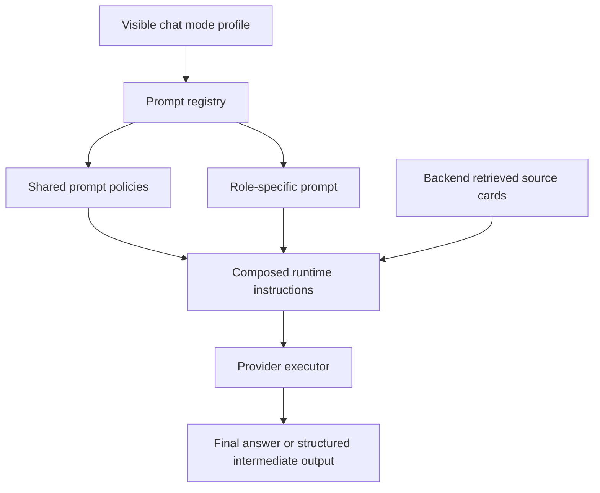
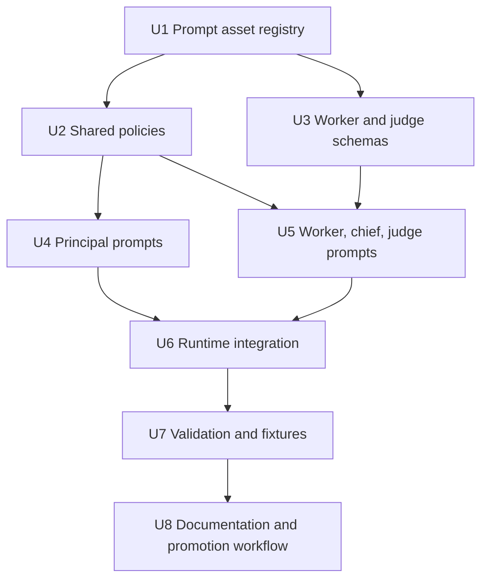

# feat: Add chat orchestration prompt pack

## Summary

Create a versioned prompt, policy, and schema package for DanteDash chat orchestration. This plan complements the multi-provider OAuth orchestration plan by defining the model-facing instructions for visible chat modes, hidden workers, hidden chiefs, and premium judging while keeping retrieval, citations, provider isolation, and source reporting backend-owned.

---

## Problem Frame

The previous orchestration plan defines which providers and internal worker pools can run. The app still needs durable prompt contracts so those models behave consistently: principals write grounded answers, workers return compact evidence analysis, judges return bounded quality verdicts, and no role leaks hidden orchestration details to the user.

---

## Assumptions

*This plan was authored without a synchronous confirmation checkpoint. The items below are agent inferences that should be reviewed before implementation proceeds.*

- The prompt pack should be implemented as local, versioned backend assets rather than inline constants or frontend-configured prompt text.
- The existing decoupage prompt/schema loader is the closest local pattern for prompt asset loading, defensive schema validation, and model-facing instruction assembly.
- The new prompt pack should initially support the four visible modes already defined in the provider-orchestration plan and should not add prompt coverage for Grok, Gemini, Perplexity, or other providers.

---

## Requirements

- R1. Cover every role requested in `docs/prompts/chat-orchestration-system-prompts-brief.md`: DeepSeek principal, GPT-5.5 principal, GPT-5.4-mini worker, Sonnet 4.6 principal, Haiku 4.5 worker, Opus 4.8 Premium principal, Sonnet chief worker, Opus Premium Haiku worker, Opus judge, shared citation/source-grounding policy, shared refusal/insufficient-evidence policy, and shared worker-output format.
- R2. Keep visible mode IDs aligned with `docs/plans/2026-06-15-001-feat-multi-provider-oauth-orchestration-plan.md`: `deepseek-v4-pro`, `codex-gpt-5.5-oauth`, `claude-sonnet-4.6-oauth`, and `claude-opus-4.8-oauth-premium`.
- R3. Compose prompts from shared policies plus role-specific prompts so grounding, citation, refusal, provider isolation, and hidden-worker rules stay consistent across providers.
- R4. Keep backend retrieval authoritative. Prompts may reason over bounded source cards supplied by the backend, but they must not instruct models to browse files, shell, tools, local paths, credentials, or provider logs.
- R5. Require final answers to cite retrieved sources inline as `[1]`, `[2]`, etc. and to state insufficient evidence instead of inventing unsupported text or visual claims.
- R6. Require worker and chief roles to return structured, compact intermediate outputs that reference source IDs and never contain final user-facing prose.
- R7. Require judge roles to return bounded verdicts, defects, source-coverage notes, and repair directives without hidden chain-of-thought or unbounded repair loops.
- R8. Ensure prompts never expose hidden workers, chiefs, judges, retries, provider internals, account identifiers, auth paths, secrets, or raw orchestration logs.
- R9. Validate prompt metadata, policy inclusion, role/provider mapping, schema shape, and forbidden content through backend tests.
- R10. Replace or wrap the current hardcoded `SYSTEM_PROMPT` in `backend/app/rag.py` without breaking the existing DeepSeek direct chat path.
- R11. Document how reviewed Claude-authored prompt drafts are imported, audited, and promoted into the runtime prompt pack.

---

## Scope Boundaries

- No implementation of provider OAuth subprocesses, worker scheduling, preflight, or budget controls; that remains in the provider-orchestration plan.
- No new visible chat modes beyond the four approved modes.
- No hidden cross-provider fallback. A selected Claude mode never uses OpenAI or DeepSeek prompts; a selected OpenAI/Codex mode never uses Claude or DeepSeek prompts.
- No prompt editing UI in the frontend.
- No live provider calls, auth probing, KB reindexing, source mutation, or prompt-generation automation during this plan.
- No raw chain-of-thought exposure in worker, chief, judge, or final outputs.
- No credentials, OAuth tokens, account identifiers, auth file paths, or provider logs in any prompt text or user-visible output.

### Deferred to Follow-Up Work

- Prompt A/B evaluation dashboard and analytics.
- User-configurable prompt profiles or workspace-level prompt overrides.
- Direct multimodal image payload prompts for final responders beyond the current bounded source-card grounding path.
- Automated prompt drafting with Claude or another model. This plan covers how to review and import drafts, not how to generate them inside the app.

---

## Context & Research

### Relevant Code and Patterns

- `backend/app/rag.py` currently owns retrieval, grounded context assembly, and the hardcoded `SYSTEM_PROMPT`.
- `backend/app/chat_models.py` currently exposes the accepted chat mode IDs as a small literal union.
- `backend/app/kb.py` dispatches selected chat clients through `chat_client_for_model`.
- `backend/app/dante_visual/decoupage.py` loads a prompt file and strict JSON schema with cached, defensive validation.
- `backend/app/dante_visual/prompts/art_grade_decoupage_vision_analyst.md` is the strongest local example of a model-facing prompt asset with integration notes, grounding discipline, hidden self-review constraints, and structured-output separation.
- `docs/prompts/README.md` indexes local prompt/schema profiles.
- `docs/prompts/chat-orchestration-system-prompts-brief.md` is the direct origin brief for the roles, hard constraints, and architecture map.
- `docs/plans/2026-06-15-001-feat-multi-provider-oauth-orchestration-plan.md` defines the provider-mode and worker topology that these prompts must attach to.

### Institutional Learnings

- Workspace instructions require read-only validation for routine health, no secret printing, no routine reindexing, and a pre-change snapshot before auth/provider/default changes. This plan does not itself trigger a snapshot, but implementation should create one before changing runtime provider defaults or auth surfaces.
- The existing decoupage prompt profile keeps schema enforcement outside the prose prompt. The chat prompt pack should follow that separation for worker and judge structured outputs.

### External References

- OpenAI model and prompt contracts remain tied to the provider-orchestration plan's referenced OpenAI model/Codex docs.
- Claude model and OAuth CLI behavior remain tied to the provider-orchestration plan's referenced Claude model/auth/CLI docs.
- DeepSeek model and API behavior remain tied to the provider-orchestration plan's referenced DeepSeek docs.

---

## Key Technical Decisions

- Store runtime prompts as backend assets, not frontend strings. This keeps provider contracts versioned, testable, and close to backend retrieval/source assembly.
- Use prompt composition instead of copy-pasting every policy into every role file. Role prompts should declare required shared policies, and the loader should compose a final model-facing instruction set.
- Keep role prompts separate from visible mode profiles. Mode profiles decide which roles run; the prompt registry decides which prompt bundle each role receives.
- Add metadata frontmatter to every prompt asset. Required metadata should include prompt ID, version, role, provider family, target model, status, required policies, input contract, output contract, and visibility.
- Use strict JSON schemas for worker and judge outputs. Workers and judges should return machine-readable intermediate artifacts that cite source IDs and can be discarded or summarized by the orchestration controller.
- Keep final answers as natural language with citations. Final responder prompts should never output internal worker JSON unless the API explicitly routes a diagnostic developer-only mode, which is out of scope here.
- Treat prompt drafts from Claude as untrusted source material until reviewed. Drafts should land in documentation first, then be promoted into backend runtime assets only after contradiction, forbidden-content, and schema checks pass.
- Make tests enforce negative contracts. It is not enough that prompts load; tests should catch missing grounding policy, forbidden cross-provider references, hidden worker disclosure, file/tool-access instructions, and absent output schemas.

---

## Open Questions

### Resolved During Planning

- Should this plan rewrite provider orchestration? No. It only plans the prompt/policy/schema layer that orchestration will consume.
- Should hidden workers be visible in the UI or response? No. Prompts and tests should enforce invisibility.
- Should a worker ever write final user-facing prose? No. Workers return structured analysis only.
- Should judges expose hidden reasoning? No. Judges return verdicts, defects, source coverage, and repair directives only.

### Deferred to Implementation

- Exact prompt metadata file format: YAML frontmatter in Markdown is preferred, but implementation may choose JSON manifests if validation becomes simpler.
- Exact schema shape for worker and judge outputs: this plan defines required semantics; the implementer should finalize compact schemas while writing tests.
- Exact integration point between `answer_with_vision` and the future orchestration controller from plan 001: if the orchestration controller lands first, prompts should integrate there; otherwise the initial registry can wrap the existing `rag.py` path.
- Exact model ID spelling for future Claude/OpenAI local CLI calls: provider execution should pin IDs in the orchestration layer; prompt metadata can carry target labels without becoming the source of truth for executor IDs.

---

## Output Structure

The expected runtime prompt pack should look roughly like this. The structure is directional; per-unit file lists are authoritative.

```text
backend/app/chat_prompts/
  __init__.py
  loader.py
  registry.py
  metadata.py
  policies/
    citation_grounding.md
    insufficient_evidence.md
    provider_isolation.md
    worker_visibility.md
  roles/
    deepseek_principal.md
    codex_gpt55_principal.md
    codex_gpt54_mini_worker.md
    claude_sonnet_principal.md
    claude_haiku_worker.md
    claude_opus_premium_principal.md
    claude_opus_sonnet_chief.md
    claude_opus_haiku_worker.md
    claude_opus_judge.md
  schemas/
    chat_worker_output.schema.json
    chat_judge_output.schema.json
docs/prompts/
  chat-orchestration-system-prompts.md
```

---

## High-Level Technical Design

> *This illustrates the intended approach and is directional guidance for review, not implementation specification. The implementing agent should treat it as context, not code to reproduce.*



| Prompt family | User-visible? | Input | Output | Hard rule |
|---|---:|---|---|---|
| Principal/final responder | Yes, only final prose | User request, bounded source cards, optional worker summaries | Natural-language answer with citations | Must cite sources or state insufficient evidence |
| Worker | No | Narrow task, source cards or source clusters | Structured extraction/comparison/rerank support | Must not answer the user |
| Chief worker | No | Worker outputs plus higher-priority source clusters | Structured synthesis for premium mode | Must not decide final answer |
| Judge | No | Candidate answer, source cards, worker/chief artifacts | Structured verdict and repair directives | Must not expose hidden reasoning |
| Shared policy | No direct invocation | Composed into roles | Constraints only | Must preserve provider isolation and retrieval ownership |

---

## Implementation Units



### U1. Add Prompt Asset Registry

**Goal:** Create a backend prompt registry and loader that can discover, validate, and compose prompt assets for chat roles.

**Requirements:** R1, R2, R3, R9, R10

**Dependencies:** None

**Files:**
- Create: `backend/app/chat_prompts/__init__.py`
- Create: `backend/app/chat_prompts/loader.py`
- Create: `backend/app/chat_prompts/registry.py`
- Create: `backend/app/chat_prompts/metadata.py`
- Test: `backend/tests/test_chat_prompt_registry.py`

**Approach:**
- Define a typed prompt metadata model with prompt ID, role, provider family, target model label, version, status, visibility, required policies, input contract, and output contract.
- Load Markdown prompt files from package-relative paths, mirroring the `Path(__file__)` pattern in `backend/app/dante_visual/decoupage.py`.
- Compose role prompts with required shared policies in deterministic order.
- Return immutable prompt bundle objects to prevent accidental mutation across requests.
- Fail closed if a prompt references a missing shared policy or if metadata does not match the requested mode/role.

**Execution note:** Start with registry tests before wiring it into chat generation so prompt asset mistakes are caught before provider behavior changes.

**Patterns to follow:**
- `backend/app/dante_visual/decoupage.py` for cached prompt loading, package-relative paths, defensive schema loading, and validation errors.
- `backend/app/chat_models.py` for stable public model IDs.

**Test scenarios:**
- Happy path: the registry loads every role prompt and composes required shared policies in stable order.
- Happy path: requesting the DeepSeek principal prompt returns a bundle tagged for `deepseek-v4-pro`.
- Edge case: a prompt with missing required metadata is rejected with a clear validation error.
- Edge case: a prompt that references a missing policy is rejected before any provider call can run.
- Error path: requesting an unknown role or unsupported visible mode fails closed.
- Integration: prompt bundle lookup can be called from the existing chat path without importing frontend code or provider credentials.

**Verification:**
- Prompt bundles are loaded from backend assets, validated once, and available through one registry API.

---

### U2. Add Shared Prompt Policies

**Goal:** Define reusable policies for source grounding, insufficient evidence, provider isolation, and hidden orchestration visibility.

**Requirements:** R3, R4, R5, R8, R9

**Dependencies:** U1

**Files:**
- Create: `backend/app/chat_prompts/policies/citation_grounding.md`
- Create: `backend/app/chat_prompts/policies/insufficient_evidence.md`
- Create: `backend/app/chat_prompts/policies/provider_isolation.md`
- Create: `backend/app/chat_prompts/policies/worker_visibility.md`
- Test: `backend/tests/test_chat_prompt_registry.py`
- Test: `backend/tests/test_chat_prompt_contracts.py`

**Approach:**
- `citation_grounding.md` should require inline citations that match backend-provided source numbering and should prohibit unsupported visual claims.
- `insufficient_evidence.md` should make uncertainty explicit and steer the model away from fabricated answers when the source set is weak.
- `provider_isolation.md` should state that the selected provider family is the only provider used for this turn and that prompts must not request hidden cross-provider fallback.
- `worker_visibility.md` should make workers, chiefs, judges, retries, budgets, and internal orchestration details invisible in user-facing responses.
- Keep policies provider-neutral so all role prompts can reuse them.

**Patterns to follow:**
- The current `SYSTEM_PROMPT` in `backend/app/rag.py` for core citation and visual-claim rules.
- The grounding and hidden-apparatus language in `backend/app/dante_visual/prompts/art_grade_decoupage_vision_analyst.md`.

**Test scenarios:**
- Happy path: each principal role includes citation, insufficient-evidence, provider-isolation, and worker-visibility policies after composition.
- Happy path: each worker/chief/judge role includes provider-isolation and worker-visibility policies.
- Edge case: policy composition is deterministic and does not duplicate policy text.
- Error path: a role prompt missing citation policy when marked as final responder fails validation.
- Error path: a role prompt containing instructions to browse files, use shell tools, or inspect auth state fails forbidden-content validation.

**Verification:**
- Shared policy text is reusable across all four visible modes and does not mention provider secrets, local auth paths, or unrelated providers as fallback options.

---

### U3. Define Worker and Judge Output Schemas

**Goal:** Add strict structured-output schemas for intermediate worker/chief artifacts and premium judge verdicts.

**Requirements:** R6, R7, R8, R9

**Dependencies:** U1

**Files:**
- Create: `backend/app/chat_prompts/schemas/chat_worker_output.schema.json`
- Create: `backend/app/chat_prompts/schemas/chat_judge_output.schema.json`
- Modify: `backend/app/chat_prompts/loader.py`
- Test: `backend/tests/test_chat_prompt_contracts.py`

**Approach:**
- Worker schema should support source-referential fields such as task summary, relevant source IDs, extracted facts, uncertainty notes, contradictions, rerank hints, and compact handoff notes.
- Chief schema should reuse the worker schema or extend it through a role field rather than inventing a second incompatible shape.
- Judge schema should support verdict, blocking defects, source coverage, unsupported claims, requested repairs, and a bounded `retry_recommended` flag.
- Schemas should forbid final user-facing answer fields in worker outputs.
- Loader validation should ensure worker/chief/judge prompts declare the correct schema name and output contract.

**Patterns to follow:**
- `backend/app/dante_visual/decoupage.py` and `backend/app/dante_visual/schemas/decoupage_sidecar.schema.json` for strict schema loading and validation.

**Test scenarios:**
- Happy path: a valid worker fixture with cited source IDs validates.
- Happy path: a valid judge fixture with `accepted`, `needs_revision`, or equivalent verdict validates.
- Edge case: worker output with no relevant sources can express insufficient evidence without becoming a final answer.
- Error path: worker output that includes a `final_answer` or similar user-facing field fails validation.
- Error path: judge output with hidden reasoning transcript or unbounded retry directives fails validation.
- Integration: schemas can be loaded through the prompt loader without depending on provider SDKs.

**Verification:**
- Worker and judge contracts are machine-readable, compact, and enforce the hidden-intermediate-output boundary.

---

### U4. Add Principal and Final Responder Prompts

**Goal:** Add role prompts for the four visible principal/final responder modes.

**Requirements:** R1, R2, R3, R4, R5, R8, R10

**Dependencies:** U1, U2

**Files:**
- Create: `backend/app/chat_prompts/roles/deepseek_principal.md`
- Create: `backend/app/chat_prompts/roles/codex_gpt55_principal.md`
- Create: `backend/app/chat_prompts/roles/claude_sonnet_principal.md`
- Create: `backend/app/chat_prompts/roles/claude_opus_premium_principal.md`
- Test: `backend/tests/test_chat_prompt_contracts.py`

**Approach:**
- DeepSeek principal prompt should preserve the current direct grounded-RAG behavior while becoming role-aware and compatible with optional same-provider workers.
- GPT-5.5 principal prompt should frame the model as the OpenAI/Codex OAuth orchestrator and final responder, with GPT-5.4-mini worker artifacts treated as hidden inputs.
- Claude Sonnet principal prompt should frame Sonnet as the Claude OAuth orchestrator and final responder, with Haiku worker artifacts treated as hidden inputs.
- Claude Opus Premium principal prompt should frame Opus as premium orchestrator and final responder that may consume Sonnet chief, Haiku worker, and Opus judge artifacts.
- All final responder prompts must treat backend source cards as the only evidence source and must not claim visual details that are absent from captions, snippets, metadata, or reviewed cards.
- All final responder prompts must explicitly hide worker/chief/judge internals from the final answer.

**Patterns to follow:**
- `backend/app/rag.py` `SYSTEM_PROMPT` for current grounded answer behavior.
- `docs/prompts/chat-orchestration-system-prompts-brief.md` for mode-specific role descriptions.
- `backend/app/dante_visual/prompts/art_grade_decoupage_vision_analyst.md` for invisible apparatus and grounding discipline.

**Test scenarios:**
- Happy path: each principal prompt composes with shared policies and declares final-answer visibility.
- Happy path: each principal prompt includes citations, source-only grounding, insufficient-evidence, and hidden-worker constraints.
- Edge case: Opus Premium prompt references judge/chief artifacts only as hidden inputs, not user-visible content.
- Error path: any principal prompt that mentions using another provider as fallback fails forbidden-content validation.
- Error path: any principal prompt instructing the model to inspect local files, auth state, or shell output fails validation.
- Integration: the existing DeepSeek chat path can receive the composed DeepSeek principal prompt without changing retrieved source context shape.

**Verification:**
- The current single `SYSTEM_PROMPT` can be replaced or wrapped by registry-loaded principal prompts without weakening existing grounded citation behavior.

---

### U5. Add Worker, Chief, and Judge Prompts

**Goal:** Add hidden role prompts for lower-cost worker extraction, premium chief synthesis, and premium judge evaluation.

**Requirements:** R1, R3, R4, R6, R7, R8, R9

**Dependencies:** U1, U2, U3

**Files:**
- Create: `backend/app/chat_prompts/roles/codex_gpt54_mini_worker.md`
- Create: `backend/app/chat_prompts/roles/claude_haiku_worker.md`
- Create: `backend/app/chat_prompts/roles/claude_opus_haiku_worker.md`
- Create: `backend/app/chat_prompts/roles/claude_opus_sonnet_chief.md`
- Create: `backend/app/chat_prompts/roles/claude_opus_judge.md`
- Test: `backend/tests/test_chat_prompt_contracts.py`

**Approach:**
- Worker prompts should focus on extraction, source comparison, candidate summarization, contradiction spotting, and rerank support.
- Worker prompts must return only the worker schema and must never address the user directly.
- Sonnet chief prompt should synthesize selected Haiku worker outputs and high-value source clusters for Opus Premium mode without writing a final answer.
- Opus judge prompt should evaluate a candidate final answer against sources and intermediate artifacts, then return a structured verdict and repair directives.
- Judge prompt should cap repair expectations by referencing backend-owned loop limits rather than inviting unlimited revision.
- Keep the Sonnet-mode Haiku worker and Opus Premium Haiku worker separate if their tasks differ, even if they initially share most wording.

**Patterns to follow:**
- The `JUDGE` and `CONFRONTADOR` separation note in `backend/app/dante_visual/prompts/art_grade_decoupage_vision_analyst.md`, which keeps evaluator tasks as separate invocations instead of in-prompt branches.
- `docs/prompts/chat-orchestration-system-prompts-brief.md` for the hidden role map.

**Test scenarios:**
- Happy path: GPT-5.4-mini worker prompt declares OpenAI/Codex provider family and worker schema.
- Happy path: Claude Haiku worker prompts declare Claude provider family and worker schema.
- Happy path: Sonnet chief prompt returns structured synthesis and references source IDs.
- Happy path: Opus judge prompt returns structured verdict with repair directives and source coverage.
- Edge case: a worker prompt can report no useful evidence without fabricating a summary.
- Error path: worker/chief prompts containing final-answer language fail validation.
- Error path: judge prompt containing hidden chain-of-thought disclosure instructions fails validation.
- Error path: any hidden prompt that mentions user-visible worker details fails validation.

**Verification:**
- Hidden prompts are provider-isolated, schema-bound, and cannot produce final user-facing responses by contract.

---

### U6. Integrate Prompt Registry Into Chat Generation

**Goal:** Replace the hardcoded grounded chat prompt with registry-loaded prompts and prepare the integration point for the orchestration controller from plan 001.

**Requirements:** R2, R3, R4, R5, R8, R10

**Dependencies:** U1, U2, U4, U5

**Files:**
- Modify: `backend/app/rag.py`
- Modify: `backend/app/kb.py`
- Modify: `backend/app/chat_models.py`
- Modify/Create: `backend/app/chat_profiles.py`
- Test: `backend/tests/test_chat_prompt_integration.py`
- Test: `backend/tests/test_chat_models.py`

**Approach:**
- Add a prompt lookup at the point where `answer_with_vision` currently supplies `SYSTEM_PROMPT`.
- For the existing direct path, select the principal prompt based on `chat_model` and keep the current retrieved source block shape.
- When `backend/app/chat_profiles.py` from plan 001 exists, map visible mode profile plus orchestration stage to prompt role IDs. If this prompt-pack plan is implemented first, add only the minimal compatibility surface needed to key principal prompts by existing chat model ID, then let plan 001 own the full profile registry.
- Keep prompt lookup pure and deterministic; it should not read provider credentials or trigger availability checks.
- Preserve streaming behavior and final source frame behavior in `backend/app/routes/chat.py`.
- Keep worker/chief/judge prompt lookup available to the future orchestration controller without forcing hidden worker execution into the current direct path.

**Patterns to follow:**
- Current `answer_with_vision` message construction in `backend/app/rag.py`.
- Current model dispatch in `backend/app/kb.py`.
- Mode profile registry described in `docs/plans/2026-06-15-001-feat-multi-provider-oauth-orchestration-plan.md`.

**Test scenarios:**
- Happy path: `deepseek-v4-pro` uses the DeepSeek principal prompt and still receives the same source context.
- Happy path: `codex-gpt-5.5-oauth` uses the GPT-5.5 principal prompt.
- Edge case: a chat model with no registered prompt fails with a clear provider/model configuration error before a model call.
- Error path: prompt lookup failure does not stream partial answer text.
- Integration: final SSE sources remain the retrieved sources used to build the prompt context.
- Integration: MCP chat and API chat resolve prompts through the same visible mode ID.

**Verification:**
- The direct chat path no longer depends on a hardcoded global `SYSTEM_PROMPT`, and existing answer/source behavior remains intact.

---

### U7. Add Prompt Contract Validation and Golden Fixtures

**Goal:** Add regression tests and fixtures that prove the prompt pack preserves grounding, visibility, provider isolation, and structured intermediate-output contracts.

**Requirements:** R3, R4, R5, R6, R7, R8, R9

**Dependencies:** U1, U2, U3, U4, U5, U6

**Files:**
- Create: `backend/tests/test_chat_prompt_contracts.py`
- Create: `backend/tests/test_chat_prompt_integration.py`
- Create: `backend/tests/fixtures/chat_prompts/valid_worker_output.json`
- Create: `backend/tests/fixtures/chat_prompts/valid_judge_output.json`
- Create: `backend/tests/fixtures/chat_prompts/invalid_worker_final_answer.json`
- Create: `backend/tests/fixtures/chat_prompts/invalid_judge_hidden_reasoning.json`
- Create: `backend/tests/fixtures/chat_prompts/sample_retrieved_sources.json`

**Approach:**
- Validate every prompt asset for required metadata, required policies, visibility classification, and output contract.
- Add negative string/pattern checks for forbidden tool/file/auth instructions and hidden cross-provider fallback language.
- Validate worker and judge fixture outputs against strict schemas.
- Add a fake-provider integration test that confirms composed prompts, source context, and selected mode are passed to the provider client without making network calls.
- Keep golden fixtures small and stable so prompt edits do not require noisy fixture churn.

**Patterns to follow:**
- Existing backend tests that validate schemas and MCP contracts.
- Decoupage schema validation style for strict output contracts.

**Test scenarios:**
- Happy path: all runtime prompts load and pass metadata/policy/schema validation.
- Happy path: valid worker and judge fixtures pass schema validation.
- Edge case: prompt text with duplicated policy sections is detected if composition would produce repeated policy text.
- Error path: a role prompt with provider family `claude` assigned to an OpenAI/Codex visible mode fails validation.
- Error path: prompt text containing instructions to reveal workers, judges, or retries fails validation.
- Error path: invalid worker/judge fixtures fail schema validation with useful messages.
- Integration: fake chat execution captures the composed system prompt and confirms source numbering/citation policy is present.

**Verification:**
- Prompt changes can be reviewed through deterministic backend tests without live provider calls or credential access.

---

### U8. Document Prompt Promotion Workflow

**Goal:** Document the prompt pack, review workflow for Claude-authored drafts, and safe operator process for future prompt updates.

**Requirements:** R1, R8, R9, R11

**Dependencies:** U1, U2, U3, U4, U5, U7

**Files:**
- Modify: `docs/prompts/README.md`
- Create: `docs/prompts/chat-orchestration-system-prompts.md`
- Modify: `docs/runbooks/dante-dashboard-operations.md`
- Test: `backend/tests/test_chat_prompt_contracts.py`

**Approach:**
- Add a docs page that lists every role prompt, shared policy, schema, visible mode, hidden role, and runtime visibility rule.
- Include a promotion workflow: draft intake, contradiction review, forbidden-content scan, schema validation, fake-provider integration test, and operator signoff before runtime promotion.
- Record that prompts are English runtime assets even if prompt-briefing conversations happen in PT-BR.
- Explain that updating prompt text does not grant models filesystem/tool access and does not change provider auth.
- Link the origin brief and provider-orchestration plan as the source of product constraints.

**Patterns to follow:**
- `docs/prompts/README.md` for prompt profile indexing.
- `docs/prompts/art-grade-decoupage-vision-analyst.md` for profile-level documentation and integration caveats.
- `docs/runbooks/dante-dashboard-operations.md` for operator-facing safety notes.

**Test scenarios:**
- Happy path: docs reference every prompt asset and schema registered in the backend prompt registry.
- Edge case: docs mention a prompt file that does not exist and the docs consistency test fails.
- Error path: a new prompt asset added without docs coverage fails registry/docs consistency checks if that check is implemented.

**Verification:**
- A future agent can import reviewed prompt drafts without guessing which files are runtime assets, which policies are shared, or which outputs are hidden.

---

## System-Wide Impact

- **Interaction graph:** Chat requests continue flowing through API/MCP, backend retrieval, provider dispatch, and final source reporting. The new surface is a prompt registry between selected mode/profile and provider execution.
- **Error propagation:** Prompt lookup, metadata, schema, or policy failures should fail before provider calls. User-facing errors should be configuration-level and should not include prompt internals or secret-bearing state.
- **State lifecycle risks:** Prompt assets are static package files and should not mutate KB data, uploads, Chroma state, or provider sessions.
- **API surface parity:** FastAPI chat and MCP chat must use the same visible mode IDs and prompt resolution rules.
- **Integration coverage:** Unit tests prove prompt assets and schemas; fake-provider integration tests prove composed prompts reach provider execution with retrieved source context.
- **Unchanged invariants:** Backend owns retrieval, source selection, and final source payloads. Frontend does not author prompts, and the source panel remains driven by backend-returned sources.

---

## Risks & Dependencies

| Risk | Likelihood | Impact | Mitigation |
|------|------------|--------|------------|
| Prompt pack drifts from provider orchestration profiles | Medium | High | Keep visible mode IDs and role IDs validated against the profile registry from plan 001. |
| Hidden workers or judges leak into final answers | Medium | High | Add shared visibility policy plus forbidden-content and fake-provider tests. |
| Worker prompts produce prose that cannot be safely consumed | Medium | Medium | Enforce strict worker schemas and reject final-answer-like fields. |
| Judge prompts invite unbounded revision loops | Low | High | Judge schema uses bounded verdict/repair fields and leaves retry limits backend-owned. |
| Prompt text weakens source grounding over time | Medium | High | Require citation and insufficient-evidence policies for every final responder prompt. |
| Claude-authored drafts contain contradictory or provider-specific assumptions | Medium | Medium | Import drafts through docs first, then run contradiction, forbidden-content, and role/provider validation before promotion. |
| Prompt tests become brittle due to large text snapshots | Medium | Medium | Test contract invariants and metadata instead of full prompt text equality. |

---

## Alternative Approaches Considered

- Keep one global `SYSTEM_PROMPT`: rejected because it cannot express worker/chief/judge contracts and makes provider-specific hidden role behavior hard to test.
- Inline prompts in provider executor classes: rejected because prompt changes would be scattered across provider code and harder to audit for safety.
- Store prompt text in frontend model-menu configuration: rejected because the backend owns retrieval, source grounding, provider dispatch, and hidden orchestration.
- Use separate prompts but no shared policies: rejected because citation, insufficient-evidence, provider isolation, and worker invisibility would drift across roles.
- Let Claude-generated prompt drafts become runtime assets directly: rejected because generated prompt text can contain contradictions, hidden provider assumptions, or unsafe instructions unless reviewed first.

---

## Success Metrics

- Every visible mode has a registered principal/final responder prompt.
- Every hidden worker, chief, and judge role requested in the brief has a registered role prompt.
- Shared policies are composed into every applicable role prompt.
- Worker and judge output schemas validate positive and negative fixtures.
- The existing direct DeepSeek chat path remains functional with registry-loaded prompts.
- Prompt contract tests catch provider mixing, hidden-role disclosure, forbidden file/tool/auth instructions, and missing citation policy.

---

## Dependencies / Prerequisites

- `docs/plans/2026-06-15-001-feat-multi-provider-oauth-orchestration-plan.md` should remain the source of truth for visible modes, worker topology, provider isolation, and OAuth/API execution boundaries.
- Claude-authored prompt drafts should be reviewed before promotion into runtime prompt assets.
- Implementation should create a pre-change snapshot if it changes provider defaults, auth behavior, or global runtime surfaces while integrating this prompt pack.

---

## Phased Delivery

### Phase 1: Prompt Pack Foundation

- Implement U1, U2, and U3 so prompt assets, shared policies, and structured schemas can be loaded and validated.

### Phase 2: Role Coverage

- Implement U4 and U5 so all principal, worker, chief, and judge roles have provider-isolated prompt contracts.

### Phase 3: Runtime Integration

- Implement U6 so the current chat path uses registry-loaded prompts and future orchestration stages can request role-specific prompts.

### Phase 4: Hardening and Handoff

- Implement U7 and U8 so prompt edits are testable, documented, and safe to maintain.

---

## Documentation / Operational Notes

- Update prompt docs in the same PR as runtime prompt assets so future agents know which prompts are active and which are only briefing material.
- Do not print composed prompts in production logs; if debugging is needed, redact or use developer-only local traces without secrets.
- Treat prompt changes like provider behavior changes: review diffs carefully, run contract tests, and avoid changing auth/provider defaults in the same change unless explicitly planned.
- Routine validation should use fake providers and read-only chat smoke checks, not live KB mutation or provider account inspection.

---

## Sources & References

- Origin brief: `docs/prompts/chat-orchestration-system-prompts-brief.md`
- Provider-orchestration plan: `docs/plans/2026-06-15-001-feat-multi-provider-oauth-orchestration-plan.md`
- Current grounded chat prompt: `backend/app/rag.py`
- Current chat model IDs: `backend/app/chat_models.py`
- Existing prompt/schema loader pattern: `backend/app/dante_visual/decoupage.py`
- Existing model-facing prompt asset pattern: `backend/app/dante_visual/prompts/art_grade_decoupage_vision_analyst.md`
- Prompt profile docs index: `docs/prompts/README.md`
