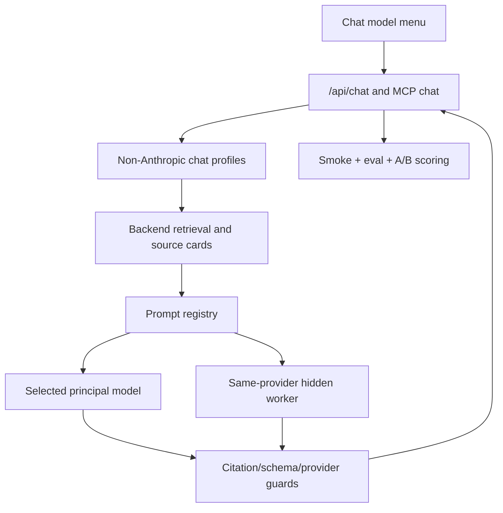

# feat: Implement non-Anthropic chat models and eval loop

## Summary

Implement and harden the non-Anthropic DanteDash chat stack: DeepSeek API mode, OpenAI/Codex OAuth mode, their hidden same-provider worker paths, runtime prompt assets, smoke tests, evals, A/B comparisons, and refinement loops. This plan explicitly excludes Anthropic/Claude/Opus/Sonnet/Haiku in this round. The work is complete only when every implemented model/stage reaches a quality/reliability score of at least `0.78` on the agreed eval rubric.

---

## Problem Frame

DanteDash already has partial DeepSeek and Codex OAuth chat support plus a draft prompt pack. It still needs production-shaped mode profiles, prompt registry integration, provider verification, schema-bound hidden workers, and repeatable eval gates so the chat modes can be judged by evidence rather than subjective feel.

---

## Requirements

- R1. Implement only these visible modes in this round: `deepseek - deepseek-v4-pro` and `openai/codex - gpt-5.5 OAuth`.
- R2. Exclude all Anthropic modes, prompts, workers, judges, and provider configs from runtime implementation in this round.
- R3. Keep provider isolation strict: DeepSeek mode uses only DeepSeek API; OpenAI/Codex mode uses only Codex/OpenAI OAuth.
- R4. Implement runtime prompt assets for DeepSeek principal, OpenAI/Codex GPT-5.5 principal, DeepSeek worker if enabled, GPT-5.4-mini worker, and shared grounding/refusal/visibility policies.
- R5. Keep backend retrieval authoritative. Models receive bounded source cards; models do not browse files, shell, auth state, or arbitrary tools.
- R6. Add backend citation parsing/validation so final answers cannot cite source numbers absent from the retrieved card set without a detected failure or repair path.
- R7. Add schema-bound worker outputs for hidden workers; workers must never produce final user-facing prose.
- R8. Add provider preflight checks for DeepSeek API config and Codex OAuth local runtime without printing secrets or auth files.
- R9. Add smoke tests, deterministic fake-provider tests, eval fixtures, and A/B comparison tooling for the implemented modes.
- R10. Define and enforce a model/stage score gate: each implemented visible mode and each implemented hidden worker path must score `>= 0.78` on the quality/reliability rubric before the goal can be marked complete.
- R11. Run at least two eval passes after implementation: initial smoke/eval/A-B, refinement, and second smoke/eval/A-B.

---

## Scope Boundaries

- No Anthropic runtime implementation: no Claude Sonnet, Claude Opus, Claude Haiku, Anthropic OAuth, Anthropic workers, or Opus judge in this round.
- No changes to ports, LaunchAgent label, MCP server name, Electron identity, or global aliases.
- No KB reindex, ingest, delete, clear, or mutation as part of validation.
- No provider secrets, OAuth tokens, account identifiers, auth file contents, or raw provider logs in tests, docs, UI, or errors.
- No PR completion claim unless each implemented model/stage has score `>= 0.78`; failing scores remain active work, not a “known issue”.

### Deferred to Follow-Up Work

- Anthropic/Claude modes and Opus Premium orchestration.
- Full premium judge/repair loop.
- User-facing eval dashboard.
- Persistent production analytics for chat quality after PR merge.

---

## Context & Research

### Relevant Code and Patterns

- `backend/app/providers.py` already has `DeepSeekChatClient` and `CodexOAuthChatClient`.
- `backend/app/kb.py` constructs DeepSeek and Codex clients and dispatches through `chat_client_for_model`.
- `backend/app/rag.py` owns retrieval, source-card assembly, the current hardcoded `SYSTEM_PROMPT`, and final answer streaming.
- `backend/app/routes/chat.py` streams answer tokens and emits the final `sources` SSE payload.
- `backend/app/chat_models.py` and `frontend/src/hooks/useChat.ts` define the currently visible chat model IDs.
- `docs/prompts/chat-orchestration-system-prompts.md` is the prompt draft source; it now marks runtime guarantees and provider configs as planned/verify-before-implementation.
- `docs/plans/2026-06-15-002-feat-chat-orchestration-prompt-pack-plan.md` defines the broader prompt-pack approach; this plan narrows it to non-Anthropic runtime assets.
- `backend/tests/test_chat_models.py` already covers safe Codex OAuth subprocess invocation.
- `scripts/smoke-dante-dashboard.sh` provides the read-only app smoke baseline.

### External References

- OpenAI model docs list GPT-5.5 as the current complex-reasoning/coding model and GPT-5.4 mini as a lower-cost mini model for coding, computer use, and subagents: <https://developers.openai.com/api/docs/models>
- OpenAI model details list GPT-5.5 model ID `gpt-5.5`, reasoning effort support, Responses/Chat endpoints, streaming, structured outputs, and image input: <https://developers.openai.com/api/docs/models/gpt-5.5>
- OpenAI model details list GPT-5.4 mini as `gpt-5.4-mini`, positioned for high-volume workloads and subagents: <https://developers.openai.com/api/docs/models/gpt-5.4-mini>
- DeepSeek docs state the API is OpenAI/Anthropic-compatible: <https://api-docs.deepseek.com/>
- DeepSeek pricing/docs state legacy `deepseek-chat` and `deepseek-reasoner` are deprecated on 2026-07-24 and map to `deepseek-v4-flash`: <https://api-docs.deepseek.com/quick_start/pricing>
- DeepSeek V4 release notes identify `deepseek-v4-pro` and `deepseek-v4-flash`: <https://api-docs.deepseek.com/news/news260424>

---

## Key Technical Decisions

- Runtime mode scope is two visible modes only: `deepseek-v4-pro` and `codex-gpt-5.5-oauth`.
- Keep hidden workers same-provider only. DeepSeek may use a verified DeepSeek worker, preferably `deepseek-v4-flash`; OpenAI/Codex may use `gpt-5.4-mini` through the same OAuth/Codex route.
- Build the prompt registry now, but only register non-Anthropic prompts in runtime profile lists.
- Keep Anthropic prompt text in docs as draft material, but do not load it from the runtime registry in this round.
- Add backend citation validation as a deterministic guard. The prompt asks for `[n]`; the backend verifies numbers against retrieved sources.
- Make eval scoring explicit and repeatable. A score is not a model claim; it is computed from test/eval outputs using deterministic checks plus rubric review where needed.
- Use fake-provider tests for deterministic CI and live smoke/eval only when the required provider runtime is available.
- Treat OAuth modes as spending-sensitive. Codex OAuth subprocesses must strip accidental API-key billing paths where practical and must keep logs redacted.

---

## Quality / Reliability Score Gate

Each implemented model/stage receives a score in `[0, 1]`. The goal can complete only when every implemented row below is `>= 0.78` in the latest post-refinement eval pass.

| Model/stage | Required? | Score target |
|---|---:|---:|
| `deepseek-v4-pro` principal/final responder | Yes | `>= 0.78` |
| DeepSeek hidden worker, if enabled | Yes if runtime-enabled | `>= 0.78` |
| `gpt-5.5` Codex OAuth principal/final responder | Yes | `>= 0.78` |
| `gpt-5.4-mini` Codex/OpenAI worker | Yes if runtime-enabled | `>= 0.78` |

Score formula:

```text
score =
  0.25 * grounding_score
+ 0.20 * citation_validity_score
+ 0.15 * insufficiency_calibration_score
+ 0.15 * source_panel_consistency_score
+ 0.10 * provider_isolation_score
+ 0.10 * worker_contract_score
+ 0.05 * latency_reliability_score
```

Rules:
- `citation_validity_score` is `0` for an answer that cites a missing source number.
- `provider_isolation_score` is `0` for any hidden cross-provider call.
- `worker_contract_score` is `0` for any worker output accepted as final user-facing prose.
- A provider unavailable because of missing local auth/API config is not a passing score; it is a blocker for that model until configured or explicitly disabled from the implemented set.

---

## High-Level Technical Design

> *This illustrates the intended approach and is directional guidance for review, not implementation specification. The implementing agent should treat it as context, not code to reproduce.*



---

## Implementation Units

### U1. Lock Non-Anthropic Chat Profiles

**Goal:** Make the visible and runtime mode registry authoritative for DeepSeek and OpenAI/Codex only.

**Requirements:** R1, R2, R3

**Dependencies:** None

**Files:**
- Modify: `backend/app/chat_models.py`
- Create/Modify: `backend/app/chat_profiles.py`
- Modify: `backend/app/schemas.py`
- Modify: `frontend/src/hooks/useChat.ts`
- Test: `backend/tests/test_chat_models.py`
- Test: `backend/tests/test_schemas.py`

**Approach:**
- Keep public IDs `deepseek-v4-pro` and `codex-gpt-5.5-oauth`.
- Add profile metadata for provider family, visible label, principal role, optional worker role, auth route, and eval target.
- Exclude Anthropic IDs from accepted runtime profile lists.
- Keep frontend menu in sync with backend profile IDs.

**Test scenarios:**
- Happy path: both accepted IDs validate in API schema.
- Error path: Anthropic IDs are rejected by API schema in this round.
- Integration: frontend model list contains only DeepSeek and OpenAI/Codex visible modes.

**Verification:**
- There is one backend source of truth for active non-Anthropic chat modes.

---

### U2. Add Non-Anthropic Prompt Registry and Assets

**Goal:** Convert the non-Anthropic parts of the prompt draft into runtime-loadable prompt assets.

**Requirements:** R4, R5, R7

**Dependencies:** U1

**Files:**
- Create: `backend/app/chat_prompts/__init__.py`
- Create: `backend/app/chat_prompts/loader.py`
- Create: `backend/app/chat_prompts/registry.py`
- Create: `backend/app/chat_prompts/policies/citation_grounding.md`
- Create: `backend/app/chat_prompts/policies/insufficient_evidence.md`
- Create: `backend/app/chat_prompts/policies/provider_isolation.md`
- Create: `backend/app/chat_prompts/policies/worker_visibility.md`
- Create: `backend/app/chat_prompts/roles/deepseek_principal.md`
- Create: `backend/app/chat_prompts/roles/deepseek_worker.md`
- Create: `backend/app/chat_prompts/roles/codex_gpt55_principal.md`
- Create: `backend/app/chat_prompts/roles/codex_gpt54_mini_worker.md`
- Test: `backend/tests/test_chat_prompt_registry.py`
- Test: `backend/tests/test_chat_prompt_contracts.py`

**Approach:**
- Use Markdown prompt assets with metadata frontmatter.
- Compose shared policies into role prompts deterministically.
- Register only non-Anthropic prompt assets for runtime.
- Leave Anthropic prompt sections as docs-only source material.
- Fail closed on missing policy references, provider mismatch, hidden-worker disclosure, or filesystem/tool/auth instructions.

**Test scenarios:**
- Happy path: DeepSeek and Codex principal prompts load with grounding/refusal/provider-isolation policies.
- Happy path: DeepSeek and GPT-5.4-mini workers load with worker schema policy and are hidden-role only.
- Error path: Anthropic prompt assets are not runtime-registered.
- Error path: a final responder prompt missing citation policy fails validation.

**Verification:**
- `backend/app/rag.py` can request a prompt bundle for either visible mode without touching docs files directly.

---

### U3. Add Citation Parsing and Source Guards

**Goal:** Make inline citation validity deterministic instead of purely prompt-based.

**Requirements:** R5, R6, R9, R10

**Dependencies:** U1, U2

**Files:**
- Create: `backend/app/citations.py`
- Modify: `backend/app/rag.py`
- Modify: `backend/app/routes/chat.py`
- Test: `backend/tests/test_citations.py`
- Test: `backend/tests/test_chat_prompt_integration.py`

**Approach:**
- Parse source references such as `[1]`, `[2][5]`, `[3, p.12]`, and timestamp forms.
- Compare cited numbers against the retrieved result count.
- If invalid citations appear, apply a deterministic policy: flag and fail the response in tests; in runtime either strip invalid citations with a warning event or return a provider error before finalization.
- Preserve the existing final `sources` SSE payload.

**Execution note:** Add characterization tests around the current source numbering before changing `answer_with_vision`.

**Test scenarios:**
- Happy path: answer citing `[1]` and `[2]` with two sources passes.
- Edge case: answer with no citations but source-grounded question fails the eval citation component.
- Error path: answer citing `[9]` with only five sources is detected.
- Integration: final SSE sources remain the retrieved sources, not model-invented sources.

**Verification:**
- Invalid citation numbers cannot silently pass as a high-scoring answer.

---

### U4. Implement Worker Contracts and Provider Executors

**Goal:** Add hidden same-provider worker support for DeepSeek and OpenAI/Codex without exposing workers to users.

**Requirements:** R3, R7, R8, R10

**Dependencies:** U1, U2

**Files:**
- Modify: `backend/app/providers.py`
- Modify: `backend/app/kb.py`
- Modify: `backend/app/deps.py`
- Create: `backend/app/chat_workers.py`
- Create: `backend/app/provider_preflight.py`
- Test: `backend/tests/test_provider_preflight.py`
- Test: `backend/tests/test_provider_executors.py`
- Test: `backend/tests/test_chat_workers.py`

**Approach:**
- Add a worker task abstraction for extraction, source comparison, and rerank support.
- DeepSeek worker uses verified DeepSeek same-provider config, preferably `deepseek-v4-flash`; disable DeepSeek worker if verification fails rather than crossing providers.
- OpenAI/Codex worker uses verified `gpt-5.4-mini` through the Codex/OpenAI OAuth path.
- Validate worker JSON/schema output app-side before principal consumption.
- Redact provider errors and do not print secrets or auth paths.

**Test scenarios:**
- Happy path: fake DeepSeek worker returns valid schema output and is accepted.
- Happy path: fake Codex worker returns valid schema output and is accepted.
- Error path: worker returning final prose is rejected.
- Error path: worker provider failure degrades within same provider or disables worker contribution without cross-provider fallback.
- Security path: preflight errors redact credentials and auth file paths.

**Verification:**
- Hidden workers cannot appear in final SSE answer text or source payload.

---

### U5. Integrate Prompted Generation Flow

**Goal:** Wire mode profiles, prompt bundles, optional worker artifacts, and citation guards into the existing chat path.

**Requirements:** R1, R3, R4, R5, R6, R7, R8

**Dependencies:** U1, U2, U3, U4

**Files:**
- Modify: `backend/app/rag.py`
- Modify: `backend/app/routes/chat.py`
- Modify: `backend/app/mcp_server.py`
- Test: `backend/tests/test_chat_prompt_integration.py`
- Test: `backend/tests/test_mcp_server.py`

**Approach:**
- Replace the hardcoded `SYSTEM_PROMPT` with prompt-registry lookup by chat profile.
- Keep retrieval and source-card construction backend-owned.
- Run workers only when profile config and preflight permit; otherwise call principal directly.
- Keep same provider family for all calls in a turn.
- Return user-facing final answer only from the principal model.

**Test scenarios:**
- Happy path: DeepSeek profile uses DeepSeek principal prompt and valid source cards.
- Happy path: Codex profile uses GPT-5.5 principal prompt and valid source cards.
- Edge case: worker disabled still allows principal-only answer.
- Error path: provider profile mismatch fails before provider call.
- Integration: MCP chat and API chat select the same profile behavior.

**Verification:**
- Current direct chat remains functional while using runtime prompt assets.

---

### U6. Add Eval, A/B, and Quality Score Harness

**Goal:** Make the `>= 0.78` quality/reliability gate measurable and repeatable.

**Requirements:** R9, R10, R11

**Dependencies:** U1, U2, U3, U4, U5

**Files:**
- Create: `backend/app/chat_eval.py`
- Create: `backend/tests/fixtures/chat_eval/golden_cases.json`
- Create: `backend/tests/test_chat_eval.py`
- Create: `scripts/eval-chat-models.py`
- Create: `docs/runbooks/chat-eval-quality-gate.md`

**Approach:**
- Build a small golden eval set covering text, image-card metadata, PDF page references, insufficient evidence, contradictions, and source-number failures.
- Support fake-provider deterministic mode for CI and optional live-provider mode for operator smoke.
- Compute the score formula in this plan for each implemented visible mode and worker path.
- Add A/B comparison between old hardcoded prompt behavior and new prompt-pack behavior where feasible.
- Persist eval summaries as local artifacts under an ignored or generated output path, not as secrets.

**Test scenarios:**
- Happy path: a fully grounded fixture answer scores above `0.78`.
- Error path: invalid citation answer receives `citation_validity_score = 0`.
- Error path: cross-provider trace receives `provider_isolation_score = 0`.
- Edge case: insufficient-evidence answer can score well when abstention is correct.
- Integration: score summary reports per-model/stage pass/fail against `0.78`.

**Verification:**
- The latest eval report clearly says whether every implemented model/stage meets `>= 0.78`.

---

### U7. Run Iterative Smoke, Eval, A/B, Refine, and Re-Test

**Goal:** Execute the quality loop required by the goal and leave evidence for pass/fail.

**Requirements:** R9, R10, R11

**Dependencies:** U6

**Files:**
- Modify: `docs/runbooks/chat-eval-quality-gate.md`
- Create: `docs/eval-reports/.gitkeep` or use an ignored generated output directory if reports include volatile/provider data

**Approach:**
- Run existing backend/frontend/static checks.
- Run read-only app smoke checks when local backend/frontend are available.
- Run eval pass 1 for DeepSeek and OpenAI/Codex.
- Compare A/B results against old prompt behavior or principal-only baseline.
- Refine prompts/configs/tests based on failures without weakening assertions.
- Run eval pass 2.
- Continue refinement until each implemented model/stage is `>= 0.78`, or stop only if blocked by missing provider auth/config after recording the blocker.

**Test scenarios:**
- Happy path: second eval pass shows all implemented model/stage scores `>= 0.78`.
- Error path: a model below `0.78` prevents goal completion.
- Error path: missing OAuth/API credentials are reported as blockers, not passing scores.

**Verification:**
- The goal can be completed only with a documented latest score table where every implemented model/stage is `>= 0.78`.

---

## System-Wide Impact

- **API/MCP parity:** `/api/chat` and MCP chat must share the same profile validation and prompt lookup.
- **Frontend behavior:** Model menu remains simple and shows only the two implemented non-Anthropic modes.
- **Provider safety:** OAuth/API failures are redacted and provider-isolated.
- **Quality gate:** Chat changes cannot be considered done on tests alone; eval scores must meet the threshold.
- **No KB mutation:** Validation uses read-only retrieval/search/chat paths.

---

## Risks & Dependencies

| Risk | Likelihood | Impact | Mitigation |
|------|------------|--------|------------|
| Provider model IDs or CLI flags drift | Medium | High | Verify OpenAI/Codex and DeepSeek runtime before live calls; keep IDs configurable. |
| Eval score becomes subjective | Medium | High | Use explicit weighted rubric plus deterministic checks for citations/provider isolation/schema validity. |
| Codex OAuth accidentally uses API-key billing | Medium | High | Preflight environment, redact key presence, and prefer OAuth/session path with spending-risk reporting. |
| Worker failures reduce reliability | Medium | Medium | Degrade within same provider and score worker path separately. |
| Anthropic code leaks into runtime despite exclusion | Low | High | Tests reject Anthropic mode IDs and runtime prompt registration in this round. |
| Live provider auth unavailable | Medium | High | Fake-provider tests still run, but goal cannot complete for affected live model until auth/config is available or model is explicitly disabled from implemented set. |

---

## Documentation / Operational Notes

- Update prompt docs to mark which prompt sections are runtime-active and which remain future Anthropic draft material.
- Add an operator runbook for interpreting eval score reports and deciding whether the goal can be marked complete.
- Keep eval reports free of raw prompts that include secrets, auth paths, or provider logs.

---

## Sources & References

- Prompt draft source: `docs/prompts/chat-orchestration-system-prompts.md`
- Prompt-pack plan: `docs/plans/2026-06-15-002-feat-chat-orchestration-prompt-pack-plan.md`
- Current chat providers: `backend/app/providers.py`
- Current chat flow: `backend/app/rag.py`
- Current API stream: `backend/app/routes/chat.py`
- Existing smoke script: `scripts/smoke-dante-dashboard.sh`
- OpenAI models: <https://developers.openai.com/api/docs/models>
- OpenAI GPT-5.5: <https://developers.openai.com/api/docs/models/gpt-5.5>
- OpenAI GPT-5.4 mini: <https://developers.openai.com/api/docs/models/gpt-5.4-mini>
- DeepSeek API docs: <https://api-docs.deepseek.com/>
- DeepSeek pricing/deprecation: <https://api-docs.deepseek.com/quick_start/pricing>
- DeepSeek V4 release: <https://api-docs.deepseek.com/news/news260424>
