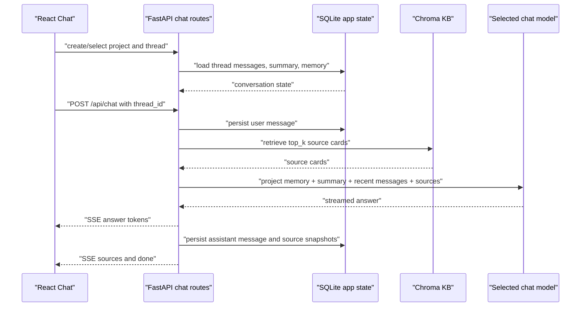

# feat: Add Persistent Chat Workspaces

## Summary

Implement the V1 persistent chat workspace for DanteDash: a local SQLite product-state database for projects, threads, messages, thread summaries, curated project memory, and per-answer sources. The Knowledge Base remains Chroma-backed; this plan adds durable chat/workspace state around the existing grounded retrieval flow without introducing a heavy memory framework.

---

## Problem Frame

The current chat behaves like a transient single session. Messages live in React state, `/api/chat` receives one question at a time, and the Context panel is reconstructed only from the current in-memory messages. Users cannot close the app, return another day, and continue a thread with its prior answers, source cards, model choice, and project context intact.

---

## Assumptions

*This plan was authored in LFG pipeline mode without synchronous user confirmation. The items below are agent inferences that fill gaps in the input and should be reviewed during implementation and PR review.*

- The V1 should be local-only and single-user, matching the current Electron/FastAPI app posture.
- SQLite should store product chat state only. Chroma remains the source of truth for indexed KB content.
- Calls to `/api/chat` without a `thread_id` should keep the current one-shot behavior for MCP and compatibility surfaces.
- Thread summary maintenance should be lightweight in V1. It should not add an extra model call on every turn unless implementation reveals an existing cheap, bounded summarization path.
- Curated project memory means user-editable project notes/instructions, not automatic memory extraction from every message.

---

## Requirements

- R1. Persist projects, threads, messages, thread summary text, curated project memory, and per-assistant-answer sources in a local SQLite database.
- R2. Add a left sidebar workflow where users can create/select projects and threads, then leave and return later with the selected thread restored.
- R3. Preserve the existing chat retrieval flow while adding optional `project_id` and `thread_id` context to prompt assembly.
- R4. Save source cards and visual attachment metadata for each assistant response so the Context panel can reload prior evidence after app restart.
- R5. Group repeated visual evidence by `dante_image_id`, `source_sha256`, linked image id, or preview image id in both persisted context and rendered UI.
- R6. Keep project memory curated and explicit: users can view/edit project memory, but the backend does not silently rewrite it from conversations in V1.
- R7. Preserve model selection and retrieval count per thread or message so resumed work reflects the user's prior chat choices.
- R8. Maintain existing compatibility for search, library, preview, MCP chat, and one-shot `/api/chat` clients.

---

## Scope Boundaries

- No cloud sync, multi-user auth, account model, RBAC, or remote collaboration.
- No LangGraph, Zep, Mem0, Basic Memory, or other heavy memory framework.
- No automatic long-term memory extraction, contradiction register, nightly consolidation, or cross-project memory.
- No live Chroma ingest, delete, clear, or reindex as part of this feature.
- No change to provider routing, hidden workers, Claude/Opus orchestration, or model prompts except passing bounded conversation/project context.

### Deferred to Follow-Up Work

- Conversation branching/fork from message, useful but not required for V1.
- Full-text or semantic search over chat history.
- Import/export of complete projects as Markdown/JSON.
- Model-generated summaries with evaluation gates, if deterministic V1 summaries are not good enough.
- User-confirmed auto-memory suggestions.

---

## Context & Research

### Relevant Code and Patterns

- `frontend/src/hooks/useChat.ts` stores messages in React state and posts one question to `/api/chat`; this is the main state boundary to replace or wrap.
- `backend/app/routes/chat.py` streams tokens and emits final `sources`; this is where user/assistant messages and source payloads can be persisted after the grounded answer is complete.
- `backend/app/schemas.py` defines `ChatRequest`; new project/thread fields should be optional to preserve compatibility.
- `frontend/src/components/ChatPanel.tsx` already groups sources by visual asset key and renders a Context panel from assistant messages.
- `frontend/src/components/Sidebar.tsx` currently owns Knowledge Base status/upload/clear; it can become a project/thread sidebar while retaining a compact Knowledge Base section.
- `backend/app/vault_index.py` uses stdlib `sqlite3` with row factories, giving a local pattern for dependency-free SQLite access.
- `backend/app/deps.py` centralizes settings and local paths; it is the right place to add an app-state database path.

### Institutional Learnings

- The visual asset package contract requires grouping related image/card/decoupage layers by `dante_image_id` or `source_sha256`.
- Donna memory policy patterns favor stable conversation ids, explicit project filters, local-first recall, and metadata tags to prevent cross-project contamination.
- Donna Crawl research packaging reinforces controlled local-only work with clear source matrices rather than broad speculative crawls.

### External References

- Open WebUI: projects, folders, pins, memory, notes, and unified model/chat workspace patterns: https://docs.openwebui.com/features/
- LibreChat: model switching, conversation branching, resumable streams, import/export, and conversation search: https://github.com/danny-avila/LibreChat
- AnythingLLM: local-first workspaces, dynamic model routing, user-managed memories: https://github.com/Mintplex-Labs/anything-llm
- AI SDK UI message persistence: store UI-format messages, validate opaque chat ids, save final messages after streaming: https://ai-sdk.dev/docs/ai-sdk-ui/chatbot-message-persistence
- LangMem summarization guidance: render full history in UI while keeping summaries in separate state: https://langchain-ai.github.io/langmem/guides/summarization/
- DeepSeek workspace request: validates the product need for project isolation, cross-session memory, and persistent files: https://github.com/deepseek-ai/DeepSeek-V3/issues/1384

---

## Key Technical Decisions

- Use stdlib SQLite via a small app-owned store module: avoids a new dependency and matches the app's local desktop posture.
- Keep Chroma and SQLite separate: Chroma answers KB retrieval; SQLite answers product state, history, and UI resume.
- Make `project_id` and `thread_id` optional on chat requests: existing one-shot and MCP surfaces keep working.
- Store source payloads as structured JSON snapshots per assistant message: the Context panel can reload exact evidence even if later retrieval ordering changes.
- Use stable asset grouping keys at display time and persist enough metadata to regroup: `dante_image_id`, `source_sha256`, `linked_image_file_id`, `preview_image_file_id`, `file_id`, and `node_id`.
- Treat project memory as an editable text block or small structured record in V1: user control beats opaque auto-memory at this stage.
- Build prompt context from project memory, thread summary, and recent messages with bounded limits: persistence should not blindly concatenate all history.
- Prefer progressive enhancement in the frontend: an empty install should create or select a default project/thread without blocking chat.

---

## Open Questions

### Resolved During Planning

- Should model memory be added? No. Product persistence comes first; model memory frameworks are out of scope.
- Should SQLite replace Chroma? No. It stores chat/workspace state only.
- Should existing one-shot chat clients be migrated immediately? No. `thread_id` persistence is optional for compatibility.

### Deferred to Implementation

- Exact summary compaction policy: implementation should choose the simplest bounded approach that avoids extra provider cost per turn while still giving useful resume context.
- Final default database path: add a setting with an ignored local default and verify it does not collide with existing runtime data.
- Exact sidebar density at narrow widths: implement against the existing responsive shell and verify in browser.

---

## High-Level Technical Design

> *This illustrates the intended approach and is directional guidance for review, not implementation specification. The implementing agent should treat it as context, not code to reproduce.*

---

## Implementation Units

### U1. SQLite Chat State Store

**Goal:** Add the local persistence layer for projects, threads, messages, summaries, curated memory, and source snapshots.

**Requirements:** R1, R4, R6, R7

**Dependencies:** None

**Files:**
- Create: `backend/app/chat_store.py`
- Test: `backend/tests/test_chat_store.py`
- Modify: `backend/app/deps.py`
- Modify: `backend/.env.example`
- Modify: `.gitignore`

**Approach:**
- Create a small SQLite store class that initializes schema idempotently on first use.
- Use UUID or opaque token ids for projects, threads, and messages.
- Store projects with name, created/updated timestamps, optional memory text, and optional instructions.
- Store threads with project id, title, summary, selected model, top_k, archived/pinned flags, and timestamps.
- Store messages with role, content, model id, top_k, streaming/completion status, and timestamps.
- Store sources as JSON snapshots linked to assistant message id, preserving search result fields and visual metadata.
- Add a settings path for the SQLite database, defaulting to ignored local runtime storage.

**Execution note:** Implement store behavior test-first. This is persistent state and should have direct coverage before route integration.

**Patterns to follow:**
- `backend/app/vault_index.py` for lightweight `sqlite3` connection and row conversion patterns.
- `backend/app/deps.py` for local path settings and cached singleton setup.

**Test scenarios:**
- Happy path: creating a project and thread returns stable ids and stores timestamps.
- Happy path: appending user and assistant messages preserves order and roles.
- Happy path: saving sources for an assistant message returns them on thread reload.
- Edge case: creating a thread without a title produces a safe default title.
- Edge case: archived threads are hidden from the default list but can still be loaded by id.
- Error path: loading a missing project/thread/message returns a controlled not-found result.
- Integration: store initialization can run twice without dropping existing rows.

**Verification:**
- A new test module proves CRUD, ordering, idempotent schema initialization, and source persistence without touching Chroma.

---

### U2. Project, Thread, and Memory API

**Goal:** Expose backend API endpoints for the frontend to list, create, update, and load projects/threads and curated memory.

**Requirements:** R1, R2, R6, R7, R8

**Dependencies:** U1

**Files:**
- Create: `backend/app/routes/chat_state.py`
- Modify: `backend/app/main.py`
- Modify: `backend/app/schemas.py`
- Test: `backend/tests/test_chat_state_routes.py`

**Approach:**
- Add API routes under `/api/projects` and `/api/threads` for the workspace sidebar and chat screen.
- Keep response DTOs explicit and sanitized; never return local database paths.
- Include thread message history and source snapshots in the thread detail response.
- Add project memory update endpoints that replace curated memory/instructions explicitly.
- Include a default-project bootstrap route or behavior so first launch can work with no preexisting rows.

**Patterns to follow:**
- `backend/app/routes/library.py` for route-level validation and sanitized DTO responses.
- `backend/app/schemas.py` for Pydantic request/response models.

**Test scenarios:**
- Happy path: first project/thread creation then thread detail load returns empty messages.
- Happy path: updating project memory changes only that project and is visible on reload.
- Happy path: thread list returns latest-updated threads in stable order.
- Edge case: empty database bootstrap creates or exposes a usable default project.
- Error path: requesting a missing project/thread returns 404 without a stack trace.
- Error path: invalid project/thread ids return 400 or 404 consistently.

**Verification:**
- Backend route tests cover all API shapes needed by the frontend before UI integration.

---

### U3. Thread-Aware Chat Streaming and Prompt Context

**Goal:** Extend `/api/chat` so thread-backed calls persist messages, reload bounded conversation context, and save final source snapshots while one-shot calls still work.

**Requirements:** R3, R4, R7, R8

**Dependencies:** U1, U2

**Files:**
- Modify: `backend/app/routes/chat.py`
- Modify: `backend/app/schemas.py`
- Modify: `backend/app/rag.py`
- Test: `backend/tests/test_chat_thread_persistence.py`
- Test: `backend/tests/test_mcp_server.py`

**Approach:**
- Add optional `project_id` and `thread_id` fields to `ChatRequest`.
- When `thread_id` is absent, preserve the current streaming behavior exactly.
- When `thread_id` is present, persist the user message before retrieval, load project memory/thread summary/recent messages, and pass a bounded context block into prompt assembly.
- Persist the assistant message after completion with answer text, selected model, top_k, visual attachment count, citation validation payload, and source snapshots.
- Update the thread title on the first user message using a deterministic short title derived from the question.
- Maintain a lightweight thread summary field after completed assistant turns without exposing it as a chat message in the UI.
- If provider generation fails, mark the pending assistant state as failed only when an assistant record was created, and return the existing neutral SSE error.

**Technical design:** The prompt should remain source-grounded. Conversation context should orient the assistant but not override KB citations. The context block should be clearly separated from retrieved source cards.

**Patterns to follow:**
- `backend/app/routes/chat.py` current SSE framing and error behavior.
- `backend/app/rag.py` current `answer_with_vision` prompt assembly and citation validation.
- `backend/tests/test_mcp_server.py` compatibility expectations for one-shot chat.

**Test scenarios:**
- Happy path: one-shot request without `thread_id` still streams answer and sources with no database requirement.
- Happy path: thread request saves user message, assistant message, and source snapshots in order.
- Happy path: second thread request includes prior summary/recent messages in the model input.
- Edge case: thread with no prior messages behaves like a normal first turn.
- Edge case: top_k and chat_model selected for a turn are persisted on the thread/message.
- Error path: provider failure returns the existing SSE error and does not silently reroute.
- Integration: MCP chat aggregation remains compatible after schema extension.

**Verification:**
- Tests prove persistence is opt-in and does not regress existing chat or MCP behavior.

---

### U4. Frontend Workspace State and API Client

**Goal:** Add frontend data access and state wiring for projects, threads, current selection, and project memory.

**Requirements:** R1, R2, R6, R7

**Dependencies:** U2

**Files:**
- Modify: `frontend/src/lib/api.ts`
- Create: `frontend/src/hooks/useChatWorkspace.ts`
- Modify: `frontend/src/App.tsx`
- Test expectation: none for automated frontend unit tests, because the repo currently has typecheck/build but no visible frontend test runner. Behavior is covered by backend tests and browser smoke in later units.

**Approach:**
- Add typed API client methods for projects, threads, thread detail, and project memory update.
- Create a workspace hook that loads projects, selects the latest/default project, selects or creates a thread, and exposes refresh/update operations.
- Keep current selected project/thread in localStorage only as a convenience pointer; SQLite remains the durable source of truth.
- Pass selected project/thread state into `Sidebar` and `ChatPanel`.
- Handle empty, loading, and error states without blocking Knowledge Base search/library tabs.

**Patterns to follow:**
- Existing hooks such as `frontend/src/hooks/useStats.ts`, `frontend/src/hooks/useItems.ts`, and `frontend/src/lib/api.ts`.
- Current `App.tsx` ownership of sidebar width and panel selection.

**Test scenarios:**
- Type-level: API client types align with backend DTOs under `pnpm typecheck`.
- Browser smoke: fresh app creates or selects a default project and thread.
- Browser smoke: selecting another thread changes the rendered chat history.
- Browser smoke: reloading the app restores the last selected thread when it still exists.

**Verification:**
- Typecheck passes and browser smoke confirms workspace selection works without transient React-only state.

---

### U5. Sidebar Projects and Thread Resume UI

**Goal:** Replace the left sidebar's KB-only layout with a durable project/thread navigator while retaining compact KB stats and upload controls.

**Requirements:** R2, R6, R7

**Dependencies:** U4

**Files:**
- Modify: `frontend/src/components/Sidebar.tsx`
- Modify: `frontend/src/index.css`
- Modify: `frontend/src/components/ChatPanel.tsx`

**Approach:**
- Add a Projects section with the current project, a project create action, and project memory edit access.
- Add a Threads section with new thread, recent thread list, active state, rename/archive affordances if scoped cleanly.
- Keep Knowledge Base stats, upload files, and clear all available in a lower compact section.
- Avoid decorative complexity; the sidebar is a work navigation surface.
- Ensure the title bar/window controls area is not invaded and central content remains at its prior vertical rhythm unless the context panel alone intentionally extends.

**Patterns to follow:**
- Current sidebar density, resize handle, and Electric Fusion/Dante identity tokens in `frontend/src/index.css`.
- Existing use of lucide icons and compact controls in `ChatPanel`.

**Test scenarios:**
- Browser smoke: active project and active thread are visually clear.
- Browser smoke: creating a new thread clears the composer/history for that thread only.
- Browser smoke: selecting an older thread restores its messages and sources.
- Browser smoke: KB counts and upload control remain usable after navigation changes.
- Visual regression check: left sidebar, central chat, and right context panel do not overlap title/window control areas.

**Verification:**
- Desktop viewport screenshot shows project/thread navigation, KB stats, and chat panel without text overlap.

---

### U6. Persistent Chat Panel and Context Sources

**Goal:** Make the chat panel render persisted thread messages and persisted sources, then continue appending live streamed turns into the same durable thread.

**Requirements:** R3, R4, R5, R7, R8

**Dependencies:** U3, U4, U5

**Files:**
- Modify: `frontend/src/hooks/useChat.ts`
- Modify: `frontend/src/components/ChatPanel.tsx`
- Modify: `frontend/src/components/PreviewDialog.tsx` if persisted source snapshots expose preview metadata differently.
- Test expectation: none for automated frontend unit tests, because the repo currently lacks a frontend unit test runner; validate with typecheck, build, and browser smoke.

**Approach:**
- Initialize chat messages from selected thread detail instead of empty React state.
- Include `project_id` and `thread_id` in chat requests when present.
- On final `sources` SSE event, update the current assistant message and let the backend be the durable source for reload.
- Preserve the existing source grouping helper, but make it robust for persisted snapshots and repeated layers.
- Keep the Context panel cumulative across answers in the selected thread.
- Keep model and top_k controls below the composer, and update thread defaults when feasible without adding extra UI friction.

**Patterns to follow:**
- Existing `collectAssistantContextGroups`, `groupSourcesByAsset`, and `sourceAssetKey` helpers in `ChatPanel`.
- Existing chat model and top_k controls in the composer meta row.

**Test scenarios:**
- Browser smoke: send a question, sources appear in answer bubble and Context panel.
- Browser smoke: reload app, same answer and Context panel sources remain visible.
- Browser smoke: repeated image/card layers collapse into one asset group with layer count.
- Browser smoke: model/top_k controls still send the selected values.
- Error path: failed stream marks the assistant turn as failed and does not create duplicated stale UI messages.

**Verification:**
- Browser smoke proves a persisted thread can survive reload and continue from the same message timeline.

---

### U7. Verification, Smoke, and Documentation

**Goal:** Add focused tests and update operator docs so the persistent workspace can be validated without touching ingest/reindex flows.

**Requirements:** R1, R2, R3, R4, R5, R6, R7, R8

**Dependencies:** U1, U2, U3, U4, U5, U6

**Files:**
- Modify: `README.md`
- Modify: `docs/runbooks/dante-dashboard-operations.md`
- Modify: `scripts/smoke-dante-dashboard.sh`
- Test: `backend/tests/test_chat_store.py`
- Test: `backend/tests/test_chat_state_routes.py`
- Test: `backend/tests/test_chat_thread_persistence.py`

**Approach:**
- Document the local app-state database path, backup expectation, and how it differs from Chroma.
- Extend the smoke script only with read/write checks for the chat workspace API that do not ingest, delete, clear, or reindex KB data.
- Ensure tests use temporary SQLite files and fake chat/Kb providers where needed.
- Run backend tests, frontend typecheck/build, and browser smoke before final handoff.

**Patterns to follow:**
- `scripts/smoke-dante-dashboard.sh` existing read-only health posture.
- `docs/runbooks/dante-dashboard-operations.md` for operator-facing notes.

**Test scenarios:**
- Integration: smoke can create a temporary project/thread and verify API response shape without altering KB content.
- Integration: backend pytest suite passes with temporary chat store.
- Integration: frontend build passes after route and state wiring.
- Browser smoke: desktop viewport shows sidebar projects/threads, central chat, and right context without overlap.

**Verification:**
- Focused backend tests pass.
- `pnpm typecheck` and `pnpm build` pass.
- Local browser smoke confirms project/thread resume and source persistence.

---

## System-Wide Impact

- **Interaction graph:** New project/thread APIs feed Sidebar and ChatPanel; `/api/chat` optionally reads/writes SQLite in addition to querying Chroma.
- **Error propagation:** Chat state errors should return route-level 4xx/5xx responses for workspace APIs; provider failures in chat keep existing neutral SSE errors.
- **State lifecycle risks:** A streamed assistant response may be interrupted. Persist a clear incomplete or failed status rather than pretending the turn completed.
- **API surface parity:** MCP and one-shot `/api/chat` clients must remain compatible because `thread_id` is optional.
- **Integration coverage:** Unit tests alone will not prove UI resume; browser smoke is required for create/select/reload/continue.
- **Unchanged invariants:** Chroma KB data, preview routes, library search, provider routing, source citation validation, and ingest flows remain unchanged.

---

## Risks & Dependencies

| Risk | Mitigation |
|------|------------|
| Dirty existing worktree obscures this feature's changes | Read before editing touched files, avoid unrelated reverts, and stage only intentional files when committing. |
| SQLite schema changes become hard to migrate | Keep V1 schema simple, initialize idempotently, include a schema version table or pragma, and test reinitialization. |
| Persisted context causes prompt bloat | Bound prompt assembly to project memory, summary, and recent messages. Never concatenate full history into the model input. |
| Source snapshots drift from current KB metadata | Persist snapshots for historical reproducibility while using preview URLs/file ids for current preview rendering. |
| Context panel duplicates layered visual assets | Use existing grouping keys and add tests/smoke around `source_sha256` and `dante_image_id` grouping. |
| Summary quality is weak without model calls | Keep the summary bounded and transparent; defer model-generated summaries if V1 deterministic compaction is insufficient. |
| UI sidebar gets too dense | Use collapsible/compact sections and keep KB controls secondary to project/thread navigation. |

---

## Documentation / Operational Notes

- Document that the app now has two local data stores: Chroma for indexed KB and SQLite for chat/workspace state.
- Add backup guidance for the SQLite app-state file.
- Keep smoke commands explicit that they do not ingest, clear, delete, or reindex KB content.
- Add notes for resetting only chat workspace state separately from clearing the KB.

---

## Sources & References

- Related code: `frontend/src/hooks/useChat.ts`
- Related code: `frontend/src/components/ChatPanel.tsx`
- Related code: `frontend/src/components/Sidebar.tsx`
- Related code: `backend/app/routes/chat.py`
- Related code: `backend/app/schemas.py`
- Related code: `backend/app/rag.py`
- Related code: `backend/app/vault_index.py`
- Related architecture: `docs/architecture/visual-asset-package-contract.md`
- Prior plan note: `docs/plans/2026-06-15-001-feat-multi-provider-oauth-orchestration-plan.md`
- External docs: https://ai-sdk.dev/docs/ai-sdk-ui/chatbot-message-persistence
- External docs: https://langchain-ai.github.io/langmem/guides/summarization/
- External prior art: https://docs.openwebui.com/features/
- External prior art: https://github.com/danny-avila/LibreChat
- External prior art: https://github.com/Mintplex-Labs/anything-llm
- External product signal: https://github.com/deepseek-ai/DeepSeek-V3/issues/1384
