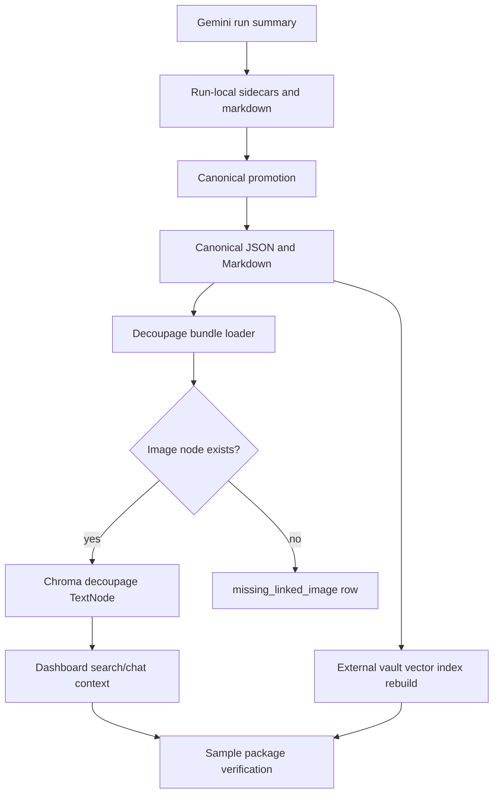
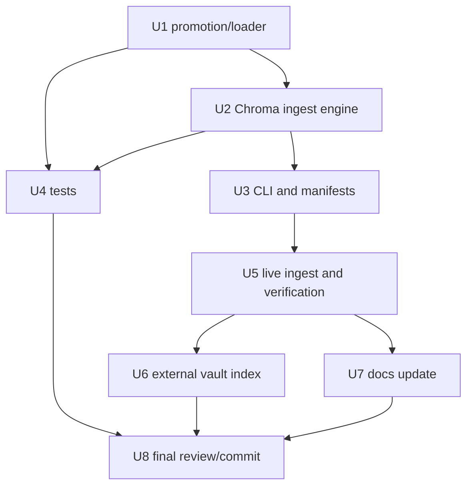

# feat: Index premium decoupage visual layer

## Summary

Implement and operate an idempotent premium decoupage ingest path for the Dante
visual corpus. The new layer must promote the Gemini-generated decoupage
sidecars into canonical JSON/Markdown locations, index one linked Chroma text
node per source image hash, refresh the external vault vector index, verify the
three-layer package shape for sample assets, and update the visual asset package
contract only after the live ingest succeeds.

---

## Problem Frame

The dashboard currently has linked image vector nodes and Gemini visual-analysis
card text nodes. The newly completed Gemini decoupage run produced 2,093 premium
sidecar/Markdown pairs, but those outputs are still run-local artifacts and are
not yet canonical files or Chroma nodes. Search and chat therefore cannot cite
the premium art-grade layer as part of each image package.

---

## Assumptions

*This plan was authored in pipeline mode without synchronous confirmation. The
items below are agent inferences that should be reviewed while implementing.*

- The user's request explicitly opens the earlier "do not ingest/reindex until
  Andre says ready" gate for this specific Gemini decoupage run.
- The existing mock canonical decoupage sidecar for the smoke asset may differ
  from the Gemini production output; replacing a different canonical file is
  allowed only with a backup and manifest row that records the replacement.
- The external vault vector-index script remains outside this repository and
  should be invoked as an operator-provided runtime path, not copied into this
  app repo.
- The source run targeted 2,093 assets while the visual corpus has 2,094 image
  vectors; the ingest should explain the one-asset difference from source-run
  evidence instead of treating the mismatch as silent drift.

---

## Requirements

- R1. Validate the Gemini decoupage run before mutation: provider `gemini`,
  model `gemini-3.1-pro-preview`, non-Vertex API surface, 2,093 targets,
  2,093 OK rows, zero errors, threshold 0.87, and average confidence around
  0.903.
- R2. Promote run-local JSON and Markdown outputs into canonical decoupage
  sidecar paths under the dataset analysis tree, preserving category/group
  folder structure.
- R3. Promotion must be idempotent: matching existing files are skipped,
  missing files are copied, differing files are backed up before replacement,
  and every action is recorded in a promotion manifest and summary.
- R4. Chroma ingest must create exactly one premium decoupage text node per
  source image hash using `dante_visual_decoupage_<source_sha256[:32]>`.
- R5. Each decoupage node must keep the image package link through
  `dante_image_id`, `source_sha256`, `linked_image_file_id`, and
  `preview_image_file_id`, both pointing to the existing visual image node.
- R6. Missing image nodes must not be ingested; they must be reported as
  `missing_linked_image` rows.
- R7. Decoupage node metadata must include dataset, artifact type, schema,
  profile, provider, model, category, group, absolute and relative sidecar
  paths, source run id, ingest run id, and file hashes.
- R8. Searchable text must include the Markdown handoff plus structured JSON
  fields relevant to decoupage search: one-line summary, spine, composition,
  camera/lens, lighting, color, art direction, costume, performance, registers,
  lineage, distinction, grounding, proactive adjacencies, and opinion.
- R9. The ingest must not alter existing image vector nodes or existing Gemini
  `visual_analysis_bundle` nodes.
- R10. The external vault vector index must be rebuilt after canonical
  Markdown promotion and validated through inspect and a representative query.
- R11. Final verification must show before/after dashboard counts, sample
  three-layer package evidence for a known asset, and a clear explanation if
  counts differ from the expected post-ingest shape.
- R12. Documentation must be updated only after live Chroma ingest succeeds,
  replacing "not indexed yet" status with indexed status and manifest paths.
- R13. Add focused tests for promotion, idempotency, metadata linking, missing
  image handling, searchable text composition, and manifest summaries.

---

## Scope Boundaries

- Do not open Obsidian.
- Do not move Knowledge Hub, the vault, source images, existing Gemini cards, or
  existing Chroma collections.
- Do not clear, delete, or reindex Chroma wholesale.
- Do not print, persist, or transform API keys or private session state.
- Do not merge image vectors, Gemini visual cards, and decoupage analyses into
  one giant document.
- Do not change model/provider routing, chat orchestration, OAuth clients, or
  prompt packs.
- Do not change dashboard UI unless verification proves the existing source
  grouping cannot show the linked decoupage layer.

### Deferred to Follow-Up Work

- Grouped dashboard package UX for browsing all layers of an image package can
  be polished in a later UI pass if the existing source grouping proves
  insufficient after ingest.
- Multi-lens decoupage suffix nodes remain out of scope; this plan indexes the
  primary `solo` Gemini run only.

---

## Context & Research

### Relevant Code and Patterns

- `backend/app/dante_visual/card_ingest.py` provides the closest ingest pattern:
  dataclass bundles/rows/summaries, idempotent node detection, linked image node
  validation, text embedding with retries, normalized embeddings, `TextNode`
  creation, metadata, TSV manifest, and JSON summary.
- `scripts/dante_visual_card_ingest.py` provides the CLI shape: load dotenv,
  validate run ids, resolve vault/dataset paths through the harness, load
  source manifests, call `get_kb()`, and print JSON output.
- `backend/tests/test_dante_visual_card_ingest.py` provides fake KB,
  collection, embedder, and vector-store patterns for fast deterministic ingest
  tests.
- `scripts/dante_visual_decoupage_gemini_concurrent.py` shows the Gemini run
  layout, validation rules, `_dante_binding`, summary shape, and flat run-local
  `sidecars/`, `markdown/`, and `raw-responses/` directories.
- `scripts/dante_visual_decoupage_harness.py` already defines canonical
  decoupage JSON and Markdown paths by `category/group/file_stem`.
- `backend/app/dante_visual/safe_io.py` provides safe root-contained writes and
  symlink protection for vault artifact promotion.
- `backend/app/dante_visual/manifest.py` provides safe run id, slug, relative
  path, and source manifest parsing helpers.
- `docs/architecture/visual-asset-package-contract.md` is the canonical package
  contract and must be updated only after live ingest is verified.
- `docs/dante-visual-analysis-harness.md` documents current provider and ingest
  boundaries.
- The operator-provided external vault vector-index script indexes Markdown and
  text files, skips generated manifests by default, and should pick up canonical
  decoupage Markdown after promotion.

### Institutional Learnings

- No `docs/solutions/` entries were present for this specific ingest lane.
- Workspace instructions emphasize read-only validation before mutation unless
  the operator explicitly opens the gate; this request opens the gate for this
  decoupage ingest.

### Verified Run-State Inputs

- The Gemini production run summary exists and reports:
  provider `gemini`, API surface `Gemini Developer API`, `uses_vertex: false`,
  model `gemini-3.1-pro-preview`, `target_count: 2093`, `ok_count: 2093`,
  `error_count: 0`, `average_confidence_overall: 0.9031`, threshold `0.87`,
  and `pass: true`.
- The run-local output directories contain 2,093 JSON sidecars, 2,093 Markdown
  handoffs, and 2,093 raw responses.
- The canonical decoupage sidecar/Markdown trees currently contain only the
  earlier smoke asset, so promotion must run before ingest.

---

## Key Technical Decisions

- Mirror `card_ingest.py` instead of building a generic ingest framework:
  decoupage is another linked visual text layer with almost identical Chroma
  lifecycle needs, and matching local patterns reduces risk.
- Keep promotion and Chroma ingest in the same decoupage module but expose them
  as separable operations through the CLI: promotion needs safe file conflict
  behavior, while Chroma ingest needs KB/embedder access and can be retried
  independently.
- Treat canonical Markdown as the stable vault surface and Chroma text as the
  searchable index surface: external vault indexing should consume the promoted
  Markdown, while dashboard search/chat should consume Chroma nodes.
- Use `source_sha256` as the package identity and idempotency key. Human
  `dante_image_id` is retained for UX and reports, but node identity comes from
  the source hash.
- Back up differing canonical sidecars before replacement rather than skipping
  them. This preserves the old smoke artifact while allowing the production
  Gemini run to become canonical.
- Do not force Chroma deletes by default. Existing decoupage nodes should be
  skipped unless `--force` is explicitly used; forced runs delete only candidate
  decoupage node ids, never image or Gemini card nodes.

---

## Open Questions

### Resolved During Planning

- Should this proceed despite the previous no-ingest gate? Yes. The user
  explicitly asked to ingest and reindex this specific decoupage run.
- Should external research be used? No. The codebase has strong local ingest
  patterns, and the external index surface is an operator-provided local script
  already inspected during planning.

### Deferred to Implementation

- Which one of the 2,094 visual assets is absent from the 2,093-target Gemini
  decoupage run: determine from the source run results and report it in the
  final ingest summary.
- Whether canonical smoke sidecars differ from production Gemini sidecars:
  determine by hashing during promotion, then back up and report any differing
  replacements.
- Exact before/after Chroma counts: measure immediately before and after live
  ingest because the local KB may have changed since planning.
- Whether external vault reindex returns decoupage results in the top five for
  the representative query: record actual query evidence after rebuild.

---

## Output Structure

```text
backend/app/dante_visual/
  decoupage_ingest.py

scripts/
  dante_visual_decoupage_ingest.py

backend/tests/
  test_dante_visual_decoupage_ingest.py

docs/architecture/
  visual-asset-package-contract.md
```

Runtime manifests are generated under the dataset analysis tree, not committed
to this repository:

```text
analysis-cards/decoupage/manifests/<ingest-run-id>/
  decoupage-promotion-manifest.tsv
  decoupage-promotion-summary.json
  decoupage-ingest-manifest.tsv
  decoupage-ingest-summary.json
```

---

## High-Level Technical Design

> *This illustrates the intended approach and is directional guidance for
> review, not implementation specification. The implementing agent should treat
> it as context, not code to reproduce.*



Implementation unit dependencies:



---

## Implementation Units

### U1. Decoupage bundle discovery and canonical promotion

**Goal:** Load the completed Gemini run, validate its summary, discover
run-local outputs, and promote them into canonical decoupage JSON/Markdown paths
with idempotent conflict handling.

**Requirements:** R1, R2, R3

**Dependencies:** None

**Files:**
- Create: `backend/app/dante_visual/decoupage_ingest.py`
- Create: `backend/tests/test_dante_visual_decoupage_ingest.py`

**Approach:**
- Add dataclasses for decoupage source run validation, promoted bundles,
  promotion rows, and promotion summaries.
- Validate the source summary before any file writes; fail fast if provider,
  model, target count, OK count, error count, threshold, or pass flag do not
  match the requested run contract.
- Resolve assets through the existing visual manifest so flat run-local files
  can be mapped back to `category/group/file_stem` canonical paths.
- Read `_dante_binding` from each sidecar and require it to match manifest
  `image_id` and `source_sha256`.
- Copy missing canonical files, skip identical canonical files, and when a
  canonical file exists with different content, write a timestamped backup
  before replacing it.
- Write promotion manifest rows with statuses such as `promoted`,
  `already_same`, `backed_up_replaced`, `missing_source_file`,
  `invalid_binding`, and `failed`.

**Execution note:** Implement promotion tests before running live promotion,
because this unit mutates canonical vault-side files.

**Patterns to follow:**
- `scripts/dante_visual_decoupage_harness.py` for canonical decoupage path
  construction.
- `backend/app/dante_visual/safe_io.py` for safe writes under a root.
- `backend/app/dante_visual/manifest.py` for asset identity and path safety.

**Test scenarios:**
- Happy path: run-local JSON/Markdown for a manifest asset are promoted into
  canonical category/group paths and recorded as `promoted`.
- Idempotency: rerunning promotion over identical canonical files records
  `already_same` and does not create backups.
- Conflict path: an existing different canonical JSON/Markdown is backed up,
  replaced, and reported as `backed_up_replaced`.
- Error path: missing run-local Markdown records `missing_source_file` and does
  not create a partial canonical package.
- Error path: a sidecar with mismatched `_dante_binding.source_sha256` is
  rejected and not promoted.

**Verification:**
- Promotion summary totals equal the source run target count.
- Canonical sidecar and Markdown counts match the number of promoted or already
  present source-run outputs.
- Any replacements have backup paths recorded in the manifest.

---

### U2. Linked Chroma decoupage ingest engine

**Goal:** Add the idempotent Chroma ingest engine that embeds canonical premium
decoupage bundles as linked `visual_decoupage_bundle` text nodes.

**Requirements:** R4, R5, R6, R7, R8, R9

**Dependencies:** U1

**Files:**
- Create: `backend/app/dante_visual/decoupage_ingest.py`
- Create: `backend/tests/test_dante_visual_decoupage_ingest.py`

**Approach:**
- Add constants for schema version, artifact type, profile id, provider,
  model, schema name, and node-id prefix.
- Build `decoupage_node_id_for(source_sha256)` and reuse the existing visual
  image node id convention for `linked_image_file_id` and
  `preview_image_file_id`.
- Collect existing decoupage node ids by `artifact_type` and `dataset_id`,
  mirroring `collect_existing_card_node_ids`.
- For each bundle, skip existing decoupage nodes unless forced, report missing
  linked image nodes, and queue only safe, linkable bundles for embedding.
- Build searchable text from Markdown plus compact structured JSON sections,
  preserving clear labels for the requested decoupage fields.
- Store metadata with package identity, canonical paths, run ids, provider,
  model, hashes, category, group, modality `text`, and artifact type
  `visual_decoupage_bundle`.
- Normalize embeddings and add `TextNode` objects through the existing vector
  store interface.

**Execution note:** Add characterization tests against fake KB objects before
calling the real KB.

**Patterns to follow:**
- `backend/app/dante_visual/card_ingest.py` for idempotent ingest, embedding
  retries, metadata shape, summary/manifest writing, and forced candidate delete
  behavior.
- `backend/tests/test_dante_visual_card_ingest.py` for fake KB testing.

**Test scenarios:**
- Happy path: a promoted bundle linked to an existing image node creates one
  decoupage node with expected node id, metadata, normalized embedding, and
  searchable text containing Markdown plus structured fields.
- Idempotency: an existing decoupage node records `skipped_existing` and does
  not embed or add a new node.
- Error path: missing linked image node records `missing_linked_image` and does
  not embed.
- Force path: forced ingest deletes only candidate decoupage ids and embeds the
  replacement node.
- Metadata path: output metadata includes all required package keys, JSON and
  Markdown path variants, provider/model/schema/profile fields, and hashes.

**Verification:**
- Ingest summary reports embedded, skipped, missing, and failed counts.
- Existing image and Gemini card node ids are never passed to delete.
- Manifest rows include enough information to audit every selected asset.

---

### U3. CLI wrapper and run artifacts

**Goal:** Expose promotion and ingest through a single operator CLI that matches
the existing visual ingest script conventions and writes durable run artifacts.

**Requirements:** R1, R2, R3, R4, R7, R11

**Dependencies:** U1, U2

**Files:**
- Create: `scripts/dante_visual_decoupage_ingest.py`
- Test: `backend/tests/test_dante_visual_decoupage_ingest.py`

**Approach:**
- Mirror `scripts/dante_visual_card_ingest.py`: load dotenv, validate run ids,
  resolve vault/dataset paths through the harness helpers, load the visual
  manifest, build bundles, get the KB, and print structured JSON.
- Support promotion and ingest in one default flow, while keeping internal
  functions separable enough for tests.
- Accept runtime inputs for vault root, dataset root, source run id, ingest run
  id, force, and max retries.
- Write promotion and ingest artifacts under the decoupage manifest run
  directory for the ingest run id.
- Exit non-zero when source validation fails, promotion has failed rows,
  missing linked image rows are present, or Chroma ingest fails.

**Patterns to follow:**
- `scripts/dante_visual_card_ingest.py` for CLI shape and JSON result output.
- `scripts/dante_visual_decoupage_gemini_concurrent.py` for source run summary
  names and run-local output layout.

**Test scenarios:**
- Happy path: CLI helper functions resolve source run outputs and ingest-run
  manifest paths without using unsafe run ids.
- Error path: unsafe run id is rejected via existing run-id validation.
- Error path: missing source summary fails before any KB access.

**Verification:**
- CLI output includes promotion manifest path, promotion summary path, ingest
  manifest path, ingest summary path, and summary counts.
- Runtime artifacts are written under the intended ingest run directory.

---

### U4. Focused test coverage

**Goal:** Add and run focused tests proving the decoupage ingest layer follows
the package contract without requiring live Chroma, live embeddings, or provider
calls.

**Requirements:** R3, R5, R6, R7, R8, R9, R13

**Dependencies:** U1, U2, U3

**Files:**
- Create: `backend/tests/test_dante_visual_decoupage_ingest.py`
- Modify: existing tests only if imports or shared fake helpers need small
  compatibility changes.

**Approach:**
- Reuse the fake KB strategy from card ingest tests.
- Build small temporary run-local and canonical directories to test promotion
  idempotency and conflict backup behavior.
- Assert exact metadata values for required contract keys.
- Assert text composition includes representative nested JSON fields and the
  Markdown handoff.

**Patterns to follow:**
- `backend/tests/test_dante_visual_card_ingest.py`
- `backend/tests/test_dante_visual_vector_ingest.py`

**Test scenarios:**
- Promotion missing/same/different-file cases.
- Source run summary validation success and failure cases.
- Linked ingest success, skip existing, missing linked image, and force cases.
- Searchable text includes the Markdown handoff and structured decoupage
  sections without collapsing into a raw full JSON dump only.

**Verification:**
- Focused decoupage ingest tests pass with existing decoupage, card ingest, and
  vector ingest tests.

---

### U5. Live Chroma ingest and package verification

**Goal:** Run the new decoupage ingest against the completed Gemini run, record
before/after counts, and verify the expected linked package shape.

**Requirements:** R1, R2, R3, R4, R5, R6, R7, R8, R9, R11

**Dependencies:** U1, U2, U3, U4

**Files:**
- Runtime artifacts only; no tracked source files expected unless implementation
  discovers a code defect.

**Approach:**
- Measure dashboard stats immediately before ingest.
- Run the decoupage ingest with the operator-provided source run id and a new
  ingest run id.
- Inspect generated promotion and ingest summaries.
- Measure dashboard stats after ingest.
- Verify a known sample package has image, Gemini card, and decoupage nodes
  linked by shared source hash/image id and preview image node.
- Explain any count differences with manifest evidence, especially the source
  run's 2,093 targets vs. 2,094 existing images.

**Patterns to follow:**
- Existing smoke/health style in `scripts/smoke-dante-dashboard.sh`.
- Existing package contract in `docs/architecture/visual-asset-package-contract.md`.

**Test scenarios:**
- Integration: before/after stats reflect added decoupage text nodes without
  changing image counts.
- Integration: sample asset package has all three layers and a shared preview
  image node.
- Error path: if live ingest reports missing linked image or failed rows, stop
  documentation updates and report manifest evidence.

**Verification:**
- Expected post-ingest shape is approximately total 6,281, image 2,094, text
  4,187 if the local KB had the expected pre-ingest shape.
- The final report includes actual before/after counts and manifest paths.

---

### U6. External vault vector index rebuild and query validation

**Goal:** Rebuild the external vault vector index so canonical decoupage
Markdown participates in vault-side retrieval, then validate counts and a
representative query.

**Requirements:** R10, R11

**Dependencies:** U5

**Files:**
- Runtime external index artifacts only; no tracked source files expected.

**Approach:**
- Invoke the operator-provided external index script after canonical Markdown
  promotion succeeds.
- Use the requested batch size and progress interval.
- Inspect the rebuilt index and run the representative query.
- Record whether the query returns canonical decoupage Markdown, Gemini cards,
  or other vault documents in the top results.

**Patterns to follow:**
- The external script's default generated-path skipping already excludes
  decoupage manifests but not canonical decoupage Markdown.

**Test scenarios:**
- Integration: inspect reports an index with embeddings after rebuild.
- Integration: representative query returns top-k rows and includes useful
  snippets for visual/cinematic composition.
- Error path: if the embedding endpoint or reranker is unavailable, report the
  failing stage and do not claim vault index success.

**Verification:**
- Build report, inspect output, and query output are captured in the final
  response.

---

### U7. Documentation update after successful ingest

**Goal:** Update the visual asset package contract and relevant harness docs
only after the live Chroma ingest and external index validation succeed.

**Requirements:** R12

**Dependencies:** U5, U6

**Files:**
- Modify: `docs/architecture/visual-asset-package-contract.md`
- Modify: `docs/dante-visual-analysis-harness.md` if command/status notes need
  to reflect the completed Gemini decoupage ingest.

**Approach:**
- Replace "not indexed yet" language with verified indexed status only after
  summaries and Chroma stats prove success.
- Update provider/model in the contract for this production layer to Gemini
  rather than the older OpenAI placeholder.
- Add final promotion and ingest manifest locations relative to the dataset
  decoupage tree.
- Preserve the rule that future ingests must keep separate image, Gemini card,
  and decoupage nodes.

**Patterns to follow:**
- Existing contract structure in `docs/architecture/visual-asset-package-contract.md`.
- Existing harness documentation style in `docs/dante-visual-analysis-harness.md`.

**Test scenarios:**
- Test expectation: none -- documentation-only unit.

**Verification:**
- Docs accurately state actual run id, ingest run id, provider/model, indexed
  status, and manifest artifact names.
- Docs do not claim full success if any ingest or external index validation
  failed.

---

### U8. Final review, commit, PR, and CI follow-through

**Goal:** Finish the LFG pipeline by reviewing the implementation against this
plan, running required checks, committing/pushing, creating or updating a PR,
and watching/fixing CI when available.

**Requirements:** R11, R13

**Dependencies:** U4, U5, U6, U7

**Files:**
- Modify: source, tests, docs, and plan-adjacent files changed by earlier units.

**Approach:**
- Run focused tests for decoupage ingest plus existing decoupage/card/vector
  tests.
- Run backend or app smoke checks needed to prove the dashboard still reads the
  KB.
- Use the code-review step to catch residual issues and persist any autofixes.
- Commit and push all tracked changes, then create/update a PR and monitor CI
  per the pipeline.

**Patterns to follow:**
- LFG pipeline requirements from the active skill invocation.

**Test scenarios:**
- Integration: focused visual ingest test suite passes.
- Integration: dashboard stats endpoint remains healthy.
- Integration: external index query evidence is included in the final report.

**Verification:**
- Working tree is clean after commit/push.
- Final response includes ingest status, before/after counts, manifest paths,
  sample search/package evidence, and whether dashboard/Chroma now has the
  three linked layers.

---

## System-Wide Impact

- **Interaction graph:** The ingest touches vault-side sidecar files, Chroma
  text nodes, dashboard search/chat source metadata, and the external vault
  vector index. It does not touch model routing or UI state.
- **Error propagation:** Source-run validation and promotion errors stop before
  Chroma ingest. Chroma missing-image rows stop success claims. External index
  failures are reported separately after Chroma success.
- **State lifecycle risks:** Partial promotion, differing canonical files,
  interrupted embeddings, duplicate source hashes, existing decoupage nodes,
  and the 2,093/2,094 target mismatch are the main state risks.
- **API surface parity:** The new script becomes an operator CLI alongside
  existing vector/card ingest scripts. It should not alter existing API routes.
- **Integration coverage:** Unit tests prove idempotency and metadata; live
  smoke proves actual Chroma counts and package linkage.
- **Unchanged invariants:** Existing `image` and `visual_analysis_bundle` nodes
  remain separate nodes. Existing preview routes should continue using the
  visual image node through `preview_image_file_id`.

---

## Risks & Dependencies

| Risk | Likelihood | Impact | Mitigation |
|------|------------|--------|------------|
| Canonical smoke file differs from Gemini output | High | Medium | Back up before replacement and record backup paths in promotion manifest. |
| One visual asset has no decoupage output | High | Low | Explain from source run target count and report the missing asset rather than inventing a node. |
| Missing linked image node for a sidecar | Low | High | Mark `missing_linked_image`, skip ingest, and stop success claims. |
| Embedding provider or local KB is unavailable during ingest | Medium | High | Use retry behavior and stop with manifest evidence instead of partial success claims. |
| External vault index endpoint unavailable | Medium | Medium | Keep Chroma success separate; report external index failure with command/stage evidence. |
| Metadata drift breaks dashboard preview grouping | Medium | High | Test required metadata keys and verify sample package through preview-image id. |
| Overwriting existing decoupage nodes accidentally deletes other layers | Low | High | Force delete only candidate `dante_visual_decoupage_*` ids, never image/card ids. |

---

## Success Metrics

- Gemini run validation passes before mutation.
- Promotion summary accounts for all 2,093 source-run outputs.
- Chroma ingest summary has zero failed rows and zero missing linked images, or
  any exceptions are fully explained with row evidence.
- Dashboard stats increase by the number of embedded decoupage text nodes, with
  image count unchanged.
- A known sample image package shows image, Gemini card, and decoupage node ids
  linked by shared source identity and preview image id.
- External vault index inspect and query return usable results after rebuild.
- Focused tests for decoupage ingest and existing visual ingest tests pass.

---

## Documentation / Operational Notes

- Use the operator-provided source run id:
  `visual-decoupage-gemini31-production-20260616-codex`.
- Use a new ingest run id such as
  `visual-decoupage-ingest-20260616-codex`, unless implementation discovers an
  existing successful ingest for the same source run.
- Do not update indexed-status docs until live Chroma ingest has actually
  completed.
- Keep runtime manifests in the dataset decoupage manifest tree and avoid
  committing vault-generated artifacts.
- Record exact before/after stats in the final report because the KB may have
  changed since the expected baseline.

---

## Sources & References

- Workspace instructions: `AGENTS.md`
- Claude compatibility instructions: `CLAUDE.md`
- Visual package contract: `docs/architecture/visual-asset-package-contract.md`
- Visual harness docs: `docs/dante-visual-analysis-harness.md`
- Card ingest pattern: `backend/app/dante_visual/card_ingest.py`
- Card ingest CLI: `scripts/dante_visual_card_ingest.py`
- Decoupage Gemini runner: `scripts/dante_visual_decoupage_gemini_concurrent.py`
- Decoupage harness path helpers: `scripts/dante_visual_decoupage_harness.py`
- Ingest tests pattern: `backend/tests/test_dante_visual_card_ingest.py`
- Vector ingest tests pattern: `backend/tests/test_dante_visual_vector_ingest.py`
