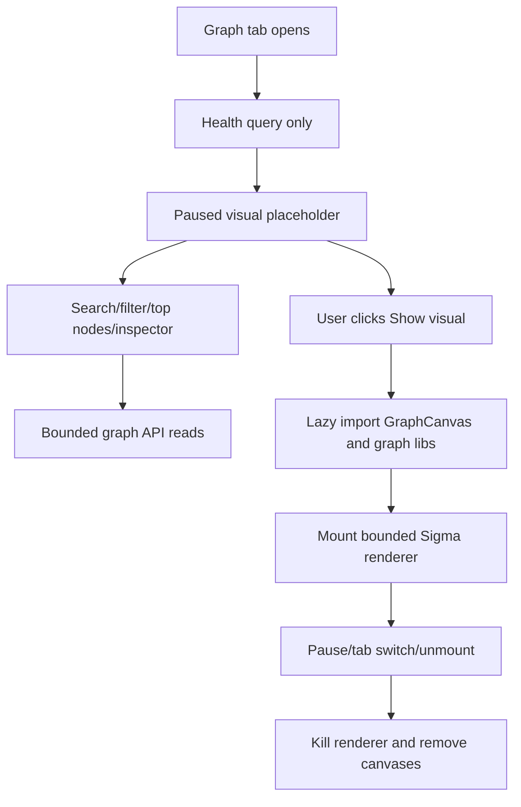
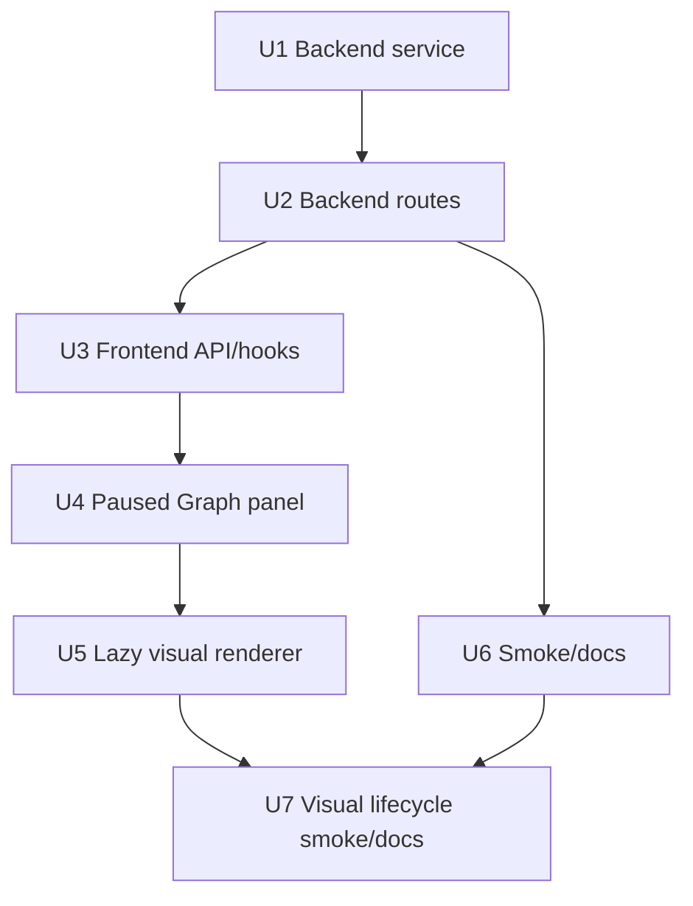

# feat: Add Black Label Graph View

## Summary

Add a first-class, read-only Black Label LightRAG Graph View to DanteDash. The
backend will expose bounded graph health, summary, search, subgraph, and node
detail APIs over the operator-provided GraphML source, while the frontend will
add a native Graph tab where search, filters, top nodes, and inspector work even
when the visual renderer is paused.

The visual graph must be explicitly opt-in. Opening the Graph tab should not
mount Sigma, WebGL, or canvas; `Show visual` mounts the renderer, and `Pause
visual`, tab switch, or unmount destroys it so canvas count returns to zero.

---

## Problem Frame

DanteDash can search and chat over the indexed visual KB, but it does not yet
offer a relationship-map view of the Black Label LightRAG graph. The existing
sidecar implementation proves the graph explorer is useful, but DanteDash needs
the capability adapted to its current FastAPI, React, Electron, dark workspace,
and strict read-only safety boundaries.

---

## Origin And Source Contract

- Origin runbook: `/Users/vidigal/claude-code/Obsidian/docs/runbooks/dantedash-black-label-graph-agent-prompt.md`.
- Canonical GraphML source: `/Users/vidigal/Obsidian_Dante_AI_RAG_DATA/neural_memory_voyage_2048/graph_chunk_entity_relation.graphml`.
- Runtime configuration key: `DANTE_LIGHTRAG_GRAPHML_PATH`. If unset, the
  backend uses the canonical local source above. Tests set this variable to a
  temporary GraphML fixture before creating route clients.
- The graph source is backend configuration only. No request parameter may
  choose, override, or traverse to another GraphML file.
- The service resolves the source once per cache check, requires an existing
  regular `.graphml` file, rejects over-large inputs, and returns redacted
  source errors. Full absolute source paths stay out of stable HTTP payloads,
  frontend UI, smoke output, and user-facing error strings.
- `/api/graph/*` inherits DanteDash's local app trust boundary: default bind is
  `127.0.0.1`, intended callers are the same-origin frontend and local agents,
  and graph routes must not add wildcard CORS or a wider exposure surface.
- Source metadata returned by health is redacted: `source_name`, `exists`,
  `size_bytes`, `mtime_ns`, `cache_status`, parse counts, and non-sensitive
  labels are allowed; absolute local paths are not.

### Reference Implementation Surfaces

- Sidecar docs: Black Label graph explorer documentation and graph visual
  polish plan.
- Sidecar backend: graph explorer service, graph routes, and graph tests.
- Sidecar frontend: graph panel and graph canvas components.
- Adaptation note: the sidecar visual started enabled by default; DanteDash
  must invert that default so renderer code, WebGL, and canvas are mounted only
  after `Show visual`.

### Acceptance Workflows

- Human opens the Graph tab and sees health, search, top nodes, inspector, and
  a paused visual placeholder with zero graph canvases.
- Human searches and selects a node while the visual stays paused.
- Human enables visual, verifies one bounded renderer mounts, then pauses or
  switches tabs and verifies graph canvases return to zero.
- Local agent or HTTP smoke calls health, search, node, and subgraph endpoints
  without depending on the canvas.
- Operator smoke confirms graph reads do not change source GraphML mtime or
  trigger ingest, reindex, clear, delete, or mutation commands.

---

## Graph Limits Contract

- Source file size cap: fail read-only with a redacted unavailable/error state
  when the GraphML exceeds the configured cap.
- Parser caps: reject DTD/entity declarations, cap nodes, edges, per-node data
  fields, per-edge data fields, and string field lengths before building the
  snapshot.
- Search: default `limit=20`, hard cap `80`.
- Summary: default top nodes `40`, hard cap `120`; graph overview payload
  defaults to at most `700` nodes and `1,400` edges.
- Subgraph: default `depth=1`, hard cap `3`; default max nodes `220`, hard cap
  `800`; default max edges `900`, hard cap `2,500`.
- Node detail: default adjacent edge cap `80`, hard cap `250`.
- Visual renderer: renders only bounded API payloads, never the full graph; no
  perpetual full-corpus physics. Layout settling is short, bounded, and disabled
  when `prefers-reduced-motion` is active.
- Filter semantics: OR within the same filter group, AND across route/entity
  groups. Active filters render as removable chips with counts where available.
  A selected node stays selected even if filters hide it from result lists.

---

## Frontend State And Accessibility Contract

- First open hierarchy: source/cache status and search are primary; filters sit
  with search; top nodes provide default exploration; inspector starts with a
  no-selection state that explains graph/source status; the center region is a
  paused visual placeholder.
- Visual states: `paused`, `loading_renderer`, `ready`, `empty`, `renderer_error`,
  `webgl_unavailable`, `reduced_motion_static`, `pause_requested`, and
  `cleanup_complete` must have clear UI content and actions.
- Keyboard and screen-reader basics: tab order reaches search, filters, top
  nodes, result rows, inspector actions, and show/pause controls; compact icon
  buttons need labels/tooltips; status changes use polite live regions.
- Canvas fallback: the DOM search/results/inspector remain the primary
  navigable representation. Canvas is an optional visual aid, not the only way
  to inspect graph data.
- Responsive behavior: the panel remains usable at practical desktop widths;
  touch targets for compact controls stay at least 32px high/wide unless an
  existing app primitive enforces a larger target.

---

## Assumptions

*This plan was authored without synchronous user confirmation. The items below
are agent inferences that fill gaps in the input and should be reviewed before
implementation proceeds.*

- The GraphML source path from the origin runbook is the canonical local source
  for v1 and should be read directly, not copied into this repo.
- The Graph View should load lightweight health immediately on tab open, then
  load bounded summary/search/subgraph data through backend threadpool work.
- Sigma, Graphology, and any layout package should be lazy-loaded only after
  the user clicks `Show visual`.
- HTTP graph endpoints are sufficient for v1 agent integration. MCP graph tools
  are out of scope for v1 and require a separate follow-up plan if HTTP proves
  insufficient.
- Graph payloads should expose relative/source-encoded hints and Obsidian URIs,
  while absolute local source paths remain server-side only.
- When filters exclude a selected node, the selected node remains the center and
  filters apply to results/neighborhood expansion rather than clearing the
  inspector unexpectedly.

---

## Requirements

- R1. Provide read-only graph endpoints for health, summary, search, subgraph,
  and node detail.
- R2. Parse GraphML safely and cache parsed data by source metadata so repeated
  graph reads do not repeatedly parse the full file.
- R3. Keep payloads bounded and deterministic; never serialize the full graph to
  the browser.
- R4. Preserve route labels, entity types, degree, weighted degree,
  descriptions, source ids/files, source-family hints, prepared queries, and
  Obsidian routing hints where available.
- R5. Graph API reads must not mutate Chroma, Knowledge Hub, Smart Connections,
  LightRAG runtime storage, vault files, or source assets.
- R6. Add a Graph tab/surface to DanteDash that matches the app's current dark
  working UI and does not change existing Search, Chat, or Library workflows.
- R7. Visual rendering starts disabled by default and does not mount canvas,
  Sigma, WebGL, or graph physics until explicit user action.
- R8. Search, filters, top nodes, node detail, and inspector remain usable while
  the visual renderer is disabled.
- R9. `Show visual` mounts a bounded graph renderer; `Pause visual`, tab
  changes, and component unmount destroy the renderer and remove canvases.
- R10. Selecting nodes should highlight/focus adjacency without camera jumps
  into empty space or renderer rebuilds on every selection.
- R11. Large graph views must avoid full-corpus physics and perpetual animation;
  any layout settling must be bounded and reduced-motion aware.
- R12. Backend tests, frontend type/build checks, smoke checks, and browser
  validation must cover the read-only API and visual lifecycle.
- R13. Graph HTTP payloads must be sanitized and path-redacted by default.
- R14. Node detail must support node ids containing slashes.

---

## Scope Boundaries

- No ingest, reindex, Chroma mutation, Knowledge Hub mutation, Smart
  Connections mutation, LightRAG runtime mutation, vault writes, or source asset
  writes.
- No replacement of the current Electron/Vite/React architecture.
- No 3D graph view in this pass.
- No full-graph physics over the complete corpus.
- No dependency on Obsidian internals beyond best-effort `obsidian://` links and
  relative path hints.
- No provider/model/chat/runtime changes.
- No MCP graph tools in v1.
- No absolute local source path exposure through regular graph payloads,
  frontend UI, smoke output, or stable HTTP errors.

### Deferred to Follow-Up Work

- MCP graph tools: revisit only in a separate plan if v1 HTTP endpoints are
  insufficient for agents.
- Deep graph analytics: centrality exploration, saved graph workspaces, and
  multi-hop query authoring can follow after the read-only explorer is stable.
- Mobile/iPhone-specific tuning beyond basic responsive and reduced-motion
  behavior can follow if desktop validation exposes no regressions.

---

## Context & Research

### Relevant Code and Patterns

- `backend/app/main.py` registers API routers with `prefix="/api"`.
- `backend/app/routes/vault_index.py` uses bounded query params and threadpool
  execution for synchronous read work.
- `frontend/src/App.tsx` owns the current tab navigation and can add a fourth
  `Graph` tab without introducing a router.
- `frontend/src/lib/api.ts` mirrors backend DTOs and is the right place for
  graph wire types and client methods.
- `frontend/src/hooks/useSearch.ts` and `frontend/src/hooks/useStats.ts` show
  the local React Query pattern for API-backed panels.
- `frontend/src/components/SearchPanel.tsx`, `ChatPanel.tsx`, and
  `LibraryPanel.tsx` establish the current panel density, `slack-panel`,
  `surface-card`, and `comfortable-scrollbar` visual language.
- `frontend/src/components/ui/tabs.tsx` unmounts inactive tab contents, which
  helps enforce renderer cleanup when the user leaves the Graph tab.
- The sidecar reference implementation provides the closest backend/parser and
  Sigma lifecycle pattern, but its default visual state must be inverted because
  DanteDash requires the visual to start disabled.

### Institutional Learnings

- No `docs/solutions/` directory exists in this repo.
- Current DanteDash docs emphasize app-only scope, read-only validation for
  risky surfaces, and preserving existing ports, MCP names, aliases, and local
  runtime boundaries.
- The decoupage package contract reinforces a layered, linkable evidence model;
  the Graph View should complement that model rather than flatten or mutate it.

### External References

- No web research was needed for planning because the origin runbook names a
  local reference implementation and the app has clear local patterns.

---

## Key Technical Decisions

- Add a dedicated graph service module rather than mixing graph parsing into
  Chroma, search, or vault-index code: this keeps read-only graph behavior
  isolated.
- Use route-local Pydantic response models in `backend/app/routes/graph.py`,
  mirrored by TypeScript interfaces in `frontend/src/lib/api.ts`, so graph
  contracts stay isolated from broader app schemas.
- Cache parsed graph snapshots in process, keyed by file metadata and refreshed
  only when the source changes or a graph endpoint needs data.
- Use `health(load=false)` as the cheapest initial call so opening the Graph tab
  can avoid immediate full parse when possible.
- Lazy-load the graph renderer component and graph libraries only after explicit
  visual enablement.
- Keep the selected node stable across filters and apply filters to search and
  neighborhood expansion, avoiding surprising selection loss.
- Keep absolute local source information out of regular graph cards; expose
  relative/source hints and prepared queries for human and agent navigation.

---

## Open Questions

### Resolved During Planning

- Should opening Graph View immediately mount the visual renderer? No. The
  visual starts paused and renderer code is lazy-loaded only after `Show visual`.
- Should first open parse the whole graph? Only lightweight health should be
  immediate; bounded graph data can load through backend threadpool reads.
- Should v1 include MCP graph tools? No. HTTP APIs satisfy v1 integration; MCP
  graph tools are a separate follow-up if needed.
- Should graph endpoints expose absolute source paths? No stable graph HTTP
  payload should expose full local paths. Health returns redacted source
  metadata only.
- Where do response models live? Route-local Pydantic models in
  `backend/app/routes/graph.py`.

### Deferred to Implementation

- Exact GraphML field irregularities: fixture tests should cover the known
  `SEP` and source-file patterns, while implementation may need small adapters
  after parsing the real file.
- Exact visual layout tuning inside the caps: start with conservative settings
  and adjust after browser validation.

---

## Output Structure

```text
backend/app/
  graph_explorer.py
  routes/graph.py
backend/tests/
  test_graph_explorer.py
frontend/src/
  components/GraphPanel.tsx
  components/GraphCanvas.tsx
  hooks/useGraph.ts
```

---

## High-Level Technical Design

> *This illustrates the intended approach and is directional guidance for
> review, not implementation specification. The implementing agent should treat
> it as context, not code to reproduce.*



---

## Implementation Units

### U1. Backend Graph Explorer Service

**Goal:** Add a read-only GraphML parser/cache/service that can produce bounded
health, summary, search, subgraph, and node-detail DTOs.

**Requirements:** R1, R2, R3, R4, R5

**Dependencies:** None

**Files:**
- Create: `backend/app/graph_explorer.py`
- Test: `backend/tests/test_graph_explorer.py`

**Approach:**
- Adapt the sidecar `GraphExplorer` service into DanteDash as an isolated
  read-only module.
- Use a hardened streaming XML posture: reject DTD/entity declarations before
  parsing, use `xml.etree.ElementTree.iterparse` or equivalent streaming
  parsing, cap source size, cap graph/data counts, and cap string field lengths.
- Infer routes/source families from deterministic rules and source-file text.
- Compute degree and weighted degree during parse.
- Cache a `GraphSnapshot` by size and `mtime_ns`; health can report cold,
  fresh, and stale states.
- Keep all outputs bounded by explicit limits and deterministic sort orders.
- Sanitize all GraphML-derived strings: render text as text only, strip control
  characters, truncate oversized fields, redact absolute paths and `..`
  segments from source hints, and build `obsidian://open` links only from
  validated relative paths with URL encoding and the allowed scheme.
- Do not import app Chroma, ingest, clear, or vault mutation modules.

**Execution note:** Implement service tests first with a tiny GraphML fixture
before connecting routes.

**Patterns to follow:**
- Sidecar graph parser and route inference.
- `backend/app/vault_index.py` style for read-only, local-index service
  boundaries.
- Existing backend tests that create temporary fixtures and assert DTO content.

**Test scenarios:**
- Happy path: parsing a fixture with `SEP` values returns the expected nodes,
  edges, source ids, source files, route labels, degrees, weighted degrees, and
  prepared queries.
- Happy path: summary returns only a bounded overview and top nodes sorted by
  weighted degree, degree, and label.
- Happy path: search for a phrase returns deterministic scored node cards and
  honors entity/route filters.
- Happy path: subgraph around a selected node returns bounded neighbors and
  edges, while preserving the selected center.
- Edge case: health with `load=false` reports source metadata without loading a
  snapshot.
- Edge case: changing fixture `mtime_ns` makes cache status stale.
- Error path: missing GraphML reports unavailable state or 404 at the route
  layer without crashing app import.
- Error path: DTD/entity declarations, over-large fixtures, and over-limit
  graphs return redacted graph unavailable/errors rather than crashing.
- Safety: service tests assert source file mtime/content is unchanged by graph
  API reads.

**Verification:**
- Focused backend graph tests pass.
- Graph service has no dependency on Chroma or mutating route modules.

### U2. Backend Graph Routes And Contracts

**Goal:** Expose agent-friendly `/api/graph/*` endpoints with bounded,
typed responses and read-only failure behavior.

**Requirements:** R1, R3, R4, R5, R12

**Dependencies:** U1

**Files:**
- Create: `backend/app/routes/graph.py`
- Modify: `backend/app/main.py`
- Test: `backend/tests/test_graph_explorer.py`

**Approach:**
- Add endpoints for health, summary, search, subgraph, and node detail under
  `/api/graph`.
- Run parser/search/subgraph work in `run_in_threadpool`.
- Use FastAPI `Query` bounds for limits, depth, node counts, edge counts, and
  search limits.
- Define route-local Pydantic models in this file and keep frontend DTOs in
  sync manually.
- Implement node detail as `GET /api/graph/node/{node_id:path}` and require the
  frontend client to call it with `encodeURIComponent(nodeId)` so node ids with
  `/` remain addressable.
- Map missing source or missing node failures to stable HTTP errors.
- Return redacted health/source metadata by default; do not expose absolute
  GraphML paths.
- Keep the local-only boundary explicit: graph routes inherit the existing
  localhost app deployment and add no wildcard CORS behavior.
- Keep route functions free of ingest/delete/reindex operations.

**Patterns to follow:**
- `backend/app/routes/vault_index.py` for local read-only routes and threadpool
  execution.
- `backend/app/routes/library.py` and `backend/app/schemas.py` for response
  model discipline.

**Test scenarios:**
- Happy path: `GET /api/graph/health?load=true` loads a fixture and reports
  node/edge counts.
- Happy path: `GET /api/graph/search?q=visual` returns bounded deterministic
  results.
- Happy path: `GET /api/graph/subgraph?node_id=...` returns a graph payload
  with the selected node and bounded edges.
- Happy path: `GET /api/graph/node/{id}` returns detail and adjacent edges.
- Happy path: `GET /api/graph/node/{node_id:path}` returns detail for fixture
  ids containing `/`.
- Error path: unknown node returns 404.
- Error path: missing graph source returns 404 for load-requiring endpoints and
  non-crashing health for `load=false`.
- Integration: registering the router in `backend/app/main.py` exposes the
  endpoints under the app's existing `/api` prefix.

**Verification:**
- Route tests pass through `TestClient`.
- `/api/graph/health` works against the live local app without mutating runtime
  data.

### U3. Frontend Graph API Client And Hooks

**Goal:** Add typed frontend graph DTOs, API methods, and React Query hooks
that support the Graph panel without coupling agents to the canvas.

**Requirements:** R1, R3, R4, R6, R8

**Dependencies:** U2

**Files:**
- Modify: `frontend/src/lib/api.ts`
- Create: `frontend/src/hooks/useGraph.ts`

**Approach:**
- Add TypeScript interfaces for graph health, count items, node cards, node
  details, edge cards, graph nodes, graph edges, and graph payloads.
- Add `api.graphHealth`, `api.graphSummary`, `api.graphSearch`,
  `api.graphSubgraph`, and `api.graphNode`.
- Encode node ids with `encodeURIComponent` in node-detail URLs.
- Add hooks mirroring existing `useSearch`/`useStats` style.
- Use `enabled` flags so node detail and search calls only fire when needed.
- Keep health cheap and let summary/subgraph calls stay bounded by params.

**Patterns to follow:**
- `frontend/src/lib/api.ts` typed client style.
- `frontend/src/hooks/useSearch.ts` for query keys and enabled query behavior.

**Test scenarios:**
- Type-level coverage through `pnpm typecheck`.
- Happy path: hooks build stable query keys from query/filter/depth/limit inputs.
- Edge case: search hook is disabled for an empty query.
- Edge case: node-detail hook is disabled when no node is selected.

**Verification:**
- TypeScript compilation passes.
- Network calls from the Graph panel hit the intended `/api/graph/*` routes.

### U4. Graph Panel Without Visual Renderer

**Goal:** Add a native Graph tab with search, route/entity filters, top nodes,
inspector, read-only/cache status, and a paused visual placeholder.

**Requirements:** R6, R7, R8

**Dependencies:** U3

**Files:**
- Modify: `frontend/src/App.tsx`
- Create: `frontend/src/components/GraphPanel.tsx`
- Modify: `frontend/src/index.css` only if existing utility classes are
  insufficient

**Approach:**
- Add a `Graph` tab using the existing tab system and `Network` icon.
- Build a three-zone working surface: control/search rail, visual placeholder
  area, and inspector/top-node rail.
- Default visual state to paused/off on every fresh mount; do not persist "on"
  in local storage.
- Let health load first; summary/top nodes may load bounded data for
  non-visual exploration.
- Keep filters and inspector usable while the visual placeholder is showing.
- Show relative path hints and prepared queries in inspector; keep Obsidian
  links as best-effort affordances.
- Make first-open hierarchy explicit: status/search first, filters beside
  search, top nodes as the default exploration list, center paused placeholder,
  and inspector no-selection state.
- Preserve keyboard access, focus states, labels/tooltips for compact controls,
  and polite live status updates.
- Avoid nested cards and oversized marketing copy; keep density consistent with
  Search/Chat/Library.

**Patterns to follow:**
- `frontend/src/components/SearchPanel.tsx` form and results density.
- `frontend/src/components/ChatPanel.tsx` evidence/inspector density.
- Existing `slack-panel`, `surface-card`, and UI primitives.

**Test scenarios:**
- Happy path: opening the Graph tab shows status, filters, search input, top
  nodes or loading state, inspector, and `Show visual`.
- Happy path: searching while paused returns results and selecting a result
  loads node detail without enabling the visual.
- Happy path: route/entity filters update results and subgraph data while
  paused.
- Accessibility: search, filters, result rows, top nodes, inspector actions,
  and visual toggles are reachable by keyboard and have readable labels.
- Edge case: missing graph source shows a readable error state.
- Edge case: no search results shows a clear empty state.
- Lifecycle: first render and reload produce zero graph canvases.

**Verification:**
- TypeScript and build pass.
- Browser snapshot shows the Graph tab and paused state without canvas elements.

### U5. Lazy Visual Renderer And Cleanup

**Goal:** Add the opt-in visual graph renderer with bounded Sigma/Graphology
lifecycle and guaranteed cleanup on pause/unmount.

**Requirements:** R7, R9, R10, R11, R12

**Dependencies:** U4

**Files:**
- Modify: `frontend/package.json`
- Modify: `pnpm-lock.yaml`
- Create: `frontend/src/components/GraphCanvas.tsx`
- Modify: `frontend/src/components/GraphPanel.tsx`

**Approach:**
- Add only the graph rendering dependencies needed for the renderer:
  `sigma`, `graphology`, and `graphology-layout-forceatlas2`, starting from the
  sidecar package posture and committing both package and lockfile updates.
- Dynamically import `GraphCanvas` after `Show visual`, so the graph renderer
  chunk is not loaded for paused-only use.
- Build deterministic initial positions and route-aware colors.
- Run only bounded layout settling for small/focused graphs and honor
  `prefers-reduced-motion`.
- Highlight selected nodes and adjacent edges without rebuilding the renderer
  on every selection.
- On cleanup, cancel animation frames and call the renderer kill/destroy
  lifecycle so canvases are removed from the DOM.
- Provide low-motion/still controls if they fit without crowding the panel;
  otherwise keep a conservative default and expose pause clearly.

**Patterns to follow:**
- Sidecar `GraphCanvas` renderer cleanup and bounded layout posture.
- Existing app preference for compact icon-first controls.

**Test scenarios:**
- Happy path: clicking `Show visual` mounts exactly one visual renderer area and
  creates canvas elements.
- Happy path: clicking `Pause visual` removes graph canvases.
- Lifecycle: switching to another tab unmounts the renderer and canvas count
  drops to zero.
- Lifecycle: repeated show/pause toggles do not accumulate canvases or leave
  animation frames running.
- Edge case: empty graph payload shows a nonblank empty visual state.
- Edge case: renderer import/init failure or WebGL unavailability returns to a
  readable paused/error state without breaking search or inspector.
- Performance: large overview does not run full-corpus physics or perpetual
  animation.
- Accessibility: reduced-motion disables settling animation.

**Verification:**
- Browser validation confirms canvas count before/after visual toggle.
- Frontend build passes with the new lazy graph chunk.

### U6. API Smoke And Read-Only Docs

**Goal:** Update read-only API smoke/docs so the graph feature can be verified
without mutating the KB or external graph source, and without making a missing
external GraphML fail unrelated dashboard smoke.

**Requirements:** R5, R12

**Dependencies:** U1, U2

**Files:**
- Modify: `scripts/smoke-dante-dashboard.sh`
- Modify: `docs/runbooks/dante-dashboard-operations.md`
- Modify: `README.md` or `index.json` only if needed to keep launcher-visible
  health expectations accurate

**Approach:**
- Add a read-only graph health check to the smoke script as warn-only by
  default when the external GraphML source is missing.
- Add an explicit strict graph smoke mode, for example
  `DANTE_GRAPH_STRICT_SMOKE=1`, that requires graph health/search/subgraph to
  succeed on machines expected to have the source.
- If live GraphML exists, assert summary/search can return bounded payloads
  without requiring visual rendering.
- Record the read-only safety boundary next to existing dashboard operations
  checks.
- Do not add commands that ingest, reindex, clear, delete, or mutate external
  state.

**Patterns to follow:**
- Existing `scripts/smoke-dante-dashboard.sh` endpoint and Chroma read-only
  checks.
- `docs/runbooks/dante-dashboard-operations.md` runtime health format.

**Test scenarios:**
- Happy path: smoke passes when backend/frontend are healthy and graph source is
  readable.
- Edge case: if graph source is missing, default smoke warns clearly but does
  not fail unrelated dashboard health.
- Strict mode: if graph source is missing under `DANTE_GRAPH_STRICT_SMOKE=1`,
  smoke fails clearly without invoking mutation commands.
- Safety: source GraphML mtime is unchanged before/after graph smoke checks.

**Verification:**
- Smoke script passes on the local app.
- Docs describe only read-only graph API operations.

### U7. Visual Lifecycle Smoke And Operational Notes

**Goal:** Validate the paused-first visual lifecycle in-browser and document the
operator-facing UI behavior.

**Requirements:** R6, R7, R8, R9, R10, R11, R12

**Dependencies:** U4, U5, U6

**Files:**
- Modify: `docs/runbooks/dante-dashboard-operations.md`

**Approach:**
- Document the visual lifecycle rule: visual starts paused, Show visual mounts,
  Pause visual destroys, and tab switch unmounts the renderer.
- Run browser validation at a practical desktop size and check canvas count
  before visual enablement, after `Show visual`, after `Pause visual`, and
  after leaving the Graph tab.
- Confirm search, filters, top nodes, and inspector work while paused.

**Test scenarios:**
- First Graph tab render has zero graph canvases.
- `Show visual` creates the renderer canvases only after explicit action.
- `Pause visual` and tab switch remove graph canvases.
- Renderer failure leaves API-backed graph exploration usable.

**Verification:**
- Browser evidence confirms canvas lifecycle and nonblank states.
- Docs describe only read-only graph UI operations.

---

## Implementation Dependency Graph



---

## System-Wide Impact

- **Interaction graph:** Adds a new backend route family, a new frontend tab,
  typed frontend client methods, and an optional renderer chunk.
- **Error propagation:** Missing/malformed GraphML should become readable graph
  errors, not generic app crashes or startup failures.
- **State lifecycle risks:** In-process graph cache can become stale when the
  source file changes; health must report stale/fresh state clearly.
- **API surface parity:** Human UI and future agents should rely on the same
  HTTP endpoints; the canvas is never an agent dependency.
- **Integration coverage:** Browser validation must prove the paused state has
  no canvases and that toggling visual on/off cleans up DOM canvases.
- **Unchanged invariants:** Existing Search, Chat, Library, Chroma, chat
  persistence, provider routing, ports, aliases, and MCP naming stay unchanged.

---

## Risks & Dependencies

| Risk | Mitigation |
|------|------------|
| Cold graph parsing stalls the UI or event loop | Run graph work in backend threadpool; keep health cheap; bound summary/subgraph payloads |
| Visual renderer increases bundle/startup cost even when paused | Lazy-load the renderer and graph libraries only after `Show visual` |
| Graph visual leaks canvases/GPU resources | Explicit cleanup calls renderer kill/destroy lifecycle and browser smoke checks canvas count |
| Full-corpus physics causes CPU/GPU load | Never run full-corpus physics; use bounded graph payloads and short settling only for small/focused graphs |
| Source paths leak too much local detail | Prefer relative/source hints and prepared queries; redact health/source payloads and keep absolute paths server-side only |
| Graph endpoints accidentally drift into mutation behavior | Isolate service from Chroma/ingest modules and add read-only/source-mtime tests |
| Route/entity inference differs from Black Label expectations | Start from sidecar route rules and verify against fixture plus live search samples |
| Local graph API leaks filesystem layout | Redact source paths, keep path config server-side, and test health/source payloads |
| GraphML parse can be abused for XML or resource exhaustion | Reject DTD/entity declarations, enforce file/count/string caps, and return redacted errors |

---

## Documentation / Operational Notes

- Graph source remains an external, read-only operator-provided GraphML file.
- Smoke and runbook updates should only add read checks; no ingest/reindex/clear
  operations belong in this feature.
- Default smoke should not fail unrelated dashboard health just because the
  external graph file is absent; strict graph smoke is opt-in.
- If frontend dependencies are added, commit both `frontend/package.json` and
  `pnpm-lock.yaml`.
- If live graph source is unavailable on a machine, health should make that
  clear without breaking unrelated dashboard features.

---

## Sources & References

- Origin runbook: operator-provided Black Label graph agent prompt.
- Reference docs: sidecar Black Label graph explorer documentation.
- Reference plan: sidecar graph visual polish plan.
- Reference backend: sidecar graph explorer service, routes, and tests.
- Reference frontend: sidecar graph panel and canvas components.
- Related code: `backend/app/main.py`
- Related code: `backend/app/routes/vault_index.py`
- Related code: `frontend/src/App.tsx`
- Related code: `frontend/src/lib/api.ts`
- Related code: `frontend/src/components/SearchPanel.tsx`
