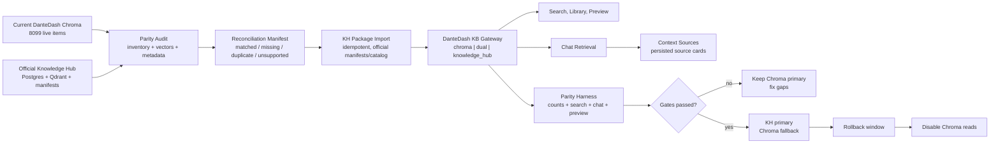

# feat: Knowledge Hub Parity Before Chroma Sunset

## Summary

Move DanteDash from its local Chroma multimodal store to the official Knowledge
Hub stack only after Knowledge Hub can reproduce the current DanteDash
experience: search, chat retrieval, previews, context sources, library counts,
and visual package grouping with an acceptable, measured regression envelope.

Chroma remains the source of truth and rollback path until parity is proven.
The first implementation should add audit, import, adapter, and dual-read
machinery. It should not delete Chroma or switch the UI blindly.

The parity target is the canonical DanteDash visual corpus, not every Chroma row
blindly copied as truth. The first gate must distinguish canonical assets from
duplicates, stale rows, orphaned rows, unsupported media, and accepted
exclusions before Knowledge Hub import or cutover work can claim success.

---

## Problem Frame

DanteDash currently has the richest live multimodal corpus in Chroma. The live
dashboard reports `8099` items: `2231` images, `4187` text-layer items, and
`1681` videos. Knowledge Hub is healthy and already uses the correct served
Voyage multimodal visual runtime, but its active visual Qdrant collection has
only `1750` points and the visual manifests list `1754` linked assets.

That gap means the migration cannot be a simple endpoint swap. If Chroma is
removed before Knowledge Hub has equivalent corpus coverage and API semantics,
DanteDash will lose visual search recall, video coverage, chat source cards,
preview behavior, and count fidelity.

The current Chroma store is the best live baseline, but it is not automatically
the clean canonical record. The migration should use Chroma to discover what the
product currently serves, then classify which rows are canonical package members
and which rows should be deduped, repaired, excluded, or left behind with an
owner-approved reason.

---

## Requirements

- R1. Freeze a current Chroma baseline before migration work starts, including
  counts, node ids, file ids, modalities, vectors, metadata, source hashes,
  preview ids, and grouped package keys.
- R2. Reconcile the official Knowledge Hub visual corpus against that baseline,
  with every Chroma row classified as `canonical`, `duplicate`, `stale`,
  `orphaned`, `unsupported`, or `accepted_exclusion`, and with every canonical
  item mapped to a Knowledge Hub match, import candidate, or explicit blocker.
- R3. Preserve the Dante visual package contract: original image or video
  preview, Voyage multimodal vector, Gemini visual card, premium decoupage
  layer, `dante_image_id`, `source_sha256`, `linked_image_file_id`, and
  `preview_image_file_id`.
- R4. Make Knowledge Hub capable of returning DanteDash-equivalent result DTOs:
  `node_id`, `file_id`, `modality`, `display_name`, `score`, sanitized
  metadata, snippet, and preview URL eligibility.
- R5. Support the current user-facing surfaces before cutover: text search,
  image search, chat retrieval, source-card persistence, context source
  accumulation, library listing, item lookup, previews, and stats.
- R6. Keep scores and result order measurable. Do not merge Knowledge Hub,
  Vault Index, Graph, and Chroma scores into one opaque ranking during parity.
- R7. Use dual-read and feature flags. Chroma must remain available as fallback
  until Knowledge Hub passes the parity gates.
- R8. Avoid broad re-embedding. Copy compatible Voyage multimodal 1024 vectors
  from Chroma only when vector provenance is verified; classify rows with weak
  provenance as `embedding_provenance_unknown` and resolve them through targeted
  eval, explicit re-embed approval, or accepted-risk sign-off.
- R9. Never expose local absolute paths, provider keys, bearer tokens, DSNs,
  runtime roots, or raw backend traces in frontend payloads.
- R10. Do not mutate the Obsidian vault, canonical Knowledge Hub runtime,
  Qdrant, Postgres, Redis, source assets, or Chroma during audit mode.
  Mutating import/cutover commands must be explicit, idempotent, and manifested.
- R11. Treat Chroma sunset as a reversible product decision. Keep Chroma primary
  if the canonical baseline cannot be signed off, if KH cannot reproduce
  required user-facing behavior inside the accepted regression envelope, or if
  broad re-embedding/import cost exceeds the approved delta budget.
- R12. Enforce explicit trust boundaries: the frontend never calls Knowledge Hub
  directly, DanteDash never stores KH datastore DSNs, preview resolution never
  exposes local paths or redirects to arbitrary URLs, and backend-only reports
  stay outside static/frontend-served roots.

---

## Scope Boundaries

- Do not delete, clear, or disable Chroma in the first implementation.
- Do not make Knowledge Hub a hidden lossy proxy over Chroma.
- Do not store all image, card, decoupage, and video layers as one giant text
  document.
- Do not use LightRAG as the visual asset storage layer. LightRAG can remain a
  separate graph/text retrieval lane.
- Do not move Knowledge Hub into the DanteDash repo or Electron process.
- Do not change chat model routing, OAuth providers, worker orchestration, or
  prompt packs.
- Do not expose KH mutating controls in the DanteDash UI as part of this plan.
- Do not route DanteDash ingest, clear, delete, or repair writes through
  Knowledge Hub in this V1 parity plan. Those operations need a separate
  mutating-operations plan after the read contract is stable.

### Deferred to Follow-Up Work

- Full Chroma removal from dependencies and deployment scripts after a rollback
  window.
- Operator UI for KH ingest, reindex, sync, staging, and repair jobs.
- LightRAG UX integration for non-visual graph/text retrieval.
- Cross-device or cloud-hosted Knowledge Hub preview serving.

---

## Context & Research

### Relevant Code and Patterns

- `backend/app/kb.py`: current Chroma-backed `KnowledgeBase` owns text/image
  search, item listing, counts, deletion, and preview lookup metadata.
- `backend/app/rag.py`: chat retrieval calls `kb.search_text`, builds grounded
  context, and emits source cards.
- `backend/app/routes/search.py`, `backend/app/routes/library.py`, and
  `backend/app/routes/preview.py`: public routes are Chroma-coupled today.
- `backend/app/routes/knowledge_hub.py`: current Hub tab is read-only cockpit
  and federated search, not a runtime merger.
- `backend/app/schemas.py`: `SearchResultDTO` and preview URL rules are the
  frontend compatibility contract.
- `frontend/src/components/ChatPanel.tsx`: context sources already accumulate
  across answers and group by `dante_image_id`, `source_sha256`, linked image id,
  preview image id, file id, or node id.
- `docs/architecture/visual-asset-package-contract.md`: package contract for
  linked image/card/decoupage layers.
- Knowledge Hub `src/knowledge_hub/visual_memory.py`: official visual memory is
  manifest plus Qdrant, keyed by asset identity and content hash.
- Knowledge Hub `src/knowledge_hub/hub_service.py`: visual sync currently resets
  the active visual collection before writing discovered assets, so side-channel
  Qdrant writes are unsafe unless the corpus is also official in KH manifests
  and catalog.

### Live Evidence Collected During Planning

- DanteDash stats: `{"total":8099,"by_modality":{"image":2231,"text":4187,"video":1681}}`.
- Knowledge Hub health: available, profile `remote_full_power`.
- Knowledge Hub visual runtime: `voyage_multimodal`, model
  `voyage-multimodal-3.5`, family `voyage_multimodal_3_5_1024`, dimension
  `1024`, collection `visual_memory__voyage_multimodal_3_5_1024`.
- Knowledge Hub dense runtime: Voyage `voyage-4-large`, dimension `2048`.
- Qdrant active visual collection: `1750` points, 1024 dimensions, cosine.
- Knowledge Hub visual manifests: `12` manifest files, `1754` linked assets.
- DanteDash Hub aggregate: Graph has `23962` nodes and `50666` edges; Vault
  Index has `6043` indexed files and `17607` Voyage 2048 embeddings.

### Institutional Learnings

- Preserve the layered visual package shape. The visual corpus is not just
  images; the linked text evidence and preview relationship are part of the
  product.
- Default to read-only gates, manifests, dedupe, and explicit counts before live
  ingest or reindex work.
- Verify KH with exact surfaces: `127.0.0.1:8080/health`,
  `127.0.0.1:8080/topology`, and the Actions bridge at `127.0.0.1:8098`.

### External References

- None. This plan is based on local repository code, live endpoints, and the
  existing Knowledge Hub runtime contract.

---

## Key Technical Decisions

- Parity first, sunset second: Chroma stays authoritative until Knowledge Hub
  proves equivalent behavior through tests and live smoke.
- Canonicality before parity: the audit must prove which Chroma rows represent
  the intended corpus before KH is judged against the baseline. Matching stale or
  duplicate rows is not a success condition unless they are explicitly accepted.
- Add a DanteDash KB gateway instead of replacing individual route internals
  ad hoc. V1 should be a read-only parity adapter for stats, search, listing,
  lookup, and preview resolution while implementations can be Chroma, Knowledge
  Hub, or dual-read.
- Treat Knowledge Hub as canonical only when it owns both vectors and package
  metadata. Direct Qdrant-only imports are not acceptable because KH visual sync
  can reset the visual collection.
- Preserve DanteDash DTO compatibility at the backend boundary. The frontend
  should not need to understand raw KH retrieval payloads.
- Keep visual/reference corpus search in the Voyage multimodal 1024 lane. Do
  not force card/decoupage layers into the 2048 dense text lane unless a later
  eval proves that split is useful.
- Make videos first-class in the migration. Current Chroma has `1681` video
  nodes, while KH visual asset discovery is raster-focused today.
- Copy existing embeddings only when vector provenance is verified: source
  content hash, `source_sha256`, modality/layer type, model family/version,
  dimension, distance metric, normalization, preprocessing signature, embedding
  run id or timestamp, and Chroma source row id. Otherwise classify as
  `embedding_provenance_unknown`, not as safe-to-copy.
- Cut over by feature flag and dual-read comparison, not by a one-time database
  migration script.

---

## Open Questions

### Resolved During Planning

- Should Chroma be removed immediately? No. The selected posture is parity
  first; Chroma exits only after KH reproduces behavior.
- Is the official KH visual runtime still local CLIP? No. The live served KH
  runtime is Voyage multimodal 1024. Historical CLIP collections may still exist
  but are not the active served surface.
- Does KH already have the full DanteDash visual corpus? No. Live evidence shows
  `1750` active KH visual points versus `8099` Chroma items in DanteDash.

### Deferred to Implementation

- Exact KH endpoint names for DanteDash package parity: implementation should
  choose names that fit KH conventions after reviewing the active KH API
  surface.
- Whether text-layer decoupage/card nodes should be separately searchable in KH
  visual memory, a linked sidecar plane, or both. The parity harness should make
  this evidence-based.
- Exact search regression threshold after the baseline query suite is built.
  Initial gate proposals are below; implementation may tighten them after the
  measured baseline.

---

## High-Level Technical Design

> This illustrates the intended migration shape. It is directional guidance for
> implementation review, not code to reproduce literally.

### Proposed Feature Flags

- `DANTEDASH_KB_BACKEND=chroma|dual|knowledge_hub`
- `DANTEDASH_KH_PARITY_STRICT=false|true`
- `DANTEDASH_KH_IMPORT_ENABLED=false|true`
- `DANTEDASH_CHROMA_FALLBACK_ENABLED=true|false`
- `DANTEDASH_KH_PREVIEW_PROXY_ENABLED=false|true`

### Initial Parity Gates

- Canonicality gate: every Chroma row is classified as `canonical`,
  `duplicate`, `stale`, `orphaned`, `unsupported`, or `accepted_exclusion`;
  canonical rows must have a package key and non-canonical rows must carry a
  reason.
- Count gate: no unclassified missing items; accepted exclusions must be listed
  by file id, reason, and owner decision.
- Preview gate: 100 percent of returned source cards have either a working
  preview URL or an explicit `preview_unavailable` reason.
- Canonical previewability gate: every canonical item that is previewable in
  Chroma remains previewable through KH, unless it has an accepted
  `preview_unavailable` exclusion with owner sign-off.
- DTO gate: 100 percent of SearchResult DTOs satisfy the existing frontend
  contract and contain no raw local paths.
- Search gate: explicit target queries have at least 0.95 target-asset recall at
  `top_k=12`; broad semantic queries have at least 0.80 grouped asset overlap
  against the Chroma baseline unless a human review accepts the KH result as
  better.
- Stratified recall gate: image, text-layer, decoupage, video/keyframe, explicit
  id lookup, broad semantic lookup, card-language lookup, and decoupage-language
  lookup each meet their own registered threshold. A high average score cannot
  hide failure in one stratum.
- Chat gate: existing chat eval score must not regress below the accepted model
  gate, and source cards must remain citeable, persisted, grouped, and previewable.
- Fallback-rate gate: dual-read and KH-primary-with-fallback runs must report
  how often Chroma served or repaired a user-visible result. KH primary cannot
  proceed while fallback dependence is above the owner-approved threshold.
- Safety gate: no raw paths, secrets, auth routes, DSNs, or internal stack traces
  in frontend-visible payloads.

### Stop-Loss Criteria

Keep Chroma as the primary backend and pause the sunset path when any of these
conditions hold:

- The U1 audit cannot produce a signed canonical baseline with all rows
  classified.
- Canonical missing rows remain unexplained after KH import/backfill.
- KH reproduces counts but fails search, chat, preview, context-source, or
  library behavior outside the accepted regression envelope.
- KH passes aggregate parity while failing a registered modality, package-layer,
  previewability, or video/keyframe stratum.
- Dual-read telemetry shows Chroma fallback is masking required KH behavior.
- Vector provenance or package identity is too weak to distinguish copied assets
  from duplicates or stale rows.
- The remaining delta requires broad re-embedding or manual repair beyond the
  owner-approved budget for this migration round.

### Security and Trust Boundaries

- Frontend calls only DanteDash backend routes. It must never call Knowledge Hub,
  Qdrant, Postgres, Redis, or Actions bridge endpoints directly.
- DanteDash backend accesses Knowledge Hub only through loopback APIs or a
  server-side bearer token stored in ignored backend configuration. Authorization
  headers, bearer tokens, provider keys, DSNs, and runtime roots must never be
  logged or included in frontend payloads.
- DanteDash should not store Qdrant, Postgres, or Redis DSNs for this migration.
  KH-owned APIs, CLI commands, or import services own datastore access.
- KH visual package APIs exposed for DanteDash must be read-only, loopback-only
  or token-protected, and deny unsafe CORS defaults.
- Preview resolution uses opaque ids. The backend must canonicalize allowed roots
  after symlink resolution, reject traversal, reject unexpected redirects, apply
  a MIME allowlist, and enforce bounded response size/range behavior.
- Backend-only unredacted manifests live under a gitignored runtime reports
  directory with restricted permissions. UI/docs/handoff artifacts use redacted
  summaries only.

### Frontend State Contract

Search, Chat, Library, Hub, Preview, and Context Sources must render explicit
states during the Chroma-to-KH transition:

- `loading`: data request is in flight and no stale error should be shown.
- `chroma_primary`: Chroma is serving user-visible results.
- `dual_shadow_running`: Chroma is user-visible and KH is compared in the
  background.
- `knowledge_hub_primary`: KH is serving user-visible results.
- `chroma_fallback_active`: KH mode was selected, but Chroma served or repaired a
  user-visible result.
- `knowledge_hub_unavailable`: KH is unreachable or returns a public-safe
  unavailable response.
- `parity_report_missing` and `parity_report_stale`: Hub cannot prove the
  current backend state from a recent parity report.
- `missing_canonical_rows` and `accepted_exclusions`: Hub should show counts and
  links to redacted parity summaries.
- `preview_unavailable`: a result is valid but cannot display a preview; the UI
  should show a reason without exposing local paths.
- `partial_source_metadata`: a result can be cited or listed but lacks optional
  package/layer details.
- `source_from_previous_backend`: persisted chat source cards remain readable
  after backend mode changes, with quiet provenance in diagnostics rather than
  noisy chat copy.

Status text must not rely on color alone. Buttons, filters, cards, and status
badges need accessible labels. Preview dialogs must restore focus on close and
remain keyboard navigable.

---

## Implementation Units

### U1. Baseline and Reconciliation Audit

**Goal:** Freeze the current Chroma and KH state into reproducible manifests
without mutating either system.

**Requirements:** R1, R2, R8, R10

**Dependencies:** None

**Files:**
- Create: `scripts/dantedash_kh_parity_audit.py`
- Create: `backend/app/kb_parity.py`
- Test: `backend/tests/test_kb_parity_audit.py`

**Approach:**
- Export Chroma inventory with ids, modalities, metadata, source hashes, preview
  ids, layer keys, display names, snippets, and vector metadata.
- Capture vector provenance for every row: source content hash, `source_sha256`,
  modality/layer type, embedding model family/version, dimensions, distance
  metric, normalization, preprocessing signature, embedding run id or timestamp,
  and Chroma source row id.
- Export KH inventory from `/topology`, `/kbs`, visual manifests, and Qdrant
  collection metadata.
- Classify every Chroma row first as `canonical`, `duplicate`, `stale`,
  `orphaned`, `unsupported`, or `accepted_exclusion`.
- For canonical rows, classify the KH relationship as `matched`,
  `missing_in_kh`, `metadata_conflict`, `vector_incompatible`, or
  `import_candidate`.
- Classify canonical rows with incomplete vector evidence as
  `embedding_provenance_unknown`; they are not eligible for direct vector copy
  until the operator accepts the risk, approves targeted re-embedding, or an eval
  demonstrates that the existing vector is safe.
- For non-canonical rows, record the evidence and owner decision that makes the
  row safe to dedupe, ignore, repair later, or exclude from the KH parity target.
- Write timestamped JSON and TSV manifests under a gitignored runtime reports
  directory.
- Write any unredacted manifest only to backend-only runtime paths with
  restricted file permissions; publish redacted summaries for UI, docs, or handoff
  use.

**Test scenarios:**
- Happy path: fixture Chroma and KH inventories produce deterministic matched
  and missing rows.
- Edge case: repeated image/card/decoupage layers group under one
  `source_sha256`.
- Error path: malformed metadata is classified, not dropped.
- Safety: report redaction strips local absolute paths unless explicitly written
  to backend-only manifests.
- Safety: unredacted manifests are not written under frontend/static paths and do
  not contain secrets, bearer tokens, DSNs, or raw provider credentials.

**Verification:**
- Running the audit with no write flags leaves Chroma, Qdrant, Postgres, Redis,
  vault files, and source assets unchanged.
- The audit report states whether the canonical baseline is signed off or
  blocked, and the migration cannot proceed to import/cutover while any row is
  unclassified.

---

### U2. Knowledge Hub Visual Package Contract

**Goal:** Extend the official KH visual memory model so it can represent the
DanteDash package, not only standalone raster assets.

**Requirements:** R2, R3, R4, R5, R9

**Dependencies:** U1

**Target repo:** `/Users/vidigal/projects/knowledge-hub`

**Files:**
- Modify: `src/knowledge_hub/visual_memory.py`
- Modify: `src/knowledge_hub/hub_service.py`
- Modify: `src/knowledge_hub/runtime.py`
- Modify: `src/knowledge_hub/main.py`
- Test: `tests/test_visual_memory*.py`

**Approach:**
- Add official package metadata fields for DanteDash visual assets:
  `dante_image_id`, `source_sha256`, `artifact_type`, `layer_type`,
  `linked_image_file_id`, `preview_image_file_id`, JSON/Markdown sidecar refs,
  media modality, and safe display labels.
- Support image, video, Gemini card, and decoupage package members.
- Make package records discoverable by KH manifests/catalog before they are
  written to Qdrant, so future KH syncs do not wipe them.
- Add sanitized read APIs for visual package stats, item lookup, text search,
  image search, and preview resolution if the current generic `/retrieve` API
  cannot satisfy the DanteDash contract.
- Keep DanteDash-facing KH visual package APIs read-only, loopback-only or
  bearer-protected, and safe for same-machine backend consumption. Do not expose
  datastore DSNs or local absolute paths through these APIs.

**Test scenarios:**
- Happy path: a complete image package returns all linked layers and one preview
  id.
- Edge case: a package with image plus card but no decoupage remains valid.
- Edge case: a video/keyframe package is represented without pretending it is a
  still image.
- Safety: API payloads contain opaque ids and relative provenance, not local
  filesystem paths.
- Safety: CORS/auth defaults prevent browser-direct KH access unless a later
  operator-control plan explicitly changes that boundary.

**Verification:**
- KH topology continues to report Voyage multimodal 1024 as the active visual
  runtime.

---

### U3. Idempotent KH Import and Delta Backfill

**Goal:** Move the DanteDash corpus into the official KH visual package model
with explicit manifests and minimal re-embedding.

**Requirements:** R2, R3, R8, R10

**Dependencies:** U1, U2

**Target repos:** DanteDash plus `/Users/vidigal/projects/knowledge-hub`

**Files:**
- Create: `scripts/dantedash_export_chroma_for_kh.py`
- Create: `scripts/dantedash_import_visual_packages_to_kh.py`
- Create: `backend/tests/test_kh_visual_package_import.py`
- Modify in KH as needed: `src/knowledge_hub/cli.py`
- Test in KH as needed: `tests/test_visual_package_import*.py`

**Approach:**
- Export compatible Chroma embeddings only when the U1 provenance manifest proves
  the vector was produced from the expected source content, modality/layer,
  Voyage multimodal 1024 model family/version, preprocessing path, distance
  metric, and embedding run.
- Import package metadata into KH official manifests/catalog first, then write
  Qdrant points through KH-owned code paths.
- Re-embed only rows marked `missing_embedding`, `dimension_mismatch`,
  `unreadable_vector`, or `embedding_provenance_unknown`, and only when
  `--execute` is set with explicit operator approval for that class.
- Use idempotent run ids and write import summaries listing embedded, copied,
  skipped, failed, accepted-exclusion, and provenance-unknown counts.
- Include a dry-run mode that never writes to KH.

**Test scenarios:**
- Happy path: a Chroma image/card/decoupage package imports once and re-runs as
  skipped existing.
- Edge case: an existing KH asset with the same content hash is linked instead
  of duplicated.
- Error path: missing source file is classified and skipped.
- Safety: no import command runs without an explicit `--execute`.

**Verification:**
- Post-import KH visual stats explain the old `1750`/`1754` state and the new
  expected counts.

---

### U4. DanteDash KB Gateway

**Goal:** Isolate route and chat code from direct Chroma calls by introducing a
stable read-only backend interface.

**Requirements:** R4, R5, R7, R9

**Dependencies:** U1 for the interface and `ChromaKbBackend`; U2 for
`KnowledgeHubKbBackend`; U5/U6 consume the gateway only after the read contract
exists.

**Files:**
- Create: `backend/app/kb_gateway.py`
- Create: `backend/app/kb_backends.py`
- Modify: `backend/app/deps.py`
- Test: `backend/tests/test_kb_gateway.py`

**Approach:**
- Define a small interface for `stats`, `count_by_modality`, `search_text`,
  `search_image`, `list_items`, `get_item`, and `resolve_preview`.
- Implement `ChromaKbBackend` by wrapping the current `KnowledgeBase`.
- Implement `KnowledgeHubKbBackend` only after U2 exposes sanitized KH visual
  package APIs that satisfy the DanteDash DTO and preview contracts.
- Implement `DualReadKbBackend` that uses Chroma for user-visible responses at
  first, runs KH in shadow, and writes comparison telemetry.
- Reuse the existing DanteDash Knowledge Hub client where possible; it should own
  loopback URL configuration, optional server-side bearer auth, timeout handling,
  and public-safe error redaction.
- Do not add direct Qdrant/Postgres/Redis clients or DSNs to DanteDash for this
  migration path.
- Keep `/api/ingest`, `/api/clear`, and `DELETE /api/items/{file_id}` Chroma-only
  in `chroma` and `dual` modes for this plan.
- In `knowledge_hub` mode, write-scope routes must return a provider-neutral
  `409` or disabled-operation response until a separate KH mutation plan is
  approved. Do not silently reroute these writes to Chroma in KH-primary mode.

**Test scenarios:**
- Happy path: Chroma backend returns byte-compatible DTOs for existing tests.
- Happy path: KH backend maps fixture KH package results into `SearchResultDTO`.
- Edge case: KH unavailable degrades to Chroma when fallback is enabled.
- Error path: KH primary failure returns a provider-neutral error when fallback
  is disabled.
- Error path: write-scope routes are blocked in `knowledge_hub` mode and remain
  Chroma-only in `chroma` and `dual` modes.
- Safety: missing or invalid KH bearer configuration degrades to unavailable or
  fallback behavior without exposing auth details.

**Verification:**
- Existing search/library/preview tests stay green with
  `DANTEDASH_KB_BACKEND=chroma`.
- Gateway contract tests prove that U4 read methods work without exposing any
  KH write capability.

---

### U5. Search, Library, Stats, and Preview Parity

**Goal:** Route DanteDash user-facing read surfaces through the gateway while
preserving the current API contract.

**Requirements:** R4, R5, R7, R9

**Dependencies:** U4

**Files:**
- Modify: `backend/app/routes/search.py`
- Modify: `backend/app/routes/library.py`
- Modify: `backend/app/routes/preview.py`
- Modify: `backend/app/schemas.py`
- Test: `backend/tests/test_library_get_item.py`
- Test: `backend/tests/test_mcp_preview.py`
- Test: `backend/tests/test_kh_search_preview_parity.py`

**Approach:**
- Replace direct `KnowledgeBase` dependency in read routes with the gateway.
- Keep `/api/search`, `/api/search/image`, `/api/stats`, `/api/items`, and
  `/api/preview/{file_id}` stable for the frontend.
- For KH preview, proxy or resolve by opaque id only. Enforce allowed roots after
  canonical path and symlink resolution, or use a KH streaming endpoint that
  never exposes local paths to the browser.
- Reject traversal, unexpected redirects, unsafe MIME types, oversize responses,
  and unbounded range requests.
- Ensure old file ids and node ids remain resolvable during dual-read.
- Return explicit `preview_unavailable` reasons and backend mode diagnostics for
  frontend state rendering without changing the existing route shape.
- Do not change ingest, clear, or delete behavior in this unit except to ensure
  those routes do not accidentally call the KH backend when KH mode is selected.

**Test scenarios:**
- Happy path: image, text-layer, and video search results all render preview
  metadata.
- Edge case: text card with `preview_image_file_id` opens the linked image.
- Edge case: video result opens the correct frame preview.
- Edge case: a valid item with no preview returns `preview_unavailable` and a
  public-safe reason.
- Safety: preview route rejects traversal, symlink escape, unexpected redirects,
  unsafe MIME, oversize responses, and raw path leakage.
- Safety: write-scope routes are covered by mode tests and cannot mutate KH in
  this parity plan.

**Verification:**
- `curl -fsS http://127.0.0.1:8035/api/stats` returns the selected backend's
  count payload, and dual mode includes hidden comparison diagnostics only in
  backend logs or manifests.

---

### U6. Chat Retrieval and Context Sources Parity

**Goal:** Make chat retrieval and persisted source cards work identically over
Chroma, dual-read, and KH.

**Requirements:** R3, R4, R5, R6, R7, R9

**Dependencies:** U4, U5

**Files:**
- Modify: `backend/app/rag.py`
- Modify: `backend/app/routes/chat.py`
- Modify: `backend/app/chat_store.py`
- Test: `backend/tests/test_chat_thread_persistence.py`
- Test: `backend/tests/test_chat_eval.py`
- Test: `backend/tests/test_chat_kh_source_parity.py`

**Approach:**
- Keep `SearchResult` as the internal source card shape.
- Ensure KH-backed results include friendly source references, package layer
  metadata, and preview ids before prompts are built.
- Keep source-card persistence unchanged from the frontend perspective.
- Preserve persisted source cards across backend mode changes; cards from a
  previous backend remain readable and previewable when possible, and diagnostics
  identify `source_from_previous_backend` without exposing that detail in normal
  assistant prose.
- In dual mode, compare Chroma and KH source groups by package key and write a
  backend-only report.

**Test scenarios:**
- Happy path: a chat response cites sources and persists source cards.
- Happy path: repeated image/card/decoupage layers group as one asset in the
  context panel.
- Edge case: answer has only text evidence but linked preview remains available.
- Edge case: source cards with partial package metadata still render and cite
  cleanly, with missing optional fields surfaced as diagnostics.
- Edge case: context sources accumulated before a backend switch remain visible
  and do not duplicate when the same grouped asset appears again.
- Safety: model responses never see raw local paths or KH auth routes.

**Verification:**
- Existing chat model smoke and evals pass with Chroma primary before any KH
  cutover.

---

### U7. Frontend Compatibility and Status UI

**Goal:** Keep the UI stable while showing enough backend status to understand
which store is serving data.

**Requirements:** R4, R5, R7, R9

**Dependencies:** U5, U6

**Files:**
- Modify: `frontend/src/lib/api.ts`
- Modify: `frontend/src/components/ChatPanel.tsx`
- Modify: `frontend/src/components/KnowledgeHubPanel.tsx`
- Test expectation: TypeScript build plus browser smoke; no new frontend test
  framework required.

**Approach:**
- Preserve the current `SearchResult` type and context-source grouping rules.
- Implement the Frontend State Contract for Search, Chat, Library, Hub, Preview,
  and Context Sources.
- Add optional backend/source diagnostics where appropriate, but surface them
  quietly: Hub/status panels can show backend mode, fallback, stale parity, and
  accepted exclusions; normal chat prose should not become noisy.
- Keep source count selector, preview dialog, and context panel behavior
  unchanged for users.
- In Hub, show parity status as read-only: baseline, missing rows, accepted
  exclusions, and current backend mode.
- Represent `preview_unavailable`, `partial_source_metadata`,
  `source_from_previous_backend`, and `chroma_fallback_active` as clear UI states
  rather than raw backend strings.
- Keep accessibility in scope: status cannot be color-only, compact controls need
  labels/tooltips, preview dialogs restore focus, and keyboard navigation remains
  usable.

**Test scenarios:**
- Happy path: Search, Chat, Library, Hub, preview, and context panel work with
  Chroma mode.
- Happy path: the same surfaces work with KH mode using fixture/local KH data.
- Happy path: Hub shows `chroma_primary`, `dual_shadow_running`,
  `knowledge_hub_primary`, and `chroma_fallback_active` states without exposing
  raw implementation details.
- Edge case: dual mode does not duplicate visible source cards.
- Edge case: missing or stale parity report shows a clear unavailable/stale state.
- Edge case: accepted exclusions and missing canonical rows are visible in Hub
  from redacted summaries.
- Edge case: preview unavailable and partial source metadata do not break cards,
  dialogs, source grouping, or citations.
- Accessibility: status badges include text or labels beyond color; preview
  dialog focus is restored; primary flows remain keyboard navigable.
- Safety: no raw local paths appear in browser-rendered payloads.

**Verification:**
- `pnpm typecheck` and `pnpm build` pass.

---

### U8. Parity Harness and Regression Gates

**Goal:** Build the parity harness, then use it to certify that KH reproduces
Chroma behavior before enabling KH primary.

**Requirements:** R1, R2, R4, R5, R6, R7

**Dependencies:** U1, U4, U5, U6 for harness implementation; U3 import/backfill
must complete before live parity certification can authorize KH primary.

**Files:**
- Create: `scripts/dantedash_kh_parity_eval.py`
- Create: `backend/testdata/kh_parity/*.json`
- Create: `backend/tests/test_kh_parity_eval.py`
- Modify: `scripts/smoke-dante-dashboard.sh`

**Approach:**
- Pre-register a fixed query suite before judging results. Cover explicit
  film/image ids, aesthetic semantics, decoupage language, Gemini card language,
  video/keyframe queries, partial evidence, broad visual references, old assets,
  recent assets, and package-layer-specific lookups.
- Keep harness implementation separate from live parity certification. The
  harness can be built with fixtures before U3; certification runs only after KH
  import/backfill and produces the cutover evidence.
- Compare Chroma and KH by grouped asset key, not only raw node id.
- Validate counts, DTO shape, preview success, search overlap, chat source
  quality, and no-leak constraints.
- Report metrics by stratum: modality, package layer, asset age, explicit lookup,
  broad semantic lookup, card-language lookup, decoupage-language lookup,
  video/keyframe lookup, and previewability.
- Report fallback rate separately from KH-native success. A result that succeeds
  only because Chroma fallback repaired it is not KH parity.
- Record human-reviewed improvements explicitly: query, baseline Chroma result,
  KH result, reviewer, reason, and accepted threshold impact.
- Produce a human-readable summary and machine-readable JSON result.

**Test scenarios:**
- Happy path: fixture Chroma/KH outputs pass gates.
- Error path: missing preview fails the preview gate.
- Error path: raw path in metadata fails the safety gate.
- Regression: lower recall fails with actionable missing asset ids.
- Regression: one failing stratum fails the run even when aggregate overlap looks
  acceptable.
- Regression: fallback dependence above the registered threshold fails cutover
  certification.

**Verification:**
- Harness exits non-zero when any required parity gate fails.
- Live certification is marked blocked until U3 has imported/backfilled the
  canonical corpus and fallback-rate, stratified recall, previewability, chat,
  DTO, and safety gates all pass.

---

### U9. Cutover, Rollback, and Chroma Sunset

**Goal:** Move from Chroma primary to KH primary without losing the ability to
recover quickly.

**Requirements:** R5, R7, R9, R10

**Dependencies:** U3, U4, U5, U6, U8

**Files:**
- Modify: `backend/app/deps.py`
- Modify: `scripts/start-dante-multimodal-rag.sh`
- Modify: `scripts/smoke-dante-dashboard.sh`
- Create: `docs/runbooks/chroma-sunset-rollback.md`

**Approach:**
- Stage 1: `chroma` mode remains default.
- Stage 2: `dual` mode in local smoke; user-visible responses still Chroma.
- Stage 3: `knowledge_hub` mode with Chroma fallback enabled.
- Stage 4: KH primary without Chroma fallback after a successful rollback
  window.
- Stage 5: remove Chroma dependencies and data only after a separate explicit
  destructive plan.
- Any operator-visible ingest, clear, delete, reindex, repair, or KH job controls
  remain out of scope until a separate mutating-operations plan defines the KH
  authority model, dry-run behavior, rollback, and audit logs.

**Test scenarios:**
- Happy path: backend mode changes by env var only.
- Error path: KH unavailable falls back only when fallback is enabled.
- Error path: fallback disabled returns a clear provider-neutral error.
- Rollback: changing one env var returns the app to Chroma primary.
- Safety: attempting write-scope routes in KH-primary mode returns a controlled
  disabled-operation response, not a hidden fallback write.
- Regression: KH primary cannot advance from Stage 3 to Stage 4 when fallback
  telemetry is above the approved threshold or any registered stratum is red.

**Verification:**
- `scripts/smoke-dante-dashboard.sh` reports backend mode, stats, search,
  preview, chat, Hub health, and parity status.
- The cutover report includes stratified parity scores, fallback-rate telemetry,
  accepted human-reviewed improvements, and rollback command.

---

### U10. Documentation and Operator Handoff

**Goal:** Keep future agents and operators from confusing cockpit integration
with completed Chroma sunset.

**Requirements:** R1, R2, R7, R10

**Dependencies:** U8, U9

**Files:**
- Modify: `README.md`
- Modify: `AGENTS.md`
- Modify: `docs/architecture/visual-asset-package-contract.md`
- Modify: `docs/runbooks/dante-dashboard-operations.md`
- Create: `docs/operations/kh-parity-baselines/README.md`

**Approach:**
- Document current backend mode, how to run the audit, how to run parity evals,
  how to switch modes, and how to roll back.
- Update stale count expectations only after live verification.
- Record manifest paths and accepted exclusions.
- Clearly label Chroma as active, fallback, disabled, or removed depending on
  the rollout stage.

**Test scenarios:**
- Documentation includes exact commands for health, audit, parity eval, smoke,
  and rollback.
- Documentation does not instruct agents to delete Chroma before the explicit
  destructive plan.

**Verification:**
- A new agent can determine current mode and next safe step from docs plus live
  endpoint checks.

---

## System-Wide Impact

- **Interaction graph:** Search, image search, library, preview, chat retrieval,
  source persistence, Hub status, MCP preview wrappers, and Electron UI smoke all
  depend on the KB backend contract.
- **Error propagation:** KH unavailability should be degraded into
  provider-neutral user errors or Chroma fallback, never raw HTTP traces.
- **State lifecycle risks:** Dual-read creates comparison artifacts; imports can
  create duplicate package rows if source hashes are not canonicalized; KH sync
  can reset visual collections unless package records are official in KH.
- **API surface parity:** Backend route contracts should remain stable even
  when storage changes.
- **Integration coverage:** Unit tests will not prove quality; live parity evals
  and browser smoke are required before cutover.
- **Unchanged invariants:** Existing ports, LaunchAgent label, MCP name, chat
  model routing, source DTO shape, preview URL shape, and context panel grouping
  should remain unchanged.

---

## Risks & Dependencies

| Risk | Mitigation |
|------|------------|
| KH visual sync wipes direct Qdrant imports | Import through KH official manifests/catalog, not side-channel point writes. |
| Current KH corpus is smaller than Chroma | Run U1 audit first, then U3 import/backfill before any cutover. |
| Video nodes are lost because KH visual discovery is raster-focused | Add video/keyframe package representation and parity tests before KH primary. |
| Existing Chroma embeddings are not safely extractable, compatible, or provenance-verified | Classify as `embedding_provenance_unknown` or delta re-embed candidates and require explicit approval before copy or re-embed. |
| Search ranking changes are hard to judge | Use fixed query suites, grouped asset overlap, target recall, preview success, and human review for accepted improvements. |
| Raw paths leak from KH manifests | Sanitize at KH API and DanteDash DTO boundaries; add no-leak tests. |
| Browser or logs expose KH auth/DSNs | Frontend calls only DanteDash; KH tokens stay server-side; DanteDash does not store datastore DSNs; logs redact Authorization and runtime roots. |
| Preview proxy becomes a file/URL escape hatch | Use opaque ids, canonical allowed roots, symlink checks, redirect rejection, MIME allowlist, and response bounds. |
| Unredacted audit manifests leak sensitive paths | Keep unredacted manifests in gitignored backend runtime dirs with restricted permissions; publish only redacted summaries. |
| Cutover breaks chat context sources | Keep `SearchResult` DTO compatibility and run chat persistence tests plus live smoke before switching defaults. |
| Operator confusion between cockpit and runtime migration | Document backend mode and parity stage in runbooks and smoke output. |

---

## Documentation / Operational Notes

- The current checked AGENTS expected KB shape is stale for this live corpus. The
  plan should update it only after a verified baseline manifest is written.
- All mutation commands should default to dry-run and require `--execute`.
- The first merged implementation should make it easier to answer "what is
  missing from KH?" before it tries to make KH primary.
- A successful parity run should produce a signed-off report with:
  - Chroma baseline counts.
  - KH baseline counts.
  - Missing/duplicate/accepted-exclusion rows.
  - Search and chat eval scores.
  - Preview success rate.
  - Current backend mode and rollback command.

---

## Sources & References

- Related code: `backend/app/kb.py`
- Related code: `backend/app/rag.py`
- Related code: `backend/app/routes/knowledge_hub.py`
- Related code: `backend/app/routes/search.py`
- Related code: `backend/app/routes/library.py`
- Related code: `backend/app/routes/preview.py`
- Related code: `backend/app/schemas.py`
- Related frontend: `frontend/src/components/ChatPanel.tsx`
- Related frontend: `frontend/src/lib/api.ts`
- Related docs: `docs/architecture/visual-asset-package-contract.md`
- Related docs: `docs/plans/2026-06-17-001-feat-knowledge-hub-cockpit-plan.md`
- Related Knowledge Hub code: `/Users/vidigal/projects/knowledge-hub/src/knowledge_hub/visual_memory.py`
- Related Knowledge Hub code: `/Users/vidigal/projects/knowledge-hub/src/knowledge_hub/hub_service.py`
- Live checks used:
  - `curl -fsS http://127.0.0.1:8035/api/stats`
  - `curl -fsS http://127.0.0.1:8035/api/knowledge-hub/health`
  - `curl -fsS http://127.0.0.1:8080/topology`
  - `curl -fsS http://127.0.0.1:6333/collections/visual_memory__voyage_multimodal_3_5_1024`
