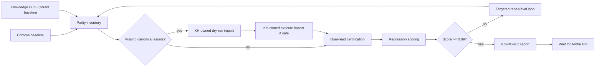

# feat: Knowledge Hub Cutover Certification

## Summary

Certify whether DanteDash can safely move from Chroma to the official Knowledge
Hub stack by proving parity against the current Chroma baseline, importing only
missing canonical assets through Knowledge Hub-owned paths, running dual-read
regression checks, and producing a GO/NO-GO report. Chroma is not disabled in
this plan; if the final score is at least `0.89`, the report may recommend
cutover and must wait for Andre's explicit `GO`.

---

## Problem Frame

DanteDash currently serves its richest multimodal corpus from Chroma while
Knowledge Hub runs the official Postgres, Qdrant, and Redis infrastructure. The
previous plan added the parity gateway and dry-run audit scaffolding, but live
evidence still shows DanteDash using `DANTEDASH_KB_BACKEND=chroma`. The next
step is certification, not blind migration.

---

## Requirements

- R1. Freeze a current Chroma baseline and a current Knowledge Hub/Qdrant
  baseline before any import or dual-read test.
- R2. Compare by canonical package key, not only raw row id, preserving image,
  video/keyframe, Gemini card, and decoupage layers.
- R3. Import only missing canonical assets through Knowledge Hub-owned manifest
  and Qdrant code paths; do not write directly to Qdrant from DanteDash.
- R4. Avoid broad re-embedding. Copy or reuse vectors only when provenance is
  verified; otherwise classify the row and use targeted backfill only when
  required for the score.
- R5. Run DanteDash in dual mode for certification and measure fallback
  dependence separately from Knowledge Hub-native success.
- R6. Measure search, chat retrieval, source-card persistence, context sources,
  previewability, library lookup, stats, DTO compatibility, and no-leak safety.
- R7. Use a deterministic confidence/quality score from `0.0` to `1.0`; the
  score must be at least `0.89` before the report can recommend disabling
  Chroma.
- R8. Continue targeted repair/eval loops while score is below `0.89`, unless a
  hard blocker proves Chroma cannot be safely disabled in this round.
- R9. Never delete, clear, or disable Chroma in this plan.
- R10. Produce a complete backend-only evidence report plus a redacted human
  summary. Wait for Andre's explicit `GO` before any persistent Chroma-disable
  change.

---

## Scope Boundaries

- Do not disable Chroma, remove Chroma dependencies, delete Chroma data, or
  mutate LaunchAgent defaults to KH-only.
- Do not make DanteDash call Postgres, Qdrant, or Redis directly. DanteDash uses
  Knowledge Hub APIs and local CLI/import surfaces only.
- Do not mutate the Obsidian vault or source visual assets.
- Do not re-run full-corpus embeddings unless the score cannot reach `0.89`
  without a bounded, explicitly manifested backfill.
- Do not accept aggregate parity if one critical stratum fails: video/keyframe,
  decoupage, linked preview, chat sources, or no-leak safety.

### Deferred to Follow-Up Work

- Persistent KH-only deployment after Andre approves `GO`.
- Removing Chroma code paths and fallback after a rollback window.
- Operator UI for Knowledge Hub import/reindex/repair jobs.
- Broader LightRAG integration unrelated to DanteDash visual corpus parity.

---

## Context & Research

### Relevant Code and Patterns

- `backend/app/kb_gateway.py` and `backend/app/kb_backends.py` define the
  current Chroma/KH gateway and fallback behavior.
- `backend/app/kb_parity.py` and `scripts/dantedash_kh_parity_audit.py` provide
  the current audit/manifests foundation.
- `scripts/dantedash_kh_parity_eval.py` provides the first asset-overlap eval
  surface.
- `backend/app/routes/search.py`, `backend/app/routes/library.py`,
  `backend/app/routes/preview.py`, and `backend/app/routes/chat.py` are the
  DanteDash parity surfaces.
- `backend/app/routes/knowledge_hub.py` is the read-only cockpit and federated
  Knowledge Hub surface.
- `docs/plans/2026-06-19-001-feat-knowledge-hub-parity-chroma-sunset-plan.md`
  is the source plan for parity-first sunset.

### Live Evidence

- DanteDash currently reports `8099` KB items through Chroma: `2231` image,
  `4187` text, and `1681` video.
- Knowledge Hub `/topology` reports official memory planes backed by Postgres,
  Qdrant, Redis, manifests, and Voyage runtimes.
- DanteDash settings currently report `dantedash_kb_backend=chroma` and
  `chroma_fallback_enabled=true`.
- Docker currently has local Knowledge Hub Postgres, Qdrant, and Redis
  containers running.

### External References

- None. This plan is grounded in local code, live endpoints, and the existing
  Knowledge Hub runtime contract.

---

## Key Technical Decisions

- Use a certification score, not a vibes-based cutover. A final score below
  `0.89` means continue repairs or report a blocker.
- Treat safety as a hard cap. Any frontend-visible local path, secret, DSN,
  provider trace, raw auth route, or backend stack trace caps the score below
  `0.89` even if retrieval looks good.
- Treat Chroma fallback as debt, not success. Dual mode can use Chroma for user
  safety, but the score must distinguish KH-native result quality from fallback
  repair.
- Import missing assets only through official KH package ownership. Direct
  Qdrant writes are not acceptable because KH sync can reset visual collections.
- Keep the final action split: certification may recommend Chroma disablement,
  but persistent Chroma disablement waits for Andre's `GO`.

---

## Confidence / Quality Score

The certification score is a weighted `0.0` to `1.0` metric:

| Dimension | Weight | Passing intent |
|---|---:|---|
| Inventory and canonical coverage | 0.16 | Canonical rows classified and matched/imported/excluded |
| Package integrity | 0.14 | Image/video/card/decoupage layers remain linked by package key |
| Vector/runtime provenance | 0.10 | Active KH vectors use expected Voyage multimodal 1024 lane or documented targeted backfill |
| Search parity by stratum | 0.16 | Explicit, semantic, card-language, decoupage, video, and previewable queries meet thresholds |
| Preview, DTO, library, and stats parity | 0.12 | Public DTOs and previews remain frontend-compatible |
| Chat retrieval and context sources | 0.12 | Sources cite, persist, group, and preview correctly |
| Dual-read fallback independence | 0.10 | KH-native success is high and fallback rate is under threshold |
| Safety and no-leak posture | 0.10 | No frontend-visible paths/secrets/DSNs/traces |

Hard caps:

- Any no-leak failure caps score at `0.88`.
- Any unclassified canonical row caps score at `0.84`.
- Any missing source-card persistence or broken chat citation path caps score at
  `0.88`.
- Any critical stratum below its minimum threshold caps score at `0.88`.
- Any import mutation without manifest and rollback evidence caps score at
  `0.80`.

---

## High-Level Technical Design

> *This illustrates the intended approach and is directional guidance for
> review, not implementation specification.*

---

## Implementation Units

### U1. Current Baseline Capture

**Goal:** Capture current Chroma and Knowledge Hub/Qdrant state with no
mutations.

**Requirements:** R1, R2, R6, R9

**Dependencies:** None

**Files:**
- Modify: `backend/app/kb_parity.py`
- Modify: `scripts/dantedash_kh_parity_audit.py`
- Test: `backend/tests/test_kb_parity.py`

**Approach:**
- Extend the audit to pull or accept KH/Qdrant package inventory, collection
  counts, vector metadata, manifest assets, and backend runtime family.
- Keep unredacted evidence in gitignored runtime reports with restricted
  permissions.
- Keep redacted summaries safe for PR/report use.

**Test scenarios:**
- Happy path: Chroma and KH fixture inventories produce deterministic matched,
  missing, metadata-conflict, and import-candidate rows.
- Edge case: package members share one `source_sha256` but different layer
  types.
- Safety: local absolute paths are present only in backend-only manifests and
  absent from redacted summaries.

**Verification:**
- Baseline reports explain current Chroma count and current KH/Qdrant count
  without changing either system.

---

### U2. Scoring Harness and Cutover Gates

**Goal:** Implement the `0.0` to `1.0` certification score and hard caps.

**Requirements:** R6, R7, R8, R10

**Dependencies:** U1

**Files:**
- Modify: `scripts/dantedash_kh_parity_eval.py`
- Create: `backend/app/kb_cutover_score.py`
- Create: `backend/tests/test_kb_cutover_score.py`
- Create: `backend/testdata/kh_parity/*.json`

**Approach:**
- Add weighted scoring for inventory, package integrity, provenance, search,
  preview/DTO/library/stats, chat/context, fallback independence, and no-leak
  safety.
- Add hard caps so a high average cannot hide a dangerous failure.
- Store per-dimension evidence and final decision in machine-readable JSON.

**Test scenarios:**
- Happy path: perfect fixture report scores `1.0`.
- Edge case: one weak stratum applies the correct hard cap.
- Error path: malformed report fails closed with score below `0.89`.
- Safety: no-leak failure caps score at `0.88`.

**Verification:**
- The score is deterministic for identical input manifests.

---

### U3. Missing Canonical Asset Import

**Goal:** Import only missing canonical assets into official Knowledge Hub
surfaces when the audit proves they are safe import candidates.

**Requirements:** R2, R3, R4, R8, R10

**Dependencies:** U1, U2

**Files:**
- Create: `scripts/dantedash_kh_import_missing.py`
- Create: `backend/tests/test_kh_import_missing.py`
- Modify as needed in Knowledge Hub only when required by official import
  surfaces.

**Approach:**
- Dry-run first. Execute only rows classified as canonical import candidates.
- Prefer KH-owned CLI/API/import paths that update official manifests before
  Qdrant points.
- Reuse existing Voyage multimodal 1024 vectors only when provenance is
  verified.
- Record copied, embedded, skipped, failed, accepted-exclusion, and blocked
  counts.

**Test scenarios:**
- Happy path: missing canonical package imports once and reruns as skipped.
- Edge case: existing KH package with the same content hash is linked rather
  than duplicated.
- Error path: provenance-unknown vectors are skipped unless targeted backfill is
  explicitly enabled.
- Safety: execute mode requires explicit flag and writes a manifest.

**Verification:**
- Post-import audit reduces missing canonical assets or explains every blocker.

---

### U4. Dual Mode Runtime Certification

**Goal:** Run DanteDash in dual-read mode and measure user-visible regressions.

**Requirements:** R5, R6, R7, R9

**Dependencies:** U1, U2, U3 when imports are needed

**Files:**
- Modify: `backend/app/kb_gateway.py`
- Modify: `backend/app/kb_backends.py`
- Modify: `scripts/smoke-dante-dashboard.sh`
- Test: `backend/tests/test_kb_gateway.py`

**Approach:**
- Add backend-only dual telemetry for requested backend, served backend,
  fallback reason, package-key overlap, and KH-native success.
- Prefer transient dual-mode certification runs over persistent app default
  changes.
- Keep Chroma fallback available while testing.

**Test scenarios:**
- Happy path: dual mode serves Chroma while recording KH comparison.
- Edge case: KH result missing preview records fallback reason.
- Error path: KH unavailable records unavailable without leaking raw errors.

**Verification:**
- Dual telemetry reports fallback dependence and KH-native success per query
  stratum.

---

### U5. Search, Preview, Library, and Chat Regression Suite

**Goal:** Prove the user-facing DanteDash surfaces behave acceptably in Chroma,
dual, and KH-primary-with-fallback modes.

**Requirements:** R5, R6, R7, R9

**Dependencies:** U2, U4

**Files:**
- Create: `backend/testdata/kh_parity/query_suite.json`
- Create: `backend/tests/test_kh_cutover_regression.py`
- Modify: `scripts/dantedash_kh_parity_eval.py`

**Approach:**
- Build a fixed query suite covering explicit ids, aesthetic semantics,
  card-language search, decoupage-language search, broad visual references,
  video/keyframe queries, and partial evidence.
- Validate result grouping, previews, DTO safety, library lookup, stats, chat
  source cards, persisted context sources, and citation viability.
- Measure KH-native success and fallback repair separately.

**Test scenarios:**
- Happy path: explicit known asset query returns the same grouped package.
- Happy path: chat source cards persist and preview after a dual-mode answer.
- Edge case: video/keyframe queries meet their own threshold.
- Safety: DTOs and SSE payloads contain no local paths or raw traces.

**Verification:**
- Regression output feeds U2 score dimensions with per-stratum evidence.

---

### U6. Repair Loop and Final GO/NO-GO Report

**Goal:** Continue targeted fixes until score is at least `0.89` or a hard
blocker proves Chroma cannot be disabled in this round.

**Requirements:** R7, R8, R10

**Dependencies:** U1, U2, U3, U4, U5

**Files:**
- Create: `backend/runtime_reports/kh-cutover/` outputs at runtime only
- Create: `docs/reports/knowledge-hub-cutover-certification.md`
- Test expectation: report generation is validated by deterministic input
  fixtures; runtime report outputs remain ignored by git.

**Approach:**
- If score is below `0.89`, identify the weakest dimension, apply the smallest
  safe repair, rerun the relevant audit/eval/smoke, and rescore.
- Stop only when score reaches `0.89` or when a hard blocker is documented with
  evidence.
- Write a complete report with counts, score, dimension table, import summary,
  dual fallback rate, search/chat/preview regressions, safety checks, and final
  recommendation.
- If score is at least `0.89`, recommend `GO` readiness but do not disable
  Chroma until Andre explicitly says `GO`.

**Test scenarios:**
- Happy path: score above gate produces a GO-ready report and no Chroma-disable
  mutation.
- Edge case: score below gate names the next repair dimension and continues.
- Error path: hard blocker produces NO-GO with evidence and no hidden cutover.

**Verification:**
- Final report states either `GO-ready, waiting for Andre GO` or `NO-GO /
  continue repairs`, with machine-readable score evidence.

---

## System-Wide Impact

- **Interaction graph:** DanteDash backend, Knowledge Hub API/CLI, Qdrant visual
  collection, manifests, chat retrieval, preview serving, and context sources
  are all involved.
- **Error propagation:** raw KH/Qdrant/Postgres/Redis failures remain server-side;
  frontend payloads receive public-safe unavailable or preview-unavailable
  states.
- **State lifecycle risks:** import must be idempotent and manifested; dual mode
  must not mutate user-visible state except ordinary chat/source persistence.
- **API surface parity:** Search, Library, Preview, Chat, Hub, and MCP preview
  clients must remain compatible.
- **Unchanged invariants:** Chroma remains present and usable until Andre
  explicitly approves a disablement step after the report.

---

## Risks & Dependencies

| Risk | Mitigation |
|------|------------|
| KH lacks official package APIs for all DanteDash layers | Use dry-run evidence to identify blockers; implement only KH-owned official surfaces needed for parity |
| Direct Qdrant writes are tempting but unsafe | Forbid them; use KH-owned manifest/import paths only |
| Aggregate score hides video or preview regressions | Use stratum thresholds and hard caps |
| Broad re-embedding becomes expensive | Reuse verified vectors and target only provenance-unknown blockers |
| Chroma fallback masks KH gaps | Score KH-native success separately and cap if fallback dependence remains too high |
| Dirty worktree contains unrelated UI work | Stage/commit only certification-related files and avoid reverting unrelated changes |

---

## Documentation / Operational Notes

- The final report belongs in `docs/reports/knowledge-hub-cutover-certification.md`.
- Runtime manifests and unredacted evidence belong under gitignored backend
  runtime reports.
- The report should include an explicit `GO` command candidate only when score
  is at least `0.89`; otherwise it should state the next repair loop.

---

## Sources & References

- Prior plan: `docs/plans/2026-06-19-001-feat-knowledge-hub-parity-chroma-sunset-plan.md`
- Gateway code: `backend/app/kb_gateway.py`
- Backend adapters: `backend/app/kb_backends.py`
- Audit code: `backend/app/kb_parity.py`
- Audit CLI: `scripts/dantedash_kh_parity_audit.py`
- Eval CLI: `scripts/dantedash_kh_parity_eval.py`
