# feat: KH-native Image Query And Chroma Read Disable

## Summary

Implement the last missing Knowledge Hub-native read path for DanteDash by
adding an official DanteDash image-query package search surface backed by the
Knowledge Hub visual Qdrant collection, wiring DanteDash to consume that route,
rerunning smoke/parity, and then disabling Chroma reads through the existing
fallback flag. Chroma data stays intact for rollback, but normal read traffic
should no longer need it once parity clears.

---

## Problem Frame

The 2026-06-19 cutover certification proved that DanteDash packages are already
represented in Knowledge Hub/Qdrant with a `0.9495` score against the `0.89`
gate, but the runtime still reports `image_query_search=chroma_fallback`.
That fallback is now the remaining blocker to operating DanteDash as a
KH-native visual inspection app over the official Knowledge Hub data plane.

---

## Assumptions

*This plan was authored in headless LFG mode without a synchronous planning
confirmation. The items below are implementation assumptions that should be
reviewed during code review.*

- Knowledge Hub may be modified for this task because Andre explicitly asked
  for KH/Qdrant image-query, but DanteDash must not write directly to Qdrant.
- The existing Knowledge Hub active visual collection,
  `visual_memory__voyage_multimodal_3_5_1024`, is the target search backend.
- Full re-embedding is out of scope unless implementation proves that a small
  query embedding path is missing or misconfigured.
- The existing Chroma directory remains on disk and available for explicit
  rollback, but it should not be read in the default KH-native mode after the
  cutover flag is flipped.

---

## Requirements

- R1. Add or expose an official Knowledge Hub DanteDash image-query API that
  searches the KH/Qdrant visual package layer using the active cloud-first
  visual embedding family.
- R2. Keep DanteDash free of direct Qdrant/Postgres/Redis writes; it must call
  the KH API and normalize the response into existing `SearchResult` DTOs.
- R3. Preserve DanteDash package identity and preview metadata:
  `source_sha256`, `dante_image_id`, `linked_image_file_id`,
  `preview_image_file_id`, node id, modality, artifact type, title, score, and
  snippet.
- R4. Update gateway status so `knowledge_hub` mode reports
  `image_query_search=knowledge_hub` when KH serves image-query, and Chroma
  fallback only appears when the fallback flag is intentionally enabled and
  actually needed.
- R5. Rerun smoke/parity and require image-query to clear the same practical
  parity gate as the 2026-06-19 cutover: no new blockers and final confidence
  score at or above `0.89`.
- R6. Disable Chroma reads by flag after image-query parity clears while keeping
  a one-env rollback path.
- R7. Keep write routes locked in KH-native mode: upload, clear, delete, broad
  ingest, and reindex must not become KH mutations in this pass.
- R8. Keep public payloads safe: no absolute local paths, bearer tokens,
  provider keys, DSNs, Qdrant URLs, Redis URLs, or backend traces in frontend or
  smoke-visible output.

---

## Scope Boundaries

- Do not delete `chroma_db/`, remove Chroma dependencies, or erase rollback
  code in this pass.
- Do not merge all package layers into one giant document; the layered package
  contract remains source of truth.
- Do not mutate the Obsidian vault, source high-resolution asset folders, or
  old Obsidian sidecar.
- Do not add a new frontend feature unless an existing image-search UI breaks
  against the KH-native response contract.
- Do not change model/provider routing, chat prompts, OAuth clients, workers,
  or chat answer style.
- Do not migrate LightRAG content or Knowledge Hub non-DanteDash planes as part
  of this cutover.

### Deferred to Follow-Up Work

- Remove Chroma code and runtime data after a rollback window and explicit
  operator decision.
- Add a visual operator screen for KH/Qdrant collection diagnostics.
- Extend the Actions bridge OpenAPI with the image-query route if Andre wants
  ChatGPT Actions to perform visual queries directly.

---

## Context & Research

### Relevant Code and Patterns

- DanteDash `backend/app/kb_gateway.py` already centralizes backend routing and
  fallback reporting for Chroma, dual, and `knowledge_hub` modes.
- DanteDash `backend/app/kb_backends.py` already normalizes KH package text
  search, stats, listing, item lookup, and previews, while
  `KnowledgeHubKbBackend.search_image` intentionally raises
  `knowledge_hub_image_search_not_available`.
- DanteDash `backend/app/knowledge_hub_client.py` already wraps the official KH
  package routes: import, search, stats, items, and item detail.
- DanteDash `scripts/smoke-dante-dashboard.sh` currently expects
  `image_query_search=chroma_fallback` whenever `DANTE_EXPECTED_KB_BACKEND` is
  `knowledge_hub`.
- DanteDash `scripts/dante_kb_runtime_env.sh` defaults to
  `DANTEDASH_KB_BACKEND=knowledge_hub` and
  `DANTEDASH_CHROMA_FALLBACK_ENABLED=true`.
- Knowledge Hub `src/knowledge_hub/main.py` already exposes
  `/dantedash/packages/import`, `/dantedash/packages/search`,
  `/dantedash/packages/stats`, `/dantedash/packages/items`, and item detail.
- Knowledge Hub `src/knowledge_hub/hub_service.py` already has
  `search_dantedash_packages()` for text-like package queries and
  `_collect_visual_hits()` / `_search_visual_embedder()` for visual Qdrant
  retrieval.
- Knowledge Hub `tests/test_api_v1.py` already covers package import/list/search
  with a fake visual embedder, which is the closest local pattern for the new
  image-query route.

### Institutional Learnings

- The visual package contract requires image, Gemini card, decoupage, and video
  layers to remain independently linkable by stable package keys.
- The 2026-06-19 cutover report states that KH already owns text search, chat
  retrieval/source cards, stats, library lookup, and previews; only image-query
  remained on Chroma fallback.

### External References

- None. This is grounded in local runtime APIs, local certification reports, and
  the already-running Knowledge Hub/Qdrant service.

---

## Key Technical Decisions

- Add the missing image-query surface in Knowledge Hub, not in DanteDash. KH
  owns Qdrant, visual embedding configuration, package manifests, and vector
  search; DanteDash remains an app client.
- Use a multipart upload or bounded file payload for image-query rather than
  requiring DanteDash to expose local file paths to KH. This preserves the
  no-local-path public contract and keeps queries portable.
- Keep the response shape parallel to `/dantedash/packages/search`: `status`,
  `items`, `returned`, `visual_family`, and `visual_retrieval`, with items
  serialized through KH's existing `_serialize_retrieved_items()`.
- Flip `DANTEDASH_CHROMA_FALLBACK_ENABLED` default to `false` only after the KH
  image-query route is wired and smoke/parity proves it works. Rollback remains
  `DANTEDASH_CHROMA_FALLBACK_ENABLED=true` or `DANTEDASH_KB_BACKEND=chroma`.
- Preserve Chroma as the parity baseline inside certification tooling, even
  after normal app reads stop using it. Certification can read both systems;
  user-facing runtime should not.

---

## Open Questions

### Resolved During Planning

- Should DanteDash write directly to Qdrant for image-query? No. KH must expose
  the official route.
- Should Chroma be deleted now? No. Only reads are disabled by flag after parity.
- Should image-query use the existing Voyage 1024 family? Yes, unless
  implementation proves the active KH profile is misconfigured.

### Deferred to Implementation

- The exact request transport for the KH route: prefer multipart file upload,
  but a base64 JSON fallback is acceptable if it better matches existing KH API
  conventions.
- Whether the running KH process needs a service restart after code changes.
  Implementation should verify live OpenAPI/endpoint behavior before declaring
  cutover.

---

## High-Level Technical Design

> *This illustrates the intended approach and is directional guidance for
> review, not implementation specification.*

```mermaid
flowchart LR
  A["DanteDash image query UI/API"] --> B["DanteDash /api/search/image"]
  B --> C["KbGateway.search_image"]
  C --> D["KnowledgeHubKbBackend.search_image"]
  D --> E["KnowledgeHubClient.dantedash_image_search"]
  E --> F["KH /dantedash/packages/search-image"]
  F --> G["KH VisualEmbedder embeds query image"]
  G --> H["Qdrant visual_memory__voyage_multimodal_3_5_1024"]
  H --> I["KH serialized package items"]
  I --> J["DanteDash SearchResult DTOs"]
  J --> K["Preview/context sources use KH package item/preview lookup"]

  C -. "rollback only when flag true" .-> L["Chroma search_image fallback"]
```

---

## Implementation Units

### U1. Add Knowledge Hub DanteDash Image-Query API

**Goal:** Provide an official KH-owned image-query endpoint for DanteDash
packages backed by the active visual Qdrant collection.

**Requirements:** R1, R3, R8

**Dependencies:** None

**Files:**
- Modify in Knowledge Hub repo: `src/knowledge_hub/main.py`
- Modify in Knowledge Hub repo: `src/knowledge_hub/hub_service.py`
- Test in Knowledge Hub repo: `tests/test_api_v1.py`
- Test in Knowledge Hub repo: `tests/test_hub_service.py`

**Approach:**
- Add a service method such as `search_dantedash_packages_by_image()` that
  accepts a temporary query image, embeds it through the active visual embedder,
  searches the DanteDash visual package scope, and serializes hits through the
  existing package item path.
- Add a route such as `POST /dantedash/packages/search-image` with bounded
  `top_k` and safe file-size/content-type validation.
- Keep the route read-only: no manifest writes, no import, no collection reset,
  no broad sync, and no persistent copy of the uploaded query image beyond a
  temporary file.
- Reuse `_serialize_retrieved_items()` to avoid inventing a second DTO shape.

**Patterns to follow:**
- `search_dantedash_packages()` in `src/knowledge_hub/hub_service.py`.
- `/dantedash/packages/search` in `src/knowledge_hub/main.py`.
- Fake visual embedder pattern in `tests/test_api_v1.py`.

**Test scenarios:**
- Happy path: uploaded image returns the expected DanteDash package item with
  `node_id`, public metadata, score, snippet, and visual retrieval status.
- Edge case: `top_k` is bounded to the same `1..50` range as package text
  search.
- Error path: missing file, unsupported content type, empty vector, or unavailable
  embedder returns a safe unavailable or validation response without backend
  trace leakage.
- Safety: response metadata does not expose private local file paths.

**Verification:**
- Knowledge Hub API tests pass and OpenAPI lists the new route.

### U2. Wire DanteDash KH Backend To Image Query

**Goal:** Make DanteDash image-search requests use the official KH image-query
route and normalize results to the existing search DTO.

**Requirements:** R2, R3, R4, R8

**Dependencies:** U1

**Files:**
- Modify: `backend/app/knowledge_hub_client.py`
- Modify: `backend/app/kb_backends.py`
- Test: `backend/tests/test_knowledge_hub_client.py`
- Test: `backend/tests/test_kb_gateway.py`

**Approach:**
- Add `KnowledgeHubClient.dantedash_search_packages_by_image()` with multipart
  upload support and the same defensive response wrapping used by other KH
  methods.
- Implement `KnowledgeHubKbBackend.search_image()` by calling the KH client,
  validating `ok/status`, bounding returned items to `top_k`, and passing them
  through the existing `_item_to_result()` conversion.
- Keep public metadata sanitization on every returned item.

**Patterns to follow:**
- Existing KH package `search_text`, `list_items`, `get_item`, and preview
  handling in `backend/app/kb_backends.py`.
- `sanitize_public_payload()` in `backend/app/knowledge_hub_client.py`.

**Test scenarios:**
- Happy path: KH image-query response becomes `SearchResult` values without
  calling Chroma.
- Edge case: `modality_filter` is forwarded only when present.
- Error path: KH unavailable response raises `KbBackendUnavailable`.
- Safety: local file paths from mocked KH metadata are redacted.

**Verification:**
- Focused backend tests prove `KnowledgeHubKbBackend.search_image()` works.

### U3. Update Gateway Status And Fallback Semantics

**Goal:** Make KH-native image query the primary runtime surface and reserve
Chroma for explicit rollback only.

**Requirements:** R4, R6, R7

**Dependencies:** U2

**Files:**
- Modify: `backend/app/kb_gateway.py`
- Modify: `scripts/dante_kb_runtime_env.sh`
- Test: `backend/tests/test_kb_gateway.py`
- Test: `backend/tests/test_runtime_shell_env.py`

**Approach:**
- In `knowledge_hub` mode, report `image_query_search=knowledge_hub` when KH
  image-query is wired.
- Keep `_read()` fallback behavior, but ensure tests distinguish successful KH
  image-query from fallback.
- Change the default fallback for `knowledge_hub` mode to `false` only after
  image-query tests and smoke are green.
- Preserve caller override: `DANTEDASH_CHROMA_FALLBACK_ENABLED=true` should
  still restore Chroma fallback for rollback.

**Patterns to follow:**
- Current status payload in `backend/app/kb_gateway.py`.
- Current shell default helper in `scripts/dante_kb_runtime_env.sh`.

**Test scenarios:**
- Happy path: KH mode with fallback disabled serves text and image query from KH.
- Rollback path: KH mode with fallback enabled falls back to Chroma only when KH
  raises `KbBackendUnavailable`.
- Error path: KH mode with fallback disabled raises when KH image-query fails.
- Shell default: unset env exports `knowledge_hub false`; explicit fallback
  env is preserved.

**Verification:**
- `/api/kb/status` reports `chroma_available_as_fallback=false` and
  `image_query_search=knowledge_hub` in the default launcher environment.

### U4. Update Smoke And Cutover Certification

**Goal:** Rerun and persist parity evidence that KH image-query can replace
Chroma reads.

**Requirements:** R5, R6, R8

**Dependencies:** U3

**Files:**
- Modify: `scripts/smoke-dante-dashboard.sh`
- Modify: `scripts/dantedash_kh_cutover_certify.py`
- Modify: `backend/app/kb_cutover_score.py`
- Test: `backend/tests/test_kh_cutover_certify.py`
- Test: `backend/tests/test_kb_cutover_score.py`

**Approach:**
- Update smoke so KH mode expects `image_query_search=knowledge_hub` when
  fallback is disabled, while preserving an explicit rollback expectation knob.
- Add an image-query parity dimension or strengthen `dual_fallback_independence`
  so disabling fallback is reflected in the confidence score.
- Keep Chroma as a certification baseline, not as a user-facing read backend.
- Write a refreshed certification report after live smoke/parity.

**Patterns to follow:**
- Current smoke optional/strict style.
- Current cutover report generation in `scripts/dantedash_kh_cutover_certify.py`.

**Test scenarios:**
- Happy path: certification accepts KH-native image query and score is at least
  `0.89`.
- Error path: certification flags fallback dependence if image-query still uses
  Chroma.
- Safety: generated report names fallback state and does not expose secrets or
  private paths.

**Verification:**
- New runtime report records KH-native image-query, fallback disabled, and no
  blockers.

### U5. Run Live KH-Native Image Search And Runtime Smoke

**Goal:** Prove the live app can perform visual image-query search through
KH/Qdrant with Chroma reads disabled.

**Requirements:** R1, R2, R3, R5, R6, R8

**Dependencies:** U4

**Files:**
- Modify only if evidence requires it: `docs/reports/knowledge-hub-cutover-certification.md`
- Modify only if evidence requires it: `docs/runbooks/dante-dashboard-operations.md`

**Approach:**
- Restart or reload the relevant local services only if needed for code changes
  to take effect.
- Run `/api/kb/status`, `/api/stats`, a text search, an image search using a
  stable local sample asset, preview lookup for an image-query result, and the
  dashboard smoke script.
- Run cutover certification and compare with the 2026-06-19 report.
- Update docs/reports only after live evidence confirms the new state.

**Patterns to follow:**
- Existing read-only smoke script and cutover report format.
- Existing DanteDash verification gates in `AGENTS.md`.

**Test scenarios:**
- Integration: `/api/search/image` returns KH-backed results with previews.
- Integration: context/source DTOs still include the same stable package keys.
- Regression: `/api/search` and chat source retrieval remain KH-backed.
- Rollback: setting fallback true still allows Chroma fallback when KH image
  query is unavailable.

**Verification:**
- `scripts/smoke-dante-dashboard.sh` passes with fallback disabled.
- Refreshed certification score is at least `0.89`.

---

## System-Wide Impact

- **Interaction graph:** `/api/search/image` moves from Chroma fallback to
  DanteDash gateway -> KH client -> KH image-query route -> Qdrant visual
  collection.
- **Error propagation:** KH image-query errors become `KbBackendUnavailable`;
  with fallback disabled, the route should return a plain provider-neutral
  error rather than silently rerouting.
- **State lifecycle risks:** Query-image temp files must be short-lived and
  never become package assets. No Chroma/Qdrant writes should happen during
  search.
- **API surface parity:** Text search, chat retrieval, stats, library, preview,
  and image-query should all report KH ownership in `knowledge_hub` mode.
- **Integration coverage:** Unit tests alone are not enough; live KH OpenAPI,
  `/api/kb/status`, `/api/search/image`, preview, smoke, and cutover
  certification must all be checked.
- **Unchanged invariants:** Chroma data remains intact; upload/clear/delete
  remain disabled in KH mode; package metadata and preview IDs remain stable.

---

## Risks & Dependencies

| Risk | Mitigation |
|------|------------|
| KH route requires a service restart and the running app keeps old code | Verify live OpenAPI or route response after code changes before running cutover smoke. |
| Query image embedding requires a different method from text query embedding | Reuse or extend the existing `VisualEmbedder` abstraction with tests around fake image embeddings. |
| KH returns package layers but preview lookup expects image node ids | Preserve `preview_image_file_id` and use existing KH private item lookup for previews. |
| Disabling fallback breaks operator rollback | Keep Chroma data untouched and preserve explicit env overrides. |
| Cutover scripts accidentally treat Chroma baseline as runtime dependency | Separate certification baseline reads from runtime status assertions. |

---

## Verification Plan

- Knowledge Hub focused tests:
  - `uv run pytest tests/test_api_v1.py tests/test_hub_service.py`
- DanteDash focused tests:
  - `uv run --project backend pytest backend/tests/test_knowledge_hub_client.py backend/tests/test_kb_gateway.py backend/tests/test_runtime_shell_env.py`
  - `uv run --project backend pytest backend/tests/test_kh_cutover_certify.py backend/tests/test_kb_cutover_score.py`
- Live smoke:
  - `curl -fsS http://127.0.0.1:8035/api/kb/status`
  - `curl -fsS http://127.0.0.1:8035/api/stats`
  - `scripts/smoke-dante-dashboard.sh`
  - `scripts/dantedash_kh_cutover_certify.py` through the existing backend
    `uv run` path
- Browser/UI smoke if frontend behavior changes:
  - Image search returns cards and opens previews.
  - Context/source panels still group linked package layers.

---

## Rollback Plan

- Runtime rollback without code revert:
  - `DANTEDASH_CHROMA_FALLBACK_ENABLED=true` restores Chroma fallback for KH
    failures.
  - `DANTEDASH_KB_BACKEND=chroma` restores Chroma as primary backend.
- Code rollback:
  - Revert the DanteDash client/backend/gateway changes while keeping the KH
    route harmless and read-only.
- Data rollback:
  - No data rollback should be needed because this plan does not delete Chroma,
    mutate package manifests during search, or rewrite visual vectors.

