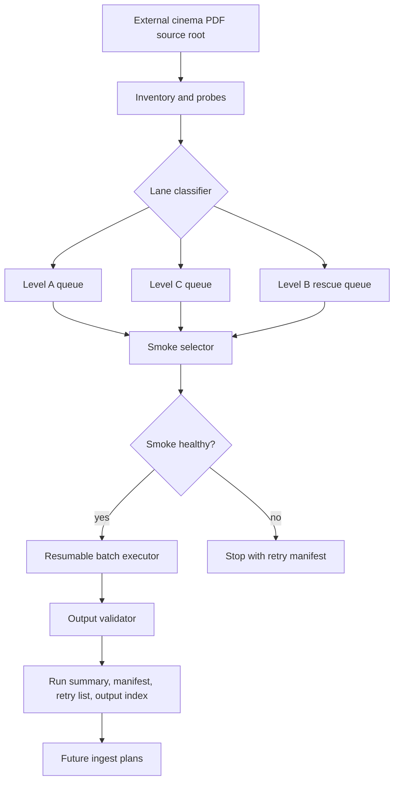

# feat: Add Docling cinema PDF batch planner

## Summary

Build a manifest-first Docling batch planner for the external Scribd cinema PDF corpus. The planner inventories every PDF, assigns the right Docling lane, runs a representative smoke set, supports resumable conversion, and writes validation artifacts that a later Knowledge Hub or LightRAG ingest plan can consume.

The plan does not ingest, embed, reindex, rename, delete, or move source PDFs.

---

## Problem Frame

The origin requirements describe 84 cinema PDFs across six topic folders, with 11,848 known pages, about 1.8 GB of PDFs, 20 large documents, and 9 weak text-probe documents. A single full-power run would waste time on clean PDFs, while a single lightweight run would under-read scanned, image-rich, or layout-heavy cinema material.

The repo already has useful patterns for this kind of work: thin CLI wrappers in `scripts/`, testable library code in `backend/app/`, run IDs, dry-run behavior, manifests, skip-existing logic, and focused pytest coverage. This plan applies those patterns to Docling conversion without changing downstream runtime stores.

---

## Requirements

### Inventory and classification

- R1. Produce one manifest row per cinema PDF with source-relative path, topic folder, file size, page count, text probe, selected Docling level, risk flags, and selection reason.
- R2. Preserve three lanes: level A for clean short text-first documents, level C as the default cinema extraction lane, and level B for OCR-heavy rescue or retry cases.
- R3. Flag large documents separately so they can run as isolated shards.
- R4. Detect duplicate content hashes and keep all rows visible without reprocessing duplicate successful outputs.

### Execution and resume

- R5. Default every command to planning or dry-run mode unless an explicit apply flag is provided.
- R6. Run a smoke set covering A, C, and B before any full-corpus execution.
- R7. Resume by skipping successful outputs and retrying only failed, stale, or explicitly selected rows.
- R8. Keep conversion outputs and run artifacts separate from source PDFs.

### Validation and handoff

- R9. Write summary, manifest, retry, and validation artifacts for every run.
- R10. Validate sampled outputs per lane for basic content health, including non-empty Markdown, extracted text continuity, OCR coverage signals, and expected structured artifacts.
- R11. Produce a downstream-ready output index for later Knowledge Hub classic, LightRAG KH-native, multimodal, or CAG planning.
- R12. Do not mutate Knowledge Hub, LightRAG, multimodal, Qdrant, Postgres, Redis, Chroma, vault files, Notion, or the external source PDFs.

---

## Key Technical Decisions

- **KTD1. Use a library plus thin CLI wrapper.** The conversion planner should live in a testable backend module, with a script that handles operator arguments. This follows `scripts/dante_local_media_ingest.py` and `backend/app/lightrag_cinema_craft_ingest.py`.
- **KTD2. Make level C the default lane.** The origin document selects C as the best default for cinema books, manuals, visual theory, directing, editing, magazines, and layout-rich PDFs.
- **KTD3. Keep A and B targeted.** A is a speed lane for clean short text-first PDFs. B is a rescue lane for weak text probes, scanned PDFs, failed C outputs, and high-value documents that justify heavier OCR.
- **KTD4. Treat smoke, planning, execution, and validation as separate phases.** Separating phases keeps expensive Docling runs gated and gives the operator useful manifests before any long job starts.
- **KTD5. Store run artifacts under ignored logs.** Run artifacts should land under `logs/docling-runs/<run-id>/` so they are reviewable locally without adding generated outputs to git.
- **KTD6. Keep public manifests portable.** Manifest rows should store source-relative paths and a source root label, not absolute source paths.
- **KTD7. Do not chain downstream ingest into this runner.** This work prepares outputs. A later plan decides what enters Knowledge Hub classic, LightRAG, multimodal, and CAG packs.

---

## High-Level Technical Design

The planner has two boundaries. The input boundary is read-only over the external source root. The output boundary is local run artifacts and Docling conversion outputs, not Knowledge Hub or LightRAG mutation.

---

## Implementation Units

### U1. Inventory and lane classification module

- **Goal:** Add a testable module that scans the external source root, computes stable metadata, probes extractable text, and assigns A, C, or B with an auditable reason.
- **Requirements:** R1, R2, R3, R4, R12.
- **Dependencies:** None.
- **Files:**
  - `backend/app/docling_cinema_batch.py`
  - `backend/tests/test_docling_cinema_batch.py`
- **Approach:** Create dataclasses for inventory rows, lane decisions, and risk flags. Use source-relative paths, SHA-256, size, page count, sampled text length, topic folder, duplicate hash state, and chosen lane. Page and text probes should use available local PDF tooling behind small helper functions so tests can stub the extraction layer.
- **Patterns to follow:** `scripts/dante_local_media_ingest.py` for row shape and hashing, `backend/app/lightrag_cinema_craft_ingest.py` for inventory and selection discipline, and `backend/tests/test_lightrag_cinema_craft_ingest.py` for fixture-driven classification tests.
- **Test scenarios:**
  - Covers AE1. Given a short clean PDF fixture with healthy sampled text, classification selects level A with a clean text-first reason.
  - Covers AE2. Given a large or canonical cinema-book fixture with healthy embedded text, classification selects level C and records layout-rich default reasoning.
  - Covers AE3. Given a weak text-probe fixture, classification selects level B or marks it as B rescue.
  - Covers AE4. Given a PDF above the large-document threshold, the row includes the large shard flag even when its lane is C.
  - Given two files with the same SHA-256, the first remains processable and the second is marked duplicate without hiding either row.
  - Given an `--only-relative-path` style selection outside the source root, the module rejects it before producing rows.
- **Verification:** A dry inventory over fixtures produces complete rows with no absolute paths in row payloads.

### U2. Run artifact and resume model

- **Goal:** Define the run directory layout, status vocabulary, summary payload, retry list, and resume behavior for Docling conversion jobs.
- **Requirements:** R4, R5, R7, R8, R9, R11, R12.
- **Dependencies:** U1.
- **Files:**
  - `backend/app/docling_cinema_batch.py`
  - `backend/tests/test_docling_cinema_batch.py`
- **Approach:** Write artifacts under `logs/docling-runs/<run-id>/`. Track statuses such as `queued`, `smoke_selected`, `skipped_existing`, `converted`, `failed`, `validation_warning`, `needs_review`, and `skipped_duplicate_in_run`. Resume should inspect prior successful outputs by source hash and selected lane before deciding what to rerun.
- **Patterns to follow:** `write_artifacts` in `scripts/dante_local_media_ingest.py`, selected and skipped manifests in `backend/app/lightrag_cinema_craft_ingest.py`, and Chroma parity manifest writing in `backend/app/kb_parity.py`.
- **Test scenarios:**
  - Given a dry run, the planner writes inventory and summary artifacts but does not call Docling.
  - Given an existing successful output for the same source hash and lane, resume marks the row `skipped_existing`.
  - Given a prior failed row, resume includes it in the retry list.
  - Given a duplicate hash in the same run, the retry list does not schedule duplicate work.
  - Given a run artifact payload, public manifest fields contain source-relative paths and do not include local absolute source roots.
- **Verification:** Summary counts reconcile with manifest rows and retry rows for dry-run fixtures.

### U3. CLI wrapper for planning, smoke, and execution

- **Goal:** Add an operator-facing script that exposes inventory, smoke, and run phases while defaulting to dry-run.
- **Requirements:** R5, R6, R7, R8, R9.
- **Dependencies:** U1, U2.
- **Files:**
  - `scripts/docling_cinema_batch.py`
  - `backend/tests/test_docling_cinema_batch_cli.py`
- **Approach:** Keep the script thin. It should parse the source root, output root, run ID, selected relative paths, lane filters, smoke mode, and apply flag, then call the backend module. The Docling executable should be discovered at runtime, and tests should inject a fake runner rather than invoking the real tool.
- **Patterns to follow:** `scripts/lightrag_cinema_craft_prepare.py` for a thin wrapper, `scripts/dante_local_media_ingest.py` for operator flags, and CLI tests around `backend/app/lightrag_cinema_craft_ingest.py`.
- **Test scenarios:**
  - Given no apply flag, the CLI returns a dry-run plan and never invokes the Docling runner.
  - Given smoke mode, the CLI selects at most one representative queued item per lane.
  - Given a lane filter for C, only level C rows are scheduled.
  - Given `--limit`, execution is bounded before runner calls are created.
  - Given an invalid source root, the CLI fails with a public-safe error.
  - Given a fake successful runner, row statuses become `converted` and artifacts are written.
  - Given a fake failed runner, the row becomes `failed` and appears in the retry artifact.
- **Verification:** The CLI can be exercised with temp fixtures and a fake runner without touching the external PDF corpus.

### U4. Output validation and quality summary

- **Goal:** Add a validation pass that inspects Docling outputs and classifies them as healthy, warning, failed, or needs review.
- **Requirements:** R9, R10, R11.
- **Dependencies:** U2, U3.
- **Files:**
  - `backend/app/docling_cinema_batch.py`
  - `backend/tests/test_docling_cinema_batch.py`
- **Approach:** Validate expected output files, Markdown length, basic extracted text continuity, presence of structured outputs when configured, and lane-specific concerns. Level A should prioritize coherent text. Level C should preserve enough structure for retrieval. Level B should show OCR coverage signals for weak text-probe inputs.
- **Patterns to follow:** Summary and status-count assertions in `backend/tests/test_lightrag_cinema_craft_ingest.py`, plus visual ingest validation patterns in `backend/tests/test_dante_visual_vector_ingest.py`.
- **Test scenarios:**
  - Given a converted row with non-empty Markdown and expected artifacts, validation marks it healthy.
  - Given missing Markdown, validation marks the row failed.
  - Given tiny Markdown from a long PDF, validation marks `validation_warning`.
  - Given a B-lane weak text-probe row with no OCR-like output signal, validation marks `needs_review`.
  - Given mixed healthy and warning rows, the validation summary reports counts by lane and status.
- **Verification:** The validation summary can identify failures without rerunning Docling.

### U5. Documentation and operator boundaries

- **Goal:** Document the batch workflow, lane policy, artifact layout, and strict no-ingest boundary for future operators.
- **Requirements:** R5, R6, R7, R8, R11, R12.
- **Dependencies:** U1, U2, U3, U4.
- **Files:**
  - `docs/runbooks/docling-cinema-batches.md`
  - `docs/runbooks/dante-dashboard-operations.md`
- **Approach:** Add a focused runbook for the Docling cinema batch flow and link it from the broader operations doc. The runbook should describe the A/C/B policy, smoke-first workflow, resume expectations, artifact meanings, and the handoff boundary to future ingest work.
- **Patterns to follow:** Existing operations docs and the boundary language in `docs/architecture/visual-asset-package-contract.md`.
- **Test scenarios:**
  - Test expectation: none, documentation-only. Review should confirm the runbook names the no-ingest boundary and describes every generated artifact.
- **Verification:** A future operator can tell which command phase plans, which phase smokes, which phase runs, and which artifacts to inspect before approving downstream ingest.

---

## Scope Boundaries

### In scope

- Build inventory, lane classification, smoke selection, resumable execution, validation, and local run artifacts.
- Add tests that exercise the planner with fake PDF and fake Docling runners.
- Document how to run and review the batch safely.

### Out of scope

- Running Docling against the full external corpus as part of this plan.
- Moving, renaming, deleting, or overwriting source PDFs.
- Ingesting outputs into Knowledge Hub classic, LightRAG KH-native, multimodal, Qdrant, Postgres, Redis, Chroma, the vault, or Notion.
- Creating CAG packs from the converted PDFs.
- Deciding which Docling outputs are canonically accepted into long-term KB surfaces.

### Deferred to Follow-Up Work

- A downstream ingest plan that maps accepted Docling outputs into Knowledge Hub classic, LightRAG KH-native, multimodal, and CAG packs.
- A quality-review UI or report that compares extraction quality across all 84 PDFs.
- Optional asset extraction from PDFs, if later needed for multimodal visual packages.

---

## Risks and Mitigations

| Risk | Mitigation |
|---|---|
| Docling runs can take hours on large or OCR-heavy PDFs. | Smoke first, isolate large PDFs, persist per-row status, and support resume. |
| Lane classification can be wrong for edge-case PDFs. | Store classifier reasons and allow explicit relative-path or lane overrides. |
| Generated outputs can consume significant disk space. | Keep artifacts under a run directory and report output size in the summary. |
| Public manifests can leak local source paths. | Store source-relative paths and source root labels only in portable manifests. |
| A downstream agent may mistake conversion for approved ingest. | Keep the no-ingest boundary in the plan, CLI help, summary payload, and runbook. |

---

## Acceptance Examples

- AE1. Given a clean teaching PDF, when the inventory command runs, then the manifest assigns level A and records a clean text-first reason.
- AE2. Given a canonical cinema book, when the inventory command runs, then the manifest assigns level C and records the main cinema extraction reason.
- AE3. Given a scanned or weak-text PDF, when the inventory command runs, then the manifest assigns level B or marks the file for B rescue after C failure.
- AE4. Given a large manual, when the batch plan is generated, then the row is isolated as a large shard even if the lane is C.
- AE5. Given a failed conversion, when the batch resumes, then successful outputs are skipped and only failed or selected stale items are retried.

---

## Operational Notes

The implementation should not run the full corpus automatically. The intended safe sequence is inventory, smoke, review artifacts, then explicit apply for bounded batches. Generated run artifacts should be ignored local outputs, while this plan and the runbook stay in git.

The source root should be passed as an operator argument and treated as external read-only input. The script should not bake in a machine-specific path.

---

## Sources and Research

- Origin requirements: `docs/brainstorms/2026-07-01-docling-cinema-pdf-batches-requirements.md`.
- Existing local ingest and manifest pattern: `scripts/dante_local_media_ingest.py`.
- Existing LightRAG prepare and resume pattern: `backend/app/lightrag_cinema_craft_ingest.py`.
- Existing focused tests for inventory, batching, skip-existing, and dry-run behavior: `backend/tests/test_lightrag_cinema_craft_ingest.py`.
- Existing parity and manifest-writing pattern: `backend/app/kb_parity.py`.
