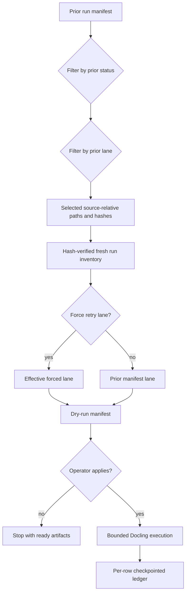

# fix: Harden Docling cinema resume runs

## Summary

Harden the Docling cinema batch runner so pending and failed PDFs can be selected from a prior manifest, retried into fresh run directories, and checkpointed safely during long conversions. The work keeps the original full-run ledger auditable and prepares bounded apply commands without mutating source PDFs or downstream Knowledge Hub surfaces.

---

## Problem Frame

The original Docling cinema plan created a manifest-first runner for the 84-PDF cinema corpus. The current recovery state is narrower: a prior full run has converted most rows, left queued level C work, and recorded failed rows that need retry. Operators need a resume path that does not hand-copy long path lists, does not silently fall back to the whole source tree, and does not overwrite the prior run.

The implementation must preserve the no-ingest boundary from the origin requirements. This work prepares conversion retries only; it does not approve any output for Knowledge Hub, LightRAG, multimodal, CAG, vault, or database ingestion.

---

## Requirements

The R-IDs below are local to this follow-up plan. Origin requirements are referenced as `Origin R#` when needed.

### Manifest Resume

- R1. Resume commands can select rows from a previous `docling-cinema-batch-manifest.tsv` by prior status and prior lane while preserving the selected rows' prior lane by default.
- R2. `--from-manifest` fails closed when no prior status is provided or when the selection produces zero rows.
- R3. A resume run refuses to write into the same run directory as the manifest it is reading.
- R4. Operators can filter by the old lane and force a new retry lane without changing how prior rows are selected.
- R5. Manifest-derived resume cannot be widened with manual `--only-relative-path` entries.
- R6. Manifest-derived resume verifies each current source file hash against the prior manifest hash before writing a new run ledger.

### Long-Run Reliability

- R7. Existing non-empty target run directories require an explicit `--resume-run` operator decision.
- R8. Manifest-derived apply runs require a positive document timeout; timeout flags are forwarded to the child process and bounded by a parent process timeout with grace.
- R9. Apply runs atomically checkpoint the manifest, retry list, output index, and summary after each row status change, publishing the summary last.
- R10. Resume checks use the effective retry lane so successful level A output does not suppress a later forced level C retry.
- R11. Persisted runner errors redact local source/output paths before they enter manifests or retry ledgers.

### Operator Handoff

- R12. The runbook documents the safe dry-run-first sequence for pending queued rows and failed retry rows.
- R13. Generated manifests remain public-safe by using source-relative paths and not exposing machine-specific source roots.
- R14. The verified handoff identifies exactly which dry-run artifacts are ready and which apply commands remain operator-gated.

### Origin Trace

| Plan requirement | Origin requirements |
|---|---|
| R1-R7 | Origin R8, R9, R11 |
| R8-R11 | Origin R7, R8, R9, R11 |
| R12-R14 | Origin R10, R11, R13, R14 |

---

## Key Technical Decisions

- **KTD1. Select from prior manifests instead of manual path lists.** The previous manifest is the canonical ledger for queued and failed rows, so the resume path should derive its scope from that ledger.
- **KTD2. Treat empty selections as operator errors.** A zero-row manifest filter is more likely to be a typo than a request to scan the full source root, so the CLI must fail closed.
- **KTD3. Separate prior lane from effective retry lane.** `--level` identifies rows in the old manifest, selected rows keep their prior lane by default, and `--force-level` intentionally overrides the lane for the new run.
- **KTD4. Verify prior source hashes before resume.** Relative paths alone are not enough proof that the current source root still matches the prior ledger.
- **KTD5. Checkpoint atomically after every row.** Large PDFs can run for hours, so row-level persistence is more valuable than only writing artifacts at the end. Atomic replacement protects the last complete ledger if a checkpoint write is interrupted.
- **KTD6. Keep retry work in fresh run directories.** Fresh run IDs protect the original full-run ledger and make dry-run/apply evidence easy to compare. Reusing a reviewed dry-run ID for apply requires explicit `--resume-run`.

---

## High-Level Technical Design

The runner has two explicit safety gates: manifest-derived selection before inventory and dry-run artifacts before apply. The apply path updates artifacts after every row so an interrupted long run remains inspectable.

---

## Implementation Units

### U1. Manifest-derived resume selection

- **Goal:** Add manifest loading and row selection helpers that accept a run directory or manifest path and return source-relative paths in stable manifest order.
- **Requirements:** R1, R2, R6, R13.
- **Dependencies:** None.
- **Files:**
  - `backend/app/docling_cinema_batch.py`
  - `backend/tests/test_docling_cinema_batch.py`
- **Approach:** Resolve manifest paths through a small helper, parse TSV with structured CSV handling, filter by prior `status` and prior `docling_level`, dedupe repeated relative paths, preserve row-number order, and return each selected row's prior lane and source hash for the new inventory pass.
- **Patterns to follow:** Existing `InventoryRow` TSV writing in `backend/app/docling_cinema_batch.py` and manifest-shape assertions in `backend/tests/test_docling_cinema_batch.py`.
- **Test scenarios:**
  - Given a prior manifest with converted and queued rows, selecting `queued` and level C returns only the queued C relative path.
  - Given a run directory instead of a manifest file, selection resolves the standard manifest filename.
  - Given duplicate relative paths in a manifest, the selection returns the first visible occurrence once.
  - Given non-lexical manifest order, explicit inventory preserves the selected row order.
  - Given a missing manifest path, the helper raises a file-not-found error before inventory.
  - Given a selected row whose current PDF hash differs from the prior manifest hash, inventory fails closed.
- **Verification:** Resume selection is deterministic, returns only source-relative paths, and carries prior lane metadata into inventory.

### U2. CLI safety gates for resume and lane forcing

- **Goal:** Extend the CLI so `--from-manifest`, `--prior-status`, `--level`, and `--force-level` compose safely for queued and failed retries.
- **Requirements:** R1, R2, R3, R4, R5, R6, R7, R10, R13.
- **Dependencies:** U1.
- **Files:**
  - `backend/app/docling_cinema_batch.py`
  - `backend/tests/test_docling_cinema_batch_cli.py`
- **Approach:** Require at least one `--prior-status` with `--from-manifest`, reject manual `--only-relative-path` when reading a manifest, refuse same-run clobber, require `--resume-run` for existing target run directories, fail on zero selected rows or source hash mismatch, use `--level` as the prior-manifest filter, preserve the prior manifest lane by default, and use `--force-level` only as an explicit override.
- **Patterns to follow:** Existing CLI tests that inject a fake runner and avoid calling real Docling.
- **Test scenarios:**
  - Given `--from-manifest` without `--prior-status`, the CLI exits with an argument error.
  - Given a filter that selects zero rows, the CLI exits with an argument error.
  - Given a manifest path pointing to the same run directory as `--run-id`, the CLI exits with an argument error.
  - Given `--from-manifest` with `--only-relative-path`, the CLI exits with an argument error.
  - Given an existing target run directory without `--resume-run`, the CLI exits with an argument error.
  - Given a prior manifest hash that does not match the current source file, the CLI exits with an argument error.
  - Given a prior C row whose current classifier would choose A, a manifest resume without `--force-level` still runs level C.
  - Given mixed prior lanes in non-lexical order, a manifest resume keeps prior lanes and manifest order.
  - Given prior failed level A rows plus `--force-level C`, inventory schedules the row as level C.
  - Given `--level A --force-level C --from-manifest`, the runner receives level C while the manifest filter uses prior level A.
- **Verification:** CLI dry-runs write the intended scoped manifest and never fall back to all PDFs when a manifest selection is empty.

### U3. Timeout and checkpoint behavior for long conversions

- **Goal:** Bound long Docling child processes and atomically persist run artifacts after every row status change.
- **Requirements:** R8, R9, R11.
- **Dependencies:** U2.
- **Files:**
  - `backend/app/docling_cinema_batch.py`
  - `backend/tests/test_docling_cinema_batch.py`
- **Approach:** Add a Docling runner factory that captures forwarded args and parent timeout. Require positive document timeouts for manifest-derived apply runs, run timed Docling commands in their own process group, convert child timeouts into failed runner results with tailed redacted output, and atomically replace artifacts after failures, exceptions, and successful validation.
- **Patterns to follow:** Existing fake-runner tests and current summary/manifests produced by `write_artifacts`.
- **Test scenarios:**
  - Given a document timeout flag, the runner passes it to Docling and also applies a parent process timeout with grace.
  - Given manifest-derived apply without a positive timeout, the CLI exits with an argument error before inventory execution.
  - Given a parent timeout, `run_docling` returns a failed `RunnerResult` with timeout context and tailed process output.
  - Given a parent timeout, the runner signals the Docling process group before marking the row failed.
  - Given the first row fails and the second row starts, the manifest already contains the failed status before the second row completes.
  - Given a successful row, the manifest and output index are refreshed immediately after validation.
  - Given a checkpoint write failure before replacement, the previous complete artifact remains readable.
  - Given raw stderr containing local source/output paths, persisted failure text is redacted.
- **Verification:** An interrupted apply run leaves the last complete manifest, retry list, and summary on disk.

### U4. Runbook and ready dry-run artifacts

- **Goal:** Document the safe operator path and generate dry-run artifacts for the real pending and failed resume scopes.
- **Requirements:** R12, R13, R14.
- **Dependencies:** U1, U2, U3.
- **Files:**
  - `docs/runbooks/docling-cinema-batches.md`
  - `logs/docling-runs/docling-cinema-pending-c-20260704-ready/docling-cinema-batch-summary.json`
  - `logs/docling-runs/docling-cinema-pending-c-20260704-ready/docling-cinema-batch-manifest.tsv`
  - `logs/docling-runs/docling-cinema-pending-c-20260704-ready/docling-cinema-batch-retry.jsonl`
  - `logs/docling-runs/docling-cinema-pending-c-20260704-ready/docling-cinema-batch-output-index.jsonl`
  - `logs/docling-runs/docling-cinema-failed-retry-c-20260704-ready/docling-cinema-batch-summary.json`
  - `logs/docling-runs/docling-cinema-failed-retry-c-20260704-ready/docling-cinema-batch-manifest.tsv`
  - `logs/docling-runs/docling-cinema-failed-retry-c-20260704-ready/docling-cinema-batch-retry.jsonl`
  - `logs/docling-runs/docling-cinema-failed-retry-c-20260704-ready/docling-cinema-batch-output-index.jsonl`
- **Approach:** Update the runbook with resume examples, force-lane semantics, timeout guidance, and a review-before-apply warning. Use the real prior full-run manifest to prepare dry-run artifacts for queued C rows and failed retries.
- **Patterns to follow:** The existing no-ingest boundary language in `docs/runbooks/docling-cinema-batches.md`.
- **Test scenarios:**
  - Test expectation: none for documentation and generated dry-run artifacts. Review should confirm the runbook names the safe sequence and the dry-run summaries reconcile with their manifests.
- **Verification:** The pending dry-run artifact contains only queued level C rows, the failed-retry artifact contains only prior failed rows, and both summaries report `apply=false`.

---

## Scope Boundaries

### In scope

- Harden CLI resume selection, forced retry lanes, timeout handling, and per-row checkpoints.
- Add focused unit and CLI tests for the safety gates.
- Update the Docling cinema runbook.
- Prepare dry-run artifacts for pending level C rows and failed retry rows from the prior full-run manifest.

### Out of scope

- Starting the real Docling apply runs without a separate operator GO.
- Mutating source PDFs or organized Scribd folders.
- Ingesting Docling outputs into Knowledge Hub, LightRAG, multimodal, Qdrant, Postgres, Redis, Chroma, vault files, Notion, or CAG packs.
- Reclassifying the whole 84-PDF corpus beyond the prior manifest-derived scopes.

### Deferred to Follow-Up Work

- A separate downstream ingest plan after converted outputs are reviewed.
- A quality review report comparing extraction quality across all 84 PDFs.
- Full branch cleanup for unrelated dirty worktree files.

---

## Risks and Dependencies

| Risk | Mitigation |
|---|---|
| A mistyped manifest filter could target the wrong set of PDFs. | Require prior status, allow prior lane filtering, and fail closed on zero selected rows. |
| A retry could overwrite or confuse the original full-run ledger. | Refuse same-run manifest reads and use fresh run IDs for retry work. |
| A changed source root could have the same relative paths as the prior manifest. | Carry prior source hashes and fail closed on mismatches before writing a new run ledger. |
| A reused target run id could overwrite reviewed readiness evidence. | Refuse existing non-empty targets unless the operator passes `--resume-run`. |
| Long conversions can terminate after hours. | Require positive timeouts for manifest apply runs, forward Docling timeout controls, signal timed process groups, and checkpoint artifacts after each row. |
| A checkpoint write can be interrupted. | Write artifacts to temporary files first, atomically replace the previous complete files, and publish summary last. |
| Raw Docling stderr could include local paths. | Redact local source and output paths before persisting runner errors. |
| Local manifests could leak machine-specific paths. | Store source-relative paths and source root labels only. |
| The worktree contains unrelated changes. | Keep implementation, tests, docs, and any staging scoped to Docling files only. |

---

## Operational Notes

The verified dry-run artifacts are readiness evidence, not conversion results. Operators should inspect the manifests and then start bounded apply runs with fresh intent, small limits, and fresh observation of the running process. Failed retries should use longer document timeouts and fresh run IDs so the original full-run evidence remains intact.

---

## Sources and Research

- Origin requirements: `docs/brainstorms/2026-07-01-docling-cinema-pdf-batches-requirements.md`.
- Prior implementation plan: `docs/plans/2026-07-01-003-feat-docling-cinema-batches-plan.md`.
- Runner implementation: `backend/app/docling_cinema_batch.py`.
- Focused tests: `backend/tests/test_docling_cinema_batch.py` and `backend/tests/test_docling_cinema_batch_cli.py`.
- Operator runbook: `docs/runbooks/docling-cinema-batches.md`.
- Prior full-run artifacts: `logs/docling-runs/docling-cinema-full-20260703-ptbr-resumable/`.
- Prepared dry-run artifacts: `logs/docling-runs/docling-cinema-pending-c-20260704-ready/` and `logs/docling-runs/docling-cinema-failed-retry-c-20260704-ready/`.
