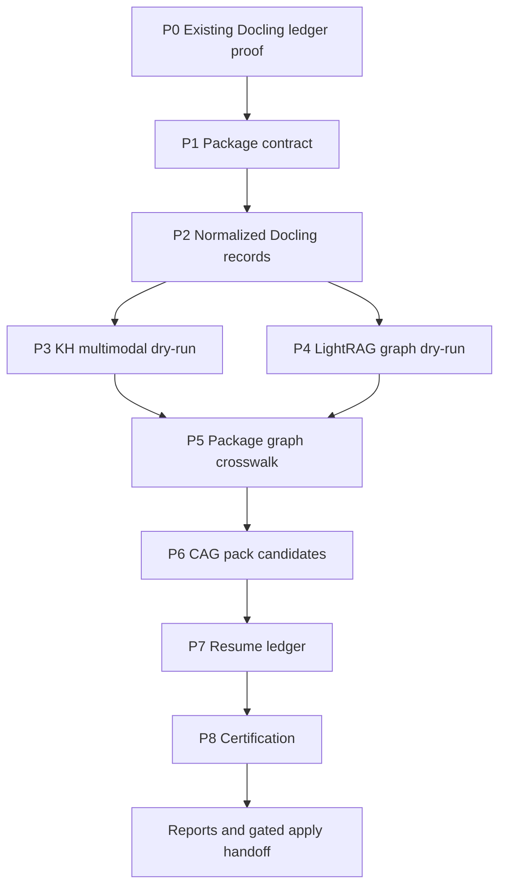

# feat: Post-Docling Ingest And Index Harness

## Summary

Build a safe, resumable P0-P8 harness that consumes the already-completed Docling cinema artifacts and prepares downstream Knowledge Hub multimodal, current LightRAG, graph crosswalk, and CAG pack outputs. The harness must default to dry-run, prove provenance before any apply path, and certify that no downstream stage reruns Docling or mutates external stores without an explicit apply gate.

---

## Problem Frame

The 84-PDF Docling conversion is already complete and must be treated as canonical input. The next problem is not extraction. It is linking the completed Docling ledgers, page/chunk outputs, enrichment overlay rows, image/table artifacts, KH package candidates, LightRAG graph documents, and CAG pack candidates into a single auditable pipeline.

Existing code already has the right safety posture in pieces: `backend/app/docling_cinema_batch.py` handles manifest-first Docling runs, `backend/app/lightrag_cinema_craft_ingest.py` separates inventory/prepare/ingest/eval with dry-run defaults, and `docs/architecture/visual-asset-package-contract.md` defines the layered visual package rule. This plan adds a post-Docling orchestration layer above those pieces rather than rerunning conversion or writing directly to KH, Qdrant, LightRAG storage, Chroma, the vault, or CAG stores.

---

## Requirements

**Canonical input and provenance**

- R1. The harness must prove the existing Docling corpus is complete from current run artifacts before preparing downstream records.
- R2. The harness must fail closed when Docling manifest hashes, output indexes, overlay manifests, or source-relative paths drift between phases.
- R3. The harness must never invoke Docling conversion commands as part of P0-P8.
- R4. Every downstream candidate record must preserve source PDF identity, source hash, run id, page or chunk identity, artifact layer, overlay status, quality status, and provenance hash.

**Normalized artifacts and package contract**

- R5. The harness must produce `docling-normalized-output.jsonl` from existing Docling manifests, output indexes, output directories, and enrichment overlay files.
- R6. The normalized records must represent converted, validation-warning, needs-review, failed, enriched, and `base_only_due_to_visual_timeout` states without hiding partials.
- R7. Package identity must bind by stable content/source hash first and use human labels only for display and grouping.
- R8. The harness must preserve separate layers for text chunks, page records, extracted images, tables/charts, visual analyses, graph documents, and CAG packs.

**Downstream dry-runs and apply gates**

- R9. KH multimodal preparation must be dry-run by default and must not call import, vector write, Qdrant write, Postgres write, Redis write, or vault mutation methods in dry-run mode.
- R10. LightRAG preparation must target the current LightRAG HTTP surface and remain dry-run unless an explicit apply flag is provided.
- R11. Qwen vision must be the primary configurable visual-analysis provider for future page/image/crop analysis, with Gemini as an optional fallback.
- R12. CAG packs must be generated as candidate manifests that reference canonical package IDs and provenance hashes rather than copying raw book text or local artifact paths.

**Crosswalk and certification**

- R13. The harness must produce `package-crosswalk.jsonl` linking Docling records, KH candidate IDs, LightRAG node references, visual-analysis references, and CAG pack candidates.
- R14. The harness must produce `p0-p8-certification.json` with per-phase status, input hashes, mutation proof, no-leak results, blocked reasons, and terminal state.
- R15. Certification must fail when normalized Docling coverage, graph crosswalk, CAG safety, no-leak evidence, or phase ledger data is missing.
- R16. Public reports must redact local absolute paths, secrets, DSNs, provider keys, and private runtime roots.

---

## Key Technical Decisions

- **Post-Docling only:** The new harness starts from existing Docling ledgers and output indexes. It does not run conversion.
- **One ledger across P0-P8:** Each phase records inputs, output paths, status, hashes, dry-run/apply mode, mutation proof, and blocking errors in a shared run ledger.
- **Schemas before writes:** The first durable outputs are normalized Docling records, package crosswalk records, and certification records. Downstream apply paths consume those records later.
- **Dry-run as the default product behavior:** Normal execution produces candidate artifacts and reports, not mutations. Apply mode is explicit per downstream surface.
- **Qwen vision primary:** The visual provider registry should prefer Qwen `qwen-3.7-max` through an OpenAI-compatible Alibaba endpoint in the `cn-beijing` region when configured. Gemini remains a fallback, not the default.
- **LightRAG current-instance alignment:** LightRAG stages should use the existing HTTP client and preflight/status rules, not direct graph/vector/document-status file writes.
- **CAG as a derived cache:** CAG packs are generated after normalized records and graph crosswalks exist. They reference evidence instead of duplicating protected or raw source text.
- **Certification is a hard gate:** A run is not healthy unless coverage, no-leak, dry-run mutation proof, crosswalk completeness, and CAG safety all pass.

---

## Model And Provider Roles

| Surface | Preferred model/provider | Purpose |
|---|---|---|
| Existing Docling outputs | Docling artifacts already on disk | Source extraction evidence; no rerun in this harness. |
| Visual analysis | Qwen `qwen-3.7-max` via Alibaba OpenAI-compatible `cn-beijing` endpoint | Cinematic page/image/crop analysis, composition, light, color, decoupage, and grounding. |
| Visual fallback | Gemini vision | Optional fallback or comparison when Qwen is unavailable. |
| OCR-specialized visual work | Qwen OCR class model when configured | Complex scanned pages, charts, tables, formulas, and visually dense book pages. |
| Multimodal embeddings | Voyage multimodal family used by DanteDash/KH | Image/page/crop/text-image retrieval candidates. |
| LightRAG embeddings | Current LightRAG embedding configuration | Graph document embedding through the active LightRAG instance. |
| LightRAG reasoning | Current LightRAG LLM configuration | Concept and relation extraction, graph reasoning, and craft synthesis. |
| Reranking | Cohere rerank family used by DanteDash/LightRAG | Ordering recovered evidence before answer or certification scoring. |
| CAG packs | Derived artifacts, not a model | Curated contexts with package IDs, source hashes, graph references, and refresh metadata. |

Provider configuration must live in ignored local environment files loaded by the local runtime and must never be printed in reports.

---

## High-Level Technical Design



The harness treats every phase as a pure artifact transform unless `--apply` is provided for a surface that has a vetted apply implementation. P0-P3 and P6-P8 can ship as dry-run/candidate generation before any mutation path exists.

---

## Output Structure

```text
backend/app/docling_kh_lightrag_cag_harness.py
backend/tests/test_docling_kh_lightrag_cag_harness.py
scripts/docling_kh_lightrag_cag_harness.py
docs/runbooks/docling-kh-lightrag-cag-harness.md
docs/plans/2026-07-08-001-feat-post-docling-ingest-index-harness-plan.md
```

Run-generated artifacts should land under ignored local run directories, not as committed defaults. Tests should use temporary directories and fixture rows.

---

## Implementation Units

### U1. P0 Run Ledger And Existing Docling Proof

- **Goal:** Create the harness module and prove the current Docling state from existing artifacts without invoking conversion.
- **Requirements:** R1, R2, R3, R14.
- **Dependencies:** None.
- **Files:**
  - `backend/app/docling_kh_lightrag_cag_harness.py`
  - `scripts/docling_kh_lightrag_cag_harness.py`
  - `backend/tests/test_docling_kh_lightrag_cag_harness.py`
- **Approach:** Add dataclasses for phase ledger rows, run summaries, source run references, and mutation proof. Load the canonical full run, queued completion run, failed retry run, and enrichment overlay from configurable repo-relative paths. Compute artifact hashes and reconcile converted counts as `63 + 15 + 6 = 84`.
- **Patterns to follow:** `backend/app/docling_cinema_batch.py` for manifest parsing and hash-safe resume, and `backend/app/lightrag_cinema_craft_ingest.py` for run summaries.
- **Test scenarios:**
  - Given fixture summaries with `63`, `15`, and `6` converted rows, the ledger reports `84/84` complete.
  - Given any missing manifest or changed artifact hash, the phase fails closed.
  - Given a harness run, no Docling runner or conversion command is called.
  - Given local absolute paths in input summaries, public report fields are redacted or made repo-relative.
- **Verification:** A dry-run command writes a phase ledger proving Docling completion from fixtures and reports `mutation_performed=false`.

### U2. P1-P2 Normalized Docling Output Schema

- **Goal:** Convert existing Docling manifests, output indexes, and overlay records into downstream-safe normalized records.
- **Requirements:** R4, R5, R6, R7, R8.
- **Dependencies:** U1.
- **Files:**
  - `backend/app/docling_kh_lightrag_cag_harness.py`
  - `backend/tests/test_docling_kh_lightrag_cag_harness.py`
- **Approach:** Define `docling-normalized-output.jsonl` rows for PDF, page, chunk, image/table, and overlay layers. Preserve page ranges, chunk ids, source hashes, output paths, overlay level, manual-review status, enrichment metrics, and blocked reason.
- **Patterns to follow:** `docs/architecture/visual-asset-package-contract.md` for layered package semantics.
- **Test scenarios:**
  - Converted rows become normalized candidate records with source hash and output index references.
  - `base_only_due_to_visual_timeout` overlay rows are retained as partial records and not silently promoted to enriched.
  - Duplicate human labels with different hashes remain distinct packages.
  - Missing chunk/page output becomes a blocked normalized row rather than an invented reference.
- **Verification:** Fixture normalization writes deterministic JSONL and a summary with coverage, partial, blocked, and needs-review counts.

### U3. P3 KH Multimodal Candidate Dry-Run

- **Goal:** Prepare KH multimodal package candidates from normalized Docling records without mutating KH or vector stores.
- **Requirements:** R8, R9, R11, R16.
- **Dependencies:** U2.
- **Files:**
  - `backend/app/docling_kh_lightrag_cag_harness.py`
  - `backend/tests/test_docling_kh_lightrag_cag_harness.py`
- **Approach:** Generate candidate package rows for text chunks, pages, extracted figures, tables, and visual-analysis needs. Include Qwen visual-analysis request specs for images/crops/pages that need visual interpretation, but do not make provider calls in dry-run mode.
- **Patterns to follow:** `backend/app/dante_visual/decoupage_ingest.py` for layered visual metadata and node-id discipline.
- **Test scenarios:**
  - Dry-run builds KH candidate rows without calling any client mutation method.
  - Visual candidates use Qwen as primary provider when configured and Gemini only as fallback.
  - Candidate reports redact provider base URLs that include private workspace identifiers when public output is requested.
  - Missing linked image/page evidence marks the candidate blocked.
- **Verification:** A mocked KH client records zero writes in dry-run and the candidate manifest contains only redacted, source-relative evidence.

### U4. P4 Current LightRAG Graph Dry-Run

- **Goal:** Prepare LightRAG graph documents and eval queries from normalized Docling records for the active LightRAG instance.
- **Requirements:** R10, R13, R14, R16.
- **Dependencies:** U2.
- **Files:**
  - `backend/app/docling_kh_lightrag_cag_harness.py`
  - `backend/tests/test_docling_kh_lightrag_cag_harness.py`
- **Approach:** Reuse the existing LightRAG inventory/prepare concepts to create rights-safe concept, relation, source provenance, and eval card candidates. Preflight the LightRAG HTTP health/status endpoints when requested, but keep insert calls behind apply mode.
- **Patterns to follow:** `backend/app/lightrag_cinema_craft_ingest.py` for `ExistingDocumentIndex`, `prepare_batches`, preflight, and public-safe errors.
- **Test scenarios:**
  - LightRAG dry-run prepares documents with source hash headers and no insert calls.
  - A busy or unavailable LightRAG preflight produces a blocked phase with public-safe diagnostics.
  - Existing document hashes skip duplicate graph candidates.
  - Unsafe or raw source text is rejected from graph payloads.
- **Verification:** LightRAG candidate manifests reconcile selected, skipped, duplicate, and blocked graph documents.

### U5. P5 Package Crosswalk

- **Goal:** Produce a crosswalk that links Docling records, KH candidates, LightRAG graph candidates, visual-analysis specs, and future CAG packs.
- **Requirements:** R7, R8, R13, R14, R16.
- **Dependencies:** U3, U4.
- **Files:**
  - `backend/app/docling_kh_lightrag_cag_harness.py`
  - `backend/tests/test_docling_kh_lightrag_cag_harness.py`
- **Approach:** Define `package-crosswalk.jsonl` with package key, layer, source/content hash, public label, KH candidate id, graph reference ids, visual spec id, CAG pack id, status, and provenance hash. Resolve duplicate labels by hash and status instead of collapsing them.
- **Patterns to follow:** `backend/app/kb_parity.py` for package-key reasoning and layer classification.
- **Test scenarios:**
  - Crosswalk rows link text, image, graph, and CAG candidates by provenance hash.
  - Duplicate display labels with different hashes create separate rows.
  - Missing graph or KH references are marked `missing` without inventing IDs.
  - Crosswalk report contains no local absolute paths.
- **Verification:** Crosswalk row count reconciles with normalized records and candidate manifests.

### U6. P6 CAG Pack Candidate Builder

- **Goal:** Generate CAG pack candidates from the crosswalk without copying raw protected source text.
- **Requirements:** R8, R12, R13, R16.
- **Dependencies:** U5.
- **Files:**
  - `backend/app/docling_kh_lightrag_cag_harness.py`
  - `backend/tests/test_docling_kh_lightrag_cag_harness.py`
- **Approach:** Build candidate specs for high-value cinema use cases such as lighting, camera movement, editing theory, color, blocking, shot design, cinematography manuals, and directing actors. Each pack references package IDs, source hashes, graph refs, and refresh policy.
- **Patterns to follow:** Existing LightRAG eval-card style in `backend/app/lightrag_cinema_craft_ingest.py`.
- **Test scenarios:**
  - CAG candidate generation rejects binary/media paths and raw local markdown dumps.
  - Pack status is `missing`, `available`, or `stale` based on package and crosswalk hashes.
  - Pack context contains bounded summaries and evidence references rather than full book text.
  - Missing graph references block packs that require graph grounding.
- **Verification:** Candidate CAG manifests are deterministic and rights-safe from fixture data.

### U7. P7 Orchestrator Resume And Phase Contracts

- **Goal:** Provide a CLI that can run, resume, and inspect P0-P8 phases from the shared ledger.
- **Requirements:** R1, R2, R9, R10, R14.
- **Dependencies:** U1, U2, U3, U4, U5, U6.
- **Files:**
  - `scripts/docling_kh_lightrag_cag_harness.py`
  - `backend/app/docling_kh_lightrag_cag_harness.py`
  - `backend/tests/test_docling_kh_lightrag_cag_harness.py`
- **Approach:** Add commands for `inventory`, `normalize`, `kh-dry-run`, `lightrag-dry-run`, `crosswalk`, `cag-dry-run`, `certify`, and `run-all`. Each command reads prior phase hashes and refuses mixed dry-run/apply state.
- **Patterns to follow:** Thin wrappers in `scripts/lightrag_cinema_craft_prepare.py` and `scripts/docling_cinema_batch.py`.
- **Test scenarios:**
  - Resume reconstructs phase state from artifacts after a partial run.
  - Mixed dry-run/apply ledgers fail validation.
  - `run-all` stops at the first failed closed phase.
  - CLI default mode performs no downstream mutations.
- **Verification:** A fixture `run-all` completes all dry-run phases and produces ledger, normalized records, crosswalk, CAG candidates, and certification artifacts.

### U8. P8 Certification And Runbook

- **Goal:** Certify the whole P0-P8 dry-run and document safe operation.
- **Requirements:** R14, R15, R16.
- **Dependencies:** U7.
- **Files:**
  - `backend/app/docling_kh_lightrag_cag_harness.py`
  - `backend/tests/test_docling_kh_lightrag_cag_harness.py`
  - `docs/runbooks/docling-kh-lightrag-cag-harness.md`
- **Approach:** Produce `p0-p8-certification.json` and a compact Markdown report with phase status, coverage, no-leak checks, mutation proof, model/provider configuration shape, and blockers. Add a runbook that makes the post-Docling boundary and apply gates unambiguous.
- **Patterns to follow:** `backend/app/kb_cutover_score.py` and `scripts/dantedash_kh_cutover_certify.py` for scoring and no-leak posture.
- **Test scenarios:**
  - Certification fails when normalized coverage is absent.
  - Certification fails when crosswalk or CAG safety sections are missing.
  - Certification fails when leaked local absolute paths appear in public payloads.
  - Certification passes for a fully reconciled fixture dry-run with no mutations.
- **Verification:** Focused tests prove missing sections are blockers and fixture reports can certify a complete dry-run.

---

## Scope Boundaries

### In scope

- Build a post-Docling harness that consumes existing conversion artifacts.
- Produce normalized Docling records, KH dry-run candidates, LightRAG dry-run candidates, package crosswalks, CAG candidates, phase ledgers, and certification reports.
- Add Qwen vision as the preferred configurable visual-analysis provider for future visual candidate stages.
- Add focused tests and a runbook for the safe dry-run workflow.

### Out of scope

- Rerunning Docling conversion.
- Running full KH multimodal import, Qdrant writes, Postgres writes, Redis writes, Chroma writes, vault mutation, LightRAG inserts, or CAG store writes by default.
- Printing or committing provider secrets, API keys, raw local env files, or private runtime roots.
- Replacing the current LightRAG runtime configuration.
- Changing DanteDash search/chat UI behavior in this harness PR.

### Deferred to Follow-Up Work

- Apply-mode implementation for KH multimodal import after candidate manifests are reviewed.
- Apply-mode implementation for LightRAG insert after dry-run graph documents and evals pass.
- Live Qwen visual-analysis batch execution against selected page/image/crop candidates.
- UI controls for inspecting P0-P8 harness outputs in the dashboard.

---

## Risks And Mitigations

| Risk | Mitigation |
|---|---|
| The harness accidentally reruns Docling after days of completed work. | Make Docling invocation absent from the new module and test that conversion runners are not called. |
| Partial overlay rows are promoted as fully enriched. | Normalize overlay levels and make base-only timeout rows explicit blockers or partials. |
| Duplicate human labels collapse distinct assets. | Use source/content hash as the binding key and label as display only. |
| Dry-run accidentally mutates external stores. | Mock clients in tests and assert no mutation methods are called unless apply mode is explicitly active. |
| Public reports leak local paths or provider secrets. | Run no-leak scans over certification payloads and redact public strings before writing reports. |
| CAG packs copy raw protected text. | Generate bounded candidate specs with references and summaries, not raw source dumps. |
| Model naming drifts across providers. | Keep provider/model names configurable and verify by smoke before live visual analysis. |

---

## Acceptance Examples

- AE1. Given the existing Docling full, pending, and retry summaries, when P0 runs, then the harness proves `84/84` completion without invoking Docling.
- AE2. Given an enrichment overlay with `12` enriched pages and `3` base-only visual-timeout pages, when P2 normalizes outputs, then both states are preserved and base-only pages are not reported as fully enriched.
- AE3. Given a KH dry-run, when the mocked KH client is inspected, then no import or vector-write method was called.
- AE4. Given Qwen vision provider configuration, when P3 builds visual-analysis candidates, then Qwen is the primary provider and Gemini is only fallback metadata.
- AE5. Given duplicate display labels with different hashes, when P5 builds the crosswalk, then separate package rows are retained.
- AE6. Given a CAG pack candidate, when P6 validates it, then it contains package references and provenance hashes rather than raw book text or local file paths.
- AE7. Given a public certification report with a leaked local absolute path, when P8 runs, then certification fails.
- AE8. Given a complete fixture dry-run, when `run-all` executes, then ledger, normalized JSONL, crosswalk JSONL, CAG candidates, and certification JSON are all produced with `mutation_performed=false`.

---

## Success Metrics

| Criterion | Target |
|---|---:|
| Existing Docling completion proof | `84/84` from artifacts |
| Docling conversion invocations by harness | `0` |
| Dry-run external mutations | `0` |
| Public path/secret leaks | `0` |
| Normalized coverage for converted records | `100%` or explicit blocker rows |
| Crosswalk rows with provenance hash | `100%` |
| CAG candidates with raw protected text | `0` |
| Focused backend tests | pass |

---

## Documentation And Operational Notes

- The runbook must state that this harness begins after Docling completion.
- The runbook must distinguish dry-run candidate generation from future apply-mode ingestion.
- The runbook must list the provider configuration keys without printing values.
- The runbook must include the expected review order: P0 ledger, P2 normalized coverage, P5 crosswalk, P6 CAG candidates, P8 certification.

---

## Sources And Research

- `docs/runbooks/docling-cinema-batches.md`: Docling is a pre-ingest conversion layer and must not mutate KH, LightRAG, multimodal, Qdrant, Postgres, Redis, Chroma, vault, Notion, or CAG packs.
- `backend/app/docling_cinema_batch.py`: existing manifest-first conversion runner and resume/hash safety patterns.
- `backend/app/lightrag_cinema_craft_ingest.py`: existing LightRAG inventory, prepare, dry-run/apply, preflight, ingest, and eval patterns.
- `docs/architecture/visual-asset-package-contract.md`: layered visual package identity and future ingest rules.
- `backend/app/dante_visual/decoupage_ingest.py`: layered visual ingest metadata and node-id patterns.
- `backend/app/kb_parity.py`: package key and layer classification patterns.
- `backend/app/kb_cutover_score.py`: no-leak and certification scoring posture.
- `docs/brainstorms/2026-07-01-docling-cinema-pdf-batches-requirements.md`: original Docling conversion boundaries.
- `docs/brainstorms/2026-07-03-s-tier-multimodal-retrieval-requirements.md`: package-aware retrieval and optional LightRAG expansion posture.
