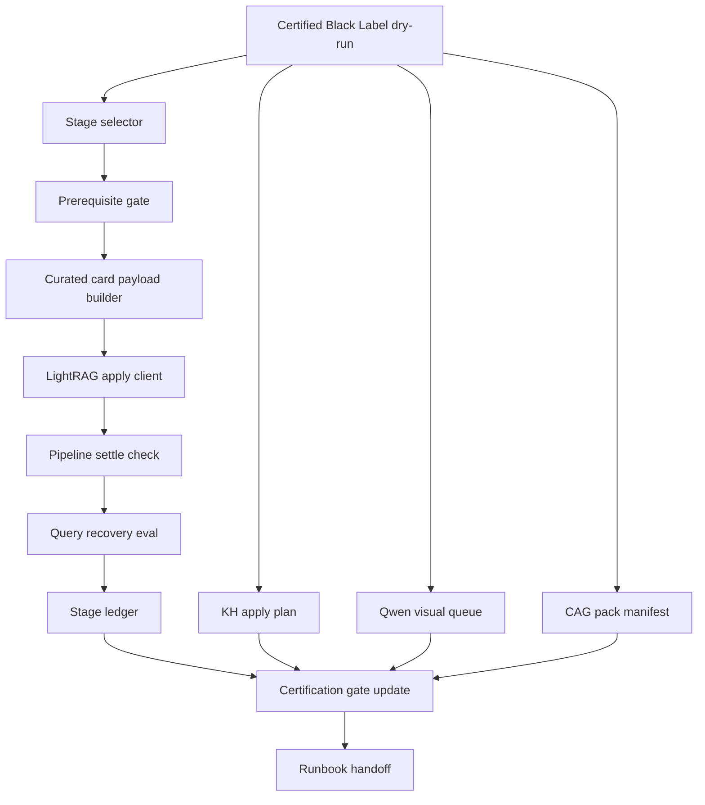
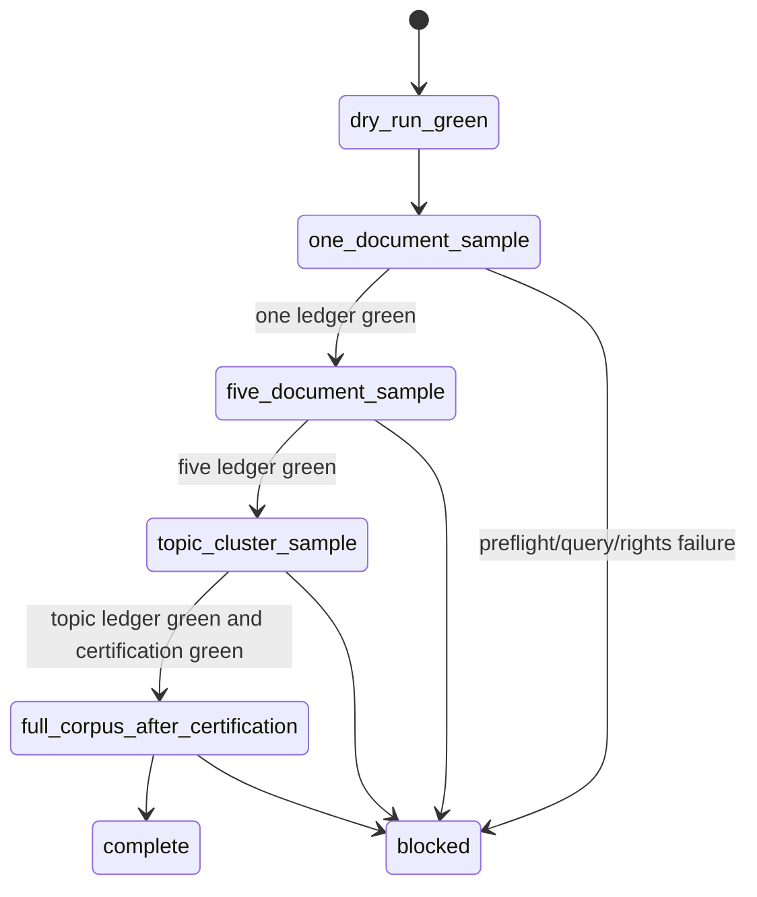

# feat: Black Label Docling Apply Harness

## Summary

Complete the Black Label post-Docling pipeline by turning the existing certified dry-run and first-card LightRAG sample into a staged apply harness with deterministic ledgers, certification gates, and operator-safe handoff artifacts for LightRAG, KH multimodal, visual enrichment, and CAG packages.

---

## Problem Frame

The 84-PDF Docling corpus is already converted and certified through the Black Label dry-run. The current implementation registers all PDF/image/text/card/CAG assets and has proved one curated LightRAG card can be inserted and recovered. The remaining work is to generalize that proof into staged, reviewable apply steps without reverting to raw book Markdown, direct datastore writes, or untracked provider calls. The legacy command and ledger name may still say `sample`, but the first rollout stage is card-scoped: `one_document_sample` means "one curated card from one source document" for compatibility with the existing apply plan.

The implementation must preserve the prior quality bar: package-first provenance, rights-safe cards, Qwen-first visual planning, no private path or secret leaks, and staged rollout from the first-card sample through five-source, topic-cluster, and full-corpus gates only when previous gates are green.

---

## Requirements

**Staged apply and certification**

- R1. The harness must support named LightRAG apply stages for `one_document_sample`, `five_document_sample`, `topic_cluster_sample`, and `full_corpus_after_certification`.
- R2. Every apply stage must preflight LightRAG health, status counts, active pipeline state, failed document count, and duplicate source handling before insert.
- R3. Every mutation attempt must write a public-safe ledger with selected cards, preflight, insert response or `null` when blocked before insert, settled status counts when applicable, query recovery evidence, blockers, and mutation proof.
- R4. A later stage must be blocked unless earlier required stage ledgers are green for the same certified Black Label run.
- R5. Full corpus apply must remain blocked unless dry-run certification, sample ledgers, rights checks, leak checks, bounded batch manifests, resume ledgers, and eval requirements are green.

**Curated cards and rights safety**

- R6. LightRAG payloads must contain curated Black Label card summaries, package refs, source hashes, graph ids, and evidence metadata, not raw Docling Markdown or binary media.
- R7. Rights-blocked cards must remain visible in plans and certification but must never be inserted into LightRAG.
- R8. Duplicate or already-applied card sources must be skipped or reported without creating ambiguous repeat inserts.

**KH, visual, and CAG handoff**

- R9. KH multimodal apply must remain a reviewed apply plan in this implementation, with public-safe manifests and no direct DanteDash datastore writes.
- R10. Qwen visual enrichment must stay Qwen-primary and Gemini-fallback in generated queues; dry-run must never call providers or print credentials.
- R11. CAG packs must reference package IDs, graph refs, visual refs, evidence card IDs, and refresh hashes without copying protected source text.
- R12. Certification must report current stage readiness for KH, visual, LightRAG, CAG, and full corpus rollout.

**Developer and operator ergonomics**

- R13. CLI commands must be explicit, resumable, and safe by default.
- R14. Tests must cover stage selection, prerequisite blocking, duplicate skip behavior, rights blocking, ledger shape, and certification status updates.
- R15. The runbook must describe the exact safe order to continue from the current green one-card sample.

---

## Key Technical Decisions

- KTD1. **Generalize the existing sample path instead of creating a second client:** the one-card apply already uses `LightRAGClient` correctly, so stage selection should reuse that path and vary only card selection, prerequisite validation, and ledger names.
- KTD2. **Use source-file IDs as idempotency handles:** LightRAG apply sources such as `black-label-docling/sample/<card_id>.md` become the durable duplicate boundary because they are visible in query context and ledgers.
- KTD3. **Treat full apply as a gated stage, not a default command:** the CLI may expose it, but it must fail closed until all prior ledgers and local certification conditions are green.
- KTD4. **Keep KH and CAG as artifact handoffs in this change:** direct KH/CAG writes have different owners and runtime contracts; this plan improves manifests and certification without mutating those stores.
- KTD5. **Keep visual enrichment queued, not called:** Qwen visual calls can be expensive and credential-bound; this implementation prepares priority queues and readiness evidence, leaving live provider execution to a separate apply adapter.
- KTD6. **Certification owns rollout truth:** reports should derive gate state from ledgers and manifests rather than chat history or operator memory.
- KTD7. **Apply commands name their target run explicitly:** `--source-run` remains the P0-P8 input for dry-run generation; staged apply and certification refresh use `--black-label-run` to avoid confusing source artifacts with generated Black Label runs.

---

## High-Level Technical Design

Gate mapping:

| Gate | Stage |
|---|---|
| Gate 0 | Certified dry-run registry and no-leak package plan |
| Gate 1 | First-card `one_document_sample` LightRAG apply |
| Gate 2 | Five-source `five_document_sample` LightRAG apply |
| Gate 3 | Topic-cluster `topic_cluster_sample` LightRAG apply |
| Gate 4 | Certification refresh after each successful stage |
| Gate 5 | Full-corpus stage unlocked only by prior green ledgers |

---

## Implementation Units

### U1. Stage Model And Ledger Contracts

- **Goal:** define the reusable staged apply model and ledger filenames for one-document, five-document, topic-cluster, and full-corpus LightRAG stages.
- **Requirements:** R1, R3, R4, R13, R14.
- **Dependencies:** None.
- **Files:**
  - `backend/app/docling_black_label_package.py`
  - `backend/tests/test_docling_black_label_package.py`
- **Approach:** add stage constants, stage metadata, prerequisite lists, stage-specific ledger names, and a public-safe ledger builder. Preserve the existing first-card ledger as a compatibility alias or migrate it through the same shape. Stage selection must derive from `source_pdf_id`, source hashes, topic, and card role at apply time rather than trusting stale row-index `apply_stage` labels from older dry-runs.
- **Patterns to follow:** existing `apply_lightrag_sample`, `_lightrag_sample_ledger`, and `PhaseResult` structures.
- **Test scenarios:**
  - Given `one_document_sample`, the stage requires a certified Black Label dry-run but has no prior stage-ledger prerequisite and selects one planned clear card.
  - Given `five_document_sample`, the stage requires a green first-card ledger and selects up to five clear planned cards from distinct source PDFs when possible.
  - Given `topic_cluster_sample`, the stage requires a green five-document ledger and selects cards from one topic cluster.
  - Given `full_corpus_after_certification`, the stage requires all prior ledgers and a green certification.
- **Verification:** focused tests prove stage metadata and ledger naming are deterministic and public-safe.

### U2. Reusable LightRAG Stage Apply

- **Goal:** replace the single-sample implementation with a generic apply function that applies selected curated cards and verifies recovery.
- **Requirements:** R2, R3, R5, R6, R7, R8, R14.
- **Dependencies:** U1.
- **Files:**
  - `backend/app/docling_black_label_package.py`
  - `scripts/docling_black_label_package.py`
  - `backend/tests/test_docling_black_label_package.py`
- **Approach:** implement `apply_lightrag_stage` with stage selection, preflight, payload construction, bounded batch insert, settle polling, duplicate handling, per-card query recovery, and final blockers. Keep `apply_lightrag_sample` as a small wrapper for existing callers. Full-corpus execution requires deterministic batch manifests, per-batch ledgers, resume state, and expected-count math based on actually sent non-duplicate cards.
- **Patterns to follow:** `backend/app/lightrag_cinema_craft_ingest.py` for status-count and pipeline-settle behavior.
- **Test scenarios:**
  - A green fake LightRAG client receives only curated card payloads and returns a green ledger.
  - A busy pipeline blocks before mutation, records `mutation_performed=false`, and writes `insert_response=null`.
  - A rights-blocked card is never inserted even when selected by stage count.
  - Query recovery failure after insert marks the ledger blocked while preserving mutation evidence.
  - Existing source duplicates are skipped and reported without failing the whole stage.
- **Verification:** mocked client tests cover green, blocked, duplicate, and post-insert failure paths.

### U3. Certification Gate Updates

- **Goal:** fold stage ledgers into `black-label-certification.json` and `report.md` so readiness is derived from artifacts.
- **Requirements:** R4, R5, R12, R14.
- **Dependencies:** U1, U2.
- **Files:**
  - `backend/app/docling_black_label_package.py`
  - `backend/tests/test_docling_black_label_package.py`
  - `docs/runbooks/docling-black-label-packages.md`
- **Approach:** read stage ledgers from the run directory during certification, compute pass/blocked/pending status for each rollout gate, and keep `full_corpus_apply_allowed=false` until all hard prerequisites pass.
- **Patterns to follow:** existing `certify_run` gate summary and report writer.
- **Test scenarios:**
  - No stage ledgers leaves stage gates pending and full apply blocked.
  - A green first-card ledger marks the `one_document_sample` gate pass but leaves later gates pending.
  - A blocked ledger keeps full apply blocked and surfaces the blocker in certification.
  - Certification output contains no local paths from ledger payloads.
- **Verification:** fixture certification changes when ledger files are present and remains leak-free.

### U4. KH, Visual, And CAG Handoff Hardening

- **Goal:** make non-LightRAG surfaces ready for staged review without performing broad writes.
- **Requirements:** R9, R10, R11, R12, R15.
- **Dependencies:** U3.
- **Files:**
  - `backend/app/docling_black_label_package.py`
  - `backend/tests/test_docling_black_label_package.py`
  - `docs/runbooks/docling-black-label-packages.md`
- **Approach:** enrich KH plan rows with stage/readiness metadata, visual queue rows with priority batches and credential-presence-only provider evidence, and CAG manifests with graph/visual readiness status derived from LightRAG ledgers and visual queues.
- **Patterns to follow:** existing `build_kh_apply_plan`, `build_visual_enrichment_queue`, and `build_cag_manifest`.
- **Test scenarios:**
  - KH plan rows expose apply-plan status but no datastore write intent.
  - Visual queue rows classify priority tiers and show provider configured booleans without exposing keys or private URLs.
  - CAG packs become graph-ready only when referenced card graph refs have green LightRAG stage evidence.
  - CAG manifests never copy raw source text or local artifact paths.
- **Verification:** dry-run certification reports KH/visual/CAG readiness without mutation.

### U5. CLI And Runbook Completion

- **Goal:** expose explicit commands for stage apply, certification refresh, and safe continuation from the current one-card sample.
- **Requirements:** R1, R3, R13, R15.
- **Dependencies:** U1, U2, U3, U4.
- **Files:**
  - `backend/app/docling_black_label_package.py`
  - `scripts/docling_black_label_package.py`
  - `docs/runbooks/docling-black-label-packages.md`
- **Approach:** add CLI choices for staged LightRAG apply and certification refresh. Keep `--source-run` for P0-P8 dry-run input and add `--black-label-run` for staged apply and refresh. Document the exact order: dry-run, first-card sample, certification refresh, five-source sample, certification refresh, topic cluster, certification refresh, and full corpus only when the CLI gate allows it.
- **Patterns to follow:** current script wrapper and runbook command style.
- **Test scenarios:**
  - CLI parses each stage name and exits non-zero on blocked gates.
  - `apply-lightrag-sample` remains compatible and maps to `one_document_sample`.
  - Staged apply commands reject ambiguous use of `--source-run` where `--black-label-run` is required.
  - Certification refresh does not perform mutations.
- **Verification:** focused CLI tests and runbook examples match implemented flags.

### U6. Live Staged Verification

- **Goal:** run the safest live verification available after implementation and capture the resulting evidence.
- **Requirements:** R2, R3, R4, R5, R6, R12, R15.
- **Dependencies:** U1, U2, U3, U4, U5.
- **Files:**
  - `logs/black-label-docling/<run-id>/` generated ledgers and reports
  - `docs/runbooks/docling-black-label-packages.md`
- **Approach:** preserve the existing green first-card ledger, refresh certification, then attempt the next safe LightRAG stage only when preflight and prerequisite gates are green. Refresh certification after each successful stage before unlocking the next stage. Do not execute full corpus in this LFG run if five-source or topic-cluster gates are absent, blocked, or too slow to certify.
- **Patterns to follow:** the already successful one-card sample ledger.
- **Test scenarios:**
  - Live LightRAG status remains `failed=0` before and after the staged apply.
  - The next-stage ledger records selected card ids, inserted or skipped sources, and query recovery.
  - Certification reflects the new live stage state.
- **Verification:** local command output and generated ledgers prove the stage result; broad stores other than LightRAG are not mutated.

---

## Scope Boundaries

- This plan does not rerun Docling or replace the completed 84-PDF corpus.
- This plan does not ingest raw book Markdown into LightRAG.
- This plan does not write directly to KH-owned datastores, Qdrant, Postgres, Redis, Chroma, the vault, Notion, or CAG stores.
- This plan does not perform live Qwen or Gemini calls.
- This plan may mutate the active LightRAG instance only through explicit staged apply commands that pass preflight.

### Deferred to Follow-Up Work

- Live Qwen visual-analysis adapter for priority image/page crops.
- Reviewed KH multimodal apply client owned by the KH runtime.
- CAG materialization into an external CAG store after graph and visual readiness are certified.
- Live execution of full 84-PDF LightRAG apply in this LFG run if topic-cluster verification is too slow or costly. The full-corpus stage implementation remains in scope and must fail closed until prerequisites are green.

---

## Risks And Dependencies

| Risk | Mitigation |
|---|---|
| LightRAG processing is slow or expensive at larger stages. | Keep stages small, use bounded batch manifests, poll until settled, and block full corpus execution until prior ledgers are green. |
| Query recovery may return adjacent context but not the exact card. | Require card id, title, source id, or file source evidence in compact query recovery checks. |
| Duplicate inserts could pollute LightRAG. | Use deterministic file sources and duplicate skip reporting before insert when detectable. |
| Protected source text could leak through generated payloads. | Build payloads from card outlines, refs, hashes, and short curated summaries only. |
| Existing dirty worktree could mix unrelated changes into commit/PR. | Treat the untracked Black Label foundation files as part of this feature and stage only the Black Label plan, module, script, tests, and runbook files. |

---

## Acceptance Examples

- AE1. Given the current certified dry-run and green first-card ledger, when the five-source stage runs, then it applies only clear curated cards and writes a green or blocked ledger with no raw source text.
- AE2. Given a missing first-card ledger, when the five-source stage is requested, then the command blocks before mutation and records the missing prerequisite.
- AE3. Given a rights-blocked card in the apply plan, when any stage selects cards, then that card is skipped or blocked and is not sent to LightRAG.
- AE4. Given a blocked stage ledger, when certification is refreshed, then `full_corpus_apply_allowed` remains false and the blocker is visible in public-safe output.
- AE5. Given a green stage ledger, when report generation runs, then the runbook-visible report shows the passed gate and the next safe stage.

---

## Documentation And Operational Notes

Update the runbook with the current evidence path, the one-card sample result, the new staged commands, the exact meanings of pending versus blocked gates, and the explicit statement that KH/CAG/Qwen are still plan/handoff surfaces unless a later reviewed apply client exists.

---

## Sources And Research

- `backend/app/docling_black_label_package.py`: current dry-run builder and one-card LightRAG apply path.
- `backend/tests/test_docling_black_label_package.py`: fixture coverage for Black Label outputs, rights blocking, Qwen queue, CAG refs, and one-card apply.
- `docs/runbooks/docling-black-label-packages.md`: current operator handoff and certified dry-run counts.
- `docs/plans/2026-07-08-001-feat-post-docling-ingest-index-harness-plan.md`: original P0-P8 post-Docling harness plan.
- `docs/architecture/visual-asset-package-contract.md`: package-first multimodal boundary.
- `backend/app/lightrag_cinema_craft_ingest.py`: existing LightRAG HTTP client and status handling patterns.
