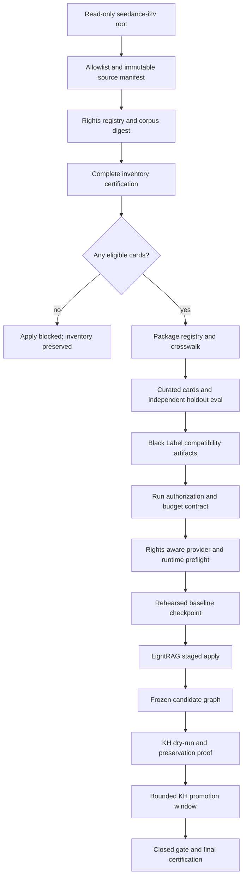
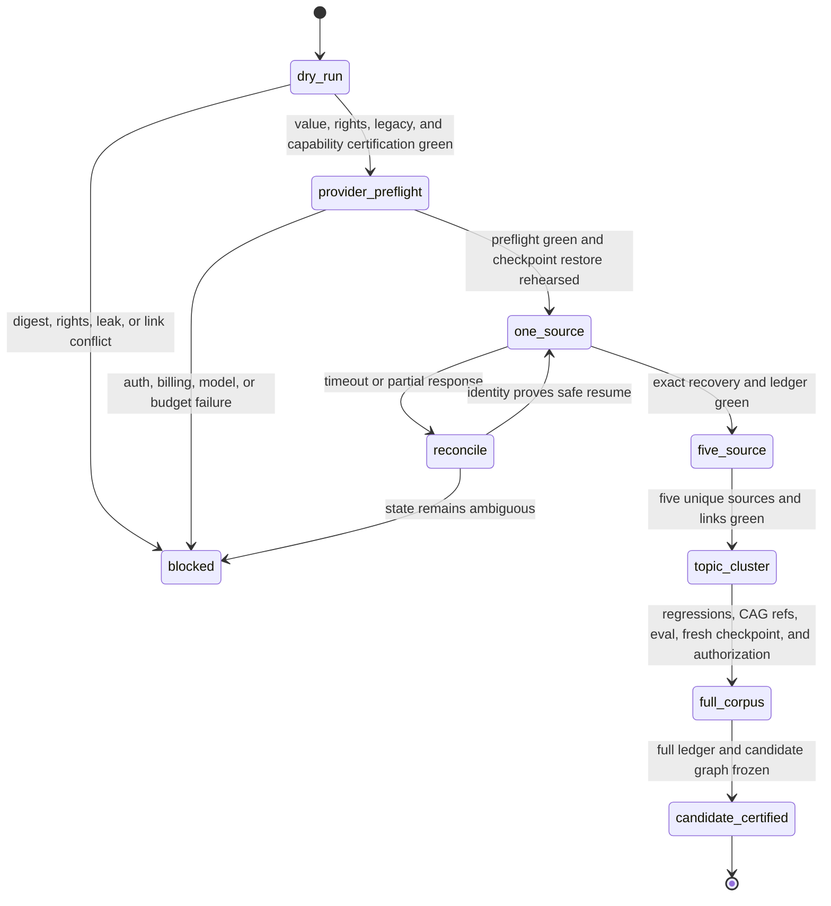
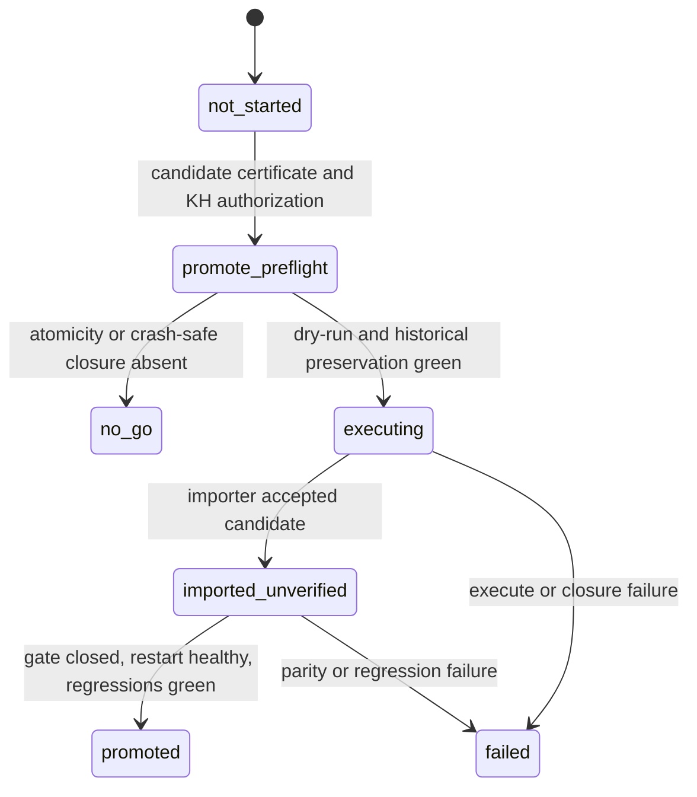
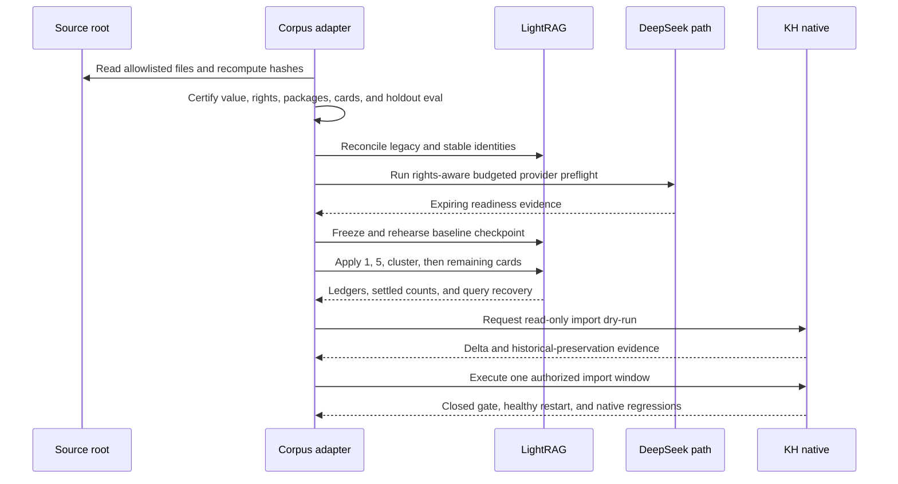

# feat: Seedance Governed Corpus Rollout

## Summary

Add a fail-closed adapter and rollout controller that turns the selected `seedance-i2v` corpus into immutable, rights-scoped package artifacts and then advances it through one-source, five-source, topic-cluster, full-corpus, and KH-native promotion gates without replacing the existing graph or leaking protected source material.

## Current Execution Status

The current delivery candidate implements the read-only dependency/capability
closure, corpus policy, deterministic P0 adapter, compatibility guard, tests,
runbook, and report scaffold in U7, U1, U2, and U5. Its machine result is P0
`blocked_no_mutation`: all 21 sources remain rights-unknown and the required
LightRAG identity, immutable-payload, value, and budget gates are not green.
U3-U6 and the mutating portion of P1 were therefore neither implemented nor
executed. Those units remain prospective and may begin only after a separately
reviewed green P0 candidate.

---

## Problem Frame

The active KH native graph is certified at 52,020 nodes and 123,523 edges, while LightRAG is idle at 15,768 processed documents under the DeepSeek, Voyage, and Cohere production profile. The previous Docling corpus has completed its governed rollout. The next corpus must use the same package-first and evidence-led process, but the existing builder accepts a certified Docling P0-P8 bundle rather than a mature KB root.

The selected `seedance-i2v` source contains 17 Markdown documents and four PNG assets with a local provenance chain. A prior KH ingest attempt timed out, so neither presence nor absence may be inferred from that attempt. The new path must inventory the source read-only, reconcile existing KH and LightRAG identities, and fail closed on rights, hash, provider, graph, or gate drift.

---

## Assumptions

- The user instruction to run P0 and P1 fully automatically establishes run-level intent. Before full apply, the controller must materialize an authorization bound to the corpus digest, approved pre-full certification, fresh checkpoint, commit, production profile, stage, and an opaque hash of this operator instruction. KH promotion requires a separate authorization bound to the post-full candidate certificate and exact import request.
- `seedance-i2v` is the bounded candidate for Gate 0 because its local source and provenance artifacts are present. It becomes the rollout corpus only if the independent value, rights, legacy-reconciliation, and dependency-capability gates pass. The source root remains read-only and is supplied explicitly at runtime rather than persisted in public artifacts.
- Text created by the operator and experiment outputs may be classified `internal_use_only` only when a source-class-specific adjudication rubric proves the claimed permission. Eligibility for external processing additionally requires an explicit per-provider, per-region, per-field disclosure permission. This classification never authorizes redistribution; unmatched or insufficient evidence remains `unknown` and ineligible.
- The current dirty worktree is protected baseline state. Only files created or intentionally changed by this plan may be staged, committed, or included in the pull request.
- Provider availability, authentication, and billing are execution-time facts. The live bounded preflight, not historical docs or environment presence alone, decides whether Gate 1 may start.

---

## Requirements

### Corpus identity and rights

- R1. The adapter must accept an explicit read-only source root and a versioned corpus policy manifest whose entries are corpus-relative and allowlisted.
- R2. The dry-run must freeze a sorted source manifest containing relative path, media type, size, SHA-256, source ID, package ID, and corpus digest for every selected, skipped, blocked, duplicate, or review-required item.
- R3. Every source must have an explicit rights record with status, basis, permitted local uses, external-processing permission, allowed providers and regions, allowed source-derived fields, evidence predicates and hash, review date, and reviewer identity. `unknown` and `blocked` must never become eligible by default, and a matching evidence hash alone never proves permission.
- R4. The run must account for all 17 Markdown documents and four PNG assets, exclude unallowlisted paths and formats, and invalidate later stages if the source digest changes.
- R5. Public artifacts may contain corpus-relative paths, stable IDs, hashes, counts, redacted decisions, and bounded independently authored policy metadata. They must contain zero credentials, absolute private paths, raw connector payloads, verbatim source bodies, or source binary data.

### Package and card generation

- R6. The dry-run must emit deterministic source, rights, package, card, crosswalk, visual queue, LightRAG plan, CAG, eval, phase-ledger, certification, and human-report artifacts without provider calls or datastore writes.
- R7. LightRAG payloads must be bounded curated cards composed from titles, declared summaries, heading seeds, relationships, hashes, and package references; raw Markdown bodies and binary media are prohibited.
- R8. Identity must separate corpus/run digest, source identity, logical card ID, revision ID, payload hash, graph document ID, and `file_source`. The same logical ID with a different payload hash is a conflict and must stop the rollout.
- R9. Visual links must be reconciled as `missing`, `exact`, `stale_compatible`, or `conflict`; a planned link must never be reported as materialized evidence.
- R10. The adapter must emit the certified Black Label compatibility artifacts, while the existing stage engine gains a narrow injectable policy seam for eligibility, stable `file_source`, cumulative unique-source selection, and explicit topic membership. The default Docling policy and all existing behavior must remain backward compatible.

### Staged rollout and provider safety

- R11. Gate 1 must materialize exactly one eligible `source_card` linked to one unique source hash and chosen as the highest-risk eligible sentinel. Gate 2 must preserve Gate 1 and add exactly four new source hashes for five total, stratified across source size and card roles, with no repeated-source fallback.
- R12. Gate 3 must use a manifest-declared `topic_id` and deterministic membership, treating already-materialized members as no-ops. It must add a predeclared minimum of new sources and relationship patterns; empty, ineligible, under-representative, or corpus-exhausting clusters are reported explicitly, and implicit largest-cluster selection is prohibited.
- R13. `file_source` identity must remain stable across retries and stages. Before Gate 1, every source must be reconciled across legacy paths, document IDs, embedded hashes, normalized-content fingerprints, and KH package references as `present`, `absent`, or `ambiguous`; any ambiguity blocks writes. Live apply also requires an authoritative deployed mapping from stable `file_source` to immutable payload hash.
- R14. A versioned run-authorization and budget manifest must bind currency, provider and model, conservative rate basis, maximum calls or tokens, total ceiling, expiry, corpus digest, and operator-instruction hash. Before attaching credentials or transmitting source-derived fields, local preflight must validate every active provider role, credential source, expected host or approved loopback proxy, TLS policy, redirect rejection, credential scope, and rights-compatible disclosure. Only then may the bounded network probe test auth and billing readiness without source content or persistence of secrets, response text, private endpoints, or account data. Every gate revalidates freshness and reservation; a lost probe response is not auto-retried.
- R15. Gate 1 must require a private, owner-only, restorable point-in-time baseline checkpoint outside the repository containing corpus digest, executed commit and profile hashes, LightRAG document index and counts, GraphML hash, KH manifest, all coordinated storage hashes/copies, available capacity, data-class inventory, retention deadline, and checkpoint identity. Credentials and sessions are excluded. An isolated offline restore rehearsal must reproduce hashes, counts, and read-only smoke results before Gate 1. Gates 1-3 may reuse the checkpoint only after integrity revalidation; full apply requires a new checkpoint and rehearsal.
- R16. Every mutating batch must hold a LightRAG-owned single-use mutation lease or fencing token enforced atomically by the insert endpoint and append a write-ahead intent containing stable IDs, payload hashes, expected delta, authorization, and checkpoint before the remote call. Control events must form a tamper-evident hash chain rooted in the corpus digest and executed commit and, for live promotion, be signed by an approved OS-backed run identity. Missing service-side fencing or signing capability is no-go. Timeout or lost response enters `indeterminate` until reconciled by identity, pipeline state, counts, and query recovery.
- R17. Partial mutation must freeze append-only intent/result events and resume idempotently through service APIs. Automatic deletion, direct datastore repair, GraphML editing, or storage restoration is prohibited.
- R18. Full-corpus apply must require green Gate 1, Gate 2, Gate 3, an independently authored and hashed holdout eval with manually reviewed semantic queries, negative controls, predeclared coverage and threshold, a fresh rehearsed full checkpoint, exact expected-count math, zero unresolved conflicts within the eligible apply set, and an authorization matching the approved pre-full certification. Inventory rows classified `unknown` or `blocked` remain accounted and excluded; they do not become eligible or disappear from certification.

### KH-native promotion and delivery

- R19. LightRAG apply and KH-native promotion must use separate ledgers and state machines linked by one immutable candidate certificate. KH stays read-only with `import_execute_enabled=false` throughout dry-run and LightRAG stages; a failed or not-started KH promotion does not invalidate a certified LightRAG candidate.
- R20. Promotion must require a frozen LightRAG graph, KH import dry-run, historical-ID and unordered-edge preservation, regression queries, a verified backup, an explainable semantic delta, and proof that the KH-owned importer commits by atomic manifest swap or otherwise cannot expose partial state.
- R21. The promotion window must require a KH-owned lease/TTL or independent watchdog plus a server-enforced single-use capability bound to authenticated operator identity, authorization ID, candidate-certificate hash, exact import-request hash, and short expiry. KH must reject caller or payload mismatch, expiry, and replay. A dedicated typed promotion client may open the gate for one bounded import only, close it, request restart, and prove native read-only health; absent these operations, crash-safe closure, or atomic import guarantees, automatic promotion is no-go before gate open.
- R22. Final certification must reconcile source counts, stage ledgers, provider evidence, LightRAG and KH graph deltas, historical preservation, regressions, gate closure, and public-safe hashes.
- R23. Delivery must first produce a reproducible commit and green PR CI, then run production pinned byte-for-byte to that commit, then deliver an evidence commit, final CI state, report, and sequential deep-memory snapshot.

### Value and terminal outcomes

- R24. Gate 0 must name the operator workflows and retrieval questions the corpus is expected to improve, freeze independent pre-ingest baselines and negative controls, predeclare minimum retrieval improvement plus acceptable noise and cost, and block live mutation when the hypothesis is unsupported.
- R25. P0 is terminally `green_dry_run` only when the immutable inventory, rights, value, legacy-reconciliation, dependency, and leak certifications are green; otherwise it is truthfully `blocked_no_mutation`. P1 may durably reach `candidate_certified` after LightRAG full-corpus certification. The full rollout and active goal are complete only at KH state `promoted`; candidate-only or no-go outcomes remain partial and must be reported as such.
- R26. The validation candidate containing dependency closure, U1, U2, and a redacted dry-run report must be independently reviewable and CI-green before stage-control or promotion implementation proceeds. KH control-plane capabilities must be audited read-only at this boundary; a failed KH audit defers promotion implementation without invalidating a later LightRAG candidate.

---

## Key Technical Decisions

- KTD1. **Adapt into the certified contract and extend one policy seam:** add a corpus adapter plus a narrow policy interface in the existing stage engine for eligibility, stable source identity, cumulative source sets, and topic membership. Preserve the default Docling policy and reuse its insertion, settlement, recovery, eval, and certification paths.
- KTD2. **Rights evidence is separate from eligibility compatibility:** preserve the rich `verified_clear | internal_use_only | unknown | blocked` registry. Derive the compatibility `clear` value only when the rights record explicitly permits local embedding and derived summaries.
- KTD3. **Logical identity and revision evidence are distinct:** source SHA-256 and card role define logical identity; payload hash defines revision; corpus digest binds the run; graph document ID and `file_source` stay stable across stages and retries.
- KTD4. **Stages are cumulative, representative unique-source sets:** Gate 1 contributes the highest-risk eligible sentinel, Gate 2 adds four stratified sources for five total, and Gate 3 uses declared membership plus minimum novelty while materialized members become no-ops.
- KTD5. **Checkpoints precede the first mutation and full apply:** each checkpoint is a private, point-in-time, restorable set of coordinated storages plus corpus, commit, profile, GraphML, KH manifest, document-index, count, capacity, retention, and hash evidence. An isolated restore rehearsal proves restorability; the baseline is revalidated before each sample stage and a freshly rehearsed checkpoint precedes full apply.
- KTD6. **Provider preflight is rights-aware, budgeted, and expiring:** a versioned run-authorization records the exact providers, models, permitted fields, hosts, rate basis, ceiling, request hash, conservative usage accounting, timestamp, expiry, and outcome class. Environment presence, logged names, or health alone do not establish readiness.
- KTD7. **Promotion is a separate KH-owned transaction:** LightRAG ends at an immutable `candidate_certified` state. KH consumes that certificate through its own ledger and may remain `not_started`, `failed`, or `promoted`; Dantedash orchestration cannot bypass missing atomic-import or crash-safe gate-closure guarantees in the KH control plane.
- KTD8. **No automatic destructive rollback:** failures stop and preserve evidence. Recovery uses identity reconciliation and idempotent resume; restoring coordinated storages or removing inserted material requires a separate explicit recovery operation.
- KTD9. **Build from a clean, approved dependency closure:** create an isolated branch/worktree from committed HEAD and adopt an input only when an independent source commit or approved artifact manifest, expected hash, and semantic review establish provenance. The dirty root alone is never authority. Broad add, reset, checkout of user changes, worktree prune, and implicit commit-all are disallowed.
- KTD10. **Prove value and external capabilities before building mutation plumbing:** P0 packages dependency closure, U1, U2, and a redacted validation report as an independently reviewable milestone. U3-U6 begin only after this milestone proves an eligible, valuable corpus and audits the deployed LightRAG and KH mutation contracts read-only.

---

## High-Level Technical Design

---

## Implementation Units

### U7. Reproducible Branch, Dependency, And Capability Closure

- **Goal:** establish a clean, approved execution base and audit external mutation capabilities without disturbing the mixed user worktree.
- **Requirements:** R10, R21, R23, R26.
- **Dependencies:** None.
- **Files:**
  - `docs/plans/2026-08-08-001-feat-seedance-governed-rollout-plan.md`
  - `backend/app/dante_visual/manifests/lightrag_multimodal_production_profile_20260807.v1.json`
- **Approach:** create an isolated branch/worktree from committed HEAD, inventory all required engine and profile inputs, and adopt only artifacts with an independently recorded source commit or approved artifact manifest, expected hash, and semantic review. Record the dirty-root fingerprint but never stage or rewrite its files. A read-only legacy audit maps all 21 sources across old paths, IDs, embedded hashes, normalized-content fingerprints, and KH references. Separate capability probes establish whether LightRAG exposes authoritative payload hashes plus service-enforced fencing and whether KH exposes typed atomic import, single-use authorization, orphan-gate closure, restart, and health operations. Missing LightRAG capability blocks LightRAG mutation; missing KH capability defers only promotion. Never infer authority from a checksum or dirty-root presence alone.
- **Test scenarios:**
  - The isolated committed tree runs the existing focused Black Label suite without importing files from the dirty root implicitly.
  - A required dependency that exists only as an unrelated uncommitted edit blocks continuation and names the missing closure.
  - A hash-matching artifact without independent provenance remains unapproved.
  - Every source receives a read-only legacy status of `present`, `absent`, or `ambiguous`; ambiguity blocks LightRAG mutation before U3.
  - Missing LightRAG payload-hash or fencing support and missing KH atomicity, capability, watchdog, or restart support are reported as separate no-go capabilities before any mutation plumbing is built.
  - The final commit allowlist excludes every pre-existing dirty-root-only path not explicitly adopted by this plan.
- **Verification:** the clean branch has a recorded commit SHA, independently approved dependencies for P0, complete legacy reconciliation, and a redacted read-only capability matrix that independently determines LightRAG and KH eligibility.

### U1. Versioned Corpus Policy And Rights Contract

- **Goal:** define the selected corpus boundary, deterministic topic membership, expected source hashes, and fail-closed local-use rights evidence.
- **Requirements:** R1-R5, R12, R14, R24-R26.
- **Dependencies:** U7.
- **Files:**
  - `backend/app/dante_visual/manifests/seedance_i2v_corpus_20260808.v1.json`
  - `backend/app/governed_corpus_rollout.py`
  - `backend/tests/test_governed_corpus_rollout.py`
- **Approach:** use a corpus-relative allowlist with per-entry media type, topic, role, rights basis, adjudication predicates, allowed local uses, external-processing decision, allowed providers, regions and fields, evidence reference, and expected hash. Include the independently authored value and budget contracts. Validate irrelevant or insufficient evidence, duplicates, path escape, unsupported media, missing evidence, and contradictions before reading content into a card builder.
- **Execution note:** Implement manifest validation and rights characterization tests first.
- **Patterns to follow:** manifest and leak-safe validation in `backend/app/docling_kh_lightrag_cag_harness.py` and `backend/app/docling_black_label_multimodal.py`.
- **Test scenarios:**
  - A complete 17-Markdown and four-PNG fixture produces 21 accounted source rows in deterministic order.
  - A corpus-relative path that escapes the root, a symlink escape, or an unallowlisted extension blocks before artifact generation.
  - `internal_use_only` becomes locally eligible only when the source-class rubric proves local embedding and derived summary permission; external calls require an exact provider, region, and field match.
  - Matching evidence hashes over irrelevant, incomplete, or non-permissive evidence remain ineligible.
  - The value contract names operator questions, baselines, negative controls, minimum improvement, noise ceiling, and cost ceiling independently of generated cards.
  - `unknown`, `blocked`, missing evidence, contradictory status, or a changed source hash remains in the registry and blocks apply eligibility.
  - Duplicate content under two paths is accounted for once as selected and once as duplicate without losing either inventory row.
- **Verification:** the manifest parser returns one deterministic corpus digest, a complete fail-closed rights decision for every source, and independently frozen value, holdout, provider-disclosure, and budget contracts.

### U2. Deterministic Package And Card Adapter

- **Goal:** turn the frozen corpus into public-safe package artifacts and Black Label-compatible curated cards without calls or writes.
- **Requirements:** R2, R5-R10, R18, R24-R26.
- **Dependencies:** U1.
- **Files:**
  - `backend/app/governed_corpus_rollout.py`
  - `backend/tests/test_governed_corpus_rollout.py`
- **Approach:** generate the complete artifact set from source metadata, declared summaries, bounded heading seeds, relationship declarations, hashes, and stable package IDs. Emit images only as linked metadata packages. Consume, but never generate, the independent holdout contract; generated exact-recovery queries remain diagnostics only. Produce compatibility `black-label-card-manifest.jsonl`, `lightrag-card-apply-plan.jsonl`, and certification fields required by the existing stage harness.
- **Patterns to follow:** Black Label artifact names and public-payload discipline in `backend/app/docling_black_label_package.py`; package identity in `docs/architecture/visual-asset-package-contract.md`.
- **Test scenarios:**
  - Repeated dry-runs over unchanged fixtures are byte-identical apart from explicitly excluded runtime timestamps.
  - Markdown bodies and PNG bytes never appear in LightRAG payloads, reports, or public JSON artifacts.
  - Logical card IDs remain stable across runtime output directories; revision IDs change when payload identity changes.
  - A logical ID with a mismatched payload hash is classified as conflict and blocks certification.
  - The independent holdout is byte-identical before and after card generation and cannot derive expected answers from generated payloads.
  - All 21 inventory rows resolve to package, card, skipped, duplicate, blocked, or review-required outcomes with no unaccounted source.
- **Verification:** a no-provider run emits all required artifacts, passes leak scanning, and reports zero provider calls and zero writes; read-only legacy and capability evidence is consumed from U7.

### P0 Validation Milestone

U7, U1, U2, the report scaffold from U5, and their redacted dry-run evidence form the first reviewable delivery candidate. It must be simplified, independently reviewed, committed, pushed, and CI-green before U3-U6 begin. The milestone must prove at least one eligible and value-bearing card, zero unresolved legacy or rights conflicts in the eligible set, complete 21-source accounting, a green leak scan, and an eligible LightRAG mutation contract. Failure of those P0 conditions produces terminal state `blocked_no_mutation`. KH capability is recorded independently: failure defers U4 and promotion but does not block U3 or a later `candidate_certified` LightRAG outcome.

### U3. Governed Stage Controller And Recovery State

- **Goal:** add a resumable controller that enforces provider, LightRAG, KH, checkpoint, unique-source, topic, and idempotency gates around the existing apply harness.
- **Requirements:** R11-R18.
- **Dependencies:** P0 Validation Milestone green and the LightRAG capability audit from U7 green.
- **Files:**
  - `backend/app/governed_corpus_rollout.py`
  - `backend/app/docling_black_label_package.py`
  - `backend/app/lightrag_cinema_craft_ingest.py`
  - `scripts/governed_corpus_rollout.py`
  - `backend/tests/test_governed_corpus_rollout.py`
  - `backend/tests/test_docling_black_label_package.py`
  - `backend/tests/test_lightrag_cinema_craft_ingest.py`
- **Approach:** expose explicit `dry-run`, `legacy-reconcile`, `preflight`, `checkpoint`, `apply-stage`, `reconcile`, and `certify-candidate` commands. Persist signed hash-chained write-ahead intent/result events under a LightRAG-owned lease or fencing token. Extend the existing engine through a backwards-compatible policy seam and require the client/API to persist and return immutable payload hashes keyed by stable `file_source`; only then delegate card insertion, settlement, eval, and query recovery to it.
- **Patterns to follow:** stage ledgers and settlement behavior in `backend/app/docling_black_label_package.py`; LightRAG client behavior in `backend/app/lightrag_cinema_craft_ingest.py`.
- **Test scenarios:**
  - Gate 1 selects one `source_card`, Gate 2 adds four sources for exactly five total, and Gate 3 accepts only declared topic membership with prior members as no-ops.
  - A retry uses the same stage-independent `file_source`; equal payloads skip idempotently and unequal payloads stop as conflicts.
  - Every source reconciles across legacy paths, IDs, hashes, normalized-content fingerprints, and KH package references; an ambiguous legacy match blocks all writes.
  - Busy or failed LightRAG, open KH import gate, binding drift, digest drift, rights drift, 401/402/429, budget denial, or missing checkpoint blocks before mutation.
  - Missing authoritative payload-hash lookup, service-owned fencing, OS-backed signing identity, or an exact provider-disclosure match blocks before mutation.
  - Crash injection before request, after acceptance, after response, and after settlement leaves a reconcilable write-ahead intent; the service rejects concurrent or stale writers.
  - Timeout at any stage enters `indeterminate`; only later identity, count, settled-state, and query-recovery agreement permits resume.
  - Partial insert writes durable evidence and never invokes delete, direct store repair, or automatic storage restore.
- **Verification:** focused tests prove every state transition, stop condition, and recovery transition without network calls.

### U4. KH Promotion Transaction And Certification

- **Goal:** orchestrate the final KH-owned promotion transaction and machine certification while preserving the historical graph exactly.
- **Requirements:** R19-R22.
- **Dependencies:** U3 candidate-certificate schema and promotion handoff contract, plus the KH capability audit from U7 green. The actual candidate certificate is a runtime input produced by U6 after LightRAG full apply.
- **Files:**
  - `backend/app/governed_corpus_rollout.py`
  - `backend/app/knowledge_hub_promotion_client.py`
  - `scripts/governed_corpus_rollout.py`
  - `backend/tests/test_governed_corpus_rollout.py`
  - `backend/tests/test_knowledge_hub_promotion_client.py`
- **Approach:** implement a dedicated typed client only for capabilities proven by U7: import dry-run and execute, single-use authorization, gate state, lease or watchdog evidence, gate closure, restart request and status, and post-restart health. Consume those surfaces through a separate promotion ledger linked to the candidate certificate. Require atomic importer semantics plus KH-owned lease/TTL or independent orphan-gate watchdog before execute. Treat accepted imports as `imported_unverified` until closure, restart, parity, and regressions are live-proven; any unavailable operation is a pre-open no-go rather than an invitation to add an ungoverned transport.
- **Patterns to follow:** promotion evidence and parity logic in `scripts/dantedash_kh_parity_eval.py`, `backend/app/routes/graph.py`, and `GOTCHAS.md`.
- **Test scenarios:**
  - Dry-run delta mismatch, historical loss, regression failure, invalid backup, or an unexplained semantic delta blocks execute.
  - Missing atomic-import or crash-safe closure support produces no-go before gate open.
  - A green mocked transaction opens once, imports once, closes once, restarts, and proves read-only native health.
  - Crash after open or import is recovered by KH-owned expiry/watchdog and remains unverified until live closure proof.
  - Execute failure still triggers KH-owned closure recovery and records the failure without claiming success.
  - Import failure leaves the known-good manifest or the complete candidate manifest, never a mixed state.
  - A successful import with a still-open gate fails final certification.
- **Verification:** mocked integration tests prove transaction ordering and fail-closed gate cleanup; no test mutates external stores.

### U5. Operational Runbook And Delivery Report Scaffold

- **Goal:** create the operator runbook and a delivery-report scaffold whose machine-certified result is populated only after live execution.
- **Requirements:** R23.
- **Dependencies:** U1-U2 for the P0 scaffold; U3-U4 extend the runbook when those capability gates pass.
- **Files:**
  - `docs/runbooks/governed-corpus-rollout.md`
  - `docs/reports/2026-08-08-seedance-i2v-governed-rollout.md`
- **Approach:** distinguish dry-run, paid preflight, LightRAG stages, frozen candidate, KH promotion, and recovery. Define required evidence fields and placeholders at P0. U9 later populates generated run IDs, hashes, machine-certified results, and terminal status; credentials, private endpoint values, raw provider responses, and source absolute paths never enter the report.
- **Patterns to follow:** evidence-first handoff in `docs/reports/2026-08-07-kh-native-docling-superset-certification.md` and operational ordering in `docs/runbooks/docling-black-label-packages.md`.
- **Test scenarios:**
  - Test expectation: none for prose; automated secret and absolute-path scans cover the generated report and committed manifest.
- **Verification:** a fresh operator can identify the current gate, evidence, rollback boundary, and next safe command without consulting chat history.

### U6. Live P0 And P1 Execution

- **Goal:** execute the selected corpus from immutable dry-run through certified native promotion when every hard gate passes.
- **Requirements:** R1-R23.
- **Dependencies:** P0 Validation Milestone green, U3-U5 complete for the eligible capability surfaces, and U8 green for the exact executable commit.
- **Files:**
  - `logs/governed-corpus-rollout/` for ignored runtime ledgers and certification artifacts
  - `docs/reports/2026-08-08-seedance-i2v-governed-rollout.md`
- **Approach:** execute only the byte-verified CI-green commit. Revalidate P0 artifacts and legacy reconciliation, materialize the versioned run authorization and budget contract, perform the rights-aware bounded provider preflight, create and rehearse the private baseline checkpoint, execute and certify representative 1/5/cluster gates, create and rehearse the pre-full checkpoint, run the independent holdout, execute the remaining eligible corpus, freeze the candidate certificate, then materialize a separate candidate-bound KH authorization and run promotion only if its external guarantees are proven. Stop automatically on any defined blocker and classify the terminal outcome using R25.
- **Patterns to follow:** stage order in the active production profile and certification requirements in `snapshots/DEEP_MEMORY_DANTEDASH_034.md`.
- **Test scenarios:**
  - Live health, stage ledgers, source counts, graph counts, regression queries, and gate state match the machine certification.
  - A blocked live gate produces a truthful blocked report and does not advance or mutate the next surface.
  - Duplicate or previously timed-out content is reconciled by stable identity before expected deltas are computed.
  - Checkpoint copies use a private root outside the repository, owner-only permissions, bounded retention, credential/session exclusions, and a verified restore rehearsal.
- **Verification:** the final report includes exact source and card counts, stage results, provider-preflight outcome, pre/post graph counts, historical preservation, regression results, KH gate closure, test results, commit/PR/CI state, and snapshot path.

### U8. Reviewable Delivery Candidate

- **Goal:** complete simplification, code review, tests, scoped commit, PR, and green CI before any live mutation.
- **Requirements:** R23.
- **Dependencies:** U7, U1, U2, and the P0 report scaffold for the validation candidate; later capability-gated units extend the same reviewed branch only after P0 CI is green.
- **Files:**
  - `backend/app/governed_corpus_rollout.py`
  - `backend/app/docling_black_label_package.py`
  - `backend/app/dante_visual/manifests/seedance_i2v_corpus_20260808.v1.json`
  - `scripts/governed_corpus_rollout.py`
  - `backend/tests/test_governed_corpus_rollout.py`
  - `backend/tests/test_docling_black_label_package.py`
  - `docs/runbooks/governed-corpus-rollout.md`
- **Approach:** run the LFG simplification, review, test, commit, PR, and CI pipeline first on the isolated P0 validation candidate. If P0 and external capability audits are green, extend the same reviewed branch with eligible later units and repeat the quality and CI gates before live mutation. Stage only allowlisted paths, inspect every commit diff, and record the approved commit SHA and executable hashes as the sole production candidate.
- **Test scenarios:**
  - CI executes without provider credentials or live network mutation.
  - The PR diff contains only allowlisted plan-owned files and checksum-verified adopted dependencies.
  - Executable hashes in the candidate record match the CI-green commit byte-for-byte.
- **Verification:** live execution remains blocked until the candidate commit and required CI checks are green.

### U9. Evidence Commit And Snapshot

- **Goal:** make the live result durable after U6 without mixing runtime data or pre-existing worktree changes.
- **Requirements:** R22, R23.
- **Dependencies:** U6.
- **Files:**
  - `docs/reports/2026-08-08-seedance-i2v-governed-rollout.md`
  - `snapshots/DEEP_MEMORY_DANTEDASH_*.md`
  - `snapshots/index.md`
  - `snapshots/LATEST.md`
- **Approach:** update the report from machine certification, create the sequential snapshot through the official helper, run secret/private-path scans, commit only the evidence files owned by this run, push, and verify the final CI state.
- **Test scenarios:**
  - Generated committed evidence contains no credential, absolute private path, raw provider response, or runtime database content.
  - A blocked rollout produces a truthful blocked snapshot and does not mark the goal complete.
- **Verification:** report, snapshot pointers, evidence commit, PR, and CI agree on the executed SHA and terminal runtime state.

---

## Scope Boundaries

- The selected source root is read-only. No files in the knowledge base, gptimg2 workspace, Obsidian vault, or provider runtime are edited.
- Raw source Markdown, binary media, provider responses, credentials, private endpoints, and account details are never persisted in LightRAG cards or committed artifacts.
- No source-derived field crosses a provider boundary without an exact rights-record match for provider, region, field, and use.
- The rollout does not use `autoresearch`, manual GraphML merge, direct Postgres/Qdrant/Redis/Chroma writes, or `qwen2.5:7b` for new documents.
- Premium Qwen visual analysis is outside this rollout. Existing visual evidence is reconciled; missing analysis remains an explicit queue or `not_applicable`, not an invented link.
- Historical vector-store exceptions remain documented and are not repaired as part of corpus ingestion.
- Automatic deletion or restoration is outside scope. Any rollback that changes coordinated storages requires a separate explicit recovery decision.
- The policy seam and controller are an internal DanteDash ingestion surface owned by this repository, not a public plugin framework. Only the consumers required by the Docling default and this validated corpus are supported.

### Deferred to Follow-Up Work

- External redistribution rights or public licensing for internal-use-only source material.
- Premium visual enrichment for the four PNG assets if existing KH visual links are missing or stale.
- Repair of inherited relation-vector and missing-chunk exceptions.

---

## System-Wide Impact

- **Source lifecycle:** a corpus digest binds source inventory, rights, packages, cards, ledgers, and promotion evidence. Drift invalidates downstream state.
- **LightRAG:** only rights-eligible curated text cards are inserted. DeepSeek performs extraction and merge, Voyage supplies graph embeddings, and Cohere remains retrieval-only; every role still requires its own approved endpoint, credential source, disclosure permission, and budget evidence.
- **Knowledge Hub:** native reads remain on during LightRAG work. Execute-import is a short final window with mandatory closure and restart proof.
- **Visual retrieval:** PNG assets remain KH-owned binary/embedding surfaces and are linked by source hash; LightRAG receives metadata relationships only.
- **Recovery:** signed hash-chained write-ahead intents, service-enforced fencing, append-only results, private point-in-time checkpoints, and restore rehearsals preserve evidence across timeout, partial mutation, concurrency, and process restart.
- **Promotion:** LightRAG and KH retain independent truth; the immutable candidate certificate is their only handoff, and KH remains no-go without atomic import plus crash-safe gate closure.
- **Delivery:** an isolated committed tree reaches green CI before live execution, which is pinned byte-for-byte to the approved commit.

---

## Risks And Dependencies

| Risk | Mitigation |
|---|---|
| Rights provenance supports local use but not external-provider disclosure or redistribution. | Apply the source-class adjudication rubric, require exact per-provider/region/field permission, prohibit redistribution, and block unknown, irrelevant, incomplete, or contradictory evidence. |
| Prior timed-out KH ingest created unknown partial state. | Reconcile all 21 sources across legacy paths, IDs, hashes, normalized-content fingerprints, and KH references; block ambiguous mappings. |
| Paid provider path is unavailable, untrusted, unauthorized, or has billing drift. | Validate the versioned budget and disclosure contract for every active provider, enforce endpoint/TLS/redirect rules, and stop on auth, billing, rate, model, rights, host, or budget failure. |
| Stage-specific identities create duplicate graph documents. | Use stage-independent identity and reconcile content hashes before insert. |
| A sample mutates the graph before a proven backup. | Create private coordinated point-in-time checkpoints before Gate 1 and full apply and prove each through isolated restore rehearsal. |
| Timeout or partial insertion leaves ambiguous state. | Freeze the ledger, wait for idle, reconcile identities/counts/query recovery, and resume only when all evidence agrees. |
| A crash occurs between remote insert and result persistence, or another writer races the controller. | Persist signed hash-chained intent, payload hashes, expected delta, and a service-enforced fencing token before every batch; reconcile incomplete intents and reject stale writers before retry. |
| Provider readiness evidence becomes stale or undercounts cost. | Bind a conservative ceiling and expiry to the run, revalidate before each gate, and never auto-retry an indeterminate paid probe. |
| KH promotion loses historical graph content. | Require zero missing historical nodes and unordered edges plus regression queries before execute and after restart. |
| The KH process dies while the execute gate is open. | Require KH-owned lease/TTL or independent watchdog before opening; otherwise promotion is no-go. |
| Import fails after partially writing state. | Require atomic manifest swap or a proven KH-owned recovery contract that exposes only the old or complete candidate state. |
| Existing dirty worktree contaminates the PR. | Build in an isolated worktree, prove dependency closure from committed inputs, stage explicit paths only, and inspect the commit diff before push. |
| A checksum canonizes a stale or experimental dependency. | Require an independent source commit or approved artifact manifest plus expected hash and semantic review; dirty-root presence alone blocks adoption. |
| Generated eval merely proves self-recall. | Freeze an independently authored holdout with semantic queries, negative controls, baselines, and thresholds before card generation. |
| Production runs code not yet reviewed by CI. | Complete the PR and green CI first, pin live execution to that SHA, and commit evidence afterward. |

---

## Acceptance Examples

- AE1. Given the frozen 21-source corpus, when dry-run completes, then every source has a hash, package outcome, rights decision, and crosswalk row while calls and writes remain zero.
- AE2. Given one source with `rights_status=unknown`, when certification runs, then the source remains visible but no derived card from it is eligible for LightRAG.
- AE3. Given a source permits local embedding but not external disclosure, when provider preflight runs, then every provider call for that source is blocked without transmitting source-derived fields.
- AE4. Given a prior timed-out ingest, when the controller reconciles identities, then exact equal content is skipped, different content under the same ID stops as conflict, ambiguous legacy identity blocks, and absence is claimed only after all legacy and stable indices are checked.
- AE5. Given Gate 1 is green, when Gate 2 selects work, then the resulting set represents exactly five total unique source hashes across the declared strata.
- AE6. Given Gate 2 is green, when Gate 3 runs, then only cards whose source belongs to the declared `topic_id` are eligible and the novelty minimum is met.
- AE7. Given any stage times out after mutation, when recovery runs, then no deletion occurs and the next stage remains blocked until identity, payload hashes, counts, idle state, and query recovery agree.
- AE8. Given full LightRAG certification is green, when KH dry-run reports one historical ID missing or a required single-use capability is absent, then the execute gate is never opened.
- AE9. Given the KH import succeeds, when restart health still reports execute enabled, then final certification fails and the report does not claim promotion complete.
- AE10. Given P0 is green but KH promotion is no-go, when reporting completes, then the result is `candidate_certified` only if LightRAG full apply passed and the active goal remains incomplete.
- AE11. Given all gates pass, when delivery completes, then the commit contains only scoped task files and the final snapshot records exact hashes, counts, test results, PR/CI state, and rollback boundaries.

---

## Requirements Traceability

| Requirements | Primary units | Test and live evidence |
|---|---|---|
| R1-R5 | U1, U7 | Manifest validation, 21-source accounting, path/hash/rights/provider-disclosure failure fixtures, corpus digest |
| R6-R10 | U2, U3 | Deterministic artifact snapshots, leak/raw-content tests, compatibility regression suite |
| R11-R13 | U3 | Risk sentinel, stratified 1+4 selection, cluster novelty, legacy reconciliation, stable identity and authoritative payload-hash tests |
| R14-R18 | U1, U3, U6 | Budget/disclosure/endpoint fixtures, restore rehearsal, signed ledger, service fencing, crash injection, independent holdout |
| R19-R22 | U4, U6, U9 | Candidate certificate, single-use KH capability, atomicity/watchdog preflight, parity/regression and gate-closure evidence |
| R23 | U7-U9 | Clean dependency closure, scoped PR diff, green CI, executed SHA hashes, report and snapshot |
| R24-R26 | U1, U2, U5, U7, U8 | Independent value contract and baseline, P0 terminal classification, capability audit, reviewable CI-green P0 milestone |

---

## Documentation And Operational Notes

The production profile is authoritative over older fallback examples. Machine ledgers and live endpoints are authoritative over chat, process presence, or timeout inference. Runtime artifacts stay ignored under `logs/`; committed reports carry redacted summaries and content hashes only.

---

## Sources And Research

- `backend/app/dante_visual/manifests/lightrag_multimodal_production_profile_20260807.v1.json`: active provider roles, accepted unit, rollout order, and baseline.
- `backend/app/docling_black_label_package.py`: certified stage apply, settlement, query recovery, compatibility artifact, and leak-scan patterns.
- `backend/app/docling_kh_lightrag_cag_harness.py`: immutable source inventory and crosswalk validation patterns.
- `backend/app/docling_black_label_multimodal.py`: provider-free dry-run, hash mismatch, and allowlist patterns.
- `backend/app/lightrag_cinema_craft_ingest.py`: LightRAG health, status, duplicate, and settle behavior.
- `docs/plans/2026-07-08-001-feat-post-docling-ingest-index-harness-plan.md`: P0-P8 source certification contract.
- `docs/plans/2026-07-08-002-feat-black-label-docling-apply-harness-plan.md`: staged Black Label contract and existing implementation intent.
- `docs/architecture/visual-asset-package-contract.md`: stable visual package identity and linked-layer rules.
- `docs/reports/2026-08-07-kh-native-docling-superset-certification.md`: promotion proof and historical-preservation evidence.
- `GOTCHAS.md`: native graph parity, stale links, and import-gate failure modes.
- `snapshots/DEEP_MEMORY_DANTEDASH_034.md`: current certified state, pending P0/P1 scope, and safety boundary.
