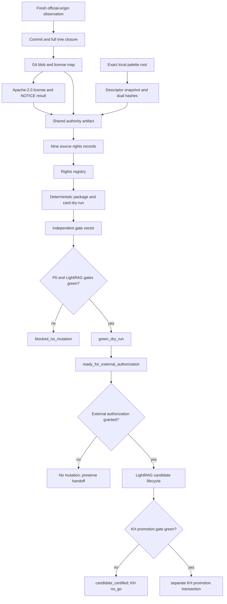

# feat: Add HyperFrames Governed Rights Evidence

## Summary

Add a hash-bound Git-license authority chain for the nine HyperFrames palette
documents, strengthen runtime-capability validation, and produce a deterministic
governed P0 dry-run. This establishes a rights-eligible corpus without treating
that result as authorization for LightRAG mutation or Knowledge Hub promotion.

---

## Problem Frame

The Seedance candidate proved the current governed adapter and failed closed,
but none of its 21 sources has sufficient rights evidence. A read-only corpus
survey found no existing candidate that already satisfies the governed rights
schema. The HyperFrames palette directory is the strongest bounded candidate:
it contains exactly nine Markdown files, and each local byte sequence matches
the corresponding Git blob in public upstream commit
`2935be6bf66d12f41ac768d841d567323b547357`.

The upstream tree carries an Apache-2.0 `LICENSE` and no `NOTICE` file. Apache
2.0 grants reproduction and preparation of derivative works subject to its
conditions, but a local license copy and self-asserted booleans are not enough
for this adapter. The rollout needs one authority artifact that binds the
repository, commit, tree, license blob, license bytes, source paths, source
blobs, source SHA-256 values, and the subject-bound deterministic policy
decision. Each per-source rights record must then bind to that authority
artifact.

The deployed LightRAG and Knowledge Hub services remain separate blockers.
LightRAG does not expose authoritative payload SHA-256 lookup or service-side
single-use fencing. Knowledge Hub imports rows before directly rewriting
manifests and exposes no candidate swap, lease, gate-close, or typed restart
contract. DanteDash can certify these absences and refuse writes; it cannot add
non-bypassable guarantees to those services from this repository.

---

## Requirements

### Source identity and authority

- R1. The policy must cover exactly the nine files under the pinned upstream
  `skills/hyperframes/palettes/` tree, with no unlisted runtime file.
- R2. Every local source must match both the recorded SHA-256 and the Git blob
  SHA-1 from upstream commit `2935be6bf66d12f41ac768d841d567323b547357`.
- R3. One shared authority artifact must bind the official repository URL,
  upstream commit and tree, Apache-2.0 license identity, license blob, exact
  license bytes, and all nine source bindings. Official repository identity and
  the automated adjudication policy must come from a subject-bound trust-root
  registry that is reviewed with the implementation, not from generated
  authority evidence.
- R4. Every eligible source must reference one source-specific rights record
  and the shared authority artifact by safe relative path and SHA-256.
- R5. The validator must reject missing, malformed, symlinked, stale, escaped,
  or field-mismatched authority and license evidence before declaring a source
  eligible. Every path component must be traversed from a trusted root
  descriptor with no-follow semantics; terminal-only pathname checks are
  insufficient.

### Rights and artifact safety

- R6. The adjudication must distinguish local embedding, derived summaries,
  provider disclosure, attribution, and trademark limits without presenting
  the result as legal advice. It must also make a source-specific license
  coverage determination after checking the source file and every path ancestor
  for more-specific or contrary license, copyright, SPDX, or notice metadata.
- R7. Generated cards must contain only independently authored metadata,
  stable identities, hashes, topics, and relationships; source bodies must not
  enter committed or public artifacts.
- R8. The repository may contain the exact public license text and bounded
  evidence metadata, but not the nine source documents or a private source-root
  path.
- R9. Existing rights-unknown manifests must remain valid and blocked; the new
  authority requirement must not silently promote legacy `clear` labels.

### Capability and terminal-state truth

- R10. Runtime validation must check all required LightRAG and Knowledge Hub
  controls, their evidence pointers, decision consistency, observation
  freshness, service fingerprints, and executable-revision binding.
- R11. A route advertised by OpenAPI, a content-derived MD5, loopback access,
  or a local client guard must never satisfy server-side payload, fencing,
  atomicity, lease, closure, or restart capabilities.
- R12. The dry-run must report the rights gate independently from value,
  budget, LightRAG, and Knowledge Hub gates. Rights eligibility does not imply
  mutation readiness.
- R13. A missing LightRAG mutation guarantee must yield P0
  `blocked_no_mutation` with zero provider calls, source writes, datastore
  writes, gate opens, or imports. A missing Knowledge Hub guarantee must leave
  the KH gate `no_go` without rewriting an otherwise truthful P0 result or a
  later LightRAG `candidate_certified` result; the full goal remains incomplete
  until KH is `promoted`.

### Verification and delivery

- R14. Two fresh run IDs over identical inputs must produce byte-identical
  run-independent artifacts and matching aggregate digests. The canonical
  comparison must enumerate the only allowed run-local fields, preserve the
  first run immutably, reject missing or extra artifacts, and exclude no field
  merely because it differs.
- R15. Tests must cover the green authority path, every trust-boundary failure,
  Seedance backward compatibility, capability-decision contradictions, and
  public-artifact leakage.
- R16. The final evidence must include the exact implementation revision,
  manifest hashes, run digests, blocker set, test results, report, draft PR
  state, and the next sequential canonical-workspace snapshot. Because this
  worktree does not contain the user-owned 005-035 snapshot chain, that snapshot
  is an external post-carrier handoff artifact and must not rewrite the branch's
  stale snapshot pointers.
- R17. Source validation and downstream analysis must consume one immutable
  descriptor-backed byte snapshot acquired through root-anchored directory
  descriptors; a validated path or ancestor must not be reopened as a new
  source of truth later in the run.
- R18. The policy manifest must be the completion record for one evidence
  generation and hash-bind every authority, license, rights, capability, and
  holdout input. Partial, extra, or mixed-generation evidence must block.
- R19. Capability observations must come from one coherent service epoch whose
  mandatory server-issued boot, instance, or deployment identity and OpenAPI
  fingerprint are unchanged before and after collection. If a service exposes
  no stable epoch identifier, positive availability is unprovable and the gate
  remains blocked.
- R20. Certification is canonical. Reports, PR text, and snapshots are derived
  views and cannot independently open or upgrade a gate.
- R21. Official-upstream membership must be proven through a fresh read-only
  observation of the allowlisted HTTPS origin and a complete Git object
  closure from commit to root tree, intermediate subtree entries, source blobs,
  and license blob. Absence of `NOTICE` must be proven by that same pinned tree
  traversal, not by a local directory listing.
- R22. Capability evidence must declare one of three proof levels:
  `discovered`, `observed`, or `deployment_bound`. Route/schema discovery and
  client-side observations may report absence or risk, but only fresh
  deployment-bound semantic evidence may satisfy an `available` capability.
  The P0 slice accepts version 1 only as fail-closed legacy input and produces a
  generic version 2 negative audit; it does not implement a positive
  `deployment_bound` transition. Positive availability requires a
  service-signed attestation and is deferred to the owning service work.
- R23. Certification must bind `subject_revision`, the reviewed executable
  implementation and exact executable-tree digest under test. The digest is the
  stable hash of the sorted path-to-SHA-256 map for every subject-tracked
  `backend/app/**/*.py` file, `backend/pyproject.toml`, `backend/uv.lock`, and
  the production-profile and governed-rights-trust-root manifests. A
  post-commit delivery envelope separately records `carrier_revision`. The
  certification does not self-bind its
  containing commit. Carrier changes are limited to the exact generated policy,
  capability, HyperFrames evidence, report, and runbook paths named below;
  policy/capability files remain hash-bound decision inputs even though they are
  non-executable.
- R24. Machine output must expose an explicit gate vector for inventory,
  rights, value, budget, legacy reconciliation, dependency closure, leak scan,
  LightRAG mutation, and Knowledge Hub promotion. Aggregation rules and blocker
  ownership are normative: one gate's failure cannot rewrite another gate's
  truthful state.
- R25. Gate outcomes and terminal states must be recomputed from validated raw
  evidence on every run. This P0 slice implements no decision cache. A future
  cache is out of scope and cannot be introduced without a separate contract.
- R26. Reviewer authority and official-upstream membership are independent
  controls. For this fully automatic slice, `reviewer_id` identifies a
  deterministic adjudication policy from the subject-bound trust-root registry;
  the validator recomputes its decision and never trusts a carrier assertion.
  Human/manual approvals are unsupported and remain blocked unless a future
  detached signature is verified against a separately governed key registry.
- R27. The stage contract must freeze exact membership: one named representative
  source, four named additions for the five-source stage, a named topic cluster
  with at least one new member after stage five, and a nonempty declared
  remaining-corpus set. A count alone is insufficient.
- R28. Before U1 implementation begins, a read-only value preflight must name
  the HyperFrames palette-selection workflow, freeze representative retrieval
  questions and the existing-system baseline, and record the zero-call P0 cost
  plus a bounded future-P1 estimate. If the corpus does not close a verified
  operator gap, stop without building corpus-specific rights evidence.

---

## Key Technical Decisions

- KTD1. **Use the palette directory as the whole runtime root.** It has nine
  Markdown files and no extra files, so the existing exact-inventory contract
  can remain strict without copying source content into DanteDash or relaxing
  `allow_unlisted_files=false`.
- KTD2. **Add a shared Git-license authority artifact.** Per-source rights JSON
  remains the eligibility record, while a separately hash-bound authority file
  records the common upstream repository, revision, tree, license, and blob map.
  It becomes proof only when a separate read-only producer has freshly observed
  the allowlisted official origin and the validator has recomputed the full
  commit-to-tree-to-blob closure. This avoids duplicating authority metadata
  nine times without treating an internally consistent JSON assertion as a
  trust anchor.
- KTD3. **Verify Git blob identity locally during the dry-run.** SHA-256 binds
  DanteDash inventory and Git blob SHA-1 binds the exact upstream tree entry.
  Both must match the same descriptor-backed source bytes, while the freshly
  observed official commit, root tree, intermediate subtree entries, license
  blob, and `NOTICE` result close the membership chain. No single hash
  substitutes for the others.
- KTD4. **Preserve the Apache conditions in the evidence layer.** The authority
  bundle carries the exact license copy and records that the pinned tree has no
  `NOTICE`. Each source and its ancestor path are checked for contrary or
  narrower file-level terms before the deterministic Apache policy covers it.
  Generated metadata keeps origin and license attribution, and it does not
  claim trademark rights.
- KTD5. **Separate rights eligibility from rollout readiness.** A green rights
  phase may coexist with blocked value, budget, LightRAG, or Knowledge Hub
  phases. The zero-call P0 aggregation requires inventory, rights, value,
  legacy, dependency, leak, and LightRAG gates. Budget gates later external
  processing, and KH independently gates promotion. Neither may rewrite a
  truthful P0 result, while the full goal remains incomplete until KH is
  `promoted`.
- KTD6. **Do not build a DanteDash-only mutation proxy.** A proxy would be
  bypassable by direct calls to the deployed services. Payload identity,
  fencing, candidate swap, leases, closure, and replay protection must be
  enforced by canonical service APIs or a mandatory non-bypassable gateway.
- KTD7. **Bind runtime evidence to a stable implementation revision.** The
  capability and dry-run artifacts are generated after feature code is stable,
  then carried by a separate evidence revision so the recorded executable
  revision is not self-referential.
- KTD8. **Snapshot source bytes once.** The adapter opens each allowlisted file
  without following links, verifies descriptor metadata, reads one byte
  snapshot, and derives size, SHA-256, Git blob, and leak-analysis input from
  that snapshot. A path replacement after acquisition cannot alter card or
  evidence inputs, and final path reconciliation still detects drift.
- KTD9. **Publish evidence as one generation.** Authority, license, rights,
  capability, and holdout files are materialized first; the policy manifest is
  completed last and hash-binds the full set. Certification rejects missing,
  extra, or cross-generation inputs.
- KTD10. **Treat runtime evidence as an epoch, not a collection of probes.**
  Service identity, version, executable fingerprint, and OpenAPI hash bracket
  all observations. A stable server-issued epoch is mandatory; absence,
  restart, or identity change invalidates positive proof for the whole bundle.
- KTD11. **Use explicit capability proof levels.** A generic version 2 runtime
  manifest separates route discovery, observed behavior, and
  deployment-bound semantic proof. This P0 implementation produces only
  discovery/observation and negative decisions. It rejects self-declared
  positive availability; support for service-signed semantic proof belongs to
  the canonical LightRAG/KH services.
- KTD12. **Separate subject and carrier revisions.** The reviewed implementation
  commit and executable-tree digest are the certification subject. Fresh
  authority/capability observations and dry-run evidence may be committed
  later by a carrier whose diff is mechanically constrained to allowlisted
  non-executable evidence and report paths. The carrier SHA is recorded only by
  the external delivery envelope after commit; no file claims the SHA of the
  commit that contains itself. Snapshot 036 or later is created only in the
  canonical workspace after carrier delivery and is reconciled before the final
  user handoff, not committed through this stale worktree.
- KTD13. **Publish a gate vector, not a global boolean.** Each gate owns its
  status, blockers, evidence, and downstream permission. P0, LightRAG candidate,
  KH promotion, and full-goal states are derived by a documented matrix; the
  off-repository handoff state is `ready_for_external_authorization`, never an
  implicit execute permission.
- KTD14. **Make determinism an executable contract.** The certification defines
  the run-local field allowlist, canonical artifact set, canonical JSON
  encoding, per-artifact digest, and aggregate digest. Distinct run roots are
  compared without editing the first run.
- KTD15. **Always recompute decisions.** The adapter may reuse immutable raw
  bytes only by content address, but it revalidates every signature/schema/hash/
  freshness/revision/epoch binding and recomputes the gate vector and terminal
  state on every run. Resolved gate outcomes are never cached.
- KTD16. **Prove operator value before corpus-specific engineering.** The
  palette corpus targets grounded palette selection in HyperFrames authoring.
  A bounded read-only baseline and four frozen questions decide whether that
  gap exists before U1 starts; rights tractability alone is not selection value.

---

## High-Level Technical Design

The current expected branch is P0 `blocked_no_mutation`: the rights gate may
become green, while the fresh negative LightRAG audit keeps mutation blocked and
the independent KH gate remains `no_go`.

---

## Phase 0 Value Preflight

Before corpus-specific implementation, freeze a read-only baseline for the
operator workflow **select a reusable, grounded color palette while authoring a
HyperFrames composition**. The baseline uses the existing search surfaces only;
it does not ingest, call a provider, or mutate a datastore.

| Query ID | Frozen operator question | Required grounded answer shape |
| --- | --- | --- |
| `palette-dark-premium` | Which reusable palette fits a premium dark product composition? | Named palette, role-level qualitative guidance, and stable source ID |
| `palette-clean-corporate` | Which palette fits a restrained corporate explainer? | Named palette, contrast guidance, and stable source ID |
| `palette-neon-energy` | Which palette supports energetic neon motion graphics? | Named palette, neon/dark-base guidance, and stable source ID |
| `palette-natural-earth` | Which palette supports a grounded nature or sustainability piece? | Named palette, earth-tone/readability guidance, and stable source ID |

Record the existing top-five results, whether each answer shape is satisfied,
the exact query/evidence hashes, and a zero-provider-call P0 cost. U1 may start
only if at least two questions lack a grounded reusable palette in the existing
system and the local nine-file corpus can answer all four from independently
authored metadata. Future P1 cost remains a separate blocked budget gate until a
real provider estimate and ceiling are authorized.

---

## Implementation Units

### U1. Git-License Authority Contract

- **Goal:** Make rights eligibility depend on an exact, reusable authority
  chain rather than self-asserted predicates.
- **Dependencies:** Phase 0 value preflight green. This unit establishes the
  source and evidence trust boundary consumed by every later unit.
- **Requirements:** R2-R6, R9, R15, R17-R18, R21, R26, R28.
- **Files:**
  - `backend/app/governed_authority_evidence.py`
  - `backend/app/governed_corpus_rollout.py`
  - `backend/app/dante_visual/manifests/governed_rights_trust_roots.v1.json`
  - `backend/tests/test_governed_authority_evidence.py`
  - `backend/tests/test_governed_corpus_rollout.py`
- **Approach:** Add a read-only producer and a separate validator for a
  versioned Git-license authority schema. The subject-bound trust registry
  allowlists `https://github.com/heygen-com/hyperframes` and the deterministic
  Apache-2.0 adjudication policy; generated evidence cannot alter either. The
  producer uses an injected `httpx.Client` against exact
  `https://api.github.com/repos/heygen-com/hyperframes/git/*` endpoints, with
  TLS verification on, redirects off, 10-second connect/read timeouts, a 2 MiB
  JSON response cap, a 1 MiB blob cap, maximum tree depth 8, and maximum 256
  observed objects. It fetches the commit and each required tree non-recursively,
  verifies every returned object ID locally, and publishes nothing on HTTP,
  rate-limit, shape, size, or partial-closure failure. Authentication headers
  and fetched source bodies are never persisted. The validator independently
  recomputes Git blob SHA-1 as
  `sha1(b"blob " + decimal_length + b"\\0" + bytes)`, verifies the full object
  closure, validates exact schemas with no unknown fields, and reruns the
  subject-bound policy instead of trusting `reviewer_id`. That policy checks
  the source plus every ancestor entry for more-specific or contrary SPDX,
  license, copyright, and notice metadata; unresolved coverage blocks the
  source. Evidence and source paths are acquired through one root-anchored
  dirfd/openat-style API: each directory component and the terminal regular
  file is opened relative to its trusted parent with no-follow semantics, then
  immutable bytes—not a `Path`—flow to JSON parsing, hashing, card generation,
  and leak analysis. Unknown or blocked legacy sources remain valid and
  ineligible without new authority fields.
- **Patterns to follow:** Preserve blocker and schema compatibility with
  `_resolve_hash_bound_file`, `_rights_evidence_blockers`, and
  `_freeze_inventory`, but do not reuse their pathname reopening as the trust
  primitive. Reuse the descriptor/fstat invariants from
  `backend/app/docling_black_label_package.py` and the value-evidence manifest
  chain in `backend/app/governed_corpus_rollout.py`.
- **Test scenarios:**
  - **Global failures:** missing authority or license; malformed or extraneous
    fields; path escape; intermediate or terminal symlink; ancestor-directory
    rename/swap; non-regular file;
    unsupported repository; official-origin observation missing/stale;
    repository, commit, root-tree, subtree, license-blob, or license-byte
    mismatch; `NOTICE` claim not closed by the pinned tree; duplicate, missing,
    or extra source binding; generated trust-root substitution; unknown policy
    engine; unsigned manual reviewer assertion; contrary path/file license; or
    unresolved source-specific coverage. Each global failure blocks all nine
    eligible claims without deleting inventory rows.
  - **Source-specific failures:** source path, size, SHA-256, Git blob, rights
    hash, authority hash, or adjudicated-use mismatch blocks the affected row
    and the aggregate rights gate while preserving the full inventory.
  - A recomputed, internally consistent authority bundle built from forged local
    Git objects fails because it lacks a fresh official-origin observation.
  - Concurrent rename, symlink swap, same-path replacement, or descriptor
    metadata change of either a terminal file or ancestor directory cannot
    substitute bytes after acquisition; synchronization hooks make the race
    deterministic in tests.
  - A Seedance-style unknown source and a legacy `clear` source remain
    structurally valid and ineligible; neither is silently promoted.
  - Every failure asserts the rights gate, P0 terminal state, zero downstream
    apply rows, and zero external or datastore side effects.
- **Verification:** The rights phase is green only when every declared eligible
  row resolves through the exact official-origin and subject-policy chains,
  and all failure fixtures produce stable blocker codes.

### U2. Runtime Capability Proof Hardening

- **Goal:** Produce a fresh, exact P0 no-go audit and independent gate vector
  without building a client-side substitute for missing P1 service controls.
- **Dependencies:** U1. U2 deliberately follows U1 because both touch the core
  adapter and shared test file; they are not parallel edit units.
- **Requirements:** R10-R15, R19-R20, R22-R25.
- **Files:**
  - `backend/app/runtime_capability_evidence.py`
  - `backend/app/governed_corpus_rollout.py`
  - `backend/tests/test_runtime_capability_evidence.py`
  - `backend/tests/test_governed_corpus_rollout.py`
- **Approach:** Introduce the generic
  `dantedash.governed_runtime_capabilities.v2` schema and preserve version 1
  parsing only as fail-closed legacy input. A read-only producer brackets every
  probe with service identity, mandatory server-issued epoch when available,
  reported version, OpenAPI SHA-256, and executable-source fingerprint. If the
  epoch is absent or changes, the corresponding required control is unavailable.
  The validator
  distinguishes `discovered`, `observed`, and `deployment_bound` proof levels;
  this slice permits only the first two as negative evidence and rejects any
  self-declared `available`/`deployment_bound` row. A future positive transition
  requires a service-signed attestation containing capability/semantics version,
  canonical service identity, executable digest, boot epoch, nonce, issued-at,
  expiry, and key ID verified against an owning-service trust root. It validates
  the exact LightRAG IDs
  `lightrag.legacy_identity_reconciliation`,
  `lightrag.authoritative_payload_hash_lookup`, and
  `lightrag.service_enforced_fencing`, plus the exact KH IDs
  `knowledge_hub.atomic_import`, `knowledge_hub.single_use_capability`,
  `knowledge_hub.watchdog_or_lease_ttl`, `knowledge_hub.gate_close`, and
  `knowledge_hub.restart`. It emits the independent gate vector and canonical
  run digest, and recomputes all decisions from evidence on every invocation.
  LightRAG MD5 identity remains a reconciliation hint only.
- **Patterns to follow:** `REQUIRED_LIGHTRAG_CAPABILITY_PROOFS`,
  `_validate_runtime_capabilities`, and `_capability_gate_blockers` in
  `backend/app/governed_corpus_rollout.py`.
- **Test scenarios:**
  - Each exact required capability fails alone and in mixed combinations; the
    affected LightRAG or KH gate changes without rewriting unrelated gates.
  - Status, scope, blocking flag, proof level, or decision contradictions;
    unresolved, cross-scope, duplicate, or extra evidence pointers; and
    incomplete or extra decision-blocker sets are rejected.
  - Route presence, loopback access, content-derived MD5, and local guards are
    accepted only as discovery/negative evidence and never as semantic proof.
  - Freshness boundary, future timestamp, service restart, process identity,
    OpenAPI, version, canonical-source, subject revision, or executable-tree
    drift invalidates the complete epoch.
  - A fake loopback service, replayed/expired observation, absent epoch,
    self-declared proof level, or unsupported positive row remains blocked.
  - Omitted or unknown gates, a reused resolved decision, or an executable
    change in a carrier revision fail closed; gate decisions are recomputed.
  - Pure terminal-aggregation tests prove that a hypothetical
    LightRAG-green/KH-`no_go` vector resolves to P0 `green_dry_run` and may later
    resolve to `candidate_certified`, but the runtime v2 validator in this slice
    cannot manufacture that positive vector.
  - Two distinct run IDs and roots preserve run one immutably, permit changes
    only in the enumerated run-local fields, and produce the same canonical
    artifact and aggregate digests. Missing or extra artifacts fail.
  - Every scenario asserts the exact gate, terminal state, downstream apply
    permission, and zero side effects.
- **Verification:** Both live mutation surfaces remain truthfully blocked by
  fresh negative evidence; the validator rejects every client-manufactured
  positive proof, while the pure terminal matrix remains consistent for every
  single-gate and mixed-gate fixture.

### U3. HyperFrames Palette Policy and Evidence

- **Goal:** Freeze the nine-source corpus, authority bundle, per-source rights
  records, independent metadata, holdout, and current no-go capability state.
- **Dependencies:** Phase 0 and U1 are sufficient to certify the independent
  rights sub-gate. Completing the whole P0 policy generation additionally
  requires the reduced negative U2 audit and a reviewed subject revision. Final
  origin/capability evidence is collected against that subject; the policy is
  written last.
- **Requirements:** R1-R9, R12-R19, R21-R28.
- **Files:**
  - `backend/app/dante_visual/manifests/hyperframes_palettes_corpus_20260808.v1.json`
  - `backend/app/dante_visual/manifests/governed_runtime_capabilities_20260808.v2.json`
  - `backend/app/dante_visual/manifests/evidence/hyperframes-palettes/authority.json`
  - `backend/app/dante_visual/manifests/evidence/hyperframes-palettes/origin-observation.json`
  - `backend/app/dante_visual/manifests/evidence/hyperframes-palettes/LICENSE`
  - `backend/app/dante_visual/manifests/evidence/hyperframes-palettes/value-baseline.json`
  - `backend/app/dante_visual/manifests/evidence/hyperframes-palettes/holdout.json`
  - `backend/app/dante_visual/manifests/evidence/hyperframes-palettes/rights-*.json`
  - `backend/tests/test_governed_corpus_rollout.py` (manifest invariants are
    authored before the subject freeze and rerun against the final generation)
- **Approach:** Record all nine source SHA-256 and Git blob identities, stable
  IDs, card roles, topics, risks, and independently authored summaries. The
  shared authority artifact binds the freshly observed official commit and its
  complete tree closure. The holdout is frozen before card generation. The
  exact stages are: `clean-corporate.md` for stage one; add
  `bold-energetic.md`, `dark-premium.md`, `pastel-soft.md`, and
  `warm-editorial.md` for stage five; use the `chromatic-expression` cluster
  `{bold-energetic.md, jewel-rich.md, neon-electric.md, pastel-soft.md}`; and
  leave `{monochrome.md, nature-earth.md}` as the nonempty remaining set.
  Origin observation, license, authority, rights, Phase 0 value baseline,
  holdout, and generic capability evidence are materialized first; the policy
  completion record hash-binds every one of them and is written last. It rejects
  any partial, mixed, or extra generation member. The local P0 value gate is
  green only when the frozen Phase 0 threshold passes; the paid-mutation budget
  remains blocked. Current service capabilities remain truthfully no-go without
  weakening the independently green rights result.
- **Patterns to follow:**
  `backend/app/dante_visual/manifests/seedance_i2v_corpus_20260808.v1.json` and
  the fixture evidence builders in
  `backend/tests/test_governed_corpus_rollout.py`.
- **Test scenarios:**
  - The runtime directory contains exactly the nine manifest paths and matches
    counts, sizes, SHA-256 values, and inventory digest.
  - Every eligible source resolves one rights record and the same authority
    artifact.
  - Curated metadata and holdout prompts do not reuse source bodies.
  - The policy declares the exact one, five, topic-cluster, and remaining sets
    above, with at least one cluster member new after stage five.
  - Partial publication, an extra unbound file, or mixed old/new rights records
    cannot produce a usable policy generation.
- **Verification:** Manifest-invariant tests resolve nine verified inventory
  rows and nine rights-eligible rows from the completed policy generation
  without embedding a source body or absolute path. End-to-end two-run dry-run
  verification belongs exclusively to U4.

### U4. Deterministic Dry-Run and Evidence Delivery

- **Goal:** Execute, review, and preserve the strongest truthful state available
  without mutating LightRAG or Knowledge Hub.
- **Dependencies:** U1-U3 complete; the subject revision independently
  simplified, reviewed, tested, and committed; fresh origin and runtime
  evidence bound to that subject; final policy generation complete.
- **Requirements:** R12-R16, R18-R20, R23-R25.
- **Files:**
  - `backend/app/dante_visual/manifests/governed_runtime_capabilities_20260808.v2.json`
  - `docs/reports/2026-08-08-hyperframes-palettes-governed-rollout.md`
  - `docs/runbooks/governed-corpus-rollout.md`
  - Canonical workspace only, outside the carrier:
    `/Users/vidigal/codex/dantedash/snapshots/DEEP_MEMORY_DANTEDASH_NNN.md`,
    `snapshots/LATEST.md`, and `snapshots/index.md`
- **Approach:** Run two fresh immutable dry-runs against the exact runtime root,
  compare the normative canonical artifact set, scan generated output for
  source-body and path leaks, and record all hashes and phase outcomes. The
  first run is never edited by the comparison. Preserve LightRAG P1 and KH
  promotion as independently `no_go` while their server-side guarantees are
  absent. Complete LFG simplification, code review, tests, browser smoke when a
  UI-visible surface changes, push, draft-PR, report, and snapshot without
  claiming CI checks the repository does not expose. Certification is the
  canonical record. The carrier diff is mechanically checked against the
  allowlist and every branch-derived view is reconciled to certification. The
  sequential snapshot is created through the canonical workspace protocol only
  after the carrier is pushed; it must agree before final user handoff, but it
  is not imported into this branch's stale snapshot chain.
- **Patterns to follow:**
  `docs/reports/2026-08-08-seedance-i2v-governed-rollout.md`,
  `docs/runbooks/governed-corpus-rollout.md`, and the workspace snapshot
  protocol.
- **Test scenarios:**
  - Two fresh runs have identical run-independent bytes and aggregate digest.
  - Generated output contains zero private absolute paths, raw source bodies,
    credentials, provider payloads, or public leak markers.
  - Certification reports nine rights-eligible sources while separately naming
    every unresolved value, budget, LightRAG, and Knowledge Hub blocker.
  - Provider calls and all mutation counters remain zero.
  - A report or PR summary that disagrees with certification blocks carrier
    delivery. A canonical-workspace snapshot disagreement blocks final user
    handoff; none of these derived views can upgrade machine state.
  - Subject/carrier mismatch or a carrier change outside the allowlist blocks
    delivery, even when generated evidence is otherwise green.
- **Verification:** The report links the exact subject revision, policy,
  authority, capability, certification, and run digests. The post-commit
  delivery envelope records the carrier revision and allowlist proof, and the
  next sequential snapshot preserves the same terminal state and next safe
  step without being used as an executable trust input.

### Subject and Carrier Boundary

The subject digest covers the exact R23 set and is recomputed from the subject
Git tree, not the working tree. Tests are reviewed and committed with the
subject even though they are not production executable inputs. After the
subject commit, the carrier may change only:

- `backend/app/dante_visual/manifests/hyperframes_palettes_corpus_20260808.v1.json`
- `backend/app/dante_visual/manifests/governed_runtime_capabilities_20260808.v2.json`
- `backend/app/dante_visual/manifests/evidence/hyperframes-palettes/**`
- `docs/reports/2026-08-08-hyperframes-palettes-governed-rollout.md`
- `docs/runbooks/governed-corpus-rollout.md`

The carrier validator rejects deleted, renamed, symlinked, or extra paths and
any modification under `backend/app/**/*.py`, `backend/tests/**`, dependency
files, the production profile, or the subject-bound trust registry. Generated
policy and capability manifests are non-executable but remain semantic decision
inputs: they require schema/invariant review and their hashes are bound by the
canonical certification.

### Canonical Determinism Contract

The comparator requires this exact 17-artifact basename set; missing or extra
members fail before comparison:

| Artifact | Only allowed run-local normalization |
| --- | --- |
| `black-label-asset-registry.jsonl` | none |
| `black-label-card-manifest.jsonl` | none |
| `black-label-certification.json` | `/run_id`, `/source_run` |
| `black-label-eval-suite.jsonl` | none |
| `cag-pack-candidates.jsonl` | none |
| `cag-pack-manifest.jsonl` | none |
| `docling-normalized-output.jsonl` | none |
| `docling-pdf-page-image-crosswalk.jsonl` | none |
| `governed-rights-registry.jsonl` | none |
| `governed-source-inventory.jsonl` | none |
| `kh-multimodal-apply-plan.jsonl` | none |
| `lightrag-card-apply-plan.jsonl` | none |
| `p0-p8-certification.json` | `/run_id` |
| `package-crosswalk.jsonl` | none |
| `phase-ledger.json` | `/run_id` |
| `report.md` | exact `- Run id: \`<run-id>\`` line only |
| `visual-enrichment-queue.jsonl` | none |

JSON objects are parsed, normalized only at the listed pointers, and serialized
with sorted keys, `ensure_ascii=true`, UTF-8, and compact separators. JSONL
preserves row order and applies the same encoding per row with one trailing LF.
The Markdown report preserves every byte except the single anchored run-ID line.
Each normalized artifact receives SHA-256; the aggregate is
`p0p8.stable_hash()` over the sorted basename-to-SHA-256 mapping. The comparator
records run-one hashes before reading run two and verifies run one again after
comparison, so it cannot normalize by editing either run directory.

### Execution Lifecycle

1. Run and freeze Phase 0. Stop if its value threshold fails. If green,
   implement U1 and the reduced negative U2 slice, including fixture tests,
   gate aggregation, and canonicalization. Add U3 manifest-invariant tests
   before freezing the executable subject.
2. Simplify, independently review, and run the complete relevant test suite.
   Commit the reviewed implementation as `subject_revision`; record its exact
   executable-tree digest.
3. Run the read-only official-origin and runtime-capability producers against
   that subject. Materialize the U3 generation and write its policy last.
4. Run the exact policy tests, then execute two fresh dry-runs with distinct run
   IDs and roots. Compare the canonical artifact set without changing run one.
5. Generate the report from certification, mechanically verify the carrier
   allowlist, commit and push the carrier, then record its SHA in the external
   PR/handoff envelope. In the canonical workspace, create the next real
   sequential snapshot from the final evidence and reconcile its terminal state
   before final user handoff; do not copy stale worktree snapshot pointers into
   the carrier. No step may mutate LightRAG or KH while its corresponding gate
   is blocked.

### Terminal-State Matrix

| P0 prerequisite vector | LightRAG mutation | LightRAG candidate | KH promotion | Resolved state |
| --- | --- | --- | --- | --- |
| Any P0 prerequisite blocked | blocked | not started | no-go or not started | `blocked_no_mutation` |
| All P0 prerequisites green | allowed | not started | no-go | `green_dry_run`; full goal incomplete |
| All P0 prerequisites green | completed and certified | certified | no-go | `candidate_certified`; full goal incomplete |
| All P0 prerequisites green | completed and certified | certified | promoted and verified | `promoted`; full goal may complete |

`Knowledge Hub=no_go` never downgrades a truthful P0 or LightRAG candidate
result. It prevents only promotion and full-goal completion.

### Acceptance Examples

- AE1 (R1-R9, R17-R18, R21, R26; U1/U3): all nine complete official-origin,
  source-specific license-coverage, and subject-policy chains make the rights
  gate green while budget or service gates keep their own statuses.
- AE2 (R3-R5, R18, R21; U1): shared authority, license, root-tree, or origin
  drift—or substitution of a carrier-generated trust root—blocks all nine
  eligible claims and leaves all inventory rows visible.
- AE3 (R2, R4-R5, R17; U1): one source-specific byte or binding drift blocks
  that row and the aggregate rights gate without erasing unrelated rows.
- AE4 (R9, R15; U1): legacy unknown and legacy `clear` inputs remain valid but
  ineligible under the new schema.
- AE5 (R10-R13, R22, R24; U2): LightRAG green with KH `no_go` resolves to
  `green_dry_run`; after certified LightRAG apply it resolves to
  `candidate_certified`, never `promoted`.
- AE6 (R14, R20, R23-R25; U2/U4): two fresh run IDs and roots produce equal
  canonical digests, the first run remains immutable, resolved decisions are
  recomputed, and a reused decision or derived-report mismatch fails delivery.
- AE7 (R7-R8, R15, R20; U1/U3/U4): leak sentinels, private absolute paths,
  credentials, provider payloads, and source bodies remain absent from every
  public artifact.
- AE8 (R22-R24; U2): omitted/unknown gates, forged proof levels, executable
  drift, or an out-of-allowlist carrier change blocks without altering another
  gate's truthful evidence.
- AE9 (R28; Phase 0): fewer than two baseline retrieval gaps stops before U1;
  otherwise the hash-bound four-query baseline and zero-call cost evidence
  enter the policy generation.

### Requirement Traceability

| Requirements | Owning units | Primary verification |
| --- | --- | --- |
| R1, R7-R8, R27 | U3 | Exact nine-source and exact stage-set manifest invariants; leak scan |
| R2-R6, R9, R17, R21, R26 | U1 | Authority producer/validator trust-boundary tests |
| R10-R13, R19, R22, R24 | U2 | Capability proof-level, epoch, gate-vector, and terminal-matrix tests |
| R14, R20, R23, R25 | U2, U4 | Canonical two-run comparison, subject/carrier proof, unconditional recomputation |
| R15 | U1-U4 | Green path plus global, source-specific, mixed-gate, and leak failures |
| R16, R18 | U3, U4 | Policy-last generation, certification reconciliation, report and snapshot |
| R28 | Phase 0, U3 | Four-query read-only baseline, threshold, cost, and policy hash binding |

---

## System-Wide Impact

- **Governed policy consumers:** Eligible sources gain a stricter authority
  chain. Unknown and blocked sources preserve their current fail-closed path.
- **Source workspace:** The external HyperFrames files remain read-only and are
  never copied into the corpus package. Only their public license is preserved
  as evidence.
- **LightRAG:** No mutation request is sent. The deployed service remains the
  authority for payload identity and fencing capability.
- **Knowledge Hub:** Import remains disabled and read-only. No gate is opened,
  and the active graph is not replaced or reindexed.
- **Operators and agents:** Machine output distinguishes rights eligibility from
  P0 terminal readiness and P1 authorization, avoiding a single ambiguous
  `clear` label.

---

## Scope Boundaries

### Included

- Exact HyperFrames palette inventory and upstream blob verification.
- Hash-bound Apache-2.0 authority evidence and per-source rights records.
- Reduced negative runtime-capability audit and deterministic P0 evidence.
- Tests, report, runbook update, LFG delivery, and canonical-workspace
  sequential snapshot.

### Deferred to external service work

- LightRAG authoritative payload SHA-256 lookup, durable single-use fencing,
  receipts, and settlement APIs.
- Knowledge Hub immutable candidate generations, atomic active-pointer swap,
  single-use promotion authorization, lease/watchdog, closure, and typed
  restart supervision.
- Service-signed positive capability attestations, owning-service trust roots,
  and mandatory boot/deployment epochs.
- Detached human-review signatures and key lifecycle, if a future corpus cannot
  use the reviewed deterministic license policy.
- Paid provider preflight, staged one/five/topic/full mutation, candidate
  certification, and native promotion after those controls are deployed.

### Excluded

- Editing installed `site-packages`, the dirty canonical Knowledge Hub checkout,
  the HyperFrames source workspace, or the active LightRAG datastore.
- Treating a local proxy, OpenAPI route, MD5 document ID, copied license, or old
  `rights_status=clear` value as sufficient proof.
- Caching resolved gate decisions or implementing positive service capability
  semantics in a DanteDash-only client.
- Direct database, Qdrant, GraphML, manifest, or source-file repair.

---

## Risks and Dependencies

- **License interpretation:** This is an evidence-sufficiency decision, not
  legal advice. Mitigation: bind the exact license and source bytes, preserve
  attribution and license conditions, and avoid trademark claims.
- **Upstream drift:** HyperFrames continues to change. Mitigation: bind the
  policy to one immutable commit and refuse byte drift instead of following
  `main`.
- **Authority overstatement:** A hand-authored JSON could merely restate a
  conclusion. Mitigation: keep official repository and deterministic policy
  roots in the reviewed subject, freshly observe the official origin, close the
  Git object graph, check file-specific license coverage, and hash-bind every
  generated artifact without accepting unsigned manual assertions.
- **Stale runtime evidence:** A once-valid capability audit can age or refer to
  another executable revision. Mitigation: enforce freshness and provenance
  bindings, then regenerate evidence after implementation stabilizes.
- **External P1 blockers:** Required controls are absent from deployed services,
  and the canonical Knowledge Hub checkout is not provenance-clean. Mitigation:
  stop before credentials, provider traffic, checkpoint work, or mutation and
  record the external dependency explicitly.
- **PR lineage:** The existing draft PR inherits a large predecessor branch and
  the repository exposes no CI workflow. Mitigation: report the exact branch
  delta and review results without claiming a green CI signal.

---

## Sources and Research

- `backend/app/governed_corpus_rollout.py`: current rights, value, budget,
  capability, inventory, and leak contracts.
- `backend/tests/test_governed_corpus_rollout.py`: deterministic fixture and
  trust-boundary test patterns.
- `docs/plans/2026-08-08-001-feat-seedance-governed-rollout-plan.md`: original
  staged-rollout requirements and terminal-state definitions.
- `snapshots/DEEP_MEMORY_DANTEDASH_035.md`: latest workspace no-go and resume
  contract; legacy rights-clear labels are not current-schema evidence.
- [Pinned HyperFrames tree](https://github.com/heygen-com/hyperframes/tree/2935be6bf66d12f41ac768d841d567323b547357): upstream source and license authority.
- [HyperFrames repository](https://github.com/heygen-com/hyperframes): current
  project identity and Apache-2.0 declaration.
- [Apache License 2.0](https://www.apache.org/licenses/LICENSE-2.0): official
  copyright grant, redistribution conditions, NOTICE handling, and trademark
  limitation.
