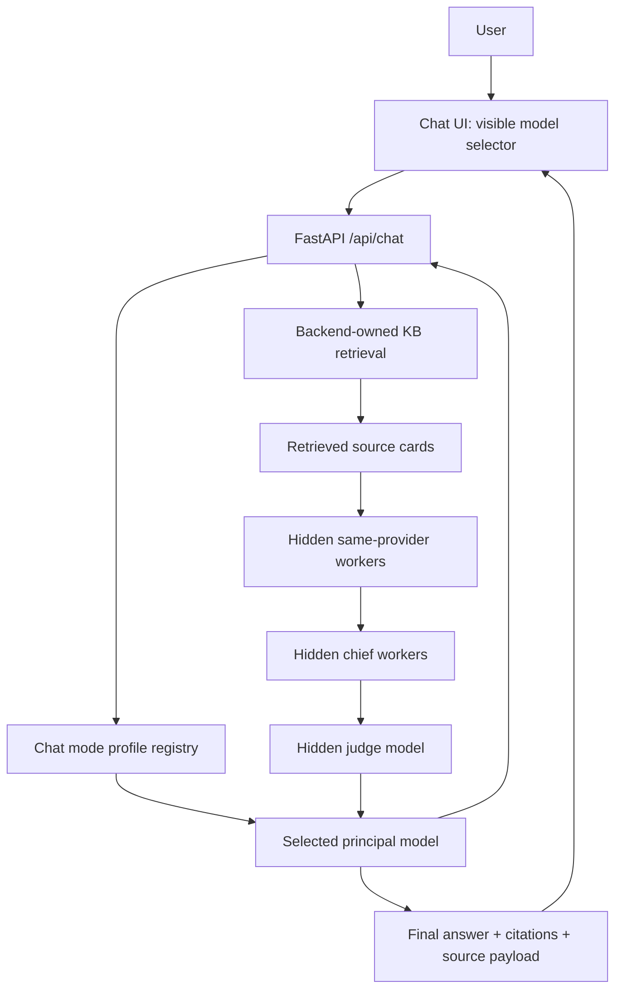

# DanteDash Chat Orchestration System Prompts Brief

Estou desenhando os system prompts para a arquitetura de chat do DanteDash.

## Contexto do produto

O DanteDash é um app Electron/FastAPI/React de multimodal RAG sobre um Knowledge Base local. O usuário vê uma UI de chat normal com um model selector. O backend controla retrieval, source selection, provider routing, budgets, retries e final source reporting.

O usuário deve ver somente estes modos no menu:

- `deepseek - deepseek-v4-pro`
- `openai/codex - gpt-5.5 OAuth`
- `claude - sonnet-4.6 OAuth`
- `claude - opus-4.8 OAuth Premium`

O usuário **não vê** internal workers, chiefs, judges, rerankers, retries nem detalhes da orchestration.

## Mapa Visual



## Modos Visíveis e Execução Interna

### DeepSeek mode

Visível para o usuário:

```text
deepseek - deepseek-v4-pro
```

Internamente:

```text
deepseek-v4-pro = principal orchestrator + final responder
deepseek-v4-flash ou worker DeepSeek configurado = hidden worker opcional
```

Neste modo não roda Claude nem OpenAI.

### OpenAI/Codex mode

Visível para o usuário:

```text
openai/codex - gpt-5.5 OAuth
```

Internamente:

```text
gpt-5.5 OAuth = principal orchestrator + final responder
gpt-5.4-mini OAuth = hidden worker para summarization, candidate comparison, extraction e reranking support
```

Neste modo não roda Claude nem DeepSeek.

### Claude Sonnet mode

Visível para o usuário:

```text
claude - sonnet-4.6 OAuth
```

Internamente:

```text
claude-sonnet-4-6 OAuth = principal orchestrator + final responder
claude-haiku-4-5 OAuth = hidden worker para extraction, summaries, cleanup e reranking support
```

Neste modo não roda OpenAI nem DeepSeek.

### Claude Opus Premium mode

Visível para o usuário:

```text
claude - opus-4.8 OAuth Premium
```

Internamente:

```text
claude-opus-4-8 OAuth, effort=xhigh = principal orchestrator + judge + final responder
claude-sonnet-4-6 OAuth = hidden chief worker
claude-haiku-4-5 OAuth = hidden worker
```

Premium flow:

```text
Opus orchestrates
  -> backend retrieves KB candidates
  -> Sonnet chief workers analyze important clusters
  -> Haiku workers do cheap extraction/summarization/dedupe
  -> Opus judge evaluates quality
  -> if accepted, Opus writes final answer
  -> if rejected, Opus sends bounded revision notes to Sonnet/Haiku
  -> max 1-2 repair loops
  -> Opus writes final answer
```

## Regras Importantes

- Provider isolation é obrigatório. O provider selecionado nunca usa outro provider escondido.
- O backend owns retrieval. Os modelos não podem navegar livremente em files, shell, tools ou filesystem.
- Workers são invisíveis para o usuário.
- Judges são invisíveis para o usuário.
- A final answer precisa citar retrieved sources.
- Se workers falharem, degradar dentro do mesmo provider.
- Se o principal model falhar, retornar erro claro daquele provider.
- Nada de unbounded loops.
- Nada de hidden cross-provider fallback.
- Nada de secrets, tokens, account identifiers, auth paths ou provider logs em user-visible output.

## Respostas às suas perguntas

### 1. Em qual modelo o chatbot retrieval-facing vai rodar?

Depende do visible mode escolhido pelo usuário.

O “retrieval-facing brain” é o selected principal model:

- DeepSeek mode: `deepseek-v4-pro`
- OpenAI/Codex mode: `gpt-5.5 OAuth`
- Claude Sonnet mode: `claude-sonnet-4-6 OAuth`
- Claude Opus Premium mode: `claude-opus-4-8 OAuth` com `effort=xhigh`

Mas o retrieval em si **não é executado pelo LLM**. O LLM pode raciocinar sobre que tipo de evidence precisa, mas o backend executa a busca real no KB.

### 2. Como o chatbot encontra os assets no KB?

O backend pesquisa o multimodal KB local.

Retrieval flow atual:

```text
User question
  -> backend embeds/searches query
  -> Chroma vector search over multimodal KB
  -> optional rerank
  -> backend returns source candidates/cards
  -> selected model receives grounded context
```

O KB contém text/image/PDF/video-derived assets em um shared multimodal vector space. Os retrieved results incluem metadata, snippets/captions quando disponíveis, source IDs, modality, scores e preview URLs.

O modelo não faz crawl direto do KB. Ele recebe bounded candidates do backend.

### 3. O que ele entrega na resposta ao pedido?

O usuário recebe:

- Uma final natural-language answer.
- Inline citations como `[1]`, `[2]`, alinhadas aos retrieved sources.
- Source cards na context panel da UI.
- Visual/source metadata quando disponível.
- Nenhum hidden worker transcript.
- Nenhum judge reasoning.
- Nenhum internal orchestration log.

A final answer deve ser grounded somente nas retrieved sources. Se a evidência recuperada for insuficiente, o chatbot deve dizer isso em vez de inventar.

## O que eu preciso de você

Por favor, escreva system prompts para todos os papéis desta arquitetura:

1. Principal orchestrator/final responder prompt para `deepseek-v4-pro`.
2. Principal orchestrator/final responder prompt para `gpt-5.5 OAuth`.
3. Worker prompt para `gpt-5.4-mini OAuth`.
4. Principal orchestrator/final responder prompt para `claude-sonnet-4-6 OAuth`.
5. Worker prompt para `claude-haiku-4-5 OAuth`.
6. Premium principal prompt para `claude-opus-4-8 OAuth effort=xhigh`.
7. Sonnet chief worker prompt para Opus Premium mode.
8. Haiku worker prompt para Opus Premium mode.
9. Opus judge prompt para Premium mode.
10. Shared citation/source-grounding policy prompt reutilizável entre providers.
11. Shared refusal/insufficient-evidence policy prompt.
12. Shared worker-output schema ou compact structured-output format.

Também pode sugerir melhorias na arquitetura se enxergar um desenho mais seguro, barato ou melhor em qualidade, mas respeitando estes hard constraints:

- sem Grok/xAI;
- sem hidden cross-provider fallback;
- backend owns retrieval;
- workers ficam invisíveis para o usuário;
- final answer precisa citar sources;
- sem unbounded judge/repair loops;
- sem filesystem/tool access via prompts.
